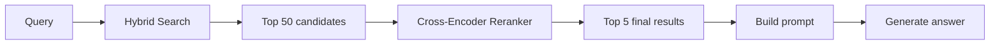
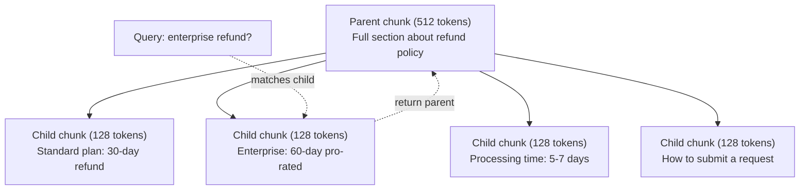
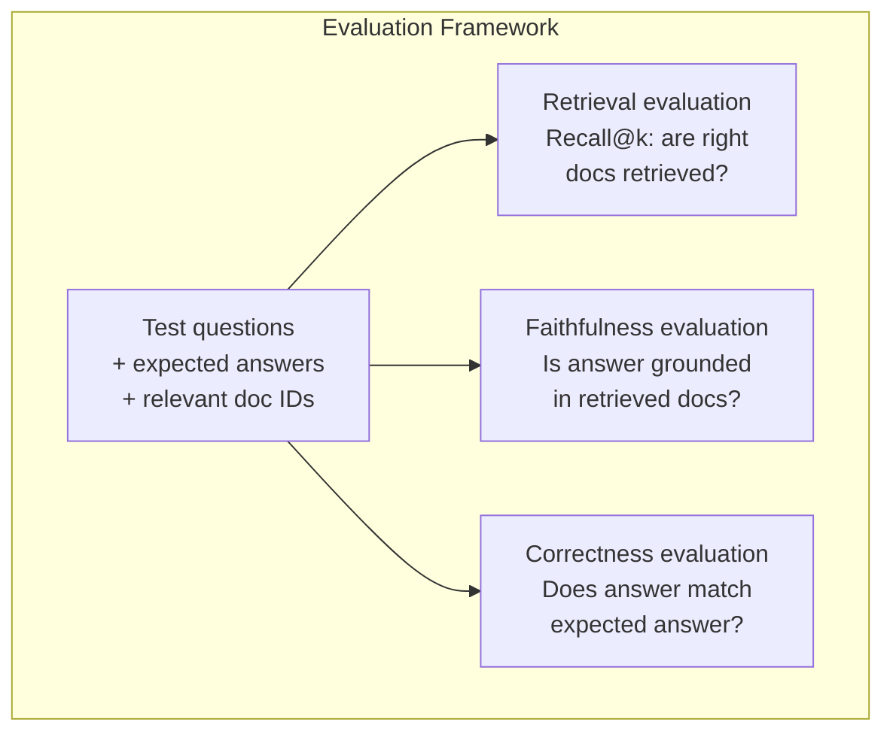

# Продвинутый RAG (чанкинг, реранжирование, гибридный поиск)

> Базовый RAG извлекает top-k наиболее похожих чанков. Это работает для простых вопросов. Но разваливается на многошаговом рассуждении, неоднозначных запросах и больших корпусах. Продвинутый RAG — это разница между демо, которое работает на 10 документах, и системой, которая работает на 10 миллионах.

**Тип:** Build
**Языки:** Python
**Предварительные требования:** Phase 11, Lesson 06 (RAG)
**Время:** ~90 минут
**Связано:** Phase 5 · 23 (Chunking Strategies for RAG) покрывает все шесть алгоритмов чанкинга — recursive, semantic, sentence, parent-document, late chunking, contextual retrieval — с бенчмарками Vectara/Anthropic. Этот урок строится поверх них: гибридный поиск, реранжирование, трансформация запросов.

## Цели обучения

- Реализовать продвинутые стратегии чанкинга (semantic, recursive, parent-child), которые сохраняют структуру документа и контекст
- Построить пайплайн гибридного поиска, объединяющий BM25 keyword matching с semantic vector search и cross-encoder reranker
- Применить техники трансформации запросов (HyDE, multi-query, step-back), чтобы улучшить retrieval для неоднозначных или сложных вопросов
- Диагностировать и исправлять типичные сбои RAG: извлечен неправильный чанк, ответа нет в контексте, многошаговое рассуждение разваливается

## Проблема

Вы построили базовый RAG-пайплайн в Lesson 06. Он работает для прямолинейных вопросов на небольшом корпусе. Теперь попробуйте эти:

**Неоднозначный запрос**: "Какой была выручка в прошлом квартале?" Семантический поиск возвращает чанки о стратегии выручки, прогнозах выручки и мыслях CFO о росте выручки. Все они семантически похожи на слово "выручка." Ни один не содержит фактическое число. Правильный чанк говорит "$47.2M in Q3 2025", но использует слово "earnings" вместо "revenue." Embedding-модель считает, что "стратегия выручки" ближе к запросу, чем "прибыль Q3 составила $47.2M."

**Многошаговый вопрос**: "У какой команды было самое большое улучшение оценки удовлетворенности клиентов?" Для этого нужно найти оценки удовлетворенности для каждой команды, сравнить их и определить максимум. Ни один отдельный чанк не содержит ответа. Информация разбросана по отчетам команд.

**Проблема большого корпуса**: У вас 2 миллиона чанков. Правильный ответ находится в chunk #1,847,293. Ваш top-5 retrieval вытаскивает chunks #14, #89,201, #1,200,000, #44 и #901,333. Они близки в embedding space, но ни один не содержит ответа. В таком масштабе approximate nearest neighbor search вносит достаточно ошибки, чтобы релевантные результаты вытеснялись из top-k.

Базовый RAG терпит неудачу, потому что vector similarity — не то же самое, что релевантность. Чанк может быть семантически похож на запрос, но бесполезен для ответа на него. Продвинутый RAG решает это четырьмя техниками: гибридный поиск (добавить keyword matching), реранжирование (оценивать кандидатов тщательнее), трансформация запросов (исправлять запрос до поиска) и более качественный чанкинг (извлекать на правильной гранулярности).

## Концепция

### Гибридный поиск: семантический + keyword

Семантический поиск (vector similarity) хорошо понимает смысл. "Как мне отменить подписку?" совпадает с "Шаги для прекращения вашего плана", хотя у них нет общих слов. Но он пропускает точные совпадения. "Код ошибки E-4021" может не совпасть с чанком, содержащим "E-4021", если embedding-модель считает это шумом.

Keyword search (BM25) работает наоборот. Он отлично справляется с точными совпадениями. "E-4021" совпадает идеально. Но "отменить подписку" вернет ноль результатов, если в документе написано "прекратить ваш план."

Гибридный поиск запускает оба подхода, а затем объединяет результаты.

**BM25** (Best Matching 25) — стандартный алгоритм keyword search. Он был основой поисковых систем с 1990-х. Формула:

```
BM25(q, d) = sum over terms t in q:
    IDF(t) * (tf(t,d) * (k1 + 1)) / (tf(t,d) + k1 * (1 - b + b * |d| / avgdl))
```

Где tf(t,d) — частота термина t в документе d, IDF(t) — обратная документная частота, |d| — длина документа, avgdl — средняя длина документа, k1 управляет насыщением частоты термина (по умолчанию 1.2), а b управляет нормализацией по длине (по умолчанию 0.75).

Простыми словами: BM25 дает документам более высокую оценку, когда они содержат термины запроса (особенно редкие), но с убывающей отдачей для повторяющихся терминов. Документ со словом "выручка" 50 раз не в 50 раз релевантнее документа, где оно встречается один раз.

### Reciprocal Rank Fusion (RRF)

У вас есть два ранжированных списка: один от vector search, другой от BM25. Как их объединить? Reciprocal Rank Fusion — стандартный подход.

```
RRF_score(d) = sum over rankings R:
    1 / (k + rank_R(d))
```

Где k — константа (обычно 60), которая не дает результату на первом месте доминировать.

Документ, ранжированный как #1 в vector search и #5 в BM25, получает: 1/(60+1) + 1/(60+5) = 0.0164 + 0.0154 = 0.0318

Документ, ранжированный как #3 в vector search и #2 в BM25, получает: 1/(60+3) + 1/(60+2) = 0.0159 + 0.0161 = 0.0320

RRF естественно балансирует два сигнала. Документ, который высоко ранжируется в обоих списках, получает лучший score. Документ, который занимает #1 в одном списке, но отсутствует в другом, получает умеренный score. Это устойчиво, потому что используются ранги, а не сырые score, поэтому различия в распределениях score между двумя системами не имеют значения.

### Реранжирование

Retrieval (vector, keyword или hybrid) быстрый, но неточный. Он использует bi-encoders: запрос и каждый документ встраиваются независимо, затем сравниваются. Embeddings вычисляются один раз и кэшируются. Это масштабируется до миллионов документов.

Реранжирование использует cross-encoders: запрос и документ-кандидат подаются вместе в модель, которая выдает relevance score. Модель видит оба текста одновременно и может уловить тонкие взаимодействия между ними. Cross-encoder может понять, что "Какой была прибыль за Q3?" сильно релевантен чанку, содержащему "$47.2M in Q3", даже если bi-encoder пропустил эту связь.

Компромисс: cross-encoders в 100-1000 раз медленнее bi-encoders, потому что они обрабатывают пару query-document совместно. Нельзя заранее посчитать cross-encoder scores для миллиона документов. Решение: извлечь более широкий набор кандидатов (top-50 из hybrid search), а затем реранжировать с cross-encoder, чтобы получить финальный top-5.



Распространенные модели для реранжирования (линейка 2026):
- Cohere Rerank 3.5: managed API, multilingual, лучший прирост recall на смешанных корпусах
- Voyage rerank-2.5: managed API, самая низкая latency среди hosted options
- Jina-Reranker-v2 Multilingual: open-weight, 100+ languages
- bge-reranker-v2-m3: open-weight, сильный baseline
- cross-encoder/ms-marco-MiniLM-L-6-v2: open-weight, работает на CPU для прототипирования
- ColBERTv2 / Jina-ColBERT-v2: late-interaction multi-vector rerankers — O(tokens) not O(docs) at scoring time

### Трансформация запросов

Иногда проблема не в retrieval, а в самом запросе. "Что там было про новое изменение политики?" — ужасный поисковый запрос. Он не содержит конкретных терминов. Embedding расплывчатый. Ни одна retrieval-система не сможет найти по нему правильные документы.

**Query rewriting**: переформулировать запрос пользователя в более хороший поисковый запрос. LLM может сделать это:

```
User: "What was that thing about the new policy change?"
Rewritten: "Recent policy changes and updates"
```

**HyDE (Hypothetical Document Embeddings)**: вместо поиска по запросу сгенерировать гипотетический ответ, embed его и искать похожие реальные документы.

```
Query: "What is the refund policy for enterprise?"
Hypothetical answer: "Enterprise customers are eligible for a full refund
within 60 days of purchase. Refunds are pro-rated based on the remaining
subscription period and processed within 5-7 business days."
```

Embed гипотетический ответ и найдите реальные документы, похожие на него. Интуиция: гипотетический ответ находится ближе в embedding space к реальному ответу, чем исходный вопрос. У вопросов и ответов разные языковые структуры. Генерируя гипотетический ответ, вы строите мост между "question space" и "answer space" в embedding.

HyDE добавляет один LLM-вызов перед retrieval. Это увеличивает latency на 500-2000ms. Оно того стоит, когда качество retrieval плохое на сырых запросах.

### Parent-Child Chunking

Стандартный чанкинг вынуждает идти на компромисс: маленькие чанки для точного retrieval, большие чанки для достаточного контекста. Parent-child chunking устраняет этот компромисс.

Индексируйте маленькие чанки (128 tokens) для retrieval. Когда маленький чанк извлечен, возвращайте его parent chunk (512 tokens) в prompt. Маленький чанк точно совпадает с запросом. Parent chunk дает достаточно контекста, чтобы LLM сгенерировала хороший ответ.



Запрос "возврат для enterprise?" точно совпадает с child chunk C2. Но prompt получает полный parent chunk P, который включает окружающий контекст о времени обработки и процессе отправки запроса.

### Metadata Filtering

Перед запуском vector search отфильтруйте корпус по metadata: date, source, category, author, language. Это уменьшает search space и предотвращает нерелевантные результаты.

"Что изменилось в политике безопасности в прошлом месяце?" должен искать только документы за последние 30 дней в категории security. Без metadata filtering вы ищете по всему корпусу и можете извлечь документ по security двухлетней давности, который случайно семантически похож.

Production RAG systems хранят metadata рядом с каждым чанком: source document, creation date, category, author, version. Vector databases поддерживают pre-filtering по metadata перед similarity search, что критично для производительности в масштабе.

### Evaluation

Вы построили RAG-систему. Как понять, работает ли она? Три метрики:

**Retrieval relevance (Recall@k)**: для набора тестовых вопросов с известными релевантными документами какой процент релевантных документов появляется в top-k results? Если ответ на вопрос находится в chunk #47, появляется ли chunk #47 в top-5?

**Faithfulness**: основан ли сгенерированный ответ на извлеченных документах? Если извлеченные чанки говорят "60-дневное окно возврата", а модель говорит "90-дневное окно возврата", это failure faithfulness. Модель сгаллюцинировала, несмотря на правильный контекст.

**Answer correctness**: совпадает ли сгенерированный ответ с expected answer? Это end-to-end метрика. Она объединяет качество retrieval и качество generation.

Простая проверка faithfulness: возьмите каждое утверждение в сгенерированном ответе и проверьте, появляется ли оно (по сути) в извлеченных чанках. Если ответ содержит факт, которого нет ни в одном извлеченном чанке, он, вероятно, сгаллюцинирован.



## Соберите это

### Шаг 1: Реализация BM25

```python
import math
from collections import Counter

class BM25:
    def __init__(self, k1=1.2, b=0.75):
        self.k1 = k1
        self.b = b
        self.docs = []
        self.doc_lengths = []
        self.avg_dl = 0
        self.doc_freqs = {}
        self.n_docs = 0

    def index(self, documents):
        self.docs = documents
        self.n_docs = len(documents)
        self.doc_lengths = []
        self.doc_freqs = {}

        for doc in documents:
            words = doc.lower().split()
            self.doc_lengths.append(len(words))
            unique_words = set(words)
            for word in unique_words:
                self.doc_freqs[word] = self.doc_freqs.get(word, 0) + 1

        self.avg_dl = sum(self.doc_lengths) / self.n_docs if self.n_docs else 1

    def score(self, query, doc_idx):
        query_words = query.lower().split()
        doc_words = self.docs[doc_idx].lower().split()
        doc_len = self.doc_lengths[doc_idx]
        word_counts = Counter(doc_words)
        score = 0.0

        for term in query_words:
            if term not in word_counts:
                continue
            tf = word_counts[term]
            df = self.doc_freqs.get(term, 0)
            idf = math.log((self.n_docs - df + 0.5) / (df + 0.5) + 1)
            numerator = tf * (self.k1 + 1)
            denominator = tf + self.k1 * (1 - self.b + self.b * doc_len / self.avg_dl)
            score += idf * numerator / denominator

        return score

    def search(self, query, top_k=10):
        scores = [(i, self.score(query, i)) for i in range(self.n_docs)]
        scores.sort(key=lambda x: x[1], reverse=True)
        return scores[:top_k]
```

### Шаг 2: Reciprocal Rank Fusion

```python
def reciprocal_rank_fusion(ranked_lists, k=60):
    scores = {}
    for ranked_list in ranked_lists:
        for rank, (doc_id, _) in enumerate(ranked_list):
            if doc_id not in scores:
                scores[doc_id] = 0.0
            scores[doc_id] += 1.0 / (k + rank + 1)
    fused = sorted(scores.items(), key=lambda x: x[1], reverse=True)
    return fused
```

### Шаг 3: Пайплайн гибридного поиска

```python
def hybrid_search(query, chunks, vector_embeddings, vocab, idf, bm25_index, top_k=5, fusion_k=60):
    query_emb = tfidf_embed(query, vocab, idf)
    vector_results = search(query_emb, vector_embeddings, top_k=top_k * 3)
    bm25_results = bm25_index.search(query, top_k=top_k * 3)
    fused = reciprocal_rank_fusion([vector_results, bm25_results], k=fusion_k)
    return fused[:top_k]
```

### Шаг 4: Простой reranker

В production вы использовали бы cross-encoder model. Здесь мы строим reranker, который оценивает query-document relevance с помощью word overlap, term importance и phrase matching.

```python
def rerank(query, candidates, chunks):
    query_words = set(query.lower().split())
    stop_words = {"the", "a", "an", "is", "are", "was", "were", "what", "how",
                  "why", "when", "where", "do", "does", "for", "of", "in", "to",
                  "and", "or", "on", "at", "by", "it", "its", "this", "that",
                  "with", "from", "be", "has", "have", "had", "not", "but"}
    query_terms = query_words - stop_words

    scored = []
    for doc_id, initial_score in candidates:
        chunk = chunks[doc_id].lower()
        chunk_words = set(chunk.split())

        term_overlap = len(query_terms & chunk_words)

        query_bigrams = set()
        q_list = [w for w in query.lower().split() if w not in stop_words]
        for i in range(len(q_list) - 1):
            query_bigrams.add(q_list[i] + " " + q_list[i + 1])
        bigram_matches = sum(1 for bg in query_bigrams if bg in chunk)

        position_boost = 0
        for term in query_terms:
            pos = chunk.find(term)
            if pos != -1 and pos < len(chunk) // 3:
                position_boost += 0.5

        rerank_score = (
            term_overlap * 1.0
            + bigram_matches * 2.0
            + position_boost
            + initial_score * 5.0
        )
        scored.append((doc_id, rerank_score))

    scored.sort(key=lambda x: x[1], reverse=True)
    return scored
```

### Шаг 5: HyDE (Hypothetical Document Embeddings)

```python
def hyde_generate_hypothesis(query):
    templates = {
        "what": "The answer to '{query}' is as follows: Based on our documentation, {topic} involves specific policies and procedures that define how the process works.",
        "how": "To address '{query}': The process involves several steps. First, you need to initiate the request. Then, the system processes it according to the defined rules.",
        "default": "Regarding '{query}': Our records indicate specific details and policies related to this topic that provide a comprehensive answer."
    }
    query_lower = query.lower()
    if query_lower.startswith("what"):
        template = templates["what"]
    elif query_lower.startswith("how"):
        template = templates["how"]
    else:
        template = templates["default"]

    topic_words = [w for w in query.lower().split()
                   if w not in {"what", "is", "the", "how", "do", "does", "a", "an",
                                "for", "of", "to", "in", "on", "at", "by", "and", "or"}]
    topic = " ".join(topic_words) if topic_words else "this topic"

    return template.format(query=query, topic=topic)


def hyde_search(query, chunks, vector_embeddings, vocab, idf, top_k=5):
    hypothesis = hyde_generate_hypothesis(query)
    hypothesis_emb = tfidf_embed(hypothesis, vocab, idf)
    results = search(hypothesis_emb, vector_embeddings, top_k)
    return results, hypothesis
```

### Шаг 6: Parent-Child Chunking

```python
def create_parent_child_chunks(text, parent_size=200, child_size=50):
    words = text.split()
    parents = []
    children = []
    child_to_parent = {}

    parent_idx = 0
    start = 0
    while start < len(words):
        parent_end = min(start + parent_size, len(words))
        parent_text = " ".join(words[start:parent_end])
        parents.append(parent_text)

        child_start = start
        while child_start < parent_end:
            child_end = min(child_start + child_size, parent_end)
            child_text = " ".join(words[child_start:child_end])
            child_idx = len(children)
            children.append(child_text)
            child_to_parent[child_idx] = parent_idx
            child_start += child_size

        parent_idx += 1
        start += parent_size

    return parents, children, child_to_parent
```

### Шаг 7: Оценка faithfulness

```python
def evaluate_faithfulness(answer, retrieved_chunks):
    answer_sentences = [s.strip() for s in answer.split(".") if len(s.strip()) > 10]
    if not answer_sentences:
        return 1.0, []

    grounded = 0
    ungrounded = []
    context = " ".join(retrieved_chunks).lower()

    for sentence in answer_sentences:
        words = set(sentence.lower().split())
        stop_words = {"the", "a", "an", "is", "are", "was", "were", "and", "or",
                      "to", "of", "in", "for", "on", "at", "by", "it", "this", "that"}
        content_words = words - stop_words
        if not content_words:
            grounded += 1
            continue

        matched = sum(1 for w in content_words if w in context)
        ratio = matched / len(content_words) if content_words else 0

        if ratio >= 0.5:
            grounded += 1
        else:
            ungrounded.append(sentence)

    score = grounded / len(answer_sentences) if answer_sentences else 1.0
    return score, ungrounded


def evaluate_retrieval_recall(queries_with_relevant, retrieval_fn, k=5):
    total_recall = 0.0
    results = []

    for query, relevant_indices in queries_with_relevant:
        retrieved = retrieval_fn(query, k)
        retrieved_indices = set(idx for idx, _ in retrieved)
        relevant_set = set(relevant_indices)
        hits = len(retrieved_indices & relevant_set)
        recall = hits / len(relevant_set) if relevant_set else 1.0
        total_recall += recall
        results.append({
            "query": query,
            "recall": recall,
            "hits": hits,
            "total_relevant": len(relevant_set)
        })

    avg_recall = total_recall / len(queries_with_relevant) if queries_with_relevant else 0
    return avg_recall, results
```

## Используйте это

С реальным cross-encoder для реранжирования:

```python
from sentence_transformers import CrossEncoder

reranker = CrossEncoder("cross-encoder/ms-marco-MiniLM-L-6-v2")

def rerank_with_cross_encoder(query, candidates, chunks, top_k=5):
    pairs = [(query, chunks[doc_id]) for doc_id, _ in candidates]
    scores = reranker.predict(pairs)
    scored = list(zip([doc_id for doc_id, _ in candidates], scores))
    scored.sort(key=lambda x: x[1], reverse=True)
    return scored[:top_k]
```

С managed reranker от Cohere:

```python
import cohere

co = cohere.Client()

def rerank_with_cohere(query, candidates, chunks, top_k=5):
    docs = [chunks[doc_id] for doc_id, _ in candidates]
    response = co.rerank(
        model="rerank-english-v3.0",
        query=query,
        documents=docs,
        top_n=top_k
    )
    return [(candidates[r.index][0], r.relevance_score) for r in response.results]
```

Для HyDE с реальной LLM:

```python
import anthropic

client = anthropic.Anthropic()

def hyde_with_llm(query):
    response = client.messages.create(
        model="claude-sonnet-4-20250514",
        max_tokens=256,
        messages=[{
            "role": "user",
            "content": f"Write a short paragraph that would be a good answer to this question. Do not say you don't know. Just write what the answer would look like.\n\nQuestion: {query}"
        }]
    )
    return response.content[0].text
```

Для production hybrid search с Weaviate:

```python
import weaviate

client = weaviate.connect_to_local()

collection = client.collections.get("Documents")
response = collection.query.hybrid(
    query="enterprise refund policy",
    alpha=0.5,
    limit=10
)
```

Параметр alpha управляет балансом: 0.0 = чистый keyword (BM25), 1.0 = чистый vector, 0.5 = равный вес. Большинство production systems используют alpha между 0.3 и 0.7.

## Доведите до поставки

Этот урок создает:
- `outputs/prompt-advanced-rag-debugger.md` -- prompt для диагностики и исправления проблем качества RAG
- `outputs/skill-advanced-rag.md` -- skill для построения production-grade RAG с hybrid search и reranking

## Упражнения

1. Сравните BM25 vs vector search vs hybrid search на sample documents. Для каждого из 5 test queries запишите, какой подход возвращает самый релевантный чанк на позиции #1. Hybrid search должен победить минимум в 3 из 5.

2. Реализуйте metadata filter. Добавьте поле "category" к каждому документу (security, billing, api, product). Перед запуском vector search фильтруйте чанки только до релевантной категории. Протестируйте с "Какое шифрование используется?" и убедитесь, что поиск идет только по чанкам категории security.

3. Постройте полный HyDE pipeline, используя простую generate function из Lesson 06. Сравните качество retrieval (top-3 relevance) между direct query search и HyDE search на всех 5 test queries. HyDE должен улучшить результаты для расплывчатых запросов.

4. Реализуйте стратегию parent-child chunking на sample documents. Используйте child_size=30 и parent_size=100. Ищите по child chunks, но возвращайте parent chunks в prompt. Сравните сгенерированные ответы со стандартным чанкингом с chunk_size=50.

5. Создайте evaluation dataset: 10 вопросов с известными answer chunks. Измерьте Recall@3, Recall@5 и Recall@10 для (a) только vector search, (b) только BM25, (c) hybrid search, (d) hybrid + reranking. Постройте график результатов и определите, где reranking помогает сильнее всего.

## Ключевые термины

| Термин | Что говорят люди | Что это на самом деле означает |
|------|----------------|----------------------|
| BM25 | "Keyword search" | Вероятностный алгоритм ранжирования, который оценивает документы по term frequency, inverse document frequency и нормализации длины документа |
| Hybrid search | "Лучшее из двух миров" | Параллельный запуск semantic (vector) и keyword (BM25) search, затем объединение результатов с rank fusion |
| Reciprocal Rank Fusion | "Объединение ранжированных списков" | Объединение нескольких ranked lists через суммирование 1/(k + rank) для каждого документа по всем спискам |
| Reranking | "Оценка вторым проходом" | Использование более дорогой cross-encoder model для повторной оценки candidate set после initial retrieval |
| Cross-encoder | "Совместная query-document модель" | Модель, которая принимает query и document как единый input и выдает relevance score; точнее bi-encoders, но слишком медленная для поиска по полному корпусу |
| Bi-encoder | "Независимая embedding model" | Модель, которая встраивает queries и documents независимо; быстрая, потому что embeddings предвычислены, но менее точная, чем cross-encoders |
| HyDE | "Поиск с фальшивым ответом" | Сгенерировать гипотетический ответ на запрос, embed его и искать реальные документы, похожие на него |
| Parent-child chunking | "Маленький поиск, большой контекст" | Индексировать маленькие чанки для точного retrieval, но возвращать более крупный parent chunk, чтобы дать достаточный контекст |
| Metadata filtering | "Сузить перед поиском" | Фильтрация документов по атрибутам (date, source, category) перед запуском vector search, чтобы уменьшить search space |
| Faithfulness | "Остался ли ответ grounded" | Поддержан ли сгенерированный ответ извлеченными документами, в отличие от hallucination из training data модели |

## Дополнительное чтение

- Robertson & Zaragoza, "The Probabilistic Relevance Framework: BM25 and Beyond" (2009) -- исчерпывающий reference для BM25, объясняющий вероятностные основы формулы
- Cormack et al., "Reciprocal Rank Fusion Outperforms Condorcet and Individual Rank Learning Methods" (2009) -- оригинальная статья RRF, показывающая, что он превосходит более сложные методы fusion
- Gao et al., "Precise Zero-Shot Dense Retrieval without Relevance Labels" (2022) -- статья HyDE, демонстрирующая, что hypothetical document embeddings улучшают retrieval без training data
- Nogueira & Cho, "Passage Re-ranking with BERT" (2019) -- показали, что cross-encoder reranking поверх BM25 значительно улучшает качество retrieval
- [Khattab et al., "DSPy: Compiling Declarative Language Model Calls into Self-Improving Pipelines" (2023)](https://arxiv.org/abs/2310.03714) -- рассматривает prompt construction и weight selection как задачу оптимизации над retrieval pipelines; прочитайте это для "program LLMs" вместо "prompt LLMs."
- [Edge et al., "From Local to Global: A Graph RAG Approach to Query-Focused Summarization" (Microsoft Research 2024)](https://arxiv.org/abs/2404.16130) -- статья GraphRAG: entity-relation extraction + Leiden community detection для query-focused summarization; различие global vs local retrieval.
- [Asai et al., "Self-RAG: Learning to Retrieve, Generate, and Critique through Self-Reflection" (ICLR 2024)](https://arxiv.org/abs/2310.11511) -- self-evaluating RAG с reflection tokens; agentic frontier после static retrieve-then-generate.
- [LangChain Query Construction blog](https://blog.langchain.dev/query-construction/) -- как переводить natural-language queries в structured database queries (Text-to-SQL, Cypher) как pre-retrieval step.
