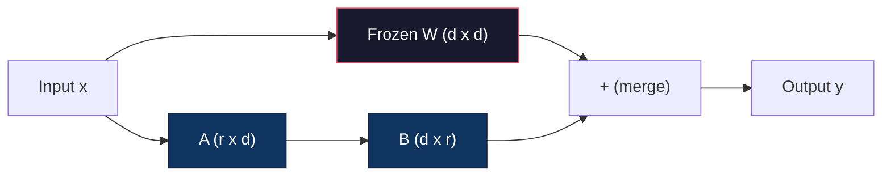
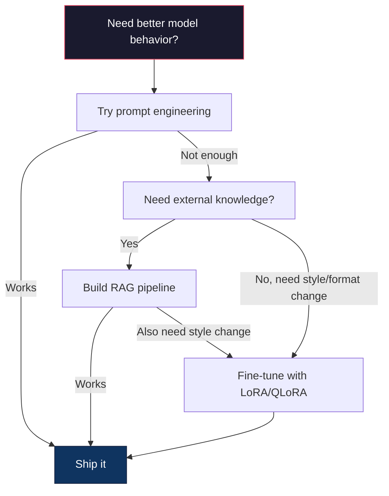

# Fine-Tuning with LoRA и QLoRA

> Полный fine-tuning модели на 7B параметров требует 56GB VRAM. У вас этого нет. У большинства компаний тоже. LoRA позволяет дообучать ту же модель в 6GB, обучая меньше 1% параметров. Это не компромисс: на большинстве задач качество совпадает с полным fine-tuning. Вся open-source экосистема fine-tuning держится на этом приеме.

**Тип:** Сборка
**Языки:** Python
**Предварительные требования:** Phase 10, Lesson 06 (Instruction Tuning / SFT)
**Время:** ~75 минут
**Связано:** Phase 10 разбирает циклы SFT/DPO с нуля. Этот урок подключает их к PEFT-инструментам 2026 года: PEFT, TRL, Unsloth, Axolotl, LLaMA-Factory.

## Цели обучения

- Реализовать LoRA, внедряя low-rank adapter matrices (A и B) в attention-слои предобученной модели
- Рассчитать экономию параметров LoRA по сравнению с полным fine-tuning: rank r при размерности d_model обучает 2*r*d параметров вместо d^2
- Дообучить модель с QLoRA: 4-bit quantized base + LoRA adapters, чтобы уложиться в память потребительской GPU
- Слить веса LoRA обратно в базовую модель для deployment и сравнить скорость inference с адаптерами и без них

## Проблема

У вас есть базовая модель: Llama 3 8B. Вы хотите, чтобы она отвечала на customer support tickets голосом вашей компании. SFT подходит, но у SFT есть проблема стоимости.

Полный fine-tuning обновляет каждый параметр модели. У Llama 3 8B восемь миллиардов параметров. В fp16 каждый параметр занимает 2 байта: 16GB только на загрузку весов. Во время обучения нужны еще gradients (16GB), optimizer states для Adam (32GB под momentum и variance) и activations. Итого примерно 56GB VRAM для одной модели 8B.

A100 80GB едва это вмещает. Две A100 стоят около $3-4/час в облаке. Обучение 3 эпох на 50,000 примерах занимает 6-10 часов. Это $30-40 за эксперимент. Десять экспериментов для подбора hyperparameters дают около $400 еще до deployment.

Для Llama 3 70B числа становятся абсурдными: около 140GB только на веса. Нужен кластер, и эксперимент стоит $100+.

Есть и более глубокая проблема. Полный fine-tuning изменяет все веса модели. Если дообучить ее на данных поддержки клиентов, можно ухудшить общие способности модели. Это называется catastrophic forgetting: модель становится лучше на вашей задаче и хуже на всем остальном.

Нужен метод, который обучает меньше параметров, использует меньше памяти и не разрушает уже имеющиеся знания модели.

## Концепция

### LoRA: Low-Rank Adaptation

Edward Hu и коллеги из Microsoft опубликовали LoRA в июне 2021 года. Идея статьи: обновления весов при fine-tuning имеют низкий внутренний ранг. Не нужно обновлять все 16.7 миллионов параметров в матрице 4096x4096. Полезную информацию в обновлении можно выразить матрицей ранга 16 или 32.

Обычный linear layer вычисляет:

```
y = Wx
```

Где W - матрица d_out x d_in. Для attention projection 4096x4096 это 16,777,216 параметров.

LoRA замораживает W и добавляет low-rank decomposition:

```
y = Wx + BAx
```

Где B имеет размер (d_out x r), а A - (r x d_in). Rank r намного меньше d, обычно 8, 16 или 32.

Для r=16 на слое 4096x4096:
- Исходные параметры: 4096 x 4096 = 16,777,216
- Параметры LoRA: (4096 x 16) + (16 x 4096) = 65,536 + 65,536 = 131,072
- Сокращение: 131,072 / 16,777,216 = 0.78%

Вы обучаете 0.78% параметров и получаете 95-100% качества.



A инициализируется случайной Gaussian-матрицей. B инициализируется нулями. Поэтому вклад LoRA в начале равен нулю: модель стартует с исходного поведения и постепенно учит адаптацию.

### Scaling Factor: Alpha

LoRA вводит scaling factor alpha, который управляет тем, насколько low-rank update влияет на выход:

```
y = Wx + (alpha / r) * BAx
```

Если alpha = r, масштаб равен 1x. Если alpha = 2r, что часто используют по умолчанию, масштаб равен 2x. Этот hyperparameter управляет learning rate пути LoRA независимо от базового learning rate.

Практические ориентиры:
- alpha = 2 * rank - распространенная convention в сообществе, хотя оригинальная статья чаще использовала alpha = rank
- alpha = rank дает масштаб 1x: консервативно, но стабильно
- Более высокий alpha дает более крупные обновления на шаг, что может ускорить convergence или вызвать нестабильность

### Где применять LoRA

В transformer много linear layers. Не обязательно добавлять LoRA во все. Оригинальная статья проверяла разные комбинации:

| Target Layers | Trainable Params (7B) | Quality |
|--------------|----------------------|---------|
| q_proj only | 4.7M | Хорошо |
| q_proj + v_proj | 9.4M | Лучше |
| q_proj + k_proj + v_proj + o_proj | 18.9M | Лучшее качество для attention |
| All linear (attention + MLP) | 37.7M | Небольшой выигрыш, 2x параметров |

Практический sweet spot для большинства задач: q_proj + v_proj. Это query и value projections в self-attention: они управляют тем, на что модель смотрит и какую информацию извлекает. Добавление MLP layers помогает на сложных задачах вроде code generation, но удваивает число параметров и часто дает убывающую отдачу.

### Выбор Rank

Rank r управляет выразительностью адаптации:

| Rank | Trainable Params (per layer) | Best For |
|------|---------------------------|----------|
| 4 | 32,768 | Простая classification, sentiment |
| 8 | 65,536 | Single-domain Q&A, summarization |
| 16 | 131,072 | Multi-domain tasks, instruction following |
| 32 | 262,144 | Complex reasoning, code generation |
| 64 | 524,288 | Убывающая отдача для большинства задач |
| 128 | 1,048,576 | Редко оправдано |

Hu et al. показали, что r=4 уже захватывает большую часть адаптации для простых задач. r=8 и r=16 - самые частые практические выборы. Выше r=64 качество редко заметно растет, а преимущество LoRA по памяти начинает исчезать.

### QLoRA: 4-Bit Quantization + LoRA

Tim Dettmers и коллеги из University of Washington опубликовали QLoRA в мае 2023 года. Идея: quantize замороженную базовую модель до 4-bit precision, а сверху подключить LoRA adapters в fp16.

Это резко меняет расчет памяти:

| Method | Weight Memory (7B) | Training Memory (7B) | GPU Required |
|--------|-------------------|---------------------|-------------|
| Full fine-tune (fp16) | 14GB | ~56GB | 1x A100 80GB |
| LoRA (fp16 base) | 14GB | ~18GB | 1x A100 40GB |
| QLoRA (4-bit base) | 3.5GB | ~6GB | 1x RTX 3090 24GB |

QLoRA дает три технических вклада:

**NF4 (Normal Float 4-bit)**: новый тип данных специально для весов нейросетей. Веса примерно нормально распределены, поэтому NF4 размещает 16 уровней quantization в квантилях standard normal distribution. Для нормально распределенных данных это информационно оптимально и теряет меньше информации, чем uniform 4-bit quantization (INT4) или обычный Float4.

**Double quantization**: сами quantization constants тоже занимают память. Каждый блок из 64 весов требует fp32 scale factor (4 байта). Для модели 7B это еще около 0.4GB. Double quantization квантует эти constants до fp8 и снижает overhead до 0.1GB.

**Paged optimizers**: во время обучения optimizer states (momentum и variance Adam) могут превысить GPU memory на длинных sequences. Paged optimizers используют unified memory NVIDIA и автоматически выгружают optimizer states в CPU RAM при нехватке GPU memory, а затем возвращают их обратно. Это предотвращает OOM за счет части throughput.

### Вопрос качества

Вредит ли снижение числа параметров или quantization базы качеству? Результаты нескольких papers:

| Method | MMLU (5-shot) | MT-Bench | HumanEval |
|--------|--------------|----------|-----------|
| Full fine-tune (Llama 2 7B) | 48.3 | 6.72 | 14.6 |
| LoRA r=16 | 47.9 | 6.68 | 14.0 |
| QLoRA r=16 (NF4) | 47.5 | 6.61 | 13.4 |
| QLoRA r=64 (NF4) | 48.1 | 6.70 | 14.2 |

LoRA при r=16 находится в пределах 1% от full fine-tuning на большинстве benchmarks. QLoRA при r=16 теряет еще доли процента. QLoRA при r=64 фактически совпадает с full fine-tuning, используя на 90% меньше памяти.

### Реальные затраты

Fine-tuning Llama 3 8B на 50,000 примерах, 3 эпохи:

| Method | GPU | Time | Cost |
|--------|-----|------|------|
| Full fine-tune | 2x A100 80GB | 8 hours | ~$32 |
| LoRA r=16 | 1x A100 40GB | 4 hours | ~$8 |
| QLoRA r=16 | 1x RTX 4090 24GB | 6 hours | ~$5 |
| QLoRA r=16 (Unsloth) | 1x RTX 4090 24GB | 2.5 hours | ~$2 |
| QLoRA r=16 | 1x T4 16GB | 12 hours | ~$4 |

QLoRA на одной consumer GPU стоит дешевле обеда. Поэтому open-weight fine-tuning community резко выросло в 2023 году, и поэтому каждый training framework ниже в 2026 году поставляет QLoRA по умолчанию.

### PEFT stack 2026 года

| Framework | Что это | Когда выбирать |
|-----------|-----------|-----------|
| **Hugging Face PEFT** | Каноническая библиотека LoRA/QLoRA/DoRA/IA3 | Нужен полный контроль, а training loop уже на `transformers.Trainer` |
| **TRL** | HF trainers для reinforcement-from-feedback: SFT, DPO, GRPO, PPO, ORPO | Нужен DPO/GRPO после SFT; построено поверх PEFT |
| **Unsloth** | Переписанный forward/backward pass на Triton kernels | Нужно 2-5x ускорение и вдвое меньше VRAM без потери accuracy; семейства Llama/Mistral/Qwen |
| **Axolotl** | YAML-config wrapper над PEFT + TRL + DeepSpeed + Unsloth | Нужны воспроизводимые training runs под version control |
| **LLaMA-Factory** | GUI/CLI/API над PEFT + TRL | Нужен zero-code fine-tuning; поддержка 100+ model families |
| **torchtune** | Native PyTorch recipes без зависимости от `transformers` | Нужны минимальные dependencies, и организация стандартизирована на PyTorch |

Правило: research use или разовый эксперимент -> PEFT. Повторяемый production pipeline -> Axolotl с включенными Unsloth kernels. Быстрое прототипирование -> LLaMA-Factory.

### Merging Adapters

После обучения у вас есть две вещи: замороженная базовая модель и маленький LoRA adapter, обычно 10-100MB. Можно:

1. **Оставить их отдельно**: загрузить base model и поверх нее adapter. Так можно переключать adapters для разных задач. Это способ обслуживать несколько fine-tuned variants из одной base model.

2. **Слить навсегда**: вычислить W' = W + (alpha/r) * BA и сохранить результат как новую full model. Merged model имеет тот же размер, что и исходная. Нет inference overhead и отдельного adapter.

Для нескольких задач, например customer support adapter, code adapter, translation adapter, держите adapters отдельно. Для одной специализированной модели - merge.

Advanced merging techniques для объединения нескольких adapters:

- **TIES-Merging** (Yadav et al. 2023): обрезает параметры малой величины, разрешает sign conflicts и затем сливает. Снижает interference между adapters.
- **DARE** (Yu et al. 2023): случайно выбрасывает adapter parameters перед merging и масштабирует оставшиеся. Неожиданно хорошо объединяет capabilities.
- **Task arithmetic**: просто складывать или вычитать adapter weights. Сложение "code" adapter и "math" adapter часто дает модель, сильную в обоих направлениях.

### When NOT to Fine-Tune

Fine-tuning - третий вариант, не первый.

**Сначала: prompt engineering.** Напишите лучший system prompt. Добавьте few-shot examples. Используйте chain-of-thought. Это ничего не стоит и занимает минуты. Если prompting дает 80% нужного результата, fine-tuning, вероятно, не нужен.

**Затем: RAG.** Если модель должна знать ваши конкретные данные: documents, knowledge base, product catalog, retrieval дешевле и проще в сопровождении, чем запекание этих знаний в weights. См. Lesson 06.

**Потом: fine-tuning.** Используйте его, когда нужно, чтобы модель приняла конкретный style, format или reasoning pattern, которых нельзя добиться prompting. Когда нужен стабильный structured output. Когда нужно distill большую модель в меньшую. Когда важна latency, и вы не можете позволить extra tokens от few-shot prompting.



## Собираем

### Шаг 1: LoRA layer

```python
import torch
import torch.nn as nn
import math

class LoRALayer(nn.Module):
    def __init__(self, in_features, out_features, rank=8, alpha=16):
        super().__init__()
        self.rank = rank
        self.alpha = alpha
        self.scaling = alpha / rank

        self.A = nn.Parameter(torch.randn(in_features, rank) * (1 / math.sqrt(rank)))
        self.B = nn.Parameter(torch.zeros(rank, out_features))

    def forward(self, x):
        return (x @ self.A @ self.B) * self.scaling
```

### Шаг 2: Linear layer, обернутый LoRA

```python
class LinearWithLoRA(nn.Module):
    def __init__(self, linear, rank=8, alpha=16):
        super().__init__()
        self.linear = linear
        self.lora = LoRALayer(
            linear.in_features, linear.out_features, rank, alpha
        )

        for param in self.linear.parameters():
            param.requires_grad = False

    def forward(self, x):
        return self.linear(x) + self.lora(x)
```

### Step 3: Внедрение LoRA в модель

```python
def inject_lora(model, target_modules, rank=8, alpha=16):
    for param in model.parameters():
        param.requires_grad = False

    lora_layers = {}
    for name, module in model.named_modules():
        if isinstance(module, nn.Linear):
            if any(t in name for t in target_modules):
                parent_name = ".".join(name.split(".")[:-1])
                child_name = name.split(".")[-1]
                parent = dict(model.named_modules())[parent_name]
                lora_linear = LinearWithLoRA(module, rank, alpha)
                setattr(parent, child_name, lora_linear)
                lora_layers[name] = lora_linear
    return lora_layers
```

### Step 4: Подсчет параметров

```python
def count_parameters(model):
    total = sum(p.numel() for p in model.parameters())
    trainable = sum(p.numel() for p in model.parameters() if p.requires_grad)
    frozen = total - trainable
    return {
        "total": total,
        "trainable": trainable,
        "frozen": frozen,
        "trainable_pct": 100 * trainable / total if total > 0 else 0
    }
```

### Step 5: Слияние весов обратно

```python
def merge_lora_weights(model):
    for name, module in model.named_modules():
        if isinstance(module, LinearWithLoRA):
            with torch.no_grad():
                merged = (
                    module.lora.A @ module.lora.B
                ) * module.lora.scaling
                module.linear.weight.data += merged.T
            parent_name = ".".join(name.split(".")[:-1])
            child_name = name.split(".")[-1]
            if parent_name:
                parent = dict(model.named_modules())[parent_name]
            else:
                parent = model
            setattr(parent, child_name, module.linear)
```

### Шаг 6: Симуляция QLoRA quantization

```python
def quantize_to_nf4(tensor, block_size=64):
    blocks = tensor.reshape(-1, block_size)
    scales = blocks.abs().max(dim=1, keepdim=True).values / 7.0
    scales = torch.clamp(scales, min=1e-8)
    quantized = torch.round(blocks / scales).clamp(-8, 7).to(torch.int8)
    return quantized, scales

def dequantize_from_nf4(quantized, scales, original_shape):
    dequantized = quantized.float() * scales
    return dequantized.reshape(original_shape)
```

### Шаг 7: Training loop

```python
def train_lora(model, data, epochs=5, lr=1e-3, batch_size=4):
    optimizer = torch.optim.AdamW(
        [p for p in model.parameters() if p.requires_grad], lr=lr
    )
    criterion = nn.MSELoss()

    losses = []
    for epoch in range(epochs):
        epoch_loss = 0.0
        n_batches = 0
        indices = torch.randperm(len(data["inputs"]))

        for i in range(0, len(indices), batch_size):
            batch_idx = indices[i:i + batch_size]
            x = data["inputs"][batch_idx]
            y = data["targets"][batch_idx]

            output = model(x)
            loss = criterion(output, y)

            optimizer.zero_grad()
            loss.backward()
            optimizer.step()

            epoch_loss += loss.item()
            n_batches += 1

        avg_loss = epoch_loss / n_batches
        losses.append(avg_loss)

    return losses
```

### Шаг 8: Полная demo

```python
def demo():
    torch.manual_seed(42)
    d_model = 256
    n_classes = 10

    model = nn.Sequential(
        nn.Linear(d_model, 512),
        nn.ReLU(),
        nn.Linear(512, 512),
        nn.ReLU(),
        nn.Linear(512, n_classes),
    )

    n_samples = 500
    x = torch.randn(n_samples, d_model)
    y = torch.randint(0, n_classes, (n_samples,))
    y_onehot = torch.zeros(n_samples, n_classes).scatter_(1, y.unsqueeze(1), 1.0)

    data = {"inputs": x, "targets": y_onehot}

    params_before = count_parameters(model)

    lora_layers = inject_lora(
        model, target_modules=["0", "2"], rank=8, alpha=16
    )

    params_after = count_parameters(model)

    losses = train_lora(model, data, epochs=20, lr=1e-3)

    merge_lora_weights(model)
    params_merged = count_parameters(model)

    return {
        "params_before": params_before,
        "params_after": params_after,
        "params_merged": params_merged,
        "losses": losses,
    }
```

## Использование

В экосистеме Hugging Face LoRA на реальной модели занимает около 20 строк:

```python
from transformers import AutoModelForCausalLM, AutoTokenizer
from peft import LoraConfig, get_peft_model, TaskType

model = AutoModelForCausalLM.from_pretrained("meta-llama/Llama-3.1-8B")
tokenizer = AutoTokenizer.from_pretrained("meta-llama/Llama-3.1-8B")

lora_config = LoraConfig(
    task_type=TaskType.CAUSAL_LM,
    r=16,
    lora_alpha=32,
    lora_dropout=0.05,
    target_modules=["q_proj", "v_proj"],
)

model = get_peft_model(model, lora_config)
model.print_trainable_parameters()
```

Для QLoRA добавьте quantization через bitsandbytes:

```python
from transformers import BitsAndBytesConfig

bnb_config = BitsAndBytesConfig(
    load_in_4bit=True,
    bnb_4bit_quant_type="nf4",
    bnb_4bit_compute_dtype=torch.bfloat16,
    bnb_4bit_use_double_quant=True,
)

model = AutoModelForCausalLM.from_pretrained(
    "meta-llama/Llama-3.1-8B",
    quantization_config=bnb_config,
    device_map="auto",
)

model = get_peft_model(model, lora_config)
```

Вот и все. Training loop и data pipeline остаются теми же. Base model теперь живет в 4-bit, LoRA adapters обучаются в fp16, и все помещается в 6GB.

Для обучения через Hugging Face Trainer:

```python
from transformers import TrainingArguments, Trainer
from datasets import load_dataset

dataset = load_dataset("tatsu-lab/alpaca", split="train[:5000]")

training_args = TrainingArguments(
    output_dir="./lora-llama",
    num_train_epochs=3,
    per_device_train_batch_size=4,
    gradient_accumulation_steps=4,
    learning_rate=2e-4,
    fp16=True,
    logging_steps=10,
    save_strategy="epoch",
    optim="paged_adamw_8bit",
)

trainer = Trainer(
    model=model,
    args=training_args,
    train_dataset=dataset,
)

trainer.train()

model.save_pretrained("./lora-adapter")
```

Сохраненный adapter занимает 10-100MB. Base model остается нетронутой. Adapters можно публиковать на Hugging Face Hub без распространения полной модели.

## Результат

Этот урок создает:
- `outputs/prompt-lora-advisor.md` -- prompt, который помогает выбрать LoRA rank, target modules и hyperparameters под конкретную задачу
- `outputs/skill-fine-tuning-guide.md` -- skill, который учит agents decision tree: когда и как выполнять fine-tuning

## Упражнения

1. **Rank ablation study.** Запустите demo с ranks 2, 4, 8, 16, 32 и 64. Постройте график final loss vs. rank. Найдите точку убывающей отдачи, где удвоение rank уже не уменьшает loss вдвое. Для простой classification на 256-dim features это обычно r=8-16.

2. **Target module comparison.** Измените inject_lora так, чтобы она таргетировала только layer "0", только layer "2", только layer "4" и все три слоя. Обучите каждый вариант 20 эпох. Сравните convergence speed и final loss. Это отражает реальное решение: q_proj, v_proj или all linear layers.

3. **Quantization error analysis.** Возьмите weight matrices обученной модели до и после quantize_to_nf4 / dequantize_from_nf4. Посчитайте mean squared error, max absolute error и correlation между исходными и восстановленными весами. Попробуйте block_size 32, 64, 128 и 256.

4. **Multi-adapter serving.** Обучите два LoRA adapters на разных подмножествах данных (even indices vs odd indices). Сохраните оба. Загрузите base model один раз, переключайте adapters и проверьте, что они дают разные outputs на одном input. Так production systems обслуживают несколько fine-tuned models из одной base.

5. **Merge vs. unmerged inference.** Сравните output LoRA model до и после merge_lora_weights на одних и тех же 100 inputs. Убедитесь, что outputs идентичны в пределах floating-point tolerance 1e-5. Затем benchmark inference speed для обоих вариантов: merged должен быть немного быстрее, потому что это один matrix multiply вместо двух.

## Ключевые термины

| Term | Как говорят | Что это на самом деле значит |
|------|------------|------------------------------|
| LoRA | "Efficient fine-tuning" | Low-Rank Adaptation: заморозить base weights и обучать две маленькие матрицы A и B, произведение которых аппроксимирует полное обновление весов |
| QLoRA | "Fine-tune on a laptop" | Quantized LoRA: загрузить base model в 4-bit NF4 и обучать LoRA adapters в fp16 сверху, что позволяет fine-tuning 7B в 6GB VRAM |
| Rank (r) | "Сколько модель может выучить" | Внутренняя размерность матриц A и B; управляет выразительностью и числом параметров |
| Alpha | "LoRA learning rate" | Scaling factor для LoRA output; alpha/r масштабирует вклад адаптации в final output |
| NF4 | "4-bit quantization" | Normal Float 4: 4-bit тип данных с уровнями quantization в квантилях normal distribution, оптимальный для neural network weights |
| Adapter | "Маленькая обученная часть" | LoRA матрицы A и B, сохраненные отдельным файлом (10-100MB), который загружается поверх любой копии base model |
| Target modules | "Куда ставить LoRA" | Конкретные linear layers (q_proj, v_proj и т.д.), куда внедряются LoRA adapters |
| Merging | "Запечь в веса" | Вычислить W + (alpha/r) * BA и заменить исходный weight, убрав adapter overhead при inference |
| Paged optimizers | "Не упасть с OOM при training" | Выгрузка optimizer states (Adam momentum, variance) в CPU, когда GPU memory исчерпана |
| Catastrophic forgetting | "Fine-tuning сломал все остальное" | Ситуация, когда обновление всех весов заставляет модель терять ранее выученные способности |

## Дополнительное чтение

- Hu et al., "LoRA: Low-Rank Adaptation of Large Language Models" (2021) -- оригинальная статья с low-rank decomposition, проверенной на GPT-3 175B с rank вплоть до 4
- Dettmers et al., "QLoRA: Efficient Finetuning of Quantized Language Models" (2023) -- вводит NF4, double quantization и paged optimizers, позволяя fine-tuning 65B на одной 48GB GPU
- PEFT library documentation (huggingface.co/docs/peft) -- стандартная библиотека для LoRA, QLoRA и других parameter-efficient методов в экосистеме Hugging Face
- Yadav et al., "TIES-Merging: Resolving Interference When Merging Models" (2023) -- техники объединения нескольких LoRA adapters без деградации качества
- [Rafailov et al., "Direct Preference Optimization: Your Language Model is Secretly a Reward Model" (NeurIPS 2023)](https://arxiv.org/abs/2305.18290) -- вывод DPO; стадия preference-tuning после SFT без reward model.
- [TRL documentation](https://huggingface.co/docs/trl/) -- официальный reference для `SFTTrainer`, `DPOTrainer`, `KTOTrainer` и интеграции с PEFT/bitsandbytes/Unsloth.
- [Unsloth documentation](https://docs.unsloth.ai/) -- fused kernels, которые удваивают throughput fine-tuning и уменьшают memory вдвое; performance layer под TRL.
- [Axolotl documentation](https://axolotl-ai-cloud.github.io/axolotl/) -- YAML-configured multi-GPU SFT/DPO/QLoRA trainer; config-as-code альтернатива hand-written scripts.
