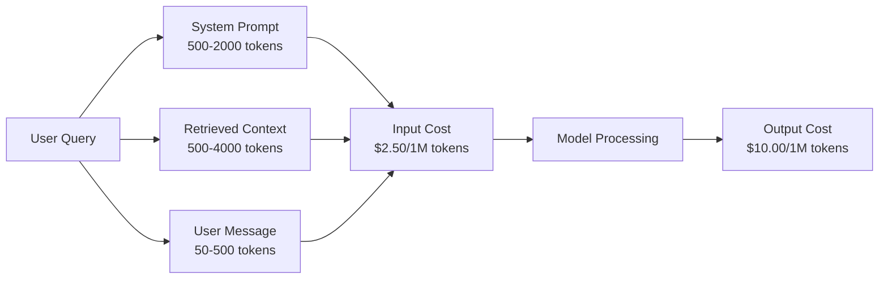
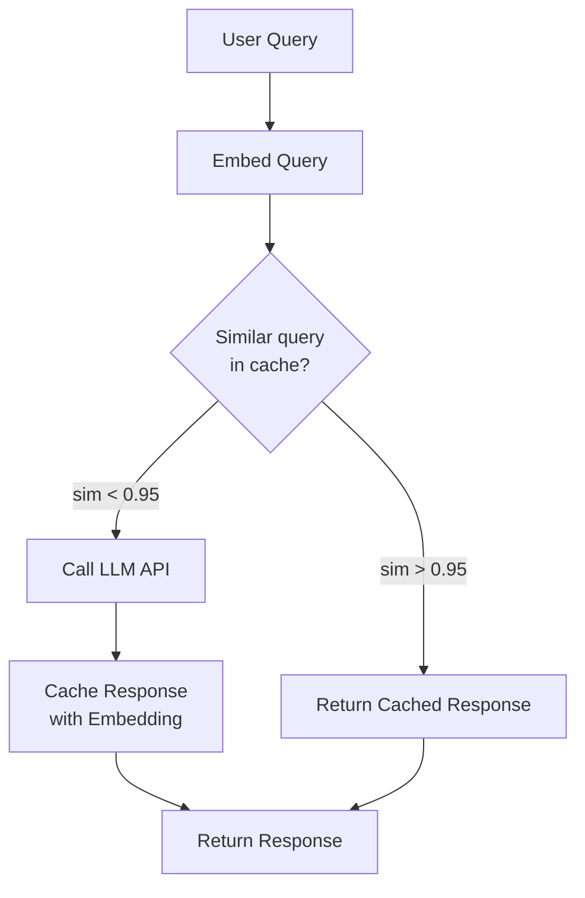
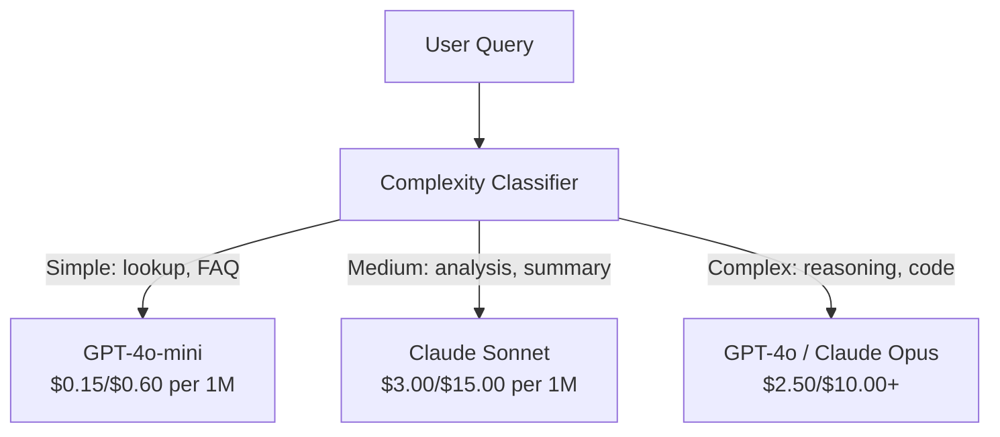

# Кэширование, ограничение скорости и оптимизация стоимости

> Большинство AI startups умирают не от плохих models. Они умирают от плохой unit economics. Один вызов GPT-4o стоит доли цента. Десять тысяч пользователей, делающих по десять calls в день, стоят $250 только во входных tokens — еще до того, как вы заработали первый доллар. Выживают компании, которые рассматривают каждый API call как финансовую транзакцию, а не как вызов функции.

**Тип:** Build
**Языки:** Python
**Предварительные требования:** Phase 11 Lesson 09 (Function Calling)
**Время:** ~45 минут
**Связано:** Phase 11 · 15 (Prompt Caching) — этот урок покрывает application-layer caching (semantic cache, exact hash cache, model routing). Lesson 15 покрывает provider-layer prompt caching (Anthropic cache_control, OpenAI automatic, Gemini CachedContent). Совмещайте оба подхода для снижения cost на 50-95%.

## Цели обучения

- Реализовать semantic caching, который обслуживает повторяющиеся или похожие queries из cache вместо нового API call
- Рассчитывать per-request costs у разных providers и реализовать token-aware rate limiting и budget alerts
- Построить слой cost optimization с prompt compression, model routing (expensive vs cheap) и response caching
- Спроектировать tiered caching strategy с exact match, semantic similarity и prefix caching для разных типов queries

## Проблема

Вы строите RAG chatbot. Он работает прекрасно. Пользователи довольны.

Потом приходит invoice.

GPT-5 стоит $5 за миллион input tokens и $15 за миллион output. Claude Opus 4.7 стоит $15 input / $75 output. Gemini 3 Pro стоит $1.25 input / $5 output. GPT-5-mini — $0.25/$2. Цены ниже иллюстративны; всегда проверяйте актуальную pricing page провайдера.

Вот математика, которая убивает startups:

- 10,000 daily active users
- 10 queries per user per day
- 1,000 input tokens per query (system prompt + context + user message)
- 500 output tokens per response

**Daily input cost:** 10,000 x 10 x 1,000 / 1,000,000 x $2.50 = **$250/day**
**Daily output cost:** 10,000 x 10 x 500 / 1,000,000 x $10.00 = **$500/day**
**Monthly total:** **$22,500/month**

Это только LLM. Добавьте embeddings, vector database hosting, infrastructure. Получается $30,000/month за chatbot.

Жесткая часть: 40-60% этих queries — почти дубликаты. Пользователи задают одни и те же вопросы немного разными словами. Ваш system prompt — одинаковый в каждом request — тарифицируется каждый раз. Context documents, retrieved by RAG, повторяются у пользователей, спрашивающих об одной теме.

Вы платите полную цену за избыточные вычисления.

## Концепция

### Анатомия стоимости LLM Call

У каждого API call есть пять компонентов cost.



System prompts — тихий убийца. System prompt на 1,500 tokens, отправляемый с каждым request, стоит $3.75 за миллион requests только за этот prefix. При 100K requests в день это $375/day — $11,250/month — за текст, который никогда не меняется.

### Provider Caching: встроенные скидки

В 2026 все три крупных provider предлагают provider-side prompt caching, но механика различается. Подробности — в Phase 11 · 15.

| Provider | Mechanism | Discount | Minimum | Cache Duration |
|----------|-----------|----------|---------|----------------|
| Anthropic | Explicit cache_control markers | 90% on cache hits (pay 25% extra on write) | 1,024 tokens (Sonnet/Opus), 2,048 (Haiku) | 5 min default; 1h extended (2x write premium) |
| OpenAI | Automatic prefix matching | 50% on cache hits | 1,024 tokens | Best-effort up to 1 hour |
| Google Gemini | Explicit CachedContent API | ~75% reduction (plus storage) | 4,096 (Flash) / 32,768 (Pro) | User-configurable TTL |

**Подход Anthropic** явный. Вы отмечаете sections prompt через `cache_control: {"type": "ephemeral"}`. Первый request платит 25% write premium. Последующие requests с тем же prefix получают 90% discount. System prompt на 2,000 tokens, который обычно стоит $0.005, на cache hits стоит $0.000625. На 100K requests это экономит $437.50/day.

**Подход OpenAI** автоматический. Любой prompt prefix, совпадающий с предыдущим request, получает 50% discount. Markers не нужны. Tradeoff: меньше discount, меньше control, но нулевая implementation effort.

### Semantic Caching: ваш собственный слой

Provider caching работает только для идентичных prefixes. Semantic caching решает более сложный случай: разные queries с одинаковым meaning.

"What is the return policy?" и "How do I return an item?" — разные strings, но один intent. Semantic cache embeds обе queries, считает cosine similarity и возвращает cached response, если similarity выше threshold (обычно 0.92-0.95).



Стоимость embeddings пренебрежимо мала. OpenAI text-embedding-3-small стоит $0.02 за миллион tokens. Проверка cache почти ничего не стоит по сравнению с полноценным LLM call.

### Exact Caching: hash and match

Для deterministic calls (temperature=0, same model, same prompt) exact caching проще и быстрее. Хешируйте full prompt, проверяйте cache, возвращайте найденное.

Это отлично работает для:
- System prompt + fixed context + identical user queries
- Function calling с identical tool definitions
- Batch processing, где один и тот же document обрабатывается несколько раз

### Rate Limiting: защита бюджета

Rate limiting — не только про fairness. Это про выживание.

**Token bucket algorithm:** каждый user получает bucket из N tokens, который пополняется со скоростью R в секунду. Request потребляет tokens из bucket. Если bucket пуст, request отклоняется. Это разрешает bursts (использовать весь bucket сразу), но enforced average rate.

**Per-user quotas:** задайте daily/monthly token limits по user tier.

| Tier | Daily Token Limit | Max Requests/min | Model Access |
|------|------------------|------------------|-------------|
| Free | 50,000 | 10 | GPT-4o-mini only |
| Pro | 500,000 | 60 | GPT-4o, Claude Sonnet |
| Enterprise | 5,000,000 | 300 | All models |

### Model Routing: правильная модель для правильной задачи

Не каждый query требует GPT-4o.

"What time does the store close?" не требует model за $10/M-output. GPT-4o-mini за $0.60/M output справится прекрасно. Claude Haiku за $1.25/M output тоже. Простой classifier направляет дешевые queries в дешевые models, а сложные — в дорогие.



Хорошо настроенный router экономит 40-70% только на model costs.

### Cost Tracking: знайте, куда уходят деньги

Нельзя оптимизировать то, что вы не измеряете. Логируйте каждый API call с:

- Timestamp
- Model name
- Input tokens
- Output tokens
- Latency (ms)
- Computed cost ($)
- User ID
- Cache hit/miss
- Request category

Эти данные показывают, какие features дороги, какие users потребляют больше всего и где caching дает максимальный эффект.

### Batching: bulk discounts

OpenAI Batch API обрабатывает requests асинхронно со скидкой 50%. Вы отправляете batch до 50,000 requests, results возвращаются в течение 24 часов.

Используйте batching для:
- Nightly document processing
- Bulk classification
- Evaluation runs
- Data enrichment pipelines

Не для: real-time user-facing queries (latency важна).

### Budget Alerts and Circuit Breakers

Circuit breaker останавливает spending, когда достигнут limit. Без него bug или abuse может сжечь monthly budget за часы.

Задайте три thresholds:
1. **Warning** (70% budget): отправить alert
2. **Throttle** (85% budget): перейти только на cheaper models
3. **Stop** (95% budget): отклонять new requests, возвращать только cached responses

### Optimization Stack

Применяйте эти techniques по порядку. Каждый слой усиливает предыдущие.

| Layer | Technique | Typical Savings | Implementation Effort |
|-------|-----------|----------------|----------------------|
| 1 | Provider prompt caching | 30-50% | Low (add cache markers) |
| 2 | Exact caching | 10-20% | Low (hash + dict) |
| 3 | Semantic caching | 15-30% | Medium (embeddings + similarity) |
| 4 | Model routing | 40-70% | Medium (classifier) |
| 5 | Rate limiting | Budget protection | Low (token bucket) |
| 6 | Prompt compression | 10-30% | Medium (rewrite prompts) |
| 7 | Batching | 50% on eligible | Low (batch API) |

RAG app, применяющий layers 1-5, обычно снижает costs с $22,500/month до $4,000-6,000/month. Это разница между burning runway и building a business.

### Real Savings: Before and After

Вот реальный breakdown для RAG chatbot с 10,000 DAU.

| Metric | Before Optimization | After Optimization | Savings |
|--------|--------------------|--------------------|---------|
| Monthly LLM cost | $22,500 | $5,200 | 77% |
| Avg cost per query | $0.0075 | $0.0017 | 77% |
| Cache hit rate | 0% | 52% | -- |
| Queries routed to mini | 0% | 65% | -- |
| P95 latency | 2,800ms | 900ms (cache hits: 50ms) | 68% |
| Monthly embedding cost | $0 | $180 | (new cost) |
| Total monthly cost | $22,500 | $5,380 | 76% |

Embedding cost для semantic caching ($180/month) окупается в течение первого часа cache hits.

## Соберите это

### Шаг 1: Cost calculator

Постройте token cost calculator, который знает текущие prices для major models.

```python
import hashlib
import time
import json
import math
from dataclasses import dataclass, field


MODEL_PRICING = {
    "gpt-4o": {"input": 2.50, "output": 10.00, "cached_input": 1.25},
    "gpt-4o-mini": {"input": 0.15, "output": 0.60, "cached_input": 0.075},
    "gpt-4.1": {"input": 2.00, "output": 8.00, "cached_input": 0.50},
    "gpt-4.1-mini": {"input": 0.40, "output": 1.60, "cached_input": 0.10},
    "gpt-4.1-nano": {"input": 0.10, "output": 0.40, "cached_input": 0.025},
    "o3": {"input": 2.00, "output": 8.00, "cached_input": 0.50},
    "o3-mini": {"input": 1.10, "output": 4.40, "cached_input": 0.55},
    "o4-mini": {"input": 1.10, "output": 4.40, "cached_input": 0.275},
    "claude-opus-4": {"input": 15.00, "output": 75.00, "cached_input": 1.50},
    "claude-sonnet-4": {"input": 3.00, "output": 15.00, "cached_input": 0.30},
    "claude-haiku-3.5": {"input": 0.80, "output": 4.00, "cached_input": 0.08},
    "gemini-2.5-pro": {"input": 1.25, "output": 10.00, "cached_input": 0.3125},
    "gemini-2.5-flash": {"input": 0.15, "output": 0.60, "cached_input": 0.0375},
}


def calculate_cost(model, input_tokens, output_tokens, cached_input_tokens=0):
    if model not in MODEL_PRICING:
        return {"error": f"Unknown model: {model}"}
    pricing = MODEL_PRICING[model]
    non_cached = input_tokens - cached_input_tokens
    input_cost = (non_cached / 1_000_000) * pricing["input"]
    cached_cost = (cached_input_tokens / 1_000_000) * pricing["cached_input"]
    output_cost = (output_tokens / 1_000_000) * pricing["output"]
    total = input_cost + cached_cost + output_cost
    return {
        "model": model,
        "input_tokens": input_tokens,
        "output_tokens": output_tokens,
        "cached_input_tokens": cached_input_tokens,
        "input_cost": round(input_cost, 6),
        "cached_input_cost": round(cached_cost, 6),
        "output_cost": round(output_cost, 6),
        "total_cost": round(total, 6),
    }
```

### Шаг 2: Exact cache

Хешируйте full prompt и возвращайте cached responses для identical requests.

```python
class ExactCache:
    def __init__(self, max_size=1000, ttl_seconds=3600):
        self.cache = {}
        self.max_size = max_size
        self.ttl = ttl_seconds
        self.hits = 0
        self.misses = 0

    def _hash(self, model, messages, temperature):
        key_data = json.dumps({"model": model, "messages": messages, "temperature": temperature}, sort_keys=True)
        return hashlib.sha256(key_data.encode()).hexdigest()

    def get(self, model, messages, temperature=0.0):
        if temperature > 0:
            self.misses += 1
            return None
        key = self._hash(model, messages, temperature)
        if key in self.cache:
            entry = self.cache[key]
            if time.time() - entry["timestamp"] < self.ttl:
                self.hits += 1
                entry["access_count"] += 1
                return entry["response"]
            del self.cache[key]
        self.misses += 1
        return None

    def put(self, model, messages, temperature, response):
        if temperature > 0:
            return
        if len(self.cache) >= self.max_size:
            oldest_key = min(self.cache, key=lambda k: self.cache[k]["timestamp"])
            del self.cache[oldest_key]
        key = self._hash(model, messages, temperature)
        self.cache[key] = {
            "response": response,
            "timestamp": time.time(),
            "access_count": 1,
        }

    def stats(self):
        total = self.hits + self.misses
        return {
            "hits": self.hits,
            "misses": self.misses,
            "hit_rate": round(self.hits / total, 4) if total > 0 else 0,
            "cache_size": len(self.cache),
        }
```

### Шаг 3: Semantic cache

Embed queries и возвращайте cached responses, когда similarity превышает threshold.

```python
def simple_embed(text):
    words = text.lower().split()
    vocab = {}
    for w in words:
        vocab[w] = vocab.get(w, 0) + 1
    norm = math.sqrt(sum(v * v for v in vocab.values()))
    if norm == 0:
        return {}
    return {k: v / norm for k, v in vocab.items()}


def cosine_similarity(a, b):
    if not a or not b:
        return 0.0
    all_keys = set(a) | set(b)
    dot = sum(a.get(k, 0) * b.get(k, 0) for k in all_keys)
    return dot


class SemanticCache:
    def __init__(self, similarity_threshold=0.85, max_size=500, ttl_seconds=3600):
        self.entries = []
        self.threshold = similarity_threshold
        self.max_size = max_size
        self.ttl = ttl_seconds
        self.hits = 0
        self.misses = 0

    def get(self, query):
        query_embedding = simple_embed(query)
        now = time.time()
        best_match = None
        best_sim = 0.0
        for entry in self.entries:
            if now - entry["timestamp"] > self.ttl:
                continue
            sim = cosine_similarity(query_embedding, entry["embedding"])
            if sim > best_sim:
                best_sim = sim
                best_match = entry
        if best_match and best_sim >= self.threshold:
            self.hits += 1
            best_match["access_count"] += 1
            return {"response": best_match["response"], "similarity": round(best_sim, 4), "original_query": best_match["query"]}
        self.misses += 1
        return None

    def put(self, query, response):
        if len(self.entries) >= self.max_size:
            self.entries.sort(key=lambda e: e["timestamp"])
            self.entries.pop(0)
        self.entries.append({
            "query": query,
            "embedding": simple_embed(query),
            "response": response,
            "timestamp": time.time(),
            "access_count": 1,
        })

    def stats(self):
        total = self.hits + self.misses
        return {
            "hits": self.hits,
            "misses": self.misses,
            "hit_rate": round(self.hits / total, 4) if total > 0 else 0,
            "cache_size": len(self.entries),
        }
```

### Шаг 4: Rate limiter

Token bucket rate limiter с per-user quotas.

```python
class TokenBucketRateLimiter:
    def __init__(self):
        self.buckets = {}
        self.tiers = {
            "free": {"capacity": 50_000, "refill_rate": 500, "max_requests_per_min": 10},
            "pro": {"capacity": 500_000, "refill_rate": 5_000, "max_requests_per_min": 60},
            "enterprise": {"capacity": 5_000_000, "refill_rate": 50_000, "max_requests_per_min": 300},
        }

    def _get_bucket(self, user_id, tier="free"):
        if user_id not in self.buckets:
            tier_config = self.tiers.get(tier, self.tiers["free"])
            self.buckets[user_id] = {
                "tokens": tier_config["capacity"],
                "capacity": tier_config["capacity"],
                "refill_rate": tier_config["refill_rate"],
                "last_refill": time.time(),
                "request_timestamps": [],
                "max_rpm": tier_config["max_requests_per_min"],
                "tier": tier,
                "total_tokens_used": 0,
            }
        return self.buckets[user_id]

    def _refill(self, bucket):
        now = time.time()
        elapsed = now - bucket["last_refill"]
        refill = int(elapsed * bucket["refill_rate"])
        if refill > 0:
            bucket["tokens"] = min(bucket["capacity"], bucket["tokens"] + refill)
            bucket["last_refill"] = now

    def check(self, user_id, tokens_needed, tier="free"):
        bucket = self._get_bucket(user_id, tier)
        self._refill(bucket)
        now = time.time()
        bucket["request_timestamps"] = [t for t in bucket["request_timestamps"] if now - t < 60]
        if len(bucket["request_timestamps"]) >= bucket["max_rpm"]:
            return {"allowed": False, "reason": "rate_limit", "retry_after_seconds": 60 - (now - bucket["request_timestamps"][0])}
        if bucket["tokens"] < tokens_needed:
            deficit = tokens_needed - bucket["tokens"]
            wait = deficit / bucket["refill_rate"]
            return {"allowed": False, "reason": "token_limit", "tokens_available": bucket["tokens"], "retry_after_seconds": round(wait, 1)}
        return {"allowed": True, "tokens_available": bucket["tokens"]}

    def consume(self, user_id, tokens_used, tier="free"):
        bucket = self._get_bucket(user_id, tier)
        bucket["tokens"] -= tokens_used
        bucket["request_timestamps"].append(time.time())
        bucket["total_tokens_used"] += tokens_used

    def get_usage(self, user_id):
        if user_id not in self.buckets:
            return {"error": "User not found"}
        b = self.buckets[user_id]
        return {
            "user_id": user_id,
            "tier": b["tier"],
            "tokens_remaining": b["tokens"],
            "capacity": b["capacity"],
            "total_tokens_used": b["total_tokens_used"],
            "utilization": round(b["total_tokens_used"] / b["capacity"], 4) if b["capacity"] else 0,
        }
```

### Шаг 5: Cost tracker

Логируйте каждый call и считайте running totals.

```python
class CostTracker:
    def __init__(self, monthly_budget=1000.0):
        self.logs = []
        self.monthly_budget = monthly_budget
        self.alerts = []

    def log_call(self, model, input_tokens, output_tokens, cached_input_tokens=0, latency_ms=0, user_id="anonymous", cache_status="miss"):
        cost = calculate_cost(model, input_tokens, output_tokens, cached_input_tokens)
        entry = {
            "timestamp": time.time(),
            "model": model,
            "input_tokens": input_tokens,
            "output_tokens": output_tokens,
            "cached_input_tokens": cached_input_tokens,
            "latency_ms": latency_ms,
            "cost": cost["total_cost"],
            "user_id": user_id,
            "cache_status": cache_status,
        }
        self.logs.append(entry)
        self._check_budget()
        return entry

    def _check_budget(self):
        total = self.total_cost()
        pct = total / self.monthly_budget if self.monthly_budget > 0 else 0
        if pct >= 0.95 and not any(a["level"] == "stop" for a in self.alerts):
            self.alerts.append({"level": "stop", "message": f"Budget 95% consumed: ${total:.2f}/${self.monthly_budget:.2f}", "timestamp": time.time()})
        elif pct >= 0.85 and not any(a["level"] == "throttle" for a in self.alerts):
            self.alerts.append({"level": "throttle", "message": f"Budget 85% consumed: ${total:.2f}/${self.monthly_budget:.2f}", "timestamp": time.time()})
        elif pct >= 0.70 and not any(a["level"] == "warning" for a in self.alerts):
            self.alerts.append({"level": "warning", "message": f"Budget 70% consumed: ${total:.2f}/${self.monthly_budget:.2f}", "timestamp": time.time()})

    def total_cost(self):
        return round(sum(e["cost"] for e in self.logs), 6)

    def cost_by_model(self):
        by_model = {}
        for e in self.logs:
            m = e["model"]
            if m not in by_model:
                by_model[m] = {"calls": 0, "cost": 0, "input_tokens": 0, "output_tokens": 0}
            by_model[m]["calls"] += 1
            by_model[m]["cost"] = round(by_model[m]["cost"] + e["cost"], 6)
            by_model[m]["input_tokens"] += e["input_tokens"]
            by_model[m]["output_tokens"] += e["output_tokens"]
        return by_model

    def cache_savings(self):
        cache_hits = [e for e in self.logs if e["cache_status"] == "hit"]
        if not cache_hits:
            return {"saved": 0, "cache_hits": 0}
        saved = 0
        for e in cache_hits:
            full_cost = calculate_cost(e["model"], e["input_tokens"], e["output_tokens"])
            saved += full_cost["total_cost"]
        return {"saved": round(saved, 4), "cache_hits": len(cache_hits)}

    def summary(self):
        if not self.logs:
            return {"total_calls": 0, "total_cost": 0}
        total_latency = sum(e["latency_ms"] for e in self.logs)
        cache_hits = sum(1 for e in self.logs if e["cache_status"] == "hit")
        return {
            "total_calls": len(self.logs),
            "total_cost": self.total_cost(),
            "avg_cost_per_call": round(self.total_cost() / len(self.logs), 6),
            "avg_latency_ms": round(total_latency / len(self.logs), 1),
            "cache_hit_rate": round(cache_hits / len(self.logs), 4),
            "cost_by_model": self.cost_by_model(),
            "cache_savings": self.cache_savings(),
            "budget_remaining": round(self.monthly_budget - self.total_cost(), 2),
            "budget_utilization": round(self.total_cost() / self.monthly_budget, 4) if self.monthly_budget > 0 else 0,
            "alerts": self.alerts,
        }
```

### Шаг 6: Model router

Направляйте queries к самой дешевой model, которая может с ними справиться.

```python
SIMPLE_KEYWORDS = ["what time", "hours", "address", "phone", "price", "return policy", "hello", "hi", "thanks", "yes", "no"]
COMPLEX_KEYWORDS = ["analyze", "compare", "explain why", "write code", "debug", "architect", "design", "trade-off", "evaluate"]


def classify_complexity(query):
    q = query.lower()
    if len(q.split()) <= 5 or any(kw in q for kw in SIMPLE_KEYWORDS):
        return "simple"
    if any(kw in q for kw in COMPLEX_KEYWORDS):
        return "complex"
    return "medium"


def route_model(query, tier="pro"):
    complexity = classify_complexity(query)
    routing_table = {
        "simple": {"free": "gpt-4.1-nano", "pro": "gpt-4o-mini", "enterprise": "gpt-4o-mini"},
        "medium": {"free": "gpt-4o-mini", "pro": "claude-sonnet-4", "enterprise": "claude-sonnet-4"},
        "complex": {"free": "gpt-4o-mini", "pro": "gpt-4o", "enterprise": "claude-opus-4"},
    }
    model = routing_table[complexity].get(tier, "gpt-4o-mini")
    return {"query": query, "complexity": complexity, "model": model, "tier": tier}
```

### Шаг 7: Запустите демо

```python
def simulate_llm_call(model, query):
    input_tokens = len(query.split()) * 4 + 500
    output_tokens = 150 + (len(query.split()) * 2)
    latency = 200 + (output_tokens * 2)
    return {
        "model": model,
        "response": f"[Simulated {model} response to: {query[:50]}...]",
        "input_tokens": input_tokens,
        "output_tokens": output_tokens,
        "latency_ms": latency,
    }


def run_demo():
    print("=" * 60)
    print("  Caching, Rate Limiting & Cost Optimization Demo")
    print("=" * 60)

    print("\n--- Model Pricing ---")
    for model, pricing in list(MODEL_PRICING.items())[:6]:
        cost_1k = calculate_cost(model, 1000, 500)
        print(f"  {model}: ${cost_1k['total_cost']:.6f} per 1K in + 500 out")

    print("\n--- Cost Comparison: 100K Requests ---")
    for model in ["gpt-4o", "gpt-4o-mini", "claude-sonnet-4", "claude-haiku-3.5"]:
        cost = calculate_cost(model, 1000 * 100_000, 500 * 100_000)
        print(f"  {model}: ${cost['total_cost']:.2f}")

    print("\n--- Anthropic Cache Savings ---")
    no_cache = calculate_cost("claude-sonnet-4", 2000, 500, 0)
    with_cache = calculate_cost("claude-sonnet-4", 2000, 500, 1500)
    saving = no_cache["total_cost"] - with_cache["total_cost"]
    print(f"  Without cache: ${no_cache['total_cost']:.6f}")
    print(f"  With 1500 cached tokens: ${with_cache['total_cost']:.6f}")
    print(f"  Savings per call: ${saving:.6f} ({saving/no_cache['total_cost']*100:.1f}%)")

    exact_cache = ExactCache(max_size=100, ttl_seconds=300)
    semantic_cache = SemanticCache(similarity_threshold=0.75, max_size=100)
    rate_limiter = TokenBucketRateLimiter()
    tracker = CostTracker(monthly_budget=100.0)

    print("\n--- Exact Cache ---")
    messages_1 = [{"role": "user", "content": "What is the return policy?"}]
    result = exact_cache.get("gpt-4o-mini", messages_1, 0.0)
    print(f"  First lookup: {'HIT' if result else 'MISS'}")
    exact_cache.put("gpt-4o-mini", messages_1, 0.0, "You can return items within 30 days.")
    result = exact_cache.get("gpt-4o-mini", messages_1, 0.0)
    print(f"  Second lookup: {'HIT' if result else 'MISS'} -> {result}")
    result = exact_cache.get("gpt-4o-mini", messages_1, 0.7)
    print(f"  With temp=0.7: {'HIT' if result else 'MISS (non-deterministic, skip cache)'}")
    print(f"  Stats: {exact_cache.stats()}")

    print("\n--- Semantic Cache ---")
    test_queries = [
        ("What is the return policy?", "Items can be returned within 30 days with receipt."),
        ("How do I return an item?", None),
        ("What are your store hours?", "We are open 9am-9pm Monday through Saturday."),
        ("When does the store open?", None),
        ("Tell me about quantum computing", "Quantum computers use qubits..."),
        ("Explain quantum mechanics", None),
    ]
    for query, response in test_queries:
        cached = semantic_cache.get(query)
        if cached:
            print(f"  '{query[:40]}' -> CACHE HIT (sim={cached['similarity']}, original='{cached['original_query'][:40]}')")
        elif response:
            semantic_cache.put(query, response)
            print(f"  '{query[:40]}' -> MISS (stored)")
        else:
            print(f"  '{query[:40]}' -> MISS (no match)")
    print(f"  Stats: {semantic_cache.stats()}")

    print("\n--- Rate Limiting ---")
    for i in range(12):
        check = rate_limiter.check("user_1", 1000, "free")
        if check["allowed"]:
            rate_limiter.consume("user_1", 1000, "free")
        status = "OK" if check["allowed"] else f"BLOCKED ({check['reason']})"
        if i < 5 or not check["allowed"]:
            print(f"  Request {i+1}: {status}")
    print(f"  Usage: {rate_limiter.get_usage('user_1')}")

    print("\n--- Model Routing ---")
    routing_queries = [
        "What time do you close?",
        "Summarize this quarterly earnings report",
        "Analyze the trade-offs between microservices and monoliths",
        "Hello",
        "Write code for a binary search tree with deletion",
    ]
    for q in routing_queries:
        route = route_model(q, "pro")
        print(f"  '{q[:50]}' -> {route['model']} ({route['complexity']})")

    print("\n--- Full Pipeline: Before vs After Optimization ---")
    queries = [
        "What is the return policy?",
        "How do I return something?",
        "What are your hours?",
        "When do you open?",
        "Explain the difference between TCP and UDP",
        "Compare TCP vs UDP protocols",
        "Hello",
        "What is your phone number?",
        "Write a Python function to sort a list",
        "Analyze the pros and cons of serverless architecture",
    ]

    print("\n  [Before: no caching, single model (gpt-4o)]")
    tracker_before = CostTracker(monthly_budget=1000.0)
    for q in queries:
        result = simulate_llm_call("gpt-4o", q)
        tracker_before.log_call("gpt-4o", result["input_tokens"], result["output_tokens"], latency_ms=result["latency_ms"], cache_status="miss")
    before = tracker_before.summary()
    print(f"  Total cost: ${before['total_cost']:.6f}")
    print(f"  Avg cost/call: ${before['avg_cost_per_call']:.6f}")
    print(f"  Avg latency: {before['avg_latency_ms']}ms")

    print("\n  [After: caching + routing + rate limiting]")
    exact_c = ExactCache()
    semantic_c = SemanticCache(similarity_threshold=0.75)
    tracker_after = CostTracker(monthly_budget=1000.0)

    for q in queries:
        messages = [{"role": "user", "content": q}]
        cached = exact_c.get("gpt-4o", messages, 0.0)
        if cached:
            tracker_after.log_call("gpt-4o-mini", 0, 0, latency_ms=5, cache_status="hit")
            continue
        sem_cached = semantic_c.get(q)
        if sem_cached:
            tracker_after.log_call("gpt-4o-mini", 0, 0, latency_ms=15, cache_status="hit")
            continue
        route = route_model(q)
        result = simulate_llm_call(route["model"], q)
        tracker_after.log_call(route["model"], result["input_tokens"], result["output_tokens"], latency_ms=result["latency_ms"], cache_status="miss")
        exact_c.put(route["model"], messages, 0.0, result["response"])
        semantic_c.put(q, result["response"])

    after = tracker_after.summary()
    print(f"  Total cost: ${after['total_cost']:.6f}")
    print(f"  Avg cost/call: ${after['avg_cost_per_call']:.6f}")
    print(f"  Avg latency: {after['avg_latency_ms']}ms")
    print(f"  Cache hit rate: {after['cache_hit_rate']:.0%}")

    if before["total_cost"] > 0:
        savings_pct = (1 - after["total_cost"] / before["total_cost"]) * 100
        print(f"\n  SAVINGS: {savings_pct:.1f}% cost reduction")
        print(f"  Latency improvement: {(1 - after['avg_latency_ms'] / before['avg_latency_ms']) * 100:.1f}% faster")

    print("\n--- Budget Alerts Demo ---")
    alert_tracker = CostTracker(monthly_budget=0.01)
    for i in range(5):
        alert_tracker.log_call("gpt-4o", 5000, 2000, latency_ms=500)
    print(f"  Total spent: ${alert_tracker.total_cost():.6f} / ${alert_tracker.monthly_budget}")
    for alert in alert_tracker.alerts:
        print(f"  ALERT [{alert['level'].upper()}]: {alert['message']}")

    print("\n--- Cost Breakdown by Model ---")
    multi_tracker = CostTracker(monthly_budget=500.0)
    for _ in range(50):
        multi_tracker.log_call("gpt-4o-mini", 800, 200, latency_ms=150)
    for _ in range(30):
        multi_tracker.log_call("claude-sonnet-4", 1500, 500, latency_ms=400)
    for _ in range(10):
        multi_tracker.log_call("gpt-4o", 2000, 800, latency_ms=600)
    for _ in range(10):
        multi_tracker.log_call("claude-opus-4", 3000, 1000, latency_ms=1200)
    breakdown = multi_tracker.cost_by_model()
    for model, data in sorted(breakdown.items(), key=lambda x: x[1]["cost"], reverse=True):
        print(f"  {model}: {data['calls']} calls, ${data['cost']:.6f}, {data['input_tokens']:,} in / {data['output_tokens']:,} out")
    print(f"  Total: ${multi_tracker.total_cost():.6f}")

    print("\n" + "=" * 60)
    print("  Demo complete.")
    print("=" * 60)


if __name__ == "__main__":
    run_demo()
```

## Используйте это

### Anthropic Prompt Caching

```python
# import anthropic
#
# client = anthropic.Anthropic()
#
# response = client.messages.create(
#     model="claude-sonnet-4-20250514",
#     max_tokens=1024,
#     system=[
#         {
#             "type": "text",
#             "text": "You are a helpful customer support agent for Acme Corp...",
#             "cache_control": {"type": "ephemeral"},
#         }
#     ],
#     messages=[{"role": "user", "content": "What is the return policy?"}],
# )
#
# print(f"Input tokens: {response.usage.input_tokens}")
# print(f"Cache creation tokens: {response.usage.cache_creation_input_tokens}")
# print(f"Cache read tokens: {response.usage.cache_read_input_tokens}")
```

Первый call пишет в cache (25% premium). Каждый следующий call с тем же system prompt prefix читает из cache (90% discount). Cache живет 5 минут и сбрасывает таймер на каждом hit.

### OpenAI Automatic Caching

```python
# from openai import OpenAI
#
# client = OpenAI()
#
# response = client.chat.completions.create(
#     model="gpt-4o",
#     messages=[
#         {"role": "system", "content": "You are a helpful customer support agent..."},
#         {"role": "user", "content": "What is the return policy?"},
#     ],
# )
#
# print(f"Prompt tokens: {response.usage.prompt_tokens}")
# print(f"Cached tokens: {response.usage.prompt_tokens_details.cached_tokens}")
# print(f"Completion tokens: {response.usage.completion_tokens}")
```

OpenAI кэширует автоматически. Любой prompt prefix длиной 1,024+ tokens, совпадающий с недавним request, получает 50% discount. Изменения кода не нужны — просто проверяйте `prompt_tokens_details.cached_tokens` в response, чтобы убедиться, что caching работает.

### OpenAI Batch API

```python
# import json
# from openai import OpenAI
#
# client = OpenAI()
#
# requests = []
# for i, query in enumerate(queries):
#     requests.append({
#         "custom_id": f"request-{i}",
#         "method": "POST",
#         "url": "/v1/chat/completions",
#         "body": {
#             "model": "gpt-4o-mini",
#             "messages": [{"role": "user", "content": query}],
#         },
#     })
#
# with open("batch_input.jsonl", "w") as f:
#     for r in requests:
#         f.write(json.dumps(r) + "\n")
#
# batch_file = client.files.create(file=open("batch_input.jsonl", "rb"), purpose="batch")
# batch = client.batches.create(input_file_id=batch_file.id, endpoint="/v1/chat/completions", completion_window="24h")
# print(f"Batch ID: {batch.id}, Status: {batch.status}")
```

Batch API дает плоскую скидку 50% на все tokens. Results приходят в течение 24 часов. Идеально для non-real-time workloads: evaluations, data labeling, bulk summarization.

### Production Semantic Cache with Redis

```python
# import redis
# import numpy as np
# from openai import OpenAI
#
# r = redis.Redis()
# client = OpenAI()
#
# def get_embedding(text):
#     response = client.embeddings.create(model="text-embedding-3-small", input=text)
#     return response.data[0].embedding
#
# def semantic_cache_lookup(query, threshold=0.95):
#     query_emb = np.array(get_embedding(query))
#     keys = r.keys("cache:emb:*")
#     best_sim, best_key = 0, None
#     for key in keys:
#         stored_emb = np.frombuffer(r.get(key), dtype=np.float32)
#         sim = np.dot(query_emb, stored_emb) / (np.linalg.norm(query_emb) * np.linalg.norm(stored_emb))
#         if sim > best_sim:
#             best_sim, best_key = sim, key
#     if best_sim >= threshold and best_key:
#         response_key = best_key.decode().replace("cache:emb:", "cache:resp:")
#         return r.get(response_key).decode()
#     return None
```

В production замените linear scan на vector index (Redis Vector Search, Pinecone или pgvector). Linear scan работает для <1,000 entries. Дальше используйте ANN (approximate nearest neighbor) для O(log n) lookup.

## Что отправить

Этот урок создает `outputs/prompt-cost-optimizer.md` — переиспользуемый prompt, который анализирует ваше LLM application и рекомендует конкретные cost optimizations с projected savings.

Он также создает `outputs/skill-cost-patterns.md` — decision framework для выбора caching strategy, rate limiting configuration и model routing rules для вашего use case.

## Упражнения

1. **Реализуйте LRU eviction для semantic cache.** Замените oldest-first eviction на least-recently-used. Отслеживайте last access time для каждого entry и evict entry с самым старым access time, когда cache заполнен. Сравните hit rates двух strategies на 100 queries.

2. **Постройте cost projection tool.** По log API calls (CostTracker logs) спрогнозируйте monthly cost на основе trailing 7-day average. Учитывайте weekday/weekend patterns. Trigger alert, если projected monthly cost превышает budget более чем на 20%.

3. **Реализуйте tiered semantic caching.** Используйте два similarity thresholds: 0.98 для high-confidence hits (return immediately) и 0.90 для medium-confidence hits (return with disclaimer: "Based on a similar previous question..."). Отслеживайте tier каждого hit и измеряйте differences user satisfaction.

4. **Постройте model routing classifier.** Замените keyword-based classifier на embedding-based. Embed 50 labeled queries (simple/medium/complex), затем классифицируйте new queries по nearest labeled example. Измерьте classification accuracy на test set из 20 queries.

5. **Реализуйте circuit breaker с degradation levels.** На 70% budget логируйте warning. На 85% автоматически переключайте весь routing на cheapest model (gpt-4o-mini). На 95% обслуживайте только cached responses и отклоняйте new queries. Проверьте симуляцией 1,000 requests при budget $1.00 и убедитесь, что каждый threshold срабатывает.

## Ключевые термины

| Термин | Как говорят | Что это на самом деле означает |
|------|----------------|----------------------|
| Prompt caching | "Cache the system prompt" | Provider-level caching, где повторяющиеся prompt prefixes получают discount (90% Anthropic, 50% OpenAI); без code changes для OpenAI, explicit markers для Anthropic |
| Semantic caching | "Smart caching" | Embedding query, расчет similarity к прошлым queries и возврат cached response при превышении threshold; ловит paraphrases, которые exact matching пропускает |
| Exact caching | "Hash caching" | Hashing full prompt (model + messages + temperature) и возврат cached response для identical inputs; работает только для deterministic calls при temperature=0 |
| Token bucket | "Rate limiter" | Algorithm, где у каждого user есть bucket из N tokens, пополняемый со скоростью R в секунду; разрешает bursts до N и average rate R |
| Model routing | "Cheapskate routing" | Classifier отправляет simple queries в cheap models (GPT-4o-mini, Haiku), а complex queries — в expensive models (GPT-4o, Opus); экономит 40-70% на model costs |
| Cost tracking | "Metering" | Логирование каждого API call с model, tokens, latency, cost и user ID, чтобы знать, куда уходят деньги и какие features дороги |
| Circuit breaker | "Kill switch" | Автоматическая деградация service (cheaper models, cached-only) или полная остановка requests при приближении spending к budget limit |
| Batch API | "Bulk discount" | Асинхронная обработка OpenAI со скидкой 50%; отправьте до 50,000 requests и получите results в течение 24 часов |
| Prompt compression | "Token diet" | Переписывание system prompts и context, чтобы использовать меньше tokens при сохранении meaning; shorter prompts дешевле и часто работают лучше |
| Cache hit rate | "Cache efficiency" | Процент requests, обслуженных из cache вместо LLM call; 40-60% типично для production chatbots и дает пропорциональную экономию |

## Дополнительное чтение

- [Anthropic Prompt Caching Guide](https://docs.anthropic.com/en/docs/build-with-claude/prompt-caching) — official docs по explicit cache_control markers, pricing и cache lifetime behavior Anthropic
- [OpenAI Prompt Caching](https://platform.openai.com/docs/guides/prompt-caching) — automatic caching OpenAI, проверка cache hits через usage fields и minimum prefix lengths
- [OpenAI Batch API](https://platform.openai.com/docs/guides/batch) — 50% discount для asynchronous processing, JSONL format, 24-hour completion window и 50K request limits
- [GPTCache](https://github.com/zilliztech/GPTCache) — open-source semantic caching library с поддержкой multiple embedding backends, vector stores и eviction policies
- [Martian Model Router](https://docs.withmartian.com) — production model routing, автоматически выбирающий cheapest model, capable для каждого query
- [Not Diamond](https://www.notdiamond.ai) — ML-based model router, который учится на traffic patterns и оптимизирует cost/quality tradeoffs across providers
- [Helicone](https://www.helicone.ai) — LLM observability platform с cost tracking, caching, rate limiting и budget alerts как proxy layer
- [Dean & Barroso, "The Tail at Scale" (CACM 2013)](https://research.google/pubs/the-tail-at-scale/) — latency, throughput, TTFT/TPOT percentiles и hedged requests; cost model за принципом "pick the cheapest model that still meets P95."
- [Kwon et al., "Efficient Memory Management for Large Language Model Serving with PagedAttention" (SOSP 2023)](https://arxiv.org/abs/2309.06180) — paper vLLM; почему paged KV-cache + continuous batching дают throughput 24× выше naive servers, infra layer под "caching and cost."
- [Dao et al., "FlashAttention-2: Faster Attention with Better Parallelism and Work Partitioning" (ICLR 2024)](https://arxiv.org/abs/2307.08691) — kernel-level cost reduction, orthogonal к prompt caching; читайте вместе со speculative decoding и GQA для полной cost-curve picture.
