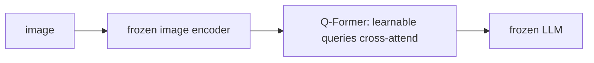

# От CLIP к BLIP-2 — Q-Former как мост между модальностями

> CLIP выравнивает изображение и текст, но не может генерировать captions, отвечать на вопросы или вести диалог. BLIP-2 (Salesforce, 2023) решил это с помощью небольшого trainable bridge: 32 learnable query vectors attend over features frozen ViT через cross-attention, а затем напрямую вставляются во входной поток frozen LLM. 188M параметров bridge соединили 11B LLM с ViT-g/14. Каждая adapter-based VLM до 2026 года — MiniGPT-4, InstructBLIP, родственники LLaVA — является потомком. Этот урок разбирает архитектуру Q-Former, объясняет two-stage training и строит toy version, которая подает visual tokens в frozen text decoder.

**Тип:** Практика
**Языки:** Python (stdlib, cross-attention + learnable-query demo)
**Предварительные требования:** Phase 12 · 02 (CLIP), Phase 7 (Transformers)
**Время:** ~180 минут

## Цели обучения

- Объяснить, почему trainable bottleneck между frozen vision encoder и frozen LLM выигрывает у end-to-end finetuning по cost и stability.
- Реализовать cross-attention block, где фиксированный набор learnable queries attends to external image features.
- Пройти BLIP-2 two-stage pretraining: representation (ITC + ITM + ITG), затем generative (LM loss with frozen decoder).
- Сравнить Q-Former с более простым MLP projector, используемым в LLaVA, и аргументировать, когда какой выбор выигрывает.

## Проблема

У вас есть frozen ViT, который производит 256 patch tokens of dim 1408 per image. У вас есть frozen 7B LLM, ожидающая token embeddings of dim 4096. Очевидный мост — linear layer from 1408 to 4096 — работает, но подача всех 256 patch tokens в context LLM стоит 256 extra tokens per image. На batch из 32 images это 8192 tokens, занятых только visual modality.

Вопрос BLIP-2: можно ли сжать 256-token image representation в гораздо меньшее число tokens (например, 32), сохранив достаточно информации, чтобы LLM могла caption, answer questions и reason about the image? И можно ли обучить этот bridge, не трогая frozen backbones, оставив training cost только на parameters bridge?

Ответ: Q-Former. 32 learnable "query" vectors, которые cross-attend to patch tokens ViT, создавая 32-token visual summary, потребляемое LLM. Всего 188M parameters. Обучается с contrastive, matching и generative objectives до какого-либо подключения к LLM.

## Концепция

### Learnable queries

Ключевой прием Q-Former: вместо того чтобы позволять text tokens LLM attend to image patches, вводится новый набор из 32 learnable query vectors `Q`, и *они* attend to image patches. Queries являются параметрами модели — они обучаются во время training, и одни и те же 32 queries используются для каждого image.

После cross-attention каждый query содержит сжатое summary изображения — "describe the main object", "describe the background", "count the objects" и т.д. Queries не специализируются буквально на semantic labels; они учат любое encoding, которое снижает downstream losses.

### Architecture

Q-Former — небольшой transformer (12 layers, ~100M params) с двумя paths:

1. Query path: 32 query vectors проходят через self-attention (между собой), затем cross-attention over frozen ViT's patch tokens, затем FFN.
2. Text path: BERT-like text encoder shares self-attention and FFN weights with query path. Cross-attention disabled for text path.

Во время training работают оба paths. Queries и text взаимодействуют через shared self-attention, что означает: queries могут condition on text для tasks, которым это нужно (ITM, ITG). На inference для VLM handoff проходят только queries, выдавая 32 visual tokens.

### Two-stage training

BLIP-2 pretrains в два stages:

Stage 1: representation learning (no LLM). Три losses:
- ITC (image-text contrastive): CLIP-style contrastive между pooled query tokens и text CLS token.
- ITM (image-text matching): binary classifier — является ли image-text pair совпадением? Hard-negative-mined.
- ITG (image-grounded text generation): causal LM head on text, conditioned on the queries. Заставляет queries encode text-generatable content.

Обучается только Q-Former. ViT frozen. LLM не участвует.

Stage 2: generative learning. Подключается frozen LLM (OPT-2.7B или Flan-T5-XL, etc.). 32 query outputs проецируются в embedding dim LLM через небольшой linear layer. Они добавляются в начало text prompt. Обучаются только linear projection и Q-Former на LM loss over concatenated prompt + image + caption sequence.

После stage 2 Q-Former + projection — полный visual adapter. На inference: image → ViT → Q-Former → linear proj → prepended to text → frozen LLM emits output.

### Parameter economics

BLIP-2 with ViT-g/14 (1.1B, frozen) + OPT-6.7B (6.7B, frozen) + Q-Former (188M, trained) = 8B total, 188M trained. Один Q-Former — ~2.4% parameters full stack. Training cost отражает это: days on a handful of A100s vs weeks for end-to-end.

Quality: BLIP-2 matches or beats Flamingo-80B on zero-shot VQA while being 50x smaller. Bridge работает.

### InstructBLIP and the instruction-aware Q-Former

InstructBLIP (2023) расширяет Q-Former дополнительным входом: instruction text itself. Во время cross-attention queries теперь имеют доступ и к image patches, и к instruction. Queries могут специализироваться per-instruction ("count the cars", "describe the mood"), а не учить одно fixed summary. Benchmark gains on held-out tasks.

### MiniGPT-4 and the projector-only approach

MiniGPT-4 сохранил Q-Former, но обучал только output linear projection, заморозив все остальное. Дешево, но ценой качества — queries были BLIP-2's, not yours. Хорошо для rapid iteration, но не лучшая architecture.

### Why LLaVA went simpler

LLaVA (2023, Lesson 12.05) заменила Q-Former plain 2-layer MLP, который проецирует каждый ViT patch token в LLM space — 576 tokens per image для сетки 24x24, все подаются в LLM. Compression хуже, но LLM может attend over raw patches. На тот момент это было спорно; к концу 2023 года стало dominant, потому что visual instruction data (LLaVA-Instruct-150k) доказали, что MLP можно обучить сохранять достаточно signal. Tradeoff: context LLaVA заполняется быстрее, но она naturally scales to multi-image and video.

К 2026 году field разделился: Q-Former сохраняется там, где важен token budget (long video, many images); MLP projector доминирует там, где raw quality per token — priority.

### Gated cross-attention: Flamingo, the ancestor

Flamingo (Lesson 12.04) предшествовал BLIP-2 и использовал ту же идею cross-attention, но на каждом frozen LLM layer, а не как single bridge. BLIP-2 показал, что можно сжать до input layer only и все равно работать. Gemini и Idefics combine both: interleaved input tokens plus optional gated cross-attention for in-context few-shot.

### The 2026 descendants

- Q-Former: BLIP-2, InstructBLIP, MiniGPT-4 и большинство video-language models из-за token budget.
- Perceiver resampler: Flamingo's variant (Lesson 12.04); Idefics family, Eagle, OmniMAE.
- MLP projector: LLaVA, LLaVA-NeXT, LLaVA-OneVision, Cambrian-1.
- Attention pool: VILA, PaliGemma.

Все четыре варианта валидны. Решающий вопрос: constrained ли вы token budget или quality-per-token.

## Использование

`code/main.py` строит stdlib Q-Former-style cross-attention:

1. Simulate 256 image patch tokens (dim 128).
2. Instantiate 32 learnable queries (dim 128).
3. Run scaled-dot-product cross-attention (Q from queries, K/V from patches).
4. Project to LLM-dim (512) via a linear layer.
5. Output the 32 LLM-ready visual tokens.

Вся математика на pure Python (nested loops over vectors). Toy but correct shape. Attention-weight matrix printed, so you can see which patches each query pulled from.

## Результат

Этот урок создает `outputs/skill-modality-bridge-picker.md`. По target VLM configuration (vision encoder token count, LLM context budget, deployment constraints, quality target) он рекомендует Q-Former vs MLP vs Perceiver resampler с коротким обоснованием и parameter-count estimate для каждого bridge.

## Упражнения

1. Реализуйте cross-attention block в PyTorch. Проверьте, что with 32 queries and 256 keys/values, attention-weight matrix is 32 x 256 and each row sums to 1 after softmax.

2. В BLIP-2 stage 1 Q-Former запускает три losses одновременно: ITC, ITM, ITG. Напишите forward signature для каждого в pseudo-code. Which one requires the text encoder path to be active?

3. Сравните parameter counts: Q-Former (12 layers, 768 hidden) vs a 2-layer MLP projector (1408 → 4096, two layers). At what LLM scale does the 188M Q-Former cost pay back in training efficiency?

4. Прочитайте Section 3.2 of the BLIP-2 paper (arXiv:2301.12597) о том, how the Q-Former is initialized. Объясните, почему initializing from BERT-base (not random) accelerates convergence.

5. Для 10-minute video at 1 FPS sampled to 60 frames вычислите per-frame token cost при (Q-Former → 32 tokens/frame) vs (MLP projector → 576 tokens/frame). Which fits into a 128k-token LLM context window?

## Ключевые термины

| Термин | Как говорят | Что это на самом деле означает |
|------|----------------|------------------------|
| Q-Former | "Querying transformer" | Небольшой transformer с 32 learnable query vectors, которые cross-attend to frozen ViT features |
| Learnable queries | "Soft prompt for vision" | Fixed set of parameters, которые являются query side of cross-attention; learned per model, shared across all inputs |
| Cross-attention | "Q from here, K/V from there" | Attention, где query, key и value приходят из разных sources; так queries pull from ViT patches |
| ITC | "Image-text contrastive" | CLIP-style loss applied to Q-Former pooled queries vs text CLS |
| ITM | "Image-text matching" | Binary classifier on hard-negative-mined pairs; forces queries to discriminate fine-grained mismatches |
| ITG | "Image-grounded text generation" | Causal LM loss, где text generated conditioned on queries; forces queries to encode text-decodable content |
| Two-stage pretraining | "Representation then generative" | Stage 1 trains Q-Former alone (ITC/ITM/ITG); Stage 2 attaches frozen LLM and trains only projection + Q-Former |
| Frozen backbone | "Do not finetune" | Vision encoder and LLM weights are fixed; trains only bridge |
| Projection head | "Linear to LLM dim" | Final linear layer mapping Q-Former output to the LLM's embedding dimension |
| Perceiver resampler | "Flamingo's version" | Similar learnable-query cross-attention, used by Flamingo at every layer rather than as a single bridge |

## Дополнительное чтение

- [Li et al. — BLIP-2 (arXiv:2301.12597)](https://arxiv.org/abs/2301.12597) — the core paper.
- [Li et al. — BLIP (arXiv:2201.12086)](https://arxiv.org/abs/2201.12086) — the predecessor with the ITC/ITM/ITG trio.
- [Li et al. — ALBEF (arXiv:2107.07651)](https://arxiv.org/abs/2107.07651) — "align before fuse" — the conceptual ancestor of stage 1 training.
- [Dai et al. — InstructBLIP (arXiv:2305.06500)](https://arxiv.org/abs/2305.06500) — instruction-aware Q-Former.
- [Zhu et al. — MiniGPT-4 (arXiv:2304.10592)](https://arxiv.org/abs/2304.10592) — projector-only approach.
- [Jaegle et al. — Perceiver IO (arXiv:2107.14795)](https://arxiv.org/abs/2107.14795) — general architecture for learnable-query cross-attention.
