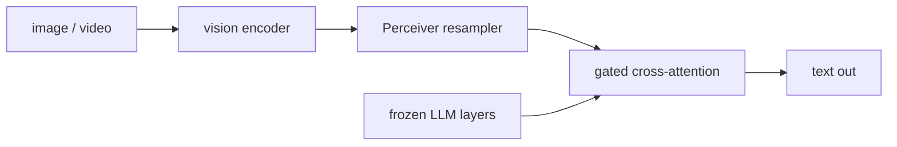

# Flamingo и gated cross-attention для few-shot VLMs

> Flamingo от DeepMind (2022) сделал две вещи раньше всех. Он показал, что одна модель может обрабатывать произвольно interleaved sequences of images, videos, and text. И он показал, что VLMs могут учиться in-context — дайте few-shot prompt с тремя example (image, caption) pairs, и модель caption a new image без какого-либо gradient step. Механизм: gated cross-attention layers, вставленные между существующими layers frozen LLM, с learned tanh gate, начинающимся с нуля, чтобы text capability LLM сохранялась при initialization. Этот урок разбирает Flamingo's Perceiver resampler и gated cross-attention architecture — ancestor of Gemini's interleaved inputs and Idefics2's visual tokens.

**Тип:** Изучение
**Языки:** Python (stdlib, gated cross-attention + Perceiver resampler demo)
**Предварительные требования:** Phase 12 · 03 (BLIP-2 Q-Former)
**Время:** ~120 минут

## Цели обучения

- Объяснить, как gated cross-attention сохраняет text capability frozen LLM at initialization via tanh(gate) = 0.
- Пройти Perceiver resampler: N image patches → K fixed "latent" queries via cross-attention.
- Описать, как Flamingo обрабатывает interleaved image-text sequences с causal masking, который respects image placement.
- Воспроизвести few-shot multimodal prompt structure (3 image-caption examples then a query image).

## Проблема

BLIP-2 подает 32 visual tokens во входной layer frozen LLM. Это работает для one image per prompt. Но что если нужно подать *many* images interleaved with text, как в "here is image A, caption it; here is image B, caption it; now here is image C, caption it"? Self-attention LLM должна была бы обрабатывать image tokens и text tokens в одном stream, и вопрос, какие positions can attend to which images, становится муторным.

Ответ Flamingo: не менять input stream LLM вообще. Вставить extra cross-attention layers между existing LLM blocks. Text tokens по-прежнему проходят через causal self-attention LLM как обычно. Между каждыми несколькими LLM blocks text tokens также cross-attend to image features через новый gated layer. Gate (initialized to zero) означает, что на step zero новые layers являются no-ops — модель ведет себя ровно как pretrained LLM. По мере training gate открывается, и visual information начинает течь.

Второй вопрос, на который ответил Flamingo: как обрабатывать variable number of images (0, 1, or many) per prompt? Perceiver resampler — небольшой cross-attention module, который берет любое число patches и производит fixed number of visual latent tokens. LLM cross-attention layer видит одну и ту же shape независимо от того, сколько images в prompt.

## Концепция



### The frozen LLM

Flamingo начинается с frozen Chinchilla 70B LLM. Все 70B weights untouched. Existing text self-attention and FFN operate normally.

### Perceiver resampler

Для каждого image in prompt ViT производит N patch tokens. Perceiver resampler имеет K fixed learnable latents (Flamingo uses K=64). Каждый resampler block состоит из двух sub-steps:

1. Cross-attention: K latents attend over N patch tokens (Q from latents, K/V from patches).
2. Self-attention + FFN within the latents.

После 6 resampler blocks output — K=64 visual tokens of dim 1024, независимо от того, сколько patches произвел ViT. Изображение 224x224 (196 patches) и 480x480 (900 patches) оба выходят как 64 resampler tokens.

Для video resampler применяется temporally: patches каждого frame производят 64 latents, и temporal positional encoding позволяет модели отличать t=0 от t=N. Full video becomes T * 64 visual tokens.

### Gated cross-attention

Между каждыми M layers frozen LLM (Flamingo uses M=4) вставляется новый gated cross-attention block:

```
x_after_llm_block = llm_block(x_before)
cross = cross_attn(x_after, resampler_output)
gated = tanh(alpha) * cross + x_after
x_before_next_block = gated
```

- `alpha` is a learnable scalar initialized to zero.
- `tanh(0) = 0`, so at init the gated branch contributes zero.
- As `alpha` moves away from zero, the cross-attention contribution grows smoothly.
- The residual connection means even a fully-open gate does not overwrite the LLM's text representation; it just adds visual information on top.

Это самое важное design choice в Flamingo: visual conditioning is additive, gated, and zero at initialization. Flamingo at step 0 — perfect Chinchilla 70B on text-only inputs.

### Masked cross-attention for interleaved inputs

В prompt вроде "<image A> caption A <image B> caption B <image C> ?" каждый text token должен видеть только images, которые стоят до него в sequence. Cross-attention mask enforces: text token at position `t` attends only to image resampler tokens whose image index `i < i_t` where `i_t` is the most recent image before position `t`. "Sees only the last preceding image" и "sees all preceding images" — оба valid choices; Flamingo chose the former.

### In-context few-shot learning

Prompt Flamingo выглядит так:

```
<image1> A photo of a cat. <image2> A photo of a dog. <image3> A photo of a
```

Модель видит completion pattern и выдает "bird" (or whatever image3 shows). No gradient steps. In-context learning capability frozen LLM переносится через gated cross-attention — это punchline статьи и причина, почему она важна.

### Training data

Flamingo обучали на трех datasets:

1. MultiModal MassiveWeb (M3W): 43M web pages with interleaved images and text, reconstructing reading order.
2. Image-Text Pairs (ALIGN + LTIP): 4.4B pairs.
3. Video-Text Pairs (VTP): 27M short video clips.

OBELICS (2023) — open reproduction of the interleaved web corpus, на котором train Idefics, Idefics2 и большинство open "Flamingo-like" models.

### OpenFlamingo and Otter

OpenFlamingo (2023) — open reproduction. Architecture identical (Perceiver resampler + gated cross-attention on frozen LLaMA or MPT). Checkpoints at 3B, 4B, 9B. Quality lags Flamingo due to smaller base LLM and less data.

Otter (2023) builds on OpenFlamingo with instruction tuning on MIMIC-IT (a dataset of multimodal instructions), showing gated cross-attention works for instruction following too.

### The descendants

- Idefics / Idefics2 / Idefics3: Hugging Face's gated cross-attention lineage, progressively simpler (Idefics2 dropped the resampler in favor of direct patch tokens with adaptive pooling).
- Flamingo-to-Chameleon transition: by 2024 many teams moved to early-fusion (Lesson 12.11); Flamingo-style gated cross-attention remains in production where backbone freezing is required.
- Gemini's interleaved input: conceptually inherits Flamingo's interleaved-format flexibility, though the exact mechanism is proprietary.

### Comparison to BLIP-2

| | BLIP-2 | Flamingo |
|---|---|---|
| Visual bridge | Q-Former once at input | Gated cross-attention at every M layers |
| Visual tokens | 32 per image | 64 per image per cross-attn layer |
| Frozen LLM | Yes | Yes |
| Few-shot in-context | Weak | Strong — the paper's centerpiece |
| Interleaved inputs | No native support | Yes, the design target |
| Training data | 130M pairs | 1.3B pairs + 43M interleaved pages |
| Parameter count | 188M trained | ~10B trained (cross-attn layers) |
| Compute | Days on 8 A100s | Weeks on thousands of TPUv4 |

Выбирайте BLIP-2 для single-image VQA on a budget. Выбирайте Flamingo/Idefics2 для interleaved, few-shot или multi-image reasoning.

## Использование

`code/main.py` demonstrates:

1. A Perceiver resampler on 36 fake patch tokens with 8 learnable latents (pure Python cross-attention).
2. A gated cross-attention step with `alpha = 0` → output equals input (LLM unchanged), then `alpha = 2.0` → visual contribution mixed in.
3. An interleaved-mask builder that produces the 2D attention mask for a "(image 1) (text 1) (image 2) (text 2)" sequence.

## Результат

Этот урок создает `outputs/skill-gated-bridge-diagnostic.md`. По config open VLM (resampler Y/N, cross-attn frequency, gate scheme) он identifies Flamingo lineage elements и explains freezing strategy. Полезно для debugging, почему fine-tune degraded text performance (answer: the gate got too wide too fast).

## Упражнения

1. Вычислите visual parameter count Flamingo-9B: 9B LLM + 1.4B gated cross-attention layers + 64M resampler. Какая fraction total params is trained?

2. Реализуйте gated residual `y = tanh(alpha) * cross + x` в PyTorch. Экспериментально покажите, что with `alpha=0`, `y==x` exactly at init.

3. Прочитайте OpenFlamingo Section 3.2 (arXiv:2308.01390) о том, how they handle multiple images in a batch when each prompt has a different image count. Describe the padding strategy.

4. Почему Flamingo's cross-attention mask позволяет text token attend to *only the most recent* preceding image rather than all preceding images? Read the Flamingo paper Section 2.4 and explain the tradeoff.

5. In-context few-shot: construct a prompt with 4 examples of "image → color of main object" for a new Flamingo variant. Describe the expected accuracy pattern as you vary the number of examples from 0 to 8.

## Ключевые термины

| Термин | Как говорят | Что это на самом деле означает |
|------|----------------|------------------------|
| Perceiver resampler | "Fixed-latent cross-attention" | Module, производящий K fixed tokens from a variable number of input patches |
| Gated cross-attention | "Tanh-gated bridge" | Residual layer `y = tanh(alpha)*cross + x`, learnable alpha, init 0 |
| Interleaved input | "Mixed sequence" | Prompt format with images and text mixed freely in reading order |
| Frozen LLM | "No LLM gradients" | Weights text LLM не обновляются; only resampler + cross-attn layers train |
| Few-shot | "In-context examples" | Дать несколько (image, answer) pairs in the prompt; model generalizes without finetuning |
| OBELICS | "Interleaved web corpus" | Open dataset of 141M web pages with images and text in reading order |
| Chinchilla | "70B frozen base" | Flamingo's frozen text LLM, from DeepMind's Chinchilla paper |
| Gate schedule | "How alpha moves" | Скорость, с которой cross-attention gate opens during training |
| Cross-attn frequency | "Every M layers" | How often a gated cross-attention block is inserted; Flamingo uses M=4 |
| OpenFlamingo | "Open reproduction" | MosaicML/LAION open checkpoint at 3-9B; architecture-identical to Flamingo |

## Дополнительное чтение

- [Alayrac et al. — Flamingo (arXiv:2204.14198)](https://arxiv.org/abs/2204.14198) — the original paper.
- [Awadalla et al. — OpenFlamingo (arXiv:2308.01390)](https://arxiv.org/abs/2308.01390) — open reproduction.
- [Laurençon et al. — OBELICS (arXiv:2306.16527)](https://arxiv.org/abs/2306.16527) — interleaved web corpus.
- [Jaegle et al. — Perceiver IO (arXiv:2107.14795)](https://arxiv.org/abs/2107.14795) — the general Perceiver architecture.
- [Li et al. — Otter (arXiv:2305.03726)](https://arxiv.org/abs/2305.03726) — instruction-tuned Flamingo descendant.
- [Laurençon et al. — Idefics2 (arXiv:2405.02246)](https://arxiv.org/abs/2405.02246) — modern simplification of the Flamingo approach.
