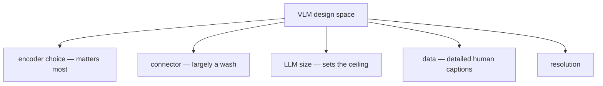

# Open-Weight VLM Recipes: что действительно важно

> Литература по open-weight VLM 2024-2026 годов — это лес ablation tables. Apple's MM1 протестировал 13 комбинаций image encoder, connector и data mix. Allen AI's Molmo доказал, что подробные человеческие captions превосходят GPT-4V distillation. Cambrian-1 выполнил 20+ сравнений encoder. Idefics2 формализовал five-axis design space. Prismatic VLMs сравнил 27 training recipes на контролируемом benchmark. Из всего этого шума устойчиво повторяется небольшой набор результатов: image encoder важнее connector architecture, data mixture важнее обоих, а подробные human captions превосходят distilled synthetic data. Этот урок читает эти таблицы за вас.

**Тип:** Изучение + лабораторная работа
**Языки:** Python (stdlib, ablation table parser + recipe picker)
**Предварительные требования:** Phase 12 · 05 (LLaVA baseline)
**Время:** ~180 минут

## Цели обучения

- Называть five-axis VLM design space: image encoder, connector, LLM, data mix, resolution schedule.
- Читать MM1 / Idefics2 / Cambrian-1 ablation table и предсказывать, какая ручка двигает заданный benchmark.
- Выбирать recipe (encoder, connector, data, resolution) для нового VLM с учетом compute budget и task mix.
- Объяснять, почему подробные human captions превосходят GPT-4V distillation при том же token count.

## Проблема

Существуют сотни open-weight VLM. Большая часть разрыва между "good" и "state-of-the-art" — это не архитектура. Это data, resolution schedule и encoder choice. Понимание, какую ручку крутить первой, когда ваша модель недорабатывает, спасает от ошибки ценой 5-million-GPU-hour.

Волна 2023 года (LLaVA-1.5, InstructBLIP, MiniGPT-4) работала на caption-pair pretraining + LLaVA-Instruct-150k. Хороший baseline. Уперлась примерно в MMMU 35%.

Волна 2024 года (MM1, Idefics2, Molmo, Cambrian-1, Prismatic VLMs) провела исчерпывающие ablations. Результаты оказались неожиданными и практичными.

## Концепция

### The five-axis design space

Idefics2 (Laurençon et al., 2024) назвал оси:

1. Image encoder. CLIP ViT-L/14, SigLIP SO400m/14, DINOv2 ViT-g/14, InternViT-6B. Encoders отличаются patch size, resolution и pretraining objective.
2. Connector. MLP (2-4 layers), Q-Former (32 queries + cross-attn), Perceiver Resampler (64 queries), C-Abstractor (convolutional + bilinear pooling).
3. Language model. Llama-3 8B / 70B, Mistral 7B, Phi-3, Gemma-2, Qwen2.5. LLM size — доминирующая parameter cost.
4. Training data. Caption pairs (CC3M, LAION), interleaved (OBELICS, MMC4), instruction (LLaVA-Instruct, ShareGPT4V, PixMo, Cauldron).
5. Resolution schedule. Fixed 224/336/448, AnyRes, native dynamic. Ramped during training or constant.

Каждый production VLM делает выбор по каждой оси. Большая часть дисперсии в MMMU scores объясняется осями 1, 4 и 5 — не тем, какой connector вы выбрали.

### Axis 1: encoder > connector

MM1 Section 3.2 показал: замена CLIP ViT-L/14 на SigLIP SO400m/14 добавила 3+ points MMMU. Замена connector с MLP на Perceiver Resampler добавила меньше 1 point. Idefics2 повторил результат: SigLIP > CLIP, Q-Former ≈ MLP ≈ Perceiver при том же token count.

Cambrian-1's "Cambrian Vision Encoders Match-Up" (Tong et al., 2024) прогнал 20+ encoders на vision-centric benchmark (CV-Bench). Вверху leaderboard — смесь DINOv2 и SigLIP; CLIP в середине; ImageBind и ViT-MAE ниже. Разрыв от CLIP ViT-L до DINOv2 ViT-g/14 — примерно 5-7 points на CV-Bench.

Encoder по умолчанию для open VLMs в 2026 году — SigLIP 2 SO400m/14 для semantic + dense features, иногда concatenated with DINOv2 ViT-g/14 features (Cambrian's "Spatial Vision Aggregator" делает это).

### Axis 2: connector design is a wash

MM1, Idefics2, Prismatic и MM-Interleaved пришли к одному выводу: при фиксированном visual-token count connector architecture почти не важна. 2-layer MLP на mean-pooled patches работает в пределах 1 point от 32-query Q-Former при том же token budget.

Важен token count. Больше visual tokens = больше LLM compute = лучше performance до некоторой точки, затем diminishing returns. 64 tokens per image слишком мало для OCR. 576-1024 tokens — sweet spot для большинства open VLMs. 2048+ помогают только для документов и графиков.

Q-Former vs MLP — это вопрос стоимости, а не качества: Q-Former ограничивает tokens на 32-64 независимо от image resolution; MLP emits all patch tokens. Для high-res inputs Q-Former экономит LLM context; для low-res разница — noise.

### Axis 3: LLM size sets the ceiling

Удвоение LLM с 7B до 13B надежно добавляет 2-4 points на MMMU во всех VLM papers. На 70B большинство benchmarks насыщаются. Потолок multimodal reasoning у VLM — это потолок text reasoning у LLM; visual encoder может только подать ему информацию, а не рассуждать вместо него.

Именно поэтому Qwen2.5-VL-72B и Claude Opus 4.7 превосходят на MMMU-Pro и ScreenSpot-Pro: language brain огромен. 7B VLM не заменит 70B VLM с помощью clever connector design.

### Axis 4: data — detailed human captions beat distillation

Molmo + PixMo (Deitke et al., 2024) — результат 2024 года, который должен прочитать каждый. В Allen AI human annotators описывали изображения в плотных speech-to-text passes длиной 1-3 минуты, получив 712K densely-captioned images. В training data вообще нет GPT-4V distillation.

Molmo-72B превзошел Llama-3.2-90B-Vision на 11 из 11 benchmarks. Дельта не в архитектуре — она в caption quality. Подробные human captions содержат в 5-10x больше информации на изображение, чем короткие web captions, и остаются factually grounded там, где GPT-4V distillation галлюцинирует.

ShareGPT4V (Chen et al., 2023) и Cauldron (Idefics2) следовали тому же playbook со смешанными human + GPT-4V captions. Тренд ясен: для frontier 2026 года caption density > caption quantity > distillation convenience.

### Axis 5: resolution and its schedule

Idefics2's ablations: 384 -> 448 добавляет 1-2 points. 448 -> 980 с image splitting (AnyRes) добавляет еще 3-5 на OCR benchmarks. Flat resolution training выходит на плато средней точности; resolution ramping (start 224, finish 448 or native) обучается быстрее и заканчивает выше.

Cambrian-1 провел trade-off resolution vs tokens: при fixed compute можно иметь больше tokens на lower resolution или меньше tokens на higher resolution. Higher resolution выигрывает для OCR; lower-res-more-tokens выигрывает для general scene understanding.

Production recipe 2026 года: train Stage 1 at 384 fixed, Stage 2 with dynamic resolution up to 1280 for OCR-heavy tasks.

### The Prismatic controlled comparison

Prismatic VLMs (Karamcheti et al., 2024) — статья, которая контролировала все оси. Тот же 13B LLM, те же instruction data, та же evaluation — меняется только одна ось за раз. Результаты:

- Per-image visual-token count объясняет ~60% variance.
- Encoder choice объясняет ~20%.
- Connector architecture объясняет ~5%.
- Все остальное (data mix, scheduler, LR) — оставшиеся ~15%.

Это грубая декомпозиция, но это самый чистый ответ в литературе на вопрос "what should I ablate first".

### A picker for 2026

С учетом evidence, default open-VLM recipe для нового проекта в 2026 году:

- Encoder: SigLIP 2 SO400m/14 at native resolution with NaFlex, concatenated with DINOv2 ViT-g/14 for dense features if you need segmentation/grounding.
- Connector: 2-layer MLP on patch tokens. Skip Q-Former unless you are token-constrained.
- LLM: Qwen2.5 / Llama-3.1 / Gemma 2, 7B for cost, 70B for quality, picked by target latency.
- Data: PixMo + ShareGPT4V + Cauldron, topped up with task-specific instruction data.
- Resolution: dynamic (min 256, max 1280 pixels per long side).
- Schedule: Stage 1 alignment (projector-only), Stage 2 full fine-tune, Stage 3 task-specific fine-tune.

Каждый из этих defaults восходит к measured ablation в статьях, процитированных в конце урока.

## Использование

`code/main.py` — это ablation table parser and recipe picker. Он кодирует MM1 and Idefics2 ablation tables (condensed) и позволяет спрашивать:

- "Given budget X and task Y, what recipe wins?"
- "If I swap SigLIP for CLIP on a 7B Llama, what is the expected MMMU delta?"
- "Which axis should I ablate first for an 80% confidence answer?"

Output — ranked recipe list с expected benchmark deltas и рекомендацией "ablate first".

## Результат

Этот урок создает `outputs/skill-vlm-recipe-picker.md`. Для target task mix, compute budget и latency target он выдает полный recipe (encoder, connector, LLM, data mix, resolution schedule) с citations to the ablation, обосновывающей каждый выбор. Останавливает инженеров от повторного изобретения Idefics2 ablation table каждый раз, когда начинается новый VLM project.

## Упражнения

1. Прочитайте MM1 Section 3.2. Для fixed 2B LLM при budget 50M images какой encoder выигрывает? Изменится ли ответ при 13B LLM? Почему?

2. Cambrian-1 показывает, что concatenating DINOv2 + SigLIP превосходит каждый из них по отдельности на vision-centric benchmarks, но не добавляет сигнала на MMMU. Предскажите, какие benchmarks выиграют, а какие останутся без изменений.

3. Ваша цель — mobile UI agent на 2B LLM. Выберите encoder, connector, resolution и data mix. Обоснуйте каждый выбор конкретной ablation table.

4. Molmo ships 4B and 72B models. 4B конкурентен с closed 7B VLMs; 72B превосходит Llama-3.2-90B-Vision на 11/11 benchmarks. Что это говорит о гипотезе LLM-size plateau?

5. Спроектируйте ablation table, чтобы изолировать data-mix quality от encoder quality на 7B VLM. Сколько training runs минимум? Предложите four axis settings.

## Ключевые термины

| Термин | Как говорят | Что это на самом деле означает |
|------|-----------------|------------------------|
| Ablation | "Turning one knob" | Обучение нескольких runs, которые отличаются ровно одной осью design-space, при фиксированных остальных |
| Connector | "Bridge" / "projector" | Обучаемый модуль, который отображает vision encoder output в token space LLM (MLP, Q-Former, Perceiver) |
| Detailed human caption | "Dense caption" | Многофразовое human-written description (обычно 80-300 tokens), богаче web alt text |
| Distillation | "GPT-4V captions" | Training data, сгенерированные более сильной proprietary VLM; удобно, но склонно наследовать hallucination |
| AnyRes / dynamic res | "High-res path" | Стратегия подачи изображений больше native resolution encoder через tiling или M-RoPE |
| Resolution ramp | "Curriculum" | Training schedule, который начинается с low-resolution и повышает его, ускоряя alignment learning |
| Vision-centric bench | "CV-Bench / BLINK" | Evaluation, проверяющая fine-grained visual perception, а не language-heavy reasoning |
| PixMo | "Molmo's data" | Allen AI's 712K densely-captioned image dataset; человеческая речь transcribed into dense captions |

## Дополнительное чтение

- [McKinzie et al. — MM1 (arXiv:2403.09611)](https://arxiv.org/abs/2403.09611)
- [Laurençon et al. — Idefics2 / What matters building VLMs (arXiv:2405.02246)](https://arxiv.org/abs/2405.02246)
- [Deitke et al. — Molmo and PixMo (arXiv:2409.17146)](https://arxiv.org/abs/2409.17146)
- [Tong et al. — Cambrian-1 (arXiv:2406.16860)](https://arxiv.org/abs/2406.16860)
- [Karamcheti et al. — Prismatic VLMs (arXiv:2402.07865)](https://arxiv.org/abs/2402.07865)
