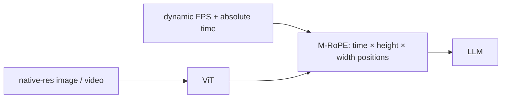

# Qwen-VL Family and Dynamic-FPS Video

> Семейство Qwen-VL — Qwen-VL (2023), Qwen2-VL (2024), Qwen2.5-VL (2025), Qwen3-VL (2025) — самая влиятельная линия открытых vision-language model в 2026 году. Каждое поколение сделало одну решающую архитектурную ставку, которую остальная open ecosystem копировала в течение двенадцати месяцев: native dynamic resolution via M-RoPE, dynamic-FPS sampling with absolute time alignment, window attention in the ViT и structured agent output formats. К Qwen3-VL recipe стабилизировался: 2D-RoPE-ViT encoder с native-aspect-ratio inputs, MLP projector в большую Qwen3 language base и training stages, где OCR, grounding и agent behavior были first-class targets. Этот урок читает семейство хронологически, чтобы вы понимали, почему каждая ручка находится там, где находится.

**Тип:** Изучение
**Языки:** Python (stdlib, M-RoPE encoder + dynamic-FPS sampler)
**Предварительные требования:** Phase 12 · 06 (patch-n'-pack)
**Время:** ~120 минут

## Цели обучения

- Вычислять трехосевые rotations M-RoPE (temporal, height, width) и объяснять, зачем нужны все три.
- Выбирать dynamic-FPS sampling strategy для video и рассуждать о tokens-per-second vs event-detection accuracy.
- Называть четыре generational upgrades Qwen-VL по порядку и что каждая включила.
- Подключать Qwen2.5-VL-style JSON agent output format и парсить structured tool calls из VLM response.

## Проблема

Qwen-VL вышел в August 2023 как прямой ответ на LLaVA-1.5 и BLIP-2. Gap, на который нацелилась Qwen team, был тройным: resolution, video и structured output.

Resolution: LLaVA-1.5 работала на 336x336. Подходит для photos, бесполезно для Chinese-language invoice или dense spreadsheet screenshot. Первой инновацией Qwen-VL были 448x448 и grounded bounding-box output, позволяющие модели указывать на объекты.

Video: Video-LLaMA складывал per-frame encoders и подавал их в LLM. Это работало для short clips, но не для multi-minute videos, где temporal axis является signal. Qwen team хотела один encoder, понимающий время.

Structured output: LLaVA emitted free-form text. Агенту нужен JSON. Qwen-VL обучали на explicit JSON output formats, включая bounding-box coordinates as text.

Каждое поколение Qwen-VL расширяет одну из этих трех осей.

## Концепция



### Qwen-VL (August 2023)

Первое поколение: OpenCLIP ViT-bigG/14 как encoder (2.5B params), LLama-compatible Q-Former (1-step with 256 queries), Qwen-7B base. Contributions:

- 448x448 resolution (then SOTA for an open VLM).
- Grounding: обучено на image-text pairs с explicit coordinate-token output. "The cat is at <box>(112, 204), (280, 344)</box>".
- Chinese + English multilingual training from the start.

Benchmarks at the time: competitive with GPT-4V on English, dominant on Chinese. Grounding supervision была главным результатом.

### Qwen2-VL (September 2024) — M-RoPE and native resolution

Qwen2-VL заменил fixed-resolution + Q-Former stack на natively dynamic-resolution ViT encoder. Key changes:

- Native dynamic resolution. ViT принимает любой HxW, делящийся на 28 (patch 14 with 2x spatial merge). Изображение 1120x672 (40x24 merged patches) производит 960 visual tokens. No resize, no tiling, no thumbnail.
- M-RoPE (Multimodal RoPE). Каждый token несет 3D position (t, h, w) вместо 1D. Для images t=0, for video t = frame_index. RoPE вращает query/key vectors с частотой per axis. No positional embedding table.
- MLP projector. Убрать Q-Former; использовать 2-layer MLP на merged patch tokens.
- Video with dynamic FPS. Video sampled at 1-2 FPS by default, но модель принимает arbitrary frame counts.

Result: Qwen2-VL-7B matched GPT-4o on several multimodal benchmarks and beat it on DocVQA (94.5 vs 88.4). Architecture change был decisive move.

### Qwen2.5-VL (February 2025) — dynamic FPS + absolute time

Главный сдвиг Qwen2.5-VL был в video. Dynamic FPS — это не просто "sample more frames when needed." Paper формализовал:

- Absolute time tokens. Вместо positional indices (frame 0, 1, 2...) используются actual timestamps. "At 0:04, the cat jumps." Модель видит `<time>0.04</time>` tokens interleaved with frame tokens.
- Dynamic FPS. Sample at 1 FPS for slow footage, 4+ FPS for action. User or trainer chooses; M-RoPE adapts.
- Window attention in ViT. Spatial attention is windowed (local within blocks) for throughput; global attention every few layers.
- Explicit JSON output format. Обучена на tool-call data: "{\"tool\": \"click\", \"coords\": [380, 220]}". Agent-ready out of the box.
- MRoPE-v2 scaling. Positions scale with max input size, чтобы 10-minute video не исчерпывал frequency range.

Benchmarks: Qwen2.5-VL-72B beats GPT-4o on most video benchmarks, matches Gemini 2.0 on documents, and sets the open-model SOTA for GUI grounding (ScreenSpot: 84% accuracy vs 38% for GPT-4o).

### Qwen3-VL (November 2025)

Qwen3-VL — incremental upgrade, который консолидирует, а не изобретает заново: larger LLM backbone (Qwen3-72B), expanded training data, improved OCR, stronger reasoning via the Qwen3 "thinking mode." ViT and M-RoPE stay. Paper focuses on data and training improvements over architecture.

Lineage takeaway: к 2025 году архитектура Qwen-VL стабилизировалась. Дополнительные поколения scale compute and data, not primitives.

### M-RoPE mathematically

Classical RoPE rotates a query `q` of dimension `d` by position `m` using paired coordinates:

```
q_rot[2i]   = q[2i]   * cos(m * theta_i) - q[2i+1] * sin(m * theta_i)
q_rot[2i+1] = q[2i]   * sin(m * theta_i) + q[2i+1] * cos(m * theta_i)
theta_i     = 10000^(-2i/d)
```

M-RoPE splits the hidden dim into three bands. Скажем, `d = 96`. Назначьте 32 dims temporal, 32 height, 32 width. Patch at (t=5, h=10, w=20) получает rotations `R_t(5)`, `R_h(10)`, `R_w(20)`, applied to its three bands.

Text tokens use `t = text_index, h = 0, w = 0` (or a normalized choice), keeping compatibility. Video frames use `t = frame_time, h = row, w = col`. Single images use `t = 0`.

Преимущество: one position encoding handles text, image, and video without branching code or different position tables.

### Dynamic-FPS sampling logic

Для video длительности `T` seconds и target-tokens budget `B`:

1. Вычислить maximum FPS, который можно позволить: `fps_max = B / (T * tokens_per_frame)`.
2. Выбрать target FPS из `{1, 2, 4, 8}`, который satisfies `fps <= fps_max`.
3. Если motion is high (optical-flow heuristic or explicit user request), выбрать higher FPS. Если motion is low, выбрать lower.
4. Sample uniformly at the chosen FPS; вставить `<time>t</time>` tokens between frames.

Qwen2.5-VL обучает эту логику implicitly; на inference user controls via `fps` parameter. A 60-second action sequence at 4 FPS with 81 tokens per frame = 19440 tokens, manageable in a 32k context.

### Structured agent output

Qwen2.5-VL's agent training explicitly targets structured tool calls:

```
{
  "tool": "mouse_click",
  "coords": [1024, 512],
  "button": "left",
  "modifier": null
}
```

Parsing is deterministic: JSON.parse over the model's output. Compare to free-form "click at (1024, 512)" which required regex and ambiguity handling. Сдвиг объясняет, почему ScreenSpot scores Qwen2.5-VL прыгнули с Qwen2-VL's 55% to 84%.

## Использование

`code/main.py` implements:

- M-RoPE position computation for a packed sequence mixing text, image patches, and video frames.
- Dynamic-FPS sampler: given (duration, budget, motion_level), pick FPS and emit frame timestamps.
- A toy Qwen2.5-VL JSON-output parser that handles tool-call responses with coordinate fields.

Запустите его, затем почувствуйте разницу, когда меняете fixed-FPS на dynamic-FPS на 5-minute video.

## Результат

Этот урок создает `outputs/skill-qwen-vl-pipeline-designer.md`. Для video task (monitoring, agent, action recognition, accessibility) он выдает Qwen2.5-VL configuration (frame budget, FPS strategy, window-attention flag, agent-output mode) и latency estimate. Используйте это всякий раз, когда deploy a Qwen-VL-family model for a video product.

## Упражнения

1. Compute M-RoPE rotations for a patch at (t=3, h=5, w=7) with hidden 48 (16 per band, base theta 10000). Покажите rotation angles для первых трех pairs in each band.

2. 10-minute security-camera recording at 1 FPS produces how many frames? При 384 resolution with 3x pool сколько total tokens? Does Qwen2.5-VL's default 32k context handle it?

3. Выберите FPS для 30-second tennis rally vs a 30-second recipe demo vs a 30-second UI-agent recording. Обоснуйте каждый выбор dynamic-FPS logic.

4. Qwen2.5-VL drops the Q-Former entirely. Почему simple MLP работает в 2025, но не в 2023? (Hint: data scale and encoder quality.)

5. Parse three Qwen2.5-VL JSON tool-call outputs into Python dicts. Что fails for malformed JSON и какую recovery strategy рекомендует Qwen cookbook?

## Ключевые термины

| Термин | Как говорят | Что это на самом деле означает |
|------|-----------------|------------------------|
| M-RoPE | "Multimodal RoPE" | 3D rotary position embedding с temporal, height и width bands in the hidden dim |
| Dynamic FPS | "Smart sampling" | Frame sampling rate, выбираемый per video по motion, duration и token budget |
| Absolute time token | "Timestamp token" | `<time>t</time>`, interleaved in the sequence, чтобы модель видела actual seconds, а не frame index |
| Window attention | "Local attention" | Spatial self-attention, ограниченный small windows for speed; global attention added periodically |
| Structured agent output | "JSON mode" | Training data supervision, обучающий VLM emitting parseable JSON with coords and tool names |
| min_pixels / max_pixels | "Resolution bounds" | Per-request Qwen2.5-VL controls bounding total pixel count and therefore token count |
| Grounding | "Point-at-it" | Outputting bounding-box coordinates as text tokens; used since Qwen-VL v1 |

## Дополнительное чтение

- [Bai et al. — Qwen-VL (arXiv:2308.12966)](https://arxiv.org/abs/2308.12966)
- [Wang et al. — Qwen2-VL (arXiv:2409.12191)](https://arxiv.org/abs/2409.12191)
- [Qwen Team — Qwen2.5-VL Technical Report (arXiv:2502.13923)](https://arxiv.org/abs/2502.13923)
- [Qwen Team — Qwen3-VL (arXiv:2511.21631)](https://arxiv.org/abs/2511.21631)
- [Zhu et al. — InternVL3 (arXiv:2504.10479)](https://arxiv.org/abs/2504.10479)
