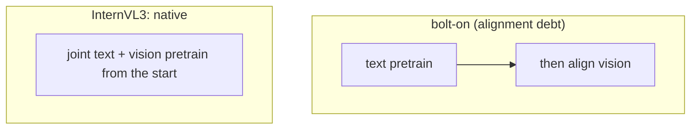

# InternVL3: Native Multimodal Pretraining

> Каждый open VLM до InternVL3 следовал одному трехшаговому recipe: взять text LLM, обученную на триллионах text tokens, прикрутить vision encoder, затем fine-tune the seams. Это работает, но создает alignment debt — text LLM потратила весь pretraining budget на чистый text и не понимает visual tokens нативно. Когда вы добавляете vision post-hoc, LLM должна заново научиться связывать visual input со своим text reasoning, не забывая text. InternVL3 (Zhu et al., April 2025) отвергает post-hoc approach: один pretraining run, text и multimodal interleaved from step one. Результат matches Gemini 2.5 Pro on MMMU-Pro at 78B params open. Этот урок разбирает доводы в пользу native pretraining и что меняется, когда вы его делаете.

**Тип:** Изучение
**Языки:** Python (stdlib, training-corpus mixer)
**Предварительные требования:** Phase 12 · 05, Phase 12 · 07 (recipes)
**Время:** ~120 минут

## Цели обучения

- Объяснять, почему post-hoc VLM training накапливает alignment debt, citing three measurable symptoms (catastrophic forgetting, answer drift, visual-text inconsistency).
- Описывать native pretraining corpus mix InternVL3 и почему ratio of text : interleaved : caption важен.
- Сравнивать V2PE (variable visual position encoding) с Qwen2-VL's M-RoPE.
- Называть Visual Resolution Router (ViR) и Decoupled Vision-Language (DvD) deployment optimizations.

## Проблема

Post-hoc VLM training — это default. LLaVA, BLIP-2, Qwen-VL, Idefics — все берут already-pretrained LLM (Llama, Vicuna, Qwen, Mistral) и добавляют vision. Training stages обычно выглядят так:

1. Frozen LLM + frozen vision encoder + trainable projector, trained on caption pairs to align embeddings.
2. Unfreeze LLM, train on instruction data (LLaVA-Instruct, ShareGPT4V).
3. Optional task-specific fine-tune.

Проявляются три симптома alignment debt:

- Catastrophic forgetting. Post-hoc VLM забывает text-only skills. GSM8K scores падают на 5-10 points. Hellaswag scores падают. Pure-text agents regress.
- Answer drift. Небольшие переформулировки одного visual question дают разные answers. Vision encoder соединяется с LLM более слабыми bindings, чем собственные tokens LLM.
- Visual-text inconsistency. VLM может корректно описать изображение, а затем ответить на вопрос, противореча собственному описанию. Visual tokens не участвуют во внутренних consistency checks LLM так же, как text.

Эти симптомы хорошо документированы. MM1.5 Section 4 количественно их измеряет. LLaVA-OneVision's ablations на них намекают. Native pretraining — ответ.

## Концепция

### Native multimodal pretraining

InternVL3 обучается с нуля на corpus, который является native multimodal с первого шага. Mix:

- 40% text-only data (FineWeb, Proof-Pile-2, etc.)
- 35% interleaved image-text data (OBELICS, MMC4-style)
- 20% paired image-caption data
- 5% video-text data

Vision tokens, text tokens и cross-modal interactions участвуют в одной loss с первого gradient step. No alignment pretraining, no projector freezing stage, no catastrophic forgetting to recover from.

Training — single stage for the base model. Instruction tuning follows, но base model уже понимает visual tokens как first-class citizens.

### V2PE (variable visual position encoding)

Qwen2-VL использует M-RoPE with fixed axis allocation. InternVL3 вводит V2PE: position encoding varies per modality type (text, image, video) with learnable scaling. На практике:

- Text tokens get 1D position (text index).
- Image patches get 2D position (row, col).
- Video frames get 3D position (time, row, col).

Все три share the same RoPE frequency base, но hidden-dim allocation per band является learned parameter, а не fixed split. Это дает свободу trade off temporal vs spatial frequency resolution during pretraining.

V2PE's ablation claim: 1-2 points on video benchmarks over M-RoPE at the same compute. Не революция, но чище.

### Visual Resolution Router (ViR)

Deployment optimization. Не всем images нужно full-resolution encoding. Photo with one object at low detail wastes tokens when encoded at 1280px native. ViR — небольшой classifier, который предсказывает minimum resolution needed to answer the question before encoding.

Routing имеет три tiers: low-res (256 tokens), medium (576), high (2048+). Для 60% production traffic queries low or medium is sufficient. Net effect: 2-3x throughput at equal quality.

### Decoupled Vision-Language deployment (DvD)

Когда вы serve a large VLM, vision encoder runs once per image, но LLM runs autoregressively for every output token. У двух компонентов разные bottlenecks (vision = GPU memory bandwidth for conv + attention; LLM = KV cache). DvD splits them onto separate GPUs with streaming between.

Для 8B + 400M encoder model DvD roughly doubles per-node throughput vs co-located.

### Single-stage vs multi-stage quality

Primary benchmark claim InternVL3: при 78B params match Gemini 2.5 Pro's MMMU-Pro. При 38B match GPT-4o. При 8B lead the open-8B leaderboard. Все на single-stage pretrain + instruction-tune recipe.

Alignment-debt hypothesis измерима: InternVL3-8B теряет меньше text-benchmark points (MMLU, GSM8K), чем Qwen2.5-VL-7B, per unit of vision-benchmark gain. Модель более generalist, потому что training был one piece, not two.

### InternVL3.5 and InternVL-U

InternVL3.5 (August 2025) scales the recipe. Тот же native-pretrain approach, больше data, больше params. MMMU improvements are incremental.

InternVL-U (2026) adds unified generation — image output via MMDiT heads on top of the same backbone. "U" stands for "Understanding + generation," chasing Transfusion-style unified models (Lesson 12.13). The same native-pretrain backbone supports both understanding and generation heads.

### Trade-offs of native pretraining

Native pretraining is not free:

- Compute. Training a new VLM from scratch costs the same as training a text LLM — millions of GPU-hours. Post-hoc adaptation reuses existing LLM weights, saves most of the cost.
- Data. Interleaved image-text corpora at scale are rare. OBELICS is 141M documents; MMC4 is 571M. Text alone ships at 15T tokens. Multimodal pretraining data scarcity is a hard constraint.
- Base-LLM reuse. Native pretraining gives up the option to drop in a new LLM later. Post-hoc lets you swap Llama-3.1 for Llama-4 by retraining only the adapter.

Ставка InternVL3: alignment debt хуже, чем loss of reuse. Benchmarks подтверждают claim. Cost-to-produce bars future labs from cheaply replicating. Post-hoc VLMs will keep existing because they remain cheaper for most projects.

## Использование

`code/main.py` — это training-corpus mixer and ViR router simulator. Он:

- Принимает target corpus mix (%text, %interleaved, %caption, %video) и computes expected steps per modality.
- Simulates ViR routing on a batch of queries (distribution: 50% low-detail, 30% medium, 20% high-detail) and reports average token count.
- Reports DvD throughput estimates given encoder vs LLM FLOPs.
- Prints a side-by-side of post-hoc vs native pretraining in params, compute, data, and expected alignment-debt symptoms.

## Результат

Этот урок создает `outputs/skill-native-vs-posthoc-auditor.md`. Для proposed VLM training plan он audits whether to go native or post-hoc, flags alignment-debt risk и recommends a corpus mix. Используйте его, когда sizing a new open-VLM project and need to pick the training strategy.

## Упражнения

1. Estimate the compute delta between InternVL3-8B (native pretrain) and LLaVA-OneVision-7B (post-hoc). Ratio of GPU-hours approximately? Что объясняет gap?

2. InternVL3 reports 40% text / 35% interleaved / 20% caption / 5% video. Если ваша target task is video-heavy, предложите new ratio и аргументируйте, почему base model still needs substantial text and caption data.

3. Прочитайте MM1.5 Section 4 on forgetting. Назовите exact benchmark, где post-hoc training showed the largest regression. How much did the regression cost?

4. ViR routes 60% of traffic to low-resolution encoding. Какие kinds of queries does it misroute (sends to low-res when high-res was needed)? Предложите three router-failure modes.

5. DvD splits vision and LLM onto separate GPUs. При каком traffic pattern does DvD hurt throughput instead of helping?

## Ключевые термины

| Термин | Как говорят | Что это на самом деле означает |
|------|-----------------|------------------------|
| Native multimodal pretraining | "From scratch together" | Text + image + video tokens participate in the loss from step 1, not bolted on later |
| Alignment debt | "Post-hoc penalty" | Measurable regression in text skills and answer consistency that comes from bolting vision onto a frozen LLM |
| V2PE | "Variable visual pos encoding" | Per-modality learnable position encoding allocation; InternVL3's M-RoPE successor |
| ViR | "Resolution router" | Small classifier that picks minimum resolution needed per query before encoding, saving inference tokens |
| DvD | "Decoupled deployment" | Vision encoder on one GPU, LLM on another, with stream handoff; doubles throughput for large VLMs |
| InternVL-U | "Unified understanding + generation" | 2026 follow-up that adds image-generation heads to the native-pretrain backbone |
| Interleaved corpus | "OBELICS / MMC4" | Documents with text and images in natural reading order; the raw material for native pretraining |

## Дополнительное чтение

- [Chen et al. — InternVL 1 (arXiv:2312.14238)](https://arxiv.org/abs/2312.14238)
- [Zhu et al. — InternVL3 (arXiv:2504.10479)](https://arxiv.org/abs/2504.10479)
- [InternVL3.5 (arXiv:2508.18265)](https://arxiv.org/abs/2508.18265)
- [InternVL-U (arXiv:2603.09877)](https://arxiv.org/abs/2603.09877)
- [Zhang et al. — MM1.5 (arXiv:2409.20566)](https://arxiv.org/abs/2409.20566)
