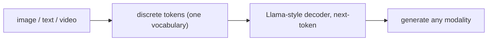

# Emu3: предсказание следующего токена для генерации изображений и видео

> Emu3 от BAAI (Wang et al., сентябрь 2024) — результат 2024 года, который должен был закрыть спор diffusion-versus-autoregressive. Один Llama-style decoder-only transformer, обученный только на next-token-prediction objective, по единому словарю из текста + VQ-токенов изображений + 3D VQ-токенов видео, превосходит SDXL в генерации изображений и LLaVA-1.6 в perception. Без CLIP loss. Без diffusion schedule. Classifier-free guidance используется на инференсе для качества, но базовая цель обучения — next-token prediction с teacher forcing. Опубликовано в Nature. Этот урок разбирает тезис Emu3 — почему лучшего токенизатора плюс масштаба достаточно — и противопоставляет его diffusion-подходам.

**Тип:** Изучение
**Языки:** Python (stdlib, 3D video tokenizer math + autoregressive sampler skeleton)
**Предварительные требования:** Phase 12 · 11 (Chameleon)
**Время:** ~120 минут

## Цели обучения

- Объяснить, почему единая next-token objective в Emu3 работает, несмотря на долгое предположение, что для качества изображений необходима diffusion.
- Описать 3D video tokenizer: как выглядит spatiotemporal VQ codebook и почему patches охватывают время.
- Сравнить Emu3 и Stable Diffusion XL по (training compute, inference cost, quality ceiling).
- Назвать три роли одной и той же модели Emu3: Emu3-Gen (image gen), Emu3-Chat (perception), Emu3-Stage2 (video gen).

## Проблема

Общепринятое мнение до 2024 года: генерации изображений нужна diffusion. Аргумент: дискретные токены изображения теряют слишком много информации для реконструкции деталей, а авторегрессионный sampling накапливает ошибку на тысячах токенов. Stable Diffusion, DALL-E 3, Imagen, Midjourney все используют ту или иную форму diffusion. Chameleon (Lesson 12.11) частично опроверг это в малом масштабе, но не сравнялся с SDXL по качеству.

Emu3 атаковал этот аргумент напрямую. Утверждение: лучший визуальный токенизатор + достаточный масштаб + next-token loss = генерация изображений, превосходящая diffusion, в той же модели, которая также умеет perception.

Когда работа вышла, ставка была спорной. Спустя два года open-source семейство unified-generation (Emu3, Show-o, Janus-Pro, Transfusion) стало стандартным путем для исследований; production frontier models, по-видимому, используют какую-то вариацию.

## Концепция

### Токенизатор Emu3

Ключевой компонент — визуальный токенизатор. Emu3 обучает кастомный IBQ-class tokenizer (Inverse Bottleneck Quantizer, семейство SBER-MoVQGAN) с 8x8 уменьшением разрешения на токен. Изображение 512x512 становится 64x64 = 4096 токенами при размере codebook 32768.

Это больше, чем 1024 токена Chameleon на 512x512 при K=8192, но дешевле на токен (меньшие codebook lookups, более простой codec). Ключевая метрика: reconstruction PSNR 30.5 dB, конкурентный с continuous latent space Stable Diffusion на 32 dB.

Для видео: 3D VQ tokenizer кодирует spatiotemporal patch (4x4x4 pixels) в одно целое число. Клип 4s при 8 FPS имеет 32 frames; при 256x256 с 4x spatial и 4x temporal reduction число токенов равно (256/4) * (256/4) * (32/4) = 64 * 64 * 8 = 32,768 tokens.

Качество токенизатора — потолок. Вклад Emu3 отчасти состоит в том, что "мы обучили очень хороший токенизатор".

### Обучение с единой функцией потерь

Emu3 использует одну цель: next-token prediction на общем словаре текстовых токенов, 2D image tokens и 3D video tokens. Во время обучения веса умножаются на modality-specific factors, чтобы сбалансировать вклад, но функция потерь идентична.

Обучение идет на смеси:
- Image gen: `<text caption> <image> image_tokens </image>`
- Image perception: `<image> image_tokens </image> <question> text_tokens`
- Video gen: `<text caption> <video> video_tokens </video>`
- Video perception: аналогично.
- Text only: стандартный NTP.

Модель учится из распределения данных, когда выдавать токены изображения, а когда текстовые токены. Генерация возникает из того, что модель предсказывает токены изображения после тега `<image>`.

### Classifier-free guidance и temperature

Авторегрессионная генерация изображений становится значительно лучше с classifier-free guidance (CFG) на инференсе. Emu3 использует его: сгенерировать дважды, один раз с полной caption, один раз с пустой caption, смешать логиты с guidance weight (типично 3.0-7.0). Это тот же прием CFG, который использует diffusion, перенесенный в авторегрессионную постановку.

Temperature важна: слишком высокая — artifacts; слишком низкая — mode collapse. Рекомендованная temperature в Emu3: 1.0 для perception, 0.8 для генерации изображений.

### Три роли, одна модель

Emu3 поставляется как три функционально разные API, но с одним базовым набором весов:

- Emu3-Gen. Генерация изображений. Вход — текст, выход — токены изображения.
- Emu3-Chat. VQA и captioning. Вход — изображение (токены), выход — текст.
- Emu3-Stage2. Генерация видео и video VQA. Вход — текст или видео, выход — текст или видео.

Без task-specific heads. Только разные prompt templates. Один и тот же checkpoint.

### Benchmarks

Из статьи Emu3 (сентябрь 2024):

- Генерация изображений: превосходит SDXL на MJHQ-30K FID (5.4 vs 5.6), GenEval overall (0.54 vs 0.55 — статистическая ничья), и примерно на уровне Deep-Eval composite.
- Image perception: превосходит LLaVA-1.6 на VQAv2 (75.1 vs 72.4) и примерно совпадает на MMMU.
- Генерация видео: качество 4-second-clip при конкурентном FVD с публично бенчмаркированными моделями эпохи Sora.

Цифры не всегда победные — Emu3 меняет один пункт здесь на один пункт там — но утверждение "next-token prediction is all you need" защищаемо по модальностям.

### Compute cost

Emu3 обучали примерно на 300 billion multimodal tokens с моделью 7B-parameter. GPU-hours грубо сопоставимы с pretraining Llama-2-7B (2k-4k GPU-years на A100-class silicon). Diffusion models вроде Stable Diffusion 3 обучаются в похожих бюджетах, но требуют отдельных text encoders и более сложных pipelines.

На инференсе Emu3 медленнее SDXL на изображение: 4096 image tokens при 30 tok/s — это около 2 минут на изображение 512x512, против 2-5 секунд для SDXL. Speculative decoding и оптимизация KV-cache сокращают разрыв, но не закрывают его. Авторегрессионная генерация изображений вычислительно тяжелая; это устойчивый trade-off.

### Почему это важно

Глубокий вклад Emu3 концептуален. Если next-token prediction масштабируется до уровня diffusion в генерации изображений, путь unified-model (одна функция потерь, один backbone, любая модальность) жизнеспособен. Будущим моделям не нужны отдельные text encoders, отдельные diffusion schedulers, отдельные VAE. Один трансформер, один токенизатор на модальность, масштаб.

Show-o, Janus-Pro и InternVL-U все опираются на этот тезис или оспаривают его. Китайские лаборатории (BAAI, DeepSeek) до 2025 года публикуют в этом направлении активнее, чем американские.

## Использование

`code/main.py` строит две игрушечные части:

- Калькулятор числа токенов 2D vs 3D VQ tokenizer: по (resolution, patch, clip_length, FPS) вычисляет число токенов для изображения и видео.
- Авторегрессионный sampler токенов изображения с classifier-free guidance при temperature.

Реализация CFG соответствует рецепту Emu3 — смешать conditional и unconditional logits с guidance weight.

## Результат

Этот урок создает `outputs/skill-token-gen-cost-analyzer.md`. По product spec для генерации (изображение или видео, целевое разрешение, уровень качества, latency budget) он вычисляет число токенов, inference cost и выбирает Emu3-family vs diffusion.

## Упражнения

1. Emu3 создает 4096 токенов на изображение 512x512 при 8x8 reduction. Посчитайте эквивалент для 1024x1024 и 2048x2048. Что происходит с задержкой инференса?

2. Прочитайте Emu3 Section 3.3 о video tokenizer. Опишите форму 3D VQ patch и почему она 4x4x4, а не 8x8x1.

3. Classifier-free guidance weight 5.0 vs 3.0: какой визуальный эффект? Проследите математику в `code/main.py`.

4. Посчитайте training FLOPs для Emu3-7B на 300B tokens и сравните со Stable Diffusion 3. Что было дороже обучать?

5. Emu3 превосходит SDXL на FID, но не на VQAv2 против специализированных VLM. Объясните, почему unified-loss approach показывает разные сильные стороны против специалистов на разных benchmarks.

## Ключевые термины

| Термин | Как говорят | Что это на самом деле означает |
|------|-----------------|------------------------|
| Next-token prediction | "NTP" | Стандартная авторегрессионная loss: предсказать token[i+1] по token[0..i]; работает для каждой модальности после токенизации |
| IBQ tokenizer | "Inverse bottleneck quantizer" | Класс VQ-VAE с более крупными codebooks (32768+) и лучшей реконструкцией, чем у Chameleon |
| 3D VQ | "Spatiotemporal quantizer" | Codebook, индексируемый по (time, row, col); один токен покрывает куб 4x4x4 pixels |
| Classifier-free guidance | "CFG" | Смешивание conditional и unconditional logits с весом gamma; повышает качество изображения на инференсе |
| Unified vocabulary | "Shared tokens" | Текст + изображение + видео берутся из одного integer space; модель предсказывает ту модальность, которая идет следующей |
| MJHQ-30K | "Image gen benchmark" | Benchmark качества Midjourney с 30k prompts; Emu3 сообщает здесь FID |

## Дополнительное чтение

- [Wang et al. — Emu3: Next-Token Prediction is All You Need (arXiv:2409.18869)](https://arxiv.org/abs/2409.18869)
- [Sun et al. — Emu: Generative Pretraining in Multimodality (arXiv:2307.05222)](https://arxiv.org/abs/2307.05222)
- [Liu et al. — LWM (arXiv:2402.08268)](https://arxiv.org/abs/2402.08268)
- [Yu et al. — MAGVIT-v2 (arXiv:2310.05737)](https://arxiv.org/abs/2310.05737)
- [Tian et al. — VAR (arXiv:2404.02905)](https://arxiv.org/abs/2404.02905)
