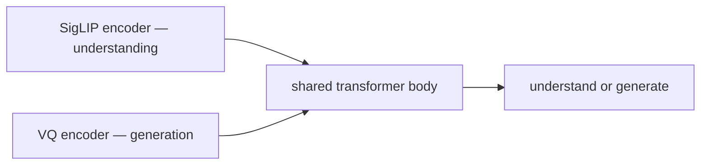

# Janus-Pro: раздельные encoders для unified multimodal models

> У unified multimodal models есть неизбежное напряжение. Understanding нужны семантические признаки — output vectors SigLIP или DINOv2, богатые concept-level information. Generation нужны reconstruction-friendly codes — VQ tokens, которые обратно складываются в четкие пиксели. Эти две цели несовместимы в одном encoder. Janus (DeepSeek, октябрь 2024) и Janus-Pro (DeepSeek, январь 2025) утверждают, что исправление в том, чтобы перестать пытаться: decouple the two encoders. Разделить transformer body между задачами, но направлять understanding через SigLIP, а generation через VQ tokenizer. При 7B Janus-Pro превосходит DALL-E 3 на GenEval и при этом соответствует LLaVA на MMMU. Этот урок разбирает, почему два encoders работают там, где один терпит неудачу.

**Тип:** Практика
**Языки:** Python (stdlib, dual-encoder routing + shared-body signal)
**Предварительные требования:** Phase 12 · 13 (Transfusion), Phase 12 · 14 (Show-o)
**Время:** ~120 минут

## Цели обучения

- Объяснить, почему один общий encoder ухудшает либо understanding, либо generation quality.
- Описать routing Janus-Pro: SigLIP features на входной стороне для understanding, VQ tokens на входе и выходе для generation.
- Проследить data-mix scaling, который позволяет Janus-Pro добиться успеха там, где Janus не смог.
- Сравнить decoupled (Janus-Pro), coupled-continuous (Transfusion) и coupled-discrete (Show-o) architectures.

## Проблема

Unified models разделяют transformer body между understanding и generation. Предыдущие попытки (Chameleon, Show-o, Transfusion) все используют один visual tokenizer для обоих направлений. Токенизатор является компромиссом:

- Оптимизирован для reconstruction (generation): VQ-VAE захватывает fine-grained pixel detail, но создает токены со слабой semantic coherence.
- Оптимизирован для semantics (understanding): SigLIP embeddings группируют изображения "cat" рядом с токенами "cat", но не позволяют хорошо реконструировать.

Show-o и Transfusion платят за это видимым quality tax в одном из направлений. Janus-Pro спрашивает: зачем требовать один tokenizer, если у задач разные потребности?

## Концепция

### Раздельное visual encoding

Архитектура Janus-Pro разделяет два encoders:

- Understanding path. Input image → SigLIP-SO400m → 2-layer MLP → transformer body.
- Generation path. Input image (if conditioning on an existing image) → VQ tokenizer → token IDs → transformer body.
- Output generation. Image tokens predicted by the transformer → VQ decoder → pixels.

Transformer body общий. Все upstream и downstream от body является task-specific.

Входы различаются форматом prompt: тег `<understand>` направляет через SigLIP; `<generate>` направляет через VQ. Или routing неявно следует из task.

### Почему это работает

Understanding loss получает SigLIP features, которые CLIP-style pretraining настроил на semantic similarity. Perception benchmarks модели улучшаются относительно Show-o / Transfusion, потому что входные features лучше подходят для задачи.

Generation loss получает VQ tokens, которые токенизатор настроил на reconstruction. Качество изображений улучшается относительно Show-o, потому что VQ codes чисто складываются обратно в пиксели.

Общий transformer body видит два входных распределения (SigLIP и VQ) и учится работать с обоими. Утверждение: при достаточном количестве данных и параметров body поглощает переключение.

### Data scaling — Janus vs Janus-Pro

Janus (оригинальный, arXiv 2410.13848) ввел decoupling, но в малом масштабе (1.3B params, limited data). Janus-Pro (arXiv 2501.17811) масштабировал:

- 7B params (vs 1.3B).
- 90M image-text pairs для stage 1 (alignment), up from 72M.
- 72M для stage 2 (unified), up from 26M.
- Добавлены 200k image-gen instruction samples для stage 3.

Итог: Janus-Pro-7B соответствует LLaVA на MMMU (60.3 vs ~58) и превосходит DALL-E 3 на GenEval (0.80 vs 0.67). Одна open model, конкурентная по обе стороны unified spectrum.

### JanusFlow — вариант с rectified flow

JanusFlow (arXiv 2411.07975) заменяет VQ generation path на rectified-flow generation path (continuous). Разделение становится SigLIP-for-understanding + rectified-flow-for-generation. Потолки качества поднимаются еще выше. Архитектура остается decoupled-encoders-shared-body.

### Работа shared body

Transformer body обрабатывает unified sequence, но с двумя входными распределениями. Его задача:

- Для understanding: потребить SigLIP features + text tokens → autoregressively выдать текст.
- Для generation: потребить text tokens + (optional image VQ tokens) → autoregressively выдать image VQ tokens.

У body нет modality-specific weights per block. Это text-style transformer, который вы ожидали бы найти внутри Qwen или Llama, плюс два input adapters.

Интересно, что это означает: body Janus-Pro можно инициализировать из pretrained LLM. Janus-Pro действительно инициализируется из DeepSeek-MoE-7B. Этот выбор важен: LLM дает reasoning ability, которого unified models, обученным pure-from-scratch, трудно достичь.

### Сравнение с InternVL-U

InternVL-U (Lesson 12.10) — follow-up 2026 года. Он объединяет:

- Native multimodal pretraining (InternVL3 backbone).
- Decoupled-encoder routing (SigLIP in, VQ + diffusion heads out).
- Unified understanding + generation + editing.

InternVL-U включает архитектурный выбор Janus-Pro в более крупный framework. Идея decoupled-encoder теперь является default для unified models at scale.

### Ограничения

Decoupled encoders добавляют архитектурную сложность. Два tokenizers для обучения, два input paths для поддержки, два набора fail modes. Для продуктов, которым не нужна generation, Janus-Pro избыточен — выберите understanding model семейства LLaVA.

Для продуктов, которым не нужен understanding, Janus-Pro слишком мощный — выберите Stable Diffusion 3 / Flux model.

Для продуктов, которым нужно и то и другое, Janus-Pro теперь reference open architecture.

## Использование

`code/main.py` симулирует routing Janus-Pro:

- Два mock encoders: SigLIP-like (создает 256-dim semantic vectors) и VQ-like (создает integer codes).
- Prompt router, который выбирает encoder на основе task tag.
- Shared body (stand-in), который обрабатывает token sequences независимо от того, какой encoder их создал.
- Переключение от stage 1 (alignment) к stage 3 (instruction tune) weighted-sample schedule.

Печатает routed paths для 3 examples: image QA, T2I, image editing.

## Результат

Этот урок создает `outputs/skill-decoupled-encoder-picker.md`. Для продукта, которому нужны unified generation + understanding at frontier-ish quality, он выбирает Janus-Pro, JanusFlow или InternVL-U с конкретной data-scale recommendation.

## Упражнения

1. Janus-Pro-7B превосходит DALL-E 3 на GenEval. Объясните, почему open model на 7B может соответствовать frontier proprietary model на generation, но не на understanding.

2. Реализуйте router function: по prompt text классифицировать как `understand` или `generate`. Как обрабатывать ambiguous prompts вроде "describe and then sketch"?

3. JanusFlow заменяет VQ path на rectified flow. Что теперь выдает transformer body и что меняется в loss?

4. Предложите четвертую задачу, которую архитектура Janus-Pro могла бы решать с еще одним decoupled encoder. Examples: image segmentation (DINO-style), depth (MiDaS-style).

5. Прочитайте Janus-Pro Section 4.2 on data scaling. Какой data stage больше всего влияет на T2I quality gain vs Janus?

## Ключевые термины

| Термин | Как говорят | Что это на самом деле означает |
|------|-----------------|------------------------|
| Decoupled encoding | "Two visual encoders" | Отдельный tokenizer или encoder для каждого направления: semantic для understanding, reconstruction для generation |
| Shared body | "One transformer" | Один transformer обрабатывает output любого encoder; без modality-specific weights |
| SigLIP for understanding | "Semantic features" | Vision tower семейства CLIP, дающая богатые conceptual features, но плохую reconstruction |
| VQ for generation | "Reconstruction codes" | Vector-quantized tokens, которые чисто декодируются обратно в pixels |
| JanusFlow | "Rectified-flow variant" | Janus-Pro с continuous flow-matching generation head вместо VQ |
| Routing tag | "Task tag" | Prompt marker (`<understand>` / `<generate>`), который выбирает input encoder |

## Дополнительное чтение

- [Wu et al. — Janus (arXiv:2410.13848)](https://arxiv.org/abs/2410.13848)
- [Chen et al. — Janus-Pro (arXiv:2501.17811)](https://arxiv.org/abs/2501.17811)
- [Ma et al. — JanusFlow (arXiv:2411.07975)](https://arxiv.org/abs/2411.07975)
- [InternVL-U (arXiv:2603.09877)](https://arxiv.org/abs/2603.09877)
- [Dong et al. — DreamLLM (arXiv:2309.11499)](https://arxiv.org/abs/2309.11499)
