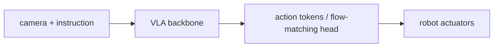

# Воплощенные VLA: RT-2, OpenVLA, π0, GR00T

> Первой моделью, которая прочитала рецепт на сайте и выполнила его на кухонном роботе, была RT-2 (Google DeepMind, июль 2023). RT-2 дискретизировала действия как текстовые токены, совместно дообучала VLM на веб-данных и данных роботизированных действий и показала, что зрительно-языковые знания веб-масштаба переносятся на управление роботами. OpenVLA (июнь 2024) выпустила открытую 7B-референсную модель. Серия π0 от Physical Intelligence (2024-2025) добавила action experts на flow matching. NVIDIA GR00T N1 (март 2025) дала двухсистемное (System 1 / System 2) управление для человекоподобных роботов в масштабе. Примитив VLA — vision-language-action, единая модель, которая видит, читает и действует, — это мост между моделями понимания из этой фазы и автономными системами в Phase 15.

**Тип:** Изучение
**Языки:** Python (stdlib, токенизатор действий + скелет VLA-инференса)
**Предварительные требования:** Phase 12 · 05 (LLaVA), Phase 15 (Autonomous Systems, упоминается)
**Время:** ~180 минут

## Цели обучения

- Описать токенизацию действий: дискретное кодирование bins (RT-2), эффективные action tokens FAST, непрерывные действия на flow matching (π0).
- Объяснить, почему совместное дообучение на веб-данных + роботизированных данных сохраняет перенос общих знаний на новые задачи.
- Сравнить OpenVLA (открытая 7B Llama+VLM), π0 (flow matching) и GR00T N1 (двухсистемная архитектура) на одной и той же роботизированной задаче.
- Назвать датасет Open X-Embodiment и его роль как обучающего корпуса RT-X.

## Проблема

Робот, выполняющий домашние дела по инструкциям на естественном языке, был исследовательской целью с 1970-х. Ответ 2020-х: модель vision-language-action (VLA). Та же архитектура VLM, что используется для VQA, но на выходе действия (моменты в суставах, позы end-effector, дискретные команды), а не текст.

Проблемы, специфичные для VLA:

1. Пространства действий непрерывны (углы суставов, силы) и высокоразмерны (7-DOF arm + 3-DOF gripper = 10 dims at 30 Hz).
2. Роботизированных обучающих данных мало. Open X-Embodiment содержит ~1M trajectories; веб text-image — 5B+.
3. Частота управления имеет значение. Контур управления 30 Hz означает бюджет 33ms на действие.
4. Безопасность. Неверное действие повреждает оборудование, людей или имущество.

## Концепция

### Токенизация действий (RT-2)

Трюк RT-2: представлять каждую целевую координату сустава как квантованный текстовый токен. Дискретизировать нормализованный диапазон [-1, 1] на 256 bins, сопоставить каждый bin с vocabulary ID. Действие с 10-DOF становится 10 токенами на каждом шаге управления.

Совместно дообучить PaLM-X VLM на смеси:

- Веб-пары image-text (captioning, VQA).
- Роботизированные демонстрации, действие как токены.

Модель видит "pick up the red cube" (язык) → image (зрение) → последовательность действий из 10 токенов (дискретизированные целевые значения суставов). Веб-предобучение сохраняет перенос общих знаний: RT-2 может выполнить "move towards the fast-moving object", хотя "fast-moving" не было в обучающих данных.

Инференс в статье RT-2: 3-5 Hz, ограничен авторегрессионным декодированием VLM.

### OpenVLA — открытая 7B-референсная модель

OpenVLA (Kim et al., июнь 2024) — открытый эквивалент RT-2 с доступными весами. 7B Llama backbone, двойной vision encoder DINOv2 + SigLIP, токенизация действий по 256 bins.

Обучена на Open X-Embodiment (970k trajectories across 22 robots). Поставляется с поддержкой LoRA fine-tuning для адаптации к новым роботам.

Инференс: 4-5 Hz на A100 с квантизацией. Достаточно быстро для медленной манипуляции, но не для высокочастотного управления.

### FAST tokenizer — более быстрое декодирование действий

Pertsch et al. (2024) показали, что токенизация через дискретные bins неэффективна — большинство действий сгруппированы в небольшой области bin-space. FAST (Frequency-domain Action Sequence Tokenizer) сжимает последовательности действий через DCT и квантует коэффициенты.

Траектория действий из 30 шагов становится ~10 FAST tokens вместо 300 discrete-bin tokens. Инференс ускоряется в 3-5x без потери качества.

### π0 и действия на flow matching

π0 от Physical Intelligence (Black et al., октябрь 2024) заменяет дискретные токены действий на action expert с flow matching:

- Небольшой action transformer читает hidden states VLM и выдает непрерывную последовательность действий из 50 шагов через rectified flow.
- Action head обучается с flow-matching loss; предобучение VLM остается неизменным.
- Инференс: полная последовательность действий выдается примерно за ~5 denoising steps, что фактически дает управление 50 Hz.

Заявление π0: превосходит OpenVLA и Octo на широком наборе задач манипуляции. Формулировка с непрерывными действиями сохраняет гладкость, которую разрушает дискретизация.

π0.5 и π0-FAST — инкрементальные улучшения. π0-FAST объединяет FAST tokenization с flow matching.

### GR00T N1 — двухсистемная архитектура для гуманоидов

NVIDIA GR00T N1 (март 2025) построена для человекоподобных роботов (>30 DOF, full-body):

- System 2: большая VLM читает сцену + инструкцию и выдает высокоуровневые подцели на ~1 Hz.
- System 1: небольшой action-head transformer выдает низкоуровневые команды суставам 50-100 Hz, обусловленные подцелями.

Разделение соответствует быстрому и медленному мышлению Канемана: System 2 планирует, System 1 действует. Преимущества: медленное планирование размером VLM не блокирует быстрое управление; System 1 остается небольшой ради задержки.

GR00T N1.7 (конец 2025) улучшает масштабирование данных. GR00T дообучается с sim-to-real data из Omniverse.

### Open X-Embodiment

Обучающие данные. RT-X (октябрь 2023) собрал 22 датасета, покрывающих 1M trajectories across 22 robots. Open X-Embodiment — корпус, который используют все:

- ALOHA / Bridge V2 / Droid / RT-2 Kitchen / Language Table.
- Каждый пример: (robot state, camera views, instruction, action sequence).
- Гигиена обучения: унифицировать пространство действий, нормализовать диапазоны суставов, изменить размер камер.

OpenVLA и π0 обучаются на Open X-Embodiment. Domain gap до конкретного робота закрывается LoRA fine-tuning на 100-1000 task-specific demos.

### Co-fine-tuning vs robot-only

Co-fine-tuning смешивает веб-данные VQA с роботизированными траекториями. Соотношение важно: слишком много VQA — модель забывает действия; слишком много роботизированных данных — модель теряет общие знания.

Соотношение RT-2: ~1:1. OpenVLA: ~0.5:1 web-to-robot. π0: похоже. Точное соотношение — гиперпараметр, который настраивают под размер датасета.

Обучение только на роботизированных данных дает task-specific models, которые проваливаются на out-of-distribution instructions. Co-fine-tuning — это разница между "pick up the red cube (in demo)" и "pick up the third largest object from the left (novel phrasing)."

### Безопасность и ограничения действий

Каждая production VLA поставляется с:

- Жесткими ограничениями суставов (нельзя превышать torque past spec).
- Ограничениями скорости (soft clipping).
- Границами рабочей области (end-effector cannot leave the table).
- Human-in-the-loop approval для новых задач.

Они находятся вне VLA как проверки уровня управления. Выход VLA — рекомендация, а не команда.

## Применение

`code/main.py`:

- Реализует 256-bin action tokenization и de-tokenization.
- Набрасывает FAST tokenizer на основе DCT + quantization.
- Сравнивает число токенов на шаг действия для (discrete-bin, FAST, continuous-flow).
- Печатает summary lineage RT-2 → OpenVLA → π0 → GR00T.

## Результат

Этот урок создает `outputs/skill-vla-action-format-picker.md`. По роботизированной задаче (manipulation, navigation, humanoid whole-body) выбирает между discrete-bin + RT-2, FAST + OpenVLA, flow-matching + π0 или dual-system + GR00T.

## Упражнения

1. Манипулятор с 10-DOF при частоте управления 30 Hz. Сколько токенов в секунду выдает discrete-bin tokenization при 256 bins? Может ли 7B VLM успеть?

2. FAST tokenization сжимает 30-step trajectories до ~10 tokens. Что теряет пользователь, если траектория содержит высокочастотное движение (например, игру на барабанах)?

3. Flow-matching head в π0 выполняет denoising за ~5 steps. Сравните throughput с autoregressive decode OpenVLA на 4-5 Hz.

4. Разделение System 1 / System 2 в GR00T соответствует Канеману. Предложите другое разделение (System 3?), которое могло бы помочь двуногой ходьбе.

5. Прочитайте Open X-Embodiment Section 4 о dataset curation. Назовите три правила curation, которые предотвращают domain leakage.

## Ключевые термины

| Термин | Как говорят | Что это на самом деле означает |
|------|-----------------|------------------------|
| VLA | "Vision-language-action" | Модель, которая принимает image + instruction и выдает action commands |
| Action tokenization | "Discrete bins" | Квантование непрерывных целевых значений суставов в 256 bins на dim, каждый как vocab ID |
| FAST tokenizer | "Frequency action tokens" | DCT + quantize для сжатия 30-step trajectories до ~10 tokens |
| Co-fine-tune | "Mix web + robot" | Обучение на web VQA data вместе с robot demos для сохранения общих знаний |
| Flow-matching action head | "π0 continuous output" | Небольшой transformer, который выдает 50-step action sequence через rectified flow |
| System 1 / System 2 | "Dual-system control" | Большая VLM медленно планирует, небольшая action head быстро действует; паттерн GR00T |
| Open X-Embodiment | "RT-X dataset" | Cross-robot dataset на 1M trajectories; обучающий корпус |

## Дополнительное чтение

- [Brohan et al. — RT-2 (arXiv:2307.15818)](https://arxiv.org/abs/2307.15818)
- [Kim et al. — OpenVLA (arXiv:2406.09246)](https://arxiv.org/abs/2406.09246)
- [Black et al. — π0 (arXiv:2410.24164)](https://arxiv.org/abs/2410.24164)
- [NVIDIA — GR00T N1 (arXiv:2503.14734)](https://arxiv.org/abs/2503.14734)
- [Open X-Embodiment Collab — RT-X (arXiv:2310.08864)](https://arxiv.org/abs/2310.08864)
