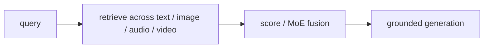

# Мультимодальный RAG и cross-modal retrieval

> Vision-native document RAG — это один срез. Production multimodal RAG шире — он извлекает по text, images, audio и video для workflows вроде trip planning ("find me a quiet vegan brunch with natural light"), medical triage ("what injury matches this photo + these notes"), e-commerce ("outfits similar to this selfie, in my size") и field service ("diagnose this engine sound plus photo of the part"). Три обзора 2025 — Abootorabi et al., Mei et al., Zhao et al. — закрепили подпроблемы: cross-modal retrieval, retrieval fusion, generation grounding, multimodal evaluation. Этот урок разбирает обзоры и проектирует production pipeline.

**Тип:** Практика
**Языки:** Python (stdlib, cross-modal retriever with fusion + grounded generator)
**Предварительные требования:** Phase 12 · 23 (ColPali), Phase 11 (RAG basics)
**Время:** ~180 минут

## Цели обучения

- Спроектировать cross-modal retrieval: text → image, image → text, audio → video и т.д.
- Сравнить три стратегии fusion: score fusion, attention-based fusion, MoE fusion.
- Объяснить generation grounding: как выглядит "cite your sources", когда источники — смесь модальностей.
- Назвать три канонических обзора multimodal RAG 2025 года и их taxonomy sub-problems.

## Проблема

Single-modality RAG — решенный паттерн: embed query, embed chunks, retrieve, stuff into LLM. Multimodal RAG требует:

1. Нескольких retrieval heads (каждой модальности нужны embeddings в совместимом пространстве).
2. Fusion результатов retrieval across modalities.
3. Generation grounding, который цитирует sources across modalities.
4. Evaluation metrics, покрывающих cross-modal signal.

Все обзоры 2025 приходят к одной taxonomy.

## Концепция

### Cross-modal retrieval

Извлечь документы модальности B по query модальности A. Три паттерна:

1. Shared embedding space. CLIP и CLAP создают text + image / text + audio embeddings в общем пространстве. Cosine similarity across modalities работает напрямую. Ограничено CLIP-trained pairs.

2. Per-modality encoder + translation. Text encoder + image encoder + небольшой translator module, отображающий между пространствами. Sen2Sen by Gupta et al. и другие дизайны 2024. Гибко, но добавляет сложность.

3. VLM as encoder. Использовать hidden states VLM как retrieval representation. Работает любая модальность, которую поддерживает VLM. Выше качество, выше стоимость.

Выбор: CLIP / SigLIP 2 для text+image; CLAP для text+audio; VLM-hidden-states для cross-modal с frontier quality.

### Fusion strategies

Вы извлекли 10 результатов: 5 images, 3 text passages, 2 audio clips. Как объединить?

Score fusion (самая дешевая). У каждой модальности свой retriever, каждый возвращает scores. Нормализовать scores within-modality, затем суммировать. Просто и часто работает.

Attention-based fusion. Конкатенировать все retrieved items, дать небольшой attention network взвесить их. Требует обучения.

MoE fusion. Gating network маршрутизирует к modality-specific experts. Разные query types маршрутизируются по-разному — visual question сильнее взвешивает images.

Production default: score fusion с небольшим bias к доминирующей модальности query. Переходите на MoE, если A/B показывает явные выигрыши в вашем domain.

### Generation grounding

LLM должен цитировать, какой retrieved item поддержал каждое утверждение. Для multi-modal:

- Text source: стандартная citation `[1]`.
- Image source: `[img 3]` с short caption.
- Audio: `[audio 2 at 0:34]`.

Обучайте generator на grounding-aware data: каждое утверждение в training target помечено source index. На inference модель естественно выводит citations.

### Обзоры 2025

Abootorabi et al. (arXiv:2502.08826, "Ask in Any Modality"): taxonomy для multimodal RAG. Покрывает retrieval, fusion, generation. Самое широкое покрытие.

Mei et al. (arXiv:2504.08748, "A Survey of Multimodal RAG"): фокусируется на sub-task benchmarks и failure modes. Полезно для evaluation design.

Zhao et al. (arXiv:2503.18016): vision-focused survey. Сильный разбор работ семейства ColPali.

Чтение всех трех дает state of the art на весну 2025. Большинство sub-problems все еще открыты.

### MuRAG — основополагающая статья

MuRAG (Chen et al., 2022) был первым multimodal RAG. Он извлекал image + text из multimodal KB и генерировал answers. Показал реализуемость до волны VLM. Современные системы (REACT, VisRAG, M3DocRAG) строятся на нем.

### Production-пример trip-planner

Query: "find me a quiet vegan brunch with natural light."

Pipeline:

1. Decompose query. "quiet" → audio/review keyword; "vegan brunch" → menu item; "natural light" → image feature.
2. Retrieve per modality:
   - Text retrieval on reviews: "vegan brunch, quiet ambiance."
   - Image retrieval on restaurant photos: "natural light, airy."
   - Audio retrieval on ambient-sound clips: "low decibel, no music."
3. Fuse scores. У каждого ресторана есть composite score.
4. Top-k restaurants → VLM generator with all evidence → answer with citations.

Это намного дальше text-RAG. Каждая модальность добавляет сигнал, который текст в одиночку пропускает.

### Agentic multimodal RAG

Multi-hop: если первый retrieval не возвращает high-confidence answers, LLM переформулирует и извлекает снова. Паттерны Agentic RAG из Phase 14 применимы здесь. Примеры:

- Retrieve initial top-10 → LLM asks "too noisy, filter for <40 dB" → re-retrieve.
- Retrieve images → LLM sees one has a menu → retrieve the menu text → answer.

Добавляет сложность, но обрабатывает queries, с которыми single-shot retrieval не справляется.

### Evaluation

Cross-modal evaluation все еще незрелая. Распространенные proxy:

- Recall@k per modality.
- Fused top-k accuracy.
- Human-judged end-to-end satisfaction.
- Task-specific (bookings completed, purchases made).

Нет стандартного benchmark, охватывающего все модальности. Большинство статей оцениваются на domain-specific tasks.

## Применение

`code/main.py`:

- Три mock retrievers (text, image, audio), работающих на общем corpus of restaurants.
- Score fusion, который объединяет modality scores с настраиваемыми weights.
- Generator stub, который выдает final answer with citations.
- Простой agentic loop, который переформулирует query, если confidence низкий.

## Результат

Этот урок создает `outputs/skill-multimodal-rag-designer.md`. По product spec с multimodal query flow проектирует retrievers, fusion, generator и evaluation.

## Упражнения

1. Предложите medical-triage multimodal RAG: query = photo of injury + text symptoms. Какие modalities извлекаются из какой KB?

2. Score fusion — простая weighted sum. Какой failure mode у нее есть, которого избегает MoE fusion?

3. Прочитайте taxonomy Abootorabi et al. (Section 3). Какие три canonical sub-problems там есть и как они отображаются на выбранный вами product?

4. Спроектируйте eval spec для trip-planner multimodal RAG. Какие metrics покрывают image recall, audio recall и composite correctness?

5. Agentic multi-hop RAG имеет latency tax на каждый round-trip. При какой query difficulty прирост accuracy оправдывает latency?

## Ключевые термины

| Термин | Как говорят | Что это на самом деле означает |
|------|-----------------|------------------------|
| Cross-modal retrieval | "Query one modality, retrieve another" | Text query извлекает images; image query извлекает text; требует shared space или translator |
| Score fusion | "Combine scores" | Weighted sum of per-modality retrieval scores; simplest fusion |
| MoE fusion | "Modality-routed experts" | Gating network выбирает, scores какой модальности доверять для каждого query |
| Grounded generation | "Cite your sources" | Каждое утверждение в answer помечено source index |
| MuRAG | "First multimodal RAG" | Статья 2022, установившая паттерн multimodal RAG |
| Agentic multi-hop | "Reformulate and retry" | LLM заново обращается к retrievers, когда first-pass confidence низкий |

## Дополнительное чтение

- [Abootorabi et al. — Ask in Any Modality (arXiv:2502.08826)](https://arxiv.org/abs/2502.08826)
- [Mei et al. — A Survey of Multimodal RAG (arXiv:2504.08748)](https://arxiv.org/abs/2504.08748)
- [Zhao et al. — Vision RAG Survey (arXiv:2503.18016)](https://arxiv.org/abs/2503.18016)
- [Chen et al. — MuRAG (arXiv:2210.02928)](https://arxiv.org/abs/2210.02928)
- [Liu et al. — REACT (arXiv:2301.10382)](https://arxiv.org/abs/2301.10382)
