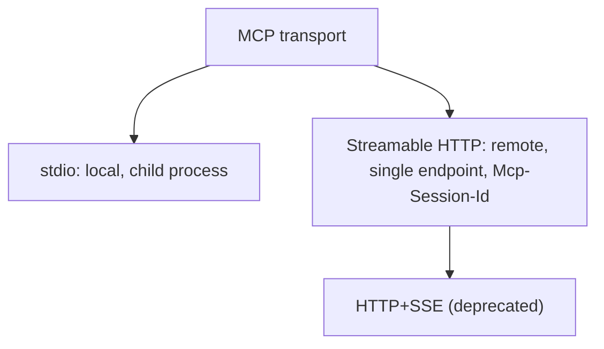

# MCP Transports — stdio, Streamable HTTP и миграция с SSE

> stdio работает локально и больше нигде. Streamable HTTP (2025-03-26) — remote standard. Старый transport HTTP+SSE deprecated и удаляется в середине 2026 года. Неправильный выбор transport приводит к миграции; правильный дает MCP-сервер, который можно хостить удаленно, с continuity сессии и защитой от DNS rebinding.

**Тип:** Learn
**Языки:** Python (stdlib, Streamable HTTP endpoint skeleton)
**Предварительные требования:** Phase 13 · 07, 08 (MCP server и client)
**Время:** ~45 минут

## Цели обучения

- Выбирать между stdio и Streamable HTTP на основе формы deployment (local vs remote, single-process vs fleet).
- Реализовать паттерн single endpoint для Streamable HTTP: POST для requests, GET для session stream.
- Применять validation `Origin` и семантику session id для защиты от DNS rebinding.
- Мигрировать legacy HTTP+SSE server на Streamable HTTP до сроков удаления в середине 2026 года.

## Проблема

Первый удаленный MCP transport (2024-11) был HTTP+SSE: два endpoints, один для client POSTs и один канал Server-Sent Events для server-to-client stream. Он работал. Но был неудобен: два endpoints на session, сломанные caches перед некоторыми CDNs и жесткая зависимость от долгоживущих SSE connections, которые некоторые WAFs агрессивно обрывают.

Спецификация 2025-03-26 заменила его на Streamable HTTP: один endpoint, POST для client requests, GET для установления session stream, оба используют общий header `Mcp-Session-Id`. Каждый server, построенный или мигрированный с тех пор, использует Streamable HTTP. Старый режим SSE deprecated: Atlassian Rovo удаляет его 30 июня 2026 года; Keboola — 1 апреля 2026 года; большинство оставшихся enterprise servers — до конца 2026 года.

И stdio все еще важен для local servers. Claude Desktop, VS Code и каждый IDE-shaped client запускают servers через stdio. Правильная mental model: stdio для "этой машины", Streamable HTTP для "по сети". Без смешивания.

## Концепция

### stdio

- Transport дочернего процесса. Client запускает server, общается через stdin/stdout.
- Один JSON object на строку. Разделение по newline.
- Нет session id; identity process и есть session.
- Auth не нужен: дочерний процесс наследует trust boundary родителя.
- Никогда не используйте для remote servers: пришлось бы туннелировать через SSH или socat, а тогда лучше использовать Streamable HTTP.

### Streamable HTTP

Один endpoint `/mcp` (или любой path). Поддерживает три HTTP methods:

- **POST /mcp.** Client отправляет JSON-RPC message. Server отвечает либо одним JSON response, либо SSE stream с одним или несколькими responses (полезно для batched responses и notifications, связанных с этим request).
- **GET /mcp.** Client открывает долгоживущий SSE channel. Server использует его для server-to-client requests (sampling, notifications, elicitation).
- **DELETE /mcp.** Client явно завершает session.

Sessions идентифицируются header `Mcp-Session-Id`, который server устанавливает в первом response, а client повторяет в каждом последующем request. Session ids ДОЛЖНЫ быть криптографически случайными (128+ bits); ids, выбранные client, отклоняются ради безопасности.

### Один endpoint или два

Режим с двумя endpoints из старой спецификации все еще callable в 2026 году — спецификация объявляет его "legacy compatible". Но все новые servers должны быть single-endpoint. Официальные SDK выдают single endpoint; legacy mode используйте только при общении с не мигрировавшим remote.

### Validation `Origin` и DNS rebinding

Браузеры сегодня не являются MCP clients, но атакующий может создать webpage, которая убедит browser отправить POST на `localhost:1234/mcp` — туда, где слушает локальный MCP server пользователя. Если server не проверяет `Origin`, browser same-origin policy его не спасет, потому что `Origin: http://evil.com` является валидным cross-origin.

Спецификация 2025-11-25 требует, чтобы servers отклоняли requests, чей `Origin` не входит в allowlist. Allowlist обычно содержит host MCP client (`https://claude.ai`, `vscode-webview://*`) и варианты localhost для local UIs.

### Жизненный цикл session id

1. Client отправляет первый request без `Mcp-Session-Id`.
2. Server назначает random id, устанавливает `Mcp-Session-Id` в response header.
3. Client повторяет этот header во всех последующих requests и в `GET /mcp` для stream.
4. Session может быть отозвана server; client видит 404 на последующих requests и должен повторно выполнить initialize.
5. Client может явно DELETE session для clean shutdown.

### Keepalive и reconnect

SSE connections обрываются. Client восстанавливает соединение, повторно выполняя GET с тем же `Mcp-Session-Id`. Server ДОЛЖЕН ставить в очередь events, пропущенные во время outage (до разумного окна), и воспроизводить их через header `last-event-id`, который client повторяет.

Phase 13 · 13 рассматривает Tasks, которые позволяют long-running work пережить даже полный reconnect session.

### Проверка обратной совместимости

Client, который хочет поддерживать и старые, и новые servers:

1. Отправляет POST на `/mcp`.
2. Если response — `200 OK` с JSON или SSE, это Streamable HTTP.
3. Если response — `200 OK` с `Content-Type: text/event-stream` И header `Location`, указывающий на вторичный endpoint, это legacy HTTP+SSE; перейдите по `Location`.

### Cloudflare, ngrok и hosting

Production remote MCP servers в 2026 году работают на Cloudflare Workers (с их MCP Agents SDK), Vercel Functions или containerized Node/Python. Ключевое: ваш hosting должен поддерживать long-lived HTTP connections для SSE GET. Free tier Vercel ограничен 10 seconds и не подходит. Cloudflare Workers поддерживают streams без фиксированного лимита.

### Gateway composition

Когда вы ставите gateway перед несколькими MCP servers (Phase 13 · 17), gateway — это единый Streamable HTTP endpoint, который переписывает session ids и multiplexes upstream. Tools объединяются на gateway layer; client видит один logical server.

### Режимы отказа transport

- **stdio SIGPIPE.** Смерть дочернего процесса в середине write вызывает SIGPIPE; servers должны завершаться чисто. Clients должны обнаруживать EOF и помечать session как dead.
- **HTTP 502 / 504.** Cloudflare, nginx и другие proxies выдают их при upstream failure. Streamable HTTP clients должны один раз повторить попытку после короткого backoff.
- **SSE connection drop.** TCP RST, proxy timeout или смена client network закрывает stream. Client переподключается с `Mcp-Session-Id` и необязательным `last-event-id`, чтобы продолжить.
- **Session revocation.** Server invalidates session id; client видит 404 на следующем request. Client должен заново выполнить handshake.
- **Clock skew.** Расчеты Resource-TTL на client расходятся с server. Client должен считать timestamps server авторитетными.

### Когда обходить Streamable HTTP

Некоторые enterprises разворачивают MCP servers за gRPC или message-queue transports внутри собственных networks. Это non-standard — спецификация MCP формально не определяет их. Gateways могут выставлять Streamable HTTP surface для MCP clients, используя gRPC внутри. Держите external surface spec-compliant; gateway отвечает за translation.

## Использование

`code/main.py` реализует минимальный Streamable HTTP endpoint через `http.server` (stdlib). Он обрабатывает POST, GET и DELETE на `/mcp`, устанавливает `Mcp-Session-Id` на первом response, валидирует `Origin` и отклоняет requests из origins вне allowlist. Handler повторно использует dispatch logic notes server из Lesson 07.

На что смотреть:

- POST handler читает JSON-RPC body, выполняет dispatch и пишет JSON response (вариант с одним response; SSE variant структурно похож).
- Проверка `Origin` отклоняет default `http://evil.example` probe, но принимает `http://localhost`.
- Session ids — random 128-bit hex strings; server хранит per-session state в памяти.

## Результат

Этот урок создает `outputs/skill-mcp-transport-migrator.md`. По legacy MCP server на HTTP+SSE skill создает migration plan на Streamable HTTP с session-id continuity, проверками Origin и поддержкой backwards-compatible probe.

## Упражнения

1. Запустите `code/main.py`. Отправьте `initialize` через `curl` POST и посмотрите response header `Mcp-Session-Id`. Отправьте второй request, повторив header, и проверьте session continuity.

2. Добавьте GET handler, который открывает SSE stream. Отправляйте одно событие `notifications/progress` каждые пять секунд. Переподключитесь, повторно выполнив GET с тем же session id, и подтвердите, что server принимает его.

3. Реализуйте replay logic для `last-event-id`. При reconnect воспроизведите все events, созданные после этого id.

4. Расширьте `Origin` validation поддержкой wildcard pattern (`https://*.example.com`) и подтвердите, что она принимает `https://app.example.com`, но отклоняет `https://evil.example.com.attacker.net`.

5. Возьмите legacy HTTP+SSE server из official registry (их несколько) и набросайте migration: что меняется в обработке endpoints, генерации session id и семантике headers.

## Ключевые термины

| Термин | Как говорят | Что это значит на самом деле |
|------|----------------|------------------------|
| stdio transport | "Локальный дочерний процесс" | JSON-RPC поверх stdin/stdout, newline-delimited |
| Streamable HTTP | "Удаленный transport" | Single-endpoint POST + GET + optional SSE, спецификация 2025-03-26 |
| HTTP+SSE | "Legacy" | Модель с двумя endpoints, удаляемая в середине 2026 года |
| `Mcp-Session-Id` | "Session header" | Random id, назначенный server, повторяемый в каждом последующем request |
| `Origin` allowlist | "Защита от DNS rebinding" | Отклонение requests, чей Origin не одобрен |
| Single endpoint | "Один URL" | `/mcp` обрабатывает POST / GET / DELETE для всех операций session |
| `last-event-id` | "SSE replay" | Header для возобновления оборванного stream без пропуска events |
| Backwards-compat probe | "Определение старого и нового" | Проверка формы response, по которой client автоматически выбирает transport |
| Long-lived HTTP | "SSE streaming" | Server отправляет events минуты или часы по одному TCP connection |
| Session revocation | "Принудительный re-init" | Server инвалидирует session id; client должен снова выполнить handshake |

## Дополнительное чтение

- [MCP — Basic transports spec 2025-11-25](https://modelcontextprotocol.io/specification/2025-11-25/basic/transports) — канонический reference по stdio и Streamable HTTP
- [MCP — Basic transports spec 2025-03-26](https://modelcontextprotocol.io/specification/2025-03-26/basic/transports) — revision, где появился Streamable HTTP
- [Cloudflare — MCP transport](https://developers.cloudflare.com/agents/model-context-protocol/transport/) — паттерны Streamable HTTP на Workers
- [AWS — MCP transport mechanisms](https://builder.aws.com/content/35A0IphCeLvYzly9Sw40G1dVNzc/mcp-transport-mechanisms-stdio-vs-streamable-http) — сравнение разных deployment shapes
- [Atlassian — HTTP+SSE deprecation notice](https://community.atlassian.com/forums/Atlassian-Remote-MCP-Server/HTTP-SSE-Deprecation-Notice/ba-p/3205484) — конкретный пример срока миграции
