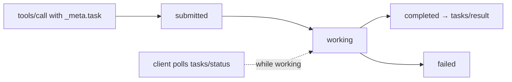

# Асинхронные задачи (SEP-1686) — вызвать сейчас, получить позже для долгих операций

> Реальная работа агентов занимает от минут до часов: CI-запуски, синтез глубокого исследования, пакетные экспорты. Синхронные вызовы инструментов теряют соединения, завершаются по тайм-ауту или блокируют UI. SEP-1686, объединенный 2025-11-25, добавляет примитив Tasks: любой запрос можно расширить так, чтобы он стал задачей, а результат можно было получить позже или стримить через уведомления о состоянии. Примечание о риске изменений: Tasks остаются экспериментальными до H1 2026; поверхность SDK все еще проектируется вокруг спецификации.

**Тип:** Build
**Языки:** Python (stdlib, конечный автомат async-задач)
**Предварительные требования:** Phase 13 · 07 (MCP server), Phase 13 · 09 (transports)
**Время:** ~75 минут

## Цели обучения

- Определять, когда переводить инструмент из синхронного режима в task-augmented (>30 секунд серверной работы).
- Проследить жизненный цикл задачи: `working` → `input_required` → `completed` / `failed` / `cancelled`.
- Сохранять состояние задачи, чтобы сбои не теряли уже запущенную работу.
- Корректно опрашивать `tasks/status` и получать `tasks/result`.

## Проблема

Инструмент `generate_report` запускает многоминутный pipeline извлечения данных. В синхронной модели есть варианты:

1. Держать соединение открытым три минуты. Удаленные транспорты его разрывают; клиенты получают тайм-аут; UI зависает.
2. Сразу вернуть placeholder; заставить клиента опрашивать пользовательский endpoint. Это нарушает единообразие MCP.
3. Запустить по принципу fire-and-forget; результата нет.

Ни один вариант не хорош. SEP-1686 добавляет четвертый: task augmentation. Любой запрос (обычно `tools/call`) можно пометить как задачу. Сервер сразу возвращает id задачи. Клиент опрашивает `tasks/status` и получает `tasks/result`, когда задача завершена. Серверное состояние переживает перезапуски.

## Концепция



### Task augmentation

Запрос становится задачей при установке `params._meta.task.required: true` (или `optional: true`, тогда решает сервер). Сервер сразу отвечает:

```json
{
  "jsonrpc": "2.0", "id": 1,
  "result": {
    "_meta": {
      "task": {
        "id": "tsk_9f7b...",
        "state": "working",
        "ttl": 900000
      }
    }
  }
}
```

`ttl` — обещание сервера хранить состояние; после ttl результат задачи удаляется.

### Opt-in на уровне инструмента

Аннотации инструмента могут объявлять поддержку задач:

- `taskSupport: "forbidden"` — этот инструмент всегда выполняется синхронно. Безопасно для быстрых инструментов.
- `taskSupport: "optional"` — клиент может запросить task-augmentation.
- `taskSupport: "required"` — клиент должен использовать task augmentation.

Инструмент `generate_report` был бы `required`. Инструмент `notes_search` был бы `forbidden`.

### Состояния

```
working  -> input_required -> working  (loop via elicitation)
working  -> completed
working  -> failed
working  -> cancelled
```

Конечный автомат append-only: после `completed`, `failed` или `cancelled` задача находится в терминальном состоянии.

### Методы

- `tasks/status {taskId}` — возвращает текущее состояние и подсказку прогресса.
- `tasks/result {taskId}` — блокируется или возвращает 404, если задача еще не завершена.
- `tasks/cancel {taskId}` — идемпотентен; терминальные состояния игнорируют его.
- `tasks/list` — опционально; перечисляет активные и недавно завершенные задачи.

### Стриминг изменений состояния

Когда сервер это поддерживает, клиент может подписаться на уведомления о состоянии:

```
server -> notifications/tasks/updated {taskId, state, progress?}
```

Клиенты, которые стримят, а не опрашивают, получают лучший UX. Опрос всегда поддерживается как минимальная поверхность.

### Durable state

Спецификация требует, чтобы серверы, объявляющие поддержку задач, сохраняли состояние. Сбой не должен терять завершенные результаты в пределах ttl. Хранилища варьируются от SQLite до Redis и файловой системы. Harness урока 13 использует файловую систему.

### Семантика отмены

`tasks/cancel` идемпотентен. Если задача выполняется, сервер пытается остановить ее (проверьте cooperative cancellation в executor). Если задача уже терминальная, запрос ничего не меняет.

### Восстановление после сбоя

Когда процесс сервера перезапускается:

1. Загрузить все сохраненные состояния задач.
2. Пометить все `working` задачи, чей процесс умер, как `failed` с ошибкой `CRASH_RECOVERY`.
3. Сохранить `completed` / `failed` / `cancelled` на время их ttl.

### Async tasks плюс sampling

Задача может сама вызвать `sampling/createMessage`. Так работают долгие research-задачи: поток задачи на сервере сэмплирует модель клиента по мере необходимости, а UI клиента показывает задачу как `working` с периодическими обновлениями прогресса.

### Почему это экспериментально

SEP-1686 вышел 2025-11-25, но более широкая roadmap выделяет три открытых вопроса: устойчивые примитивы подписки, subtasks (отношения parent-child между задачами) и стандартизация result-TTL. Ожидайте развития спецификации в течение 2026. Production-код должен считать Tasks стабильными только для типового сценария и защищаться от будущих изменений SDK для subtasks.

## Использование

`code/main.py` реализует устойчивое хранилище задач (на файловой системе) и инструмент `generate_report`, который выполняется в фоновом потоке. Клиенты вызывают инструмент, сразу получают id задачи, опрашивают `tasks/status`, пока worker обновляет progress, и получают `tasks/result` после завершения. Отмена работает; восстановление после сбоя симулируется убийством worker thread и повторной загрузкой состояния.

На что смотреть:

- JSON состояния задачи сохраняется в `/tmp/lesson-13-tasks/<id>.json`.
- Worker thread обновляет поле `progress`; опрос показывает его продвижение.
- Отмена на стороне клиента устанавливает event; worker проверяет его и выходит раньше.
- Повторная загрузка состояния после "crash" помечает выполнявшуюся задачу как `failed` с `CRASH_RECOVERY`.

## Результат

Этот урок создает `outputs/skill-task-store-designer.md`. Для долгого инструмента (research, build, export) skill проектирует хранилище задач (форму состояния, ttl, durability), выбирает правильный флаг taskSupport и набрасывает уведомления о прогрессе.

## Упражнения

1. Запустите `code/main.py`. Запустите задачу `generate_report`, опросите состояние, затем получите результат.

2. Добавьте вызов `tasks/cancel` в середине выполнения. Проверьте, что worker его учитывает и состояние становится `cancelled`.

3. Симулируйте восстановление после сбоя: убейте worker thread, перезапустите загрузчик и наблюдайте режим отказа `CRASH_RECOVERY`.

4. Расширьте хранилище до SQLite. Выигрыши в durability те же; открываются возможности запросов (например, вывести все задачи из session X).

5. Прочитайте post о MCP roadmap for 2026. Определите один открытый вопрос, связанный с Tasks, который с наибольшей вероятностью повлияет на дизайн SDK API в следующем году.

## Ключевые термины

| Термин | Как обычно говорят | Что это на самом деле значит |
|------|----------------|------------------------|
| Task | "Долгий вызов инструмента" | Запрос, расширенный `_meta.task` для async execution |
| SEP-1686 | "Спецификация Tasks" | Spec Evolution Proposal, добавивший Tasks в 2025-11-25 |
| `_meta.task` | "Task envelope" | Метаданные на уровне запроса, содержащие id, state, ttl |
| taskSupport | "Флаг инструмента" | `forbidden` / `optional` / `required` на уровне инструмента |
| `tasks/status` | "Метод опроса" | Получить текущее состояние и опциональную подсказку прогресса |
| `tasks/result` | "Получить результат" | Возвращает завершенный payload или 404, если еще не готово |
| `tasks/cancel` | "Остановить" | Идемпотентный запрос отмены |
| ttl | "Бюджет хранения" | Миллисекунды, в течение которых сервер обещает хранить состояние задачи |
| `notifications/tasks/updated` | "State push" | Инициированное сервером событие изменения состояния |
| Durable store | "Crash-safe state" | Слой persistence на файловой системе / SQLite / Redis |

## Дополнительное чтение

- [MCP — GitHub SEP-1686 issue](https://github.com/modelcontextprotocol/modelcontextprotocol/issues/1686) — исходное предложение и полное обсуждение
- [WorkOS — MCP async tasks for AI agent workflows](https://workos.com/blog/mcp-async-tasks-ai-agent-workflows) — разбор дизайна с обоснованием
- [DeepWiki — MCP task system and async operations](https://deepwiki.com/modelcontextprotocol/modelcontextprotocol/2.7-task-system-and-async-operations) — механика и state machine
- [FastMCP — Tasks](https://gofastmcp.com/servers/tasks) — паттерны реализации задач на уровне SDK
- [MCP blog — 2026 roadmap](https://blog.modelcontextprotocol.io/posts/2026-mcp-roadmap/) — открытые вопросы и приоритеты 2026, включая subtasks
