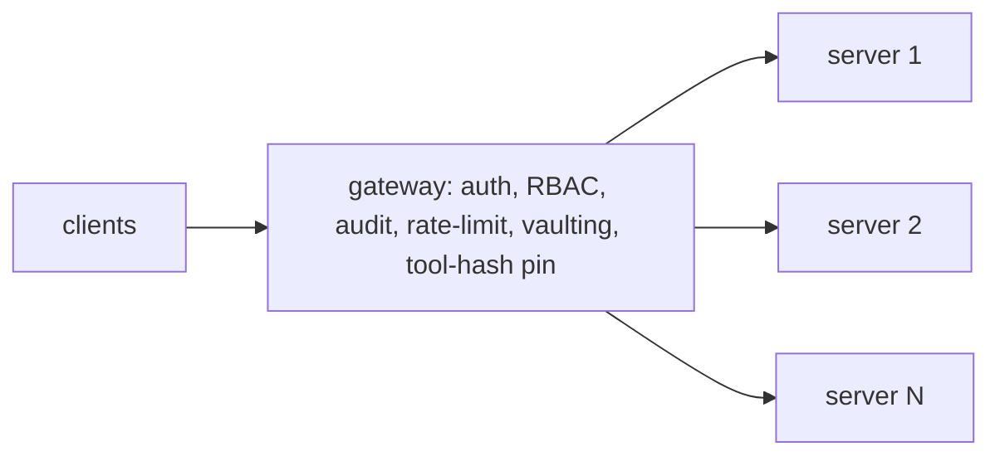

# MCP Gateways and Registries — корпоративные control planes

> Корпоративные организации не могут позволить каждому developer устанавливать случайные MCP servers. Gateway централизует auth, RBAC, audit, rate limiting, caching и detection tool-poisoning, затем предоставляет объединенную поверхность инструментов как единый MCP endpoint. Official MCP Registry (Anthropic + GitHub + PulseMCP + Microsoft, namespace-verified) — canonical upstream. Этот урок показывает, где находится gateway, проходит minimal implementation и обозревает landscape vendors на 2026.

**Тип:** Learn
**Языки:** Python (stdlib, минимальный gateway)
**Предварительные требования:** Phase 13 · 15 (tool poisoning), Phase 13 · 16 (OAuth 2.1)
**Время:** ~45 минут

## Цели обучения

- Объяснить, где находится MCP gateway (между MCP clients и несколькими backend MCP servers).
- Реализовать пять обязанностей gateway: auth, RBAC, audit, rate limit, policy.
- Принудительно применять pinned-tool-hash manifest на слое gateway.
- Отличать Official MCP Registry от metaregistries (Glama, MCPMarket, MCP.so, Smithery, LobeHub).

## Проблема

У компании из Fortune 500 есть 30 approved MCP servers, 5000 developers, требования compliance and audit и security team, которая хочет centralized policy. Разрешить каждому developer устанавливать произвольные servers в IDE — неприемлемый вариант.

Gateway pattern:

1. Gateway запускается как единый Streamable HTTP endpoint, к которому подключаются developers.
2. Gateway хранит credentials для каждого backend MCP server.
3. Каждый developer request проходит authentication и получает scopes через собственный OAuth gateway.
4. Gateway направляет вызов к backend server, применяя policy.
5. Все calls записываются в audit log.

Cloudflare MCP Portals, Kong AI Gateway, IBM ContextForge, MintMCP, TrueFoundry, Envoy AI Gateway — все поставили gateways или gateway features в 2025-2026.

Тем временем Official MCP Registry запущен как canonical upstream: curated, namespace-verified, reverse-DNS-named servers, из которых gateway can pull. Metaregistries (Glama, MCPMarket, MCP.so, Smithery, LobeHub) агрегируют servers из нескольких источников.

## Концепция

### Пять обязанностей gateway

1. **Auth.** OAuth 2.1 для идентификации developer; сопоставляет его с ролями пользователя.
2. **RBAC.** Per-user policy: какие servers, какие tools, какие scopes.
3. **Audit.** Каждый call записывается с указанием кто, что, когда и с каким результатом вызвал.
4. **Rate limit.** Per-user / per-tool / per-server caps для предотвращения abuse.
5. **Policy.** Отклонять poisoned descriptions, применять Rule of Two, редактировать PII.

### Gateway как единый endpoint

Для developers gateway выглядит как один MCP server. Внутри он маршрутизирует к N backends. Session ids (Phase 13 · 09) переписываются на boundary.

### Credential vaulting

Developers никогда не видят backend tokens. Gateway хранит их (или проксирует в identity provider, который это делает). Developer с `notes:read` на gateway может транзитивно получить доступ к notes MCP server с собственными backend credentials gateway — но только under policy, которая связывает транзитивный доступ.

### Tool-hash pinning на gateway

Gateway хранит manifest approved tool descriptions (SHA256 hashes). Во время discovery он получает `tools/list` каждого backend, сравнивает hashes с manifest и удаляет любой tool, whose description has mutated. Это rug-pull defense из Phase 13 · 15, примененная централизованно.

### Policy-as-code

Advanced gateways выражают policy в OPA/Rego, Kyverno или Styra. Правила вроде "user `alice` may call `github.open_pr` only on repos in org `acme`" кодируются декларативно. Simple gateways используют hand-coded Python. Обе формы valid.

### Session-aware routing

Когда user session включает mix servers, gateway multiplexes: single MCP session developer содержит N backend sessions, по одной на server. Notifications из любого backend проходят через gateway в session developer.

### Namespace merging

Gateways merge tool namespaces from all backends, typically with prefix-on-collision. `github.open_pr`, `notes.search`. Это делает routing однозначным.

### Registries

- **Official MCP Registry (`registry.modelcontextprotocol.io`).** Запущен под stewardship Anthropic, GitHub, PulseMCP и Microsoft. Namespace-verified (reverse-DNS: `io.github.user/server`). Предварительно фильтруется по базовому качеству.
- **Glama.** Metaregistry с фокусом на search, агрегирующий много источников.
- **MCPMarket.** Directory с коммерческим уклоном и vendor listings.
- **MCP.so.** Community directory с открытыми submissions.
- **Smithery.** Installation flow в стиле package manager.
- **LobeHub.** Registry, интегрированный в UI их LobeChat app.

Enterprise gateways по умолчанию pull from the Official Registry, разрешают admin-curated additions из metaregistries и отклоняют все unpinned.

### Reverse-DNS naming

Official Registry mandates reverse-DNS names для public servers: `io.github.alice/notes`. Namespaces prevent squatting и делают trust delegation clearer.

### Обзор vendors, апрель 2026

| Vendor | Strength |
|--------|----------|
| Cloudflare MCP Portals | Edge-hosted; OAuth integrated; free tier |
| Kong AI Gateway | K8s-native; fine-grained policy; logs to OpenTelemetry |
| IBM ContextForge | Enterprise IAM; compliance; audit export |
| TrueFoundry | DevOps-leaning; metrics-first |
| MintMCP | Developer-platform oriented |
| Envoy AI Gateway | Open-source; customizable filters |

Phase 17 (production infrastructure) dives deeper on gateway operations.

## Использование

`code/main.py` поставляет minimal gateway примерно в 150 строк: authenticates users through fake Bearer token, хранит per-user RBAC policy, routes requests to two backend MCP servers, writes every call to audit log, enforces rate limit и rejects any backend tool, whose description hash does not match pinned manifest.

На что смотреть:

- `RBAC` — dict, keyed by `user_id`, with allowed `server_tool` entries.
- `AUDIT_LOG` — append-only list of events.
- Rate limit uses a token bucket per user.
- Pinned manifest — dict of `server::tool -> hash`.

## Результат

Этот урок создает `outputs/skill-gateway-bootstrap.md`. Для enterprise MCP plan (users, backends, compliance) skill produces gateway configuration spec.

## Упражнения

1. Запустите `code/main.py`. Сделайте call как allowed user; затем как disallowed user; затем burst, превышающий rate limit. Проверьте все три flows.

2. Добавьте policy, которая redacts PII from results перед возвратом client. Используйте простой regex pass для строк, похожих на SSN; отметьте gap (emails, phone numbers).

3. Расширьте audit log, чтобы emit OpenTelemetry GenAI spans. Phase 13 · 20 covers exact attributes.

4. Спроектируйте RBAC policy для команды из 50 developers с пятью backends (notes, github, postgres, jira, slack). Кто получает read-only на каждом? Кто получает write?

5. Прочитайте Cloudflare enterprise MCP post от начала до конца. Определите одну feature, которую ships Cloudflare и которой нет у этого stdlib gateway.

## Ключевые термины

| Термин | Как обычно говорят | Что это на самом деле значит |
|------|----------------|------------------------|
| Gateway | "MCP proxy" | Централизующий server между clients and backends |
| Credential vaulting | "Backend tokens stay server-side" | Developers never see upstream tokens |
| Session-aware routing | "Multi-backend session" | Gateway multiplexes N backend sessions per developer session |
| Tool-hash pinning | "Approved manifest" | SHA256 каждого approved tool description; centrally blocks rug-pulls |
| RBAC | "Per-user policy" | Role-based access control для tools and servers |
| Policy-as-code | "Declarative rules" | OPA/Rego, Kyverno, Styra policies enforced at gateway |
| Audit log | "Who, what, when" | Append-only event log для compliance |
| Rate limit | "Per-user token bucket" | Per-minute caps для предотвращения abuse |
| Official MCP Registry | "Canonical upstream" | `registry.modelcontextprotocol.io`, namespace-verified |
| Reverse-DNS naming | "Registry namespace" | Конвенция `io.github.user/server` |

## Дополнительное чтение

- [Official MCP Registry](https://registry.modelcontextprotocol.io/) — canonical upstream, namespace-verified
- [Cloudflare — Enterprise MCP](https://blog.cloudflare.com/enterprise-mcp/) — gateway pattern with OAuth and policy
- [agentic-community — MCP gateway registry](https://github.com/agentic-community/mcp-gateway-registry) — open-source reference gateway
- [TrueFoundry — What is an MCP gateway?](https://www.truefoundry.com/blog/what-is-mcp-gateway) — feature comparison article
- [IBM — MCP context forge](https://github.com/IBM/mcp-context-forge) — enterprise gateway from IBM
