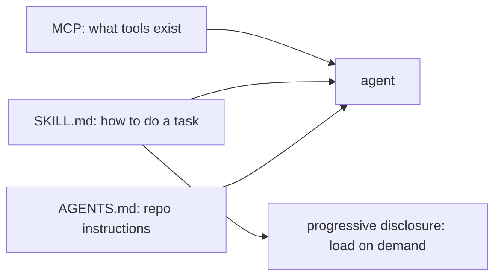

# Skills и Agent SDKs — Anthropic Skills, AGENTS.md, OpenAI Apps SDK

> MCP говорит "какие инструменты существуют." Skills говорят "как выполнить задачу." Stack 2026 года наслаивает и то и другое. Anthropic Agent Skills (open standard, декабрь 2025 года) поставляются как SKILL.md с progressive disclosure. OpenAI Apps SDK — это MCP плюс widget metadata. AGENTS.md (теперь в 60,000+ repos) лежит в корне repo как project-level agent context. Этот урок объясняет, что покрывает каждый слой, и строит минимальный bundle SKILL.md + AGENTS.md, переносимый между агентами.

**Тип:** Изучение
**Языки:** Python (stdlib, parser и loader для SKILL.md)
**Предварительные требования:** Фаза 13 · 07 (MCP server)
**Время:** ~45 минут

## Цели обучения

- Отличать три слоя: AGENTS.md (project context), SKILL.md (reusable know-how), MCP (tools).
- Написать SKILL.md с YAML frontmatter и progressive disclosure.
- Загружать skills в стиле filesystem в agent runtime.
- Составить skill с MCP server и AGENTS.md так, чтобы один package работал в Claude Code, Cursor и Codex.

## Проблема

Инженер превращает workflow написания release notes в многошаговый prompt: "Прочитай последние merged PRs. Сгруппируй по области. Суммируй каждый. Напиши changelog entry в стиле команды. Отправь draft в Slack." Он кладет это в Notion doc для своей команды.

Теперь он хочет использовать этот workflow из Claude Code, Cursor и Codex CLI. У каждого агента свой способ загрузки instructions: slash-commands Claude Code, rules Cursor, `.codex.md` Codex. Инженер копирует workflow три раза и поддерживает три копии.

AGENTS.md и SKILL.md вместе исправляют это:

- **AGENTS.md** лежит в корне repo. Каждый совместимый агент читает его при старте session. "Как устроен этот проект? Какие conventions? Какие commands запускают tests?"
- **SKILL.md** — переносимый bundle: YAML frontmatter (name, description) + markdown body + optional resources. Агенты, поддерживающие skills, загружают их по имени on demand.
- **MCP** (Фаза 13 · 06-14) обрабатывает tools, которые skill должен вызывать.

Три слоя, один переносимый artifact.

## Концепция



### AGENTS.md (agents.md)

Запущен в конце 2025 года, к апрелю 2026 года принят в 60,000+ repos. Один файл в корне repo. Формат:

```markdown
# Project: my-service

## Conventions
- TypeScript with strict mode.
- Use Pydantic for models on the Python side.
- Tests run with `pnpm test`.

## Build and run
- `pnpm dev` for local dev server.
- `pnpm build` for production bundle.
```

Агенты читают это при старте session и используют для калибровки своего поведения под проект. Каждый coding agent в 2026 году поддерживает AGENTS.md: Claude Code, Cursor, Codex, Copilot Workspace, opencode, Windsurf, Zed.

### Формат SKILL.md

Anthropic Agent Skills (выпущены как open standard в декабре 2025 года):

```markdown
---
name: release-notes-writer
description: Write a changelog entry for the latest merged PRs following this project's style.
---

# Release notes writer

When invoked, run these steps:

1. List PRs merged since the last tag. Use `gh pr list --base main --state merged`.
2. Group by label: feature, fix, chore, docs.
3. For each PR in each group, write one line: `- <title> (#<num>)`.
4. Draft the release notes and stage them in CHANGELOG.md.

If the user says "ship", run `git tag vX.Y.Z` and `gh release create`.

## Notes

- Never include commits without a PR.
- Skip "chore" entries from the public changelog.
```

Frontmatter объявляет identity skill. Body — это prompt, показываемый model при загрузке skill.

### Progressive disclosure

Skills могут ссылаться на sub-resources, которые agent получает только при необходимости. Пример:

```
skills/
  release-notes-writer/
    SKILL.md
    style-guide.md
    template.md
    scripts/
      generate.sh
```

SKILL.md говорит "см. style-guide.md с правилами стиля." Agent подтягивает style-guide.md только когда skill активно выполняется. Это не раздувает prompt деталями, которые model могут не понадобиться.

### Обнаружение через filesystem

Agent runtimes сканируют известные directories на наличие файлов SKILL.md:

- `~/.anthropic/skills/*/SKILL.md`
- Project `./skills/*/SKILL.md`
- `~/.claude/skills/*/SKILL.md`

Загрузка идет по имени folder и frontmatter `name`. Claude Code, Anthropic Claude Agent SDK и SkillKit (cross-agent) следуют этому pattern.

### Anthropic Claude Agent SDK

`@anthropic-ai/claude-agent-sdk` (TypeScript) и `claude-agent-sdk` (Python) загружают skills при старте session и выставляют их внутри runtime как вызываемых "agents". Agent loop передает управление skill, когда user его вызывает.

### OpenAI Apps SDK

Запущен в октябре 2025 года; построен прямо на MCP. Объединяет прежние OpenAI Connectors и Custom GPT Actions в единый developer surface. Приложение Apps SDK — это:

- MCP server (tools, resources, prompts).
- Плюс widget metadata для ChatGPT UI.
- Плюс опциональный MCP Apps resource `ui://` для interactive surfaces.

Тот же protocol, более богатый UX.

### Cross-agent portability через SkillKit

Tools вроде SkillKit и похожие cross-agent distribution layers переводят один SKILL.md в native format каждого из 32+ AI agents (Claude Code, Cursor, Codex, Gemini CLI, OpenCode и т. д.). Один source of truth, много consumers.

### Трехслойный stack

| Слой | Файл | Когда загружается | Назначение |
|-------|------|-------------|---------|
| AGENTS.md | корень repo | старт session | conventions уровня проекта |
| SKILL.md | directory skills | вызов skill | переиспользуемый workflow |
| MCP server | внешний процесс | нужны tools | вызываемые действия |

Все три слоя сочетаются: agent читает AGENTS.md при старте session, user вызывает skill, instructions skill включают MCP tool calls, agent отправляет их через MCP client.

## Используйте

`code/main.py` поставляет parser и loader для SKILL.md на stdlib. Он обнаруживает skills в `./skills/`, парсит YAML frontmatter плюс markdown body и создает dict с ключами по именам skills. Затем он имитирует agent loop, который вызывает `release-notes-writer` по имени.

На что обратить внимание:

- YAML frontmatter разбирается минимальным parser на stdlib (без зависимости `pyyaml`).
- Body skill хранится без изменений; agent добавляет его перед system prompt при вызове.
- Progressive disclosure показан через функцию `read_subresource`, которая подтягивает referenced files по требованию.

## Отгрузите

Этот урок создает `outputs/skill-agent-bundle.md`. Для workflow skill создает объединенный bundle SKILL.md + AGENTS.md + MCP-server-blueprint, переносимый между агентами.

## Упражнения

1. Запустите `code/main.py`. Добавьте второй skill под `skills/` и подтвердите, что loader его подхватывает.

2. Напишите AGENTS.md для этого course repo. Включите testing commands, style conventions и mental model Фазы 13.

3. Перенесите multi-step workflow из internal docs вашей команды в SKILL.md. Проверьте, что он загружается в Claude Code.

4. Вручную переведите skill в native rule formats Cursor и Codex. Посчитайте diff между форматами — это translation surface, который автоматизирует SkillKit.

5. Прочитайте blog post Anthropic Agent Skills. Определите одну feature в Claude Agent SDK, которую loader этого урока не покрывает. (Подсказка: agent sub-invocation.)

## Ключевые термины

| Термин | Как говорят | Что это на самом деле означает |
|------|----------------|------------------------|
| SKILL.md | "Файл skill" | YAML frontmatter плюс markdown body, загружается agent runtime |
| AGENTS.md | "Контекст агента в корне repo" | Файл project-level conventions, читаемый при старте session |
| Progressive disclosure | "Ленивая загрузка sub-resources" | Body skill ссылается на files, подтягиваемые только при необходимости |
| Frontmatter | "YAML-блок в начале" | Metadata (name, description) внутри delimiters `---` |
| Claude Agent SDK | "Skill runtime Anthropic" | `@anthropic-ai/claude-agent-sdk`, загружает skills и routes |
| OpenAI Apps SDK | "MCP + widget meta" | Developer surface OpenAI, построенная на MCP плюс ChatGPT UI hooks |
| Skill discovery | "Сканирование filesystem" | Обход известных dirs для SKILL.md, ключ по имени |
| Cross-agent portability | "Один skill, много agents" | Перевод одного SKILL.md в 32+ agents через SkillKit-style tools |
| Agent Skill | "Переносимое know-how" | Reusable task template вне tool concept MCP |
| Apps SDK | "MCP плюс ChatGPT UI" | Connectors и Custom GPTs объединены на MCP |

## Дополнительное чтение

- [Anthropic — Agent Skills announcement](https://www.anthropic.com/engineering/equipping-agents-for-the-real-world-with-agent-skills) — запуск в декабре 2025 года
- [Anthropic — Agent Skills docs](https://platform.claude.com/docs/en/agents-and-tools/agent-skills/overview) — reference формата SKILL.md
- [OpenAI — Apps SDK](https://developers.openai.com/apps-sdk) — developer platform для ChatGPT на базе MCP
- [agents.md](https://agents.md/) — формат AGENTS.md и список adoption
- [Anthropic — anthropics/skills GitHub](https://github.com/anthropics/skills) — официальные примеры skills
