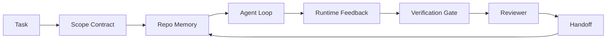

# Инженерия agent workbench: почему способные модели все еще ошибаются

> Способной модели недостаточно. Надежным агентам нужен workbench: инструкции, состояние, область действия, обратная связь, верификация, review и handoff. Уберите это, и даже frontier model произведет работу, которую небезопасно поставлять.

**Тип:** Изучение + сборка
**Языки:** Python (stdlib)
**Предварительные требования:** Phase 14 · 01 (Agent Loop), Phase 14 · 26 (Failure Modes)
**Время:** ~45 минут

## Цели обучения

- Отделить способность модели от надежности исполнения.
- Назвать семь поверхностей workbench, которые определяют, можно ли поставлять работу агента.
- Сравнить запуск только с prompt и запуск под управлением workbench на небольшой задаче в репозитории.
- Подготовить отчет о режимах отказа, который сопоставляет каждую пропущенную поверхность с вызванным симптомом.

## Проблема

Вы помещаете frontier model в реальный repo и просите добавить input validation. Она открывает четыре файла, пишет правдоподобный код, объявляет success и останавливается. Вы запускаете tests. Два падают. Третий файл был изменен, хотя не имел отношения к validation. Нет записи о том, какие assumptions сделал agent, что он попробовал сначала и что осталось сделать.

Модель не ошибалась насчет Python. Она ошибалась насчет работы. Она не знала, что считается done, куда ей разрешено писать, какие tests являются authoritative и как next session должна продолжить.

Это не model bug. Это workbench bug. Поверхность вокруг agent лишена частей, которые превращают one-shot generation в надежную, resumable engineering.

## Концепция

Workbench — это операционная среда, которая оборачивает модель во время задачи. У него семь поверхностей:

| Поверхность | Что она несет | Отказ, когда ее нет |
|---------|-----------------|----------------------|
| Instructions | Правила запуска, запрещенные действия, definition of done | Агент угадывает, что значит "готово к поставке" |
| State | Текущая задача, затронутые файлы, блокеры, следующее действие | Каждая сессия начинается с нуля |
| Scope | Разрешенные файлы, запрещенные файлы, критерии приемки | Правки протекают в несвязанный код |
| Feedback | Реальный вывод команд, захваченный в цикл | Агент объявляет успех при 400 |
| Verification | Тесты, lint, smoke run, проверка scope | "Выглядит хорошо" попадает в main |
| Review | Второй проход в другой роли | Builder проверяет собственную работу |
| Handoff | Что изменилось, почему, что осталось | Следующая сессия заново обнаруживает все |

Workbench независим от модели. Вы можете заменить модель и сохранить поверхности. Вы не можете заменить поверхности и сохранить надежность.



Цикл замыкается на state file, а не на chat history. Chat изменчив. Repo — system of record.

### Workbench против prompt engineering

Prompting сообщает модели, что вы хотите в этом ходе. Workbench сообщает модели, как выполнять работу между ходами и сессиями. Большинство историй о сбоях агентов — это отказы workbench, замаскированные под prompt engineering.

### Workbench против framework

Framework дает runtime (LangGraph, AutoGen, Agents SDK). Workbench дает агенту место для работы внутри этого runtime. Нужно и то и другое. Этот мини-трек про второе.

### Рассуждение от примитивов, а не от vendor taxonomies

Сейчас много пишут о "harness engineering". Addy Osmani, OpenAI, Anthropic, LangChain, Martin Fowler, MongoDB, HumanLayer, Augment Code, Thoughtworks, walkinglabs awesome list и устойчивый поток материалов Medium и Hacker News продвигают эту тему. Они расходятся в том, где проходит граница harness, что входит в scope и какой vocabulary использовать. Нам не нужно выбирать сторону. Семь поверхностей — это UX layer; под каждым workbench находится один и тот же набор примитивов distributed systems, которые удерживают любой надежный backend.

На минуту снимите с этого ярлык agent. Agent run — это вычисление, которое пересекает время, процессы и машины. Чтобы сделать его надежным, нужны те же примитивы, что и любой production system.

| Примитив | Что это | Что он несет для агента |
|-----------|------------|------------------------------|
| Function | Типизированный обработчик. По возможности чистый. Владеет своими входами и выходами. | Вызов инструмента, проверка правила, шаг верификации, вызов модели |
| Worker | Долгоживущий процесс, который владеет одной или несколькими функциями и жизненным циклом | Builder, reviewer, verifier, MCP server |
| Trigger | Источник события, который вызывает функцию | Тик agent loop, HTTP-запрос, сообщение queue, cron, изменение файла, hook |
| Runtime | Граница, которая решает, что где запускается, с какими timeout и ресурсами | Процесс Claude Code, runtime LangGraph, контейнер worker |
| HTTP / RPC | Провод между caller и worker | Протокол tool-call, MCP request, model API |
| Queue | Долговечный буфер между trigger и worker; back-pressure, retry, идемпотентность | Доска задач, лог feedback, inbox review |
| Session persistence | Состояние, переживающее краши, рестарты, замену модели | `agent_state.json`, checkpoints, KV stores, сам repo |
| Authorization policy | Кто может вызвать какую функцию с каким scope | Разрешенные/запрещенные файлы, границы approval, списки capabilities MCP |

Теперь сопоставьте семь поверхностей workbench с этими примитивами.

- **Instructions** — policy + метаданные функций. Rules — это checks (functions). Router (`AGENTS.md`) — policy, прикрепленная к startup runtime.
- **State** — session persistence. Keyed store, который runtime читает на каждом шаге. File, KV или DB; важны semantics of persistence, а не storage backend.
- **Scope** — authorization policy per task. Allowed/forbidden globs — это ACL. Требуемые approvals — lattice разрешений.
- **Feedback** — invocation log, записываемый в queue. Каждый shell call — долговечная, воспроизводимая запись.
- **Verification** — function. Детерминирована по входам. Запускается при закрытии задачи. Отказывает закрыто.
- **Review** — отдельный worker с read-only authz на артефакты builder и write-only authz на review reports.
- **Handoff** — долговечная запись, emitted by a session-end trigger. Startup trigger следующей сессии читает ее.

Сам agent loop — worker, который consumes events (user message, tool result, timer tick), вызывает functions (model, затем tools, выбранные model), пишет records (state, feedback) и emits triggers (verify, review, handoff). Никакой магии; та же форма, что у job processor.

### Распространенные patterns, переведенные в примитивы

Каждый популярный harness pattern сводится к восьми примитивам. Таблица перевода:

| Вендорский или community pattern | Что это на самом деле |
|------------------------------|--------------------|
| Ralph Loop (Claude Code, Codex, книга agentic_harness) — заново вводит исходное намерение в свежее окно контекста, когда агент пытается остановиться рано | Trigger, который повторно ставит задачу в очередь с чистым контекстом; session persistence переносит цель вперед |
| Plan / Execute / Verify (PEV) | Три worker, по одному на роль, общаются через state и queue между фазами |
| Harness-compute separation (OpenAI Agents SDK, апрель 2026) — разделение control plane и execution plane | Переформулировка control-plane / data-plane. Появилась за десятилетия до ярлыка agent |
| Open Agent Passport (OAP, март 2026) — подписывать и аудитировать каждый tool call относительно declarative policy до исполнения | Authorization policy, enforced by pre-action worker, с подписанной audit queue |
| Guides and Sensors (Birgitta Böckeler / Thoughtworks) — feedforward rules + feedback observability | Authorization policy + verification functions + observability traces |
| Progressive compaction, 5-stage (reverse engineering Claude Code, апрель 2026) | Worker управления состоянием, который cron-подобно проходит по session persistence, чтобы удерживать ее в бюджете |
| Hooks / middleware (LangChain, Claude Code) — перехватывают вызовы модели и инструментов | Triggers + functions, обернутые вокруг invocation path runtime |
| Skills as Markdown with progressive disclosure (Anthropic, Flue) | Function registry, где метаданные функций загружаются в контекст just-in-time |
| Sandbox agents (Codex, Sandcastle, Vercel Sandbox) | Compute plane: runtime с изолированной filesystem, network и lifecycle |
| MCP servers | Workers, exposing functions over stable RPC, со списками capabilities как authorization |

Каждая строка этой таблицы — agent community, приходящее к примитиву, у которого в distributed systems уже было имя, и дающее ему новое. Полезные labels для marketing; бесполезные как engineering vocabulary.

### Что на самом деле показывают свидетельства

Утверждение harness-over-model теперь подкреплено числами. Их стоит знать, потому что это также единственный честный аргумент против "just wait for a smarter model."

- Terminal Bench 2.0 — та же модель, но изменение harness перевело coding agent из-за пределов top 30 на пятое место (LangChain, *Anatomy of an Agent Harness*).
- Vercel — удалил 80% tools своего agent; success rate вырос с 80% до 100% (MongoDB).
- Harvey — legal agents more than doubled accuracy только через harness optimization (MongoDB).
- 88% enterprise AI agent projects не доходят до production. Отказы группируются вокруг runtime, а не reasoning (preprints.org, *Harness Engineering for Language Agents*, март 2026).
- Benchmark study 2025 по трем популярным open-source frameworks сообщил ~50% task completion; long-context WebAgent упал с 40-50% до менее 10% в long-context conditions, в основном из-за infinite loops и goal loss (широко освещалось в writeups early 2026).

Вывод не в том, что "harness wins forever." Models со временем впитывают harness tricks. Вывод в том, что сегодня load-bearing engineering находится вокруг модели, а не внутри нее, и примитивы, несущие эту нагрузку, — те самые, которые всегда нужны production system.

### Где vendor writeups останавливаются слишком рано

Это часть, где не нужно быть слишком вежливым.

- LangChain's *Anatomy of an Agent Harness* перечисляет eleven components — prompts, tools, hooks, sandboxes, orchestration, memory, skills, subagents и runtime "dumb loop." Он не называет queues, workers как deployment unit, trigger semantics, session persistence как отдельную concern или authorization policy. Он рассматривает harness как object, который configure, а не как system, которую deploy.
- Addy Osmani's *Agent Harness Engineering* дает framing `Agent = Model + Harness` и ratchet pattern, но останавливается до ответа, из чего построен harness. Это читается как stance, а не spec.
- Anthropic и OpenAI глубже всего заходят в surfaces, но остаются внутри собственных runtimes. Announcement "harness-compute separation" в April 2026 Agents SDK — первая vendor piece, явно поддерживающая control-plane / data-plane split. Это primitive idea, не новая.
- Книга agentic_harness трактует harness как config object (Jaymin West's *Agentic Engineering*, chapter 6), а самая сильная строка в ней: "the harness is the primary security boundary in an agentic system." Это просто authorization policy, сформулированная заново.
- Hacker News threads продолжают приходить к тому же месту. April 2026 thread *The agent harness belongs outside the sandbox* утверждает, что harness должен располагаться "more like a hypervisor that sits outside everything and authorises access based on context and user." Это снова authorization policy как separate plane.

Не нужно спорить ни с одним из этих материалов, чтобы увидеть gap. Они пишут UX descriptions системы, которая уже существует. Мы пишем систему. Когда система построена правильно, семь поверхностей следуют из примитивов. Когда она построена неправильно, никакая полировка `AGENTS.md` не исправит missing queue.

Поэтому, когда где-то слышите "harness engineering", переводите это в примитивы. Prompts и rules — policy и functions. Scaffolding — runtime. Guardrails — authorization + verification. Hooks — triggers. Memory — session persistence. Ralph Loop — requeue. Subagents — workers. Sandboxes — compute planes. Vocabulary меняется; engineering нет. Workbench — agent-facing UX; harness, в смысле, который переживет следующий vendor reframe, — это functions, workers, triggers, runtimes, queues, persistence и policy, правильно связанные вместе.

## Практика

`code/main.py` запускает tiny repo task дважды. Сначала как prompt only, затем с подключенными seven surfaces. Та же модель, та же задача. Script подсчитывает, какие surfaces отсутствовали в failed run, и печатает failure-mode report.

Repo task намеренно мала: добавить input validation в one-file FastAPI-style handler и написать passing test.

Запустите:

```
python3 code/main.py
```

Вывод: side-by-side log двух runs, `failure_modes.json` с summary prompt-only run и one-line verdict для workbench run.

Agent — tiny rule-based stub; смысл в surfaces, а не в model. В оставшейся части mini-track вы пересоберете каждую surface как real, reusable artifact.

## Как использовать

Три места, где workbench surfaces уже встречаются в реальности, даже если их так никто не называет:

- **Claude Code, Codex, Cursor.** `AGENTS.md` и `CLAUDE.md` — instructions surface. Slash commands — scope. Hooks — verification.
- **LangGraph, OpenAI Agents SDK.** Checkpoints и session stores — state surface. Handoffs — handoff surface.
- **CI on a real repo.** Tests, lint и type-check — verification. PR template — handoff. CODEOWNERS — review.

Workbench engineering — дисциплина, которая делает эти surfaces explicit и reusable, вместо того чтобы оставлять каждую team заново их rediscover.

## Что подготовить

`outputs/skill-workbench-audit.md` — portable skill, который audits existing repo на seven workbench surfaces и reports, какие missing, partial и healthy. Положите его рядом с любым agent setup; он скажет, что чинить первым.

## Упражнения

1. Выберите repo, где уже запускаете agent. Оцените seven surfaces от 0 (missing) до 2 (healthy). Какая surface самая слабая?
2. Расширьте `main.py`, чтобы prompt-only run также выдавал fake "success" claim. Проверьте, что verification gate поймал бы его.
3. Добавьте eighth surface для вашего product. Обоснуйте, почему она не схлопывается в одну из существующих seven.
4. Повторно запустите script с другим stub agent, который hallucinate лишнюю file write. Какая surface поймает это первой?
5. Сопоставьте five industry-recurring failure modes из Phase 14 · 26 с seven surfaces. Какой mode каждая surface designed to absorb?

## Ключевые термины

| Термин | Как говорят | Что это на самом деле означает |
|------|----------------|------------------------|
| Workbench | "Настройка" | Спроектированные поверхности вокруг модели, которые делают работу надежной |
| Surface | "Документ" или "скрипт" | Именованный, машинно-читаемый вход, который агент читает или пишет на каждом ходе |
| System of record | "Заметки" | Файл, который агент считает истиной, когда история чата исчезла |
| Definition of done | "Приемка" | Объективный, файловый checklist, который агент не может подделать |
| Workbench audit | "Проверка готовности repo" | Проход по семи поверхностям, который отмечает недостающие части до начала работы |

## Дополнительное чтение

Читайте это как data points, а не как authorities. Каждый материал — partial taxonomy. Переводите каждую concept обратно в primitive (function, worker, trigger, runtime, HTTP/RPC, queue, persistence, policy), прежде чем решать, adopt ли ее.

Вендорские framing:

- [Addy Osmani, Agent Harness Engineering](https://addyosmani.com/blog/agent-harness-engineering/) — `Agent = Model + Harness` и ratchet pattern; мало infrastructure
- [LangChain, The Anatomy of an Agent Harness](https://blog.langchain.com/the-anatomy-of-an-agent-harness/) — eleven components: prompts, tools, hooks, orchestration, sandboxes, memory, skills, subagents, runtime; опускает queues, deployment, authz
- [OpenAI, Harness engineering: leveraging Codex in an agent-first world](https://openai.com/index/harness-engineering/) — взгляд Codex team на surfaces вокруг их runtime
- [OpenAI, Unrolling the Codex agent loop](https://openai.com/index/unrolling-the-codex-agent-loop/) — agent loop, сведенный к `while` над function calls
- [Anthropic, Effective harnesses for long-running agents](https://www.anthropic.com/engineering/effective-harnesses-for-long-running-agents) — long-horizon surfaces внутри specific runtime
- [Anthropic, Harness design for long-running application development](https://www.anthropic.com/engineering/harness-design-long-running-apps) — applied design notes
- [LangChain Deep Agents harness capabilities](https://docs.langchain.com/oss/python/deepagents/harness) — runtime config surface

Практические материалы с полезными деталями:

- [Martin Fowler / Birgitta Böckeler, Harness engineering for coding agent users](https://martinfowler.com/articles/harness-engineering.html) — guides (feedforward) + sensors (feedback); самая чистая control-theory framing
- [HumanLayer, Skill Issue: Harness Engineering for Coding Agents](https://www.humanlayer.dev/blog/skill-issue-harness-engineering-for-coding-agents) — "it's not a model problem, it's a configuration problem"
- [MongoDB, The Agent Harness: Why the LLM Is the Smallest Part of Your Agent System](https://www.mongodb.com/company/blog/technical/agent-harness-why-llm-is-smallest-part-of-your-agent-system) — receipts: Vercel 80% to 100%, Harvey 2x accuracy, Terminal Bench Top 30 to Top 5
- [Augment Code, Harness Engineering for AI Coding Agents](https://www.augmentcode.com/guides/harness-engineering-ai-coding-agents) — constraint-first walkthrough
- [Sequoia podcast, Harrison Chase on Context Engineering Long-Horizon Agents](https://sequoiacap.com/podcast/context-engineering-our-way-to-long-horizon-agents-langchains-harrison-chase/) — runtime concerns over model concerns

Книги, статьи и референсные реализации:

- [Jaymin West, Agentic Engineering — Chapter 6: Harnesses](https://www.jayminwest.com/agentic-engineering-book/6-harnesses) — book-length treatment, treats harness as the primary security boundary
- [preprints.org, Harness Engineering for Language Agents (March 2026)](https://www.preprints.org/manuscript/202603.1756) — academic framing as control / agency / runtime
- [walkinglabs/awesome-harness-engineering](https://github.com/walkinglabs/awesome-harness-engineering) — курируемый reading list по context, evaluation, observability, orchestration
- [ai-boost/awesome-harness-engineering](https://github.com/ai-boost/awesome-harness-engineering) — альтернативный курируемый список (tools, evals, memory, MCP, permissions)
- [andrewgarst/agentic_harness](https://github.com/andrewgarst/agentic_harness) — готовая к production референсная реализация с Redis-backed memory и eval suite
- [HKUDS/OpenHarness](https://github.com/HKUDS/OpenHarness) — открытый agent harness со встроенным personal agent

Треды Hacker News стоит читать ради разногласий, а не консенсуса:

- [HN: Effective harnesses for long-running agents](https://news.ycombinator.com/item?id=46081704)
- [HN: Improving 15 LLMs at Coding in One Afternoon. Only the Harness Changed](https://news.ycombinator.com/item?id=46988596)
- [HN: The agent harness belongs outside the sandbox](https://news.ycombinator.com/item?id=47990675) — аргументирует authorization как отдельную плоскость

Перекрестные ссылки внутри этого курса:

- Phase 14 · 23 — OpenTelemetry GenAI conventions: observability layer, на который указывает sensors literature
- Phase 14 · 26 — каталог failure modes, которые seven surfaces designed to absorb
- Phase 14 · 27 — защиты от prompt injection, которые находятся на authorization-policy primitive
- Phase 14 · 29 — production runtimes (queue, event, cron): где primitives из этого урока живут в deployment
