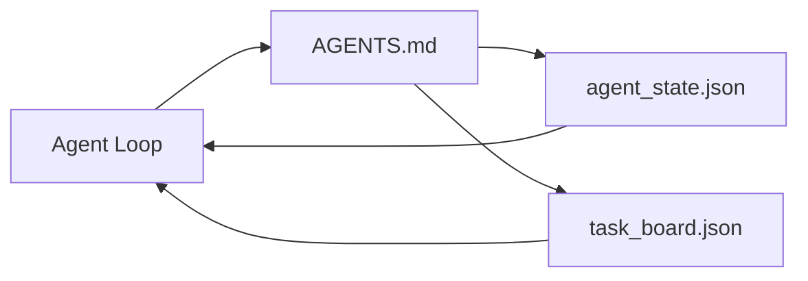

# Минимальный воркбенч агента

> Самый маленький полезный воркбенч состоит из трех файлов: корневого маршрутизатора инструкций, файла состояния и доски задач. Все остальное наслаивается сверху. Если репозиторий не может нести эти три файла, никакая модель его не спасет.

**Тип:** Build
**Языки:** Python (stdlib)
**Предварительные требования:** Phase 14 · 31 (Why Capable Models Still Fail)
**Время:** ~45 минут

## Цели обучения

- Определить три файла, из которых состоит минимально жизнеспособный воркбенч.
- Объяснить, почему короткий корневой маршрутизатор лучше длинного монолитного `AGENTS.md`.
- Построить файл состояния, который агент может читать на каждом ходе и записывать в конце.
- Построить доску задач, которая выдерживает многосессионную работу без истории чата.

## Проблема

Большинство команд начинают строить воркбенч с 3000-строчного `AGENTS.md` и считают дело законченным. Модель загружает его, игнорирует части, которые не может сжать в краткое резюме, и все равно ошибается на тех же поверхностях, где ошибалась раньше.

Нужно противоположное. Крошечный корневой файл, который направляет агента в более глубокие файлы только когда это уместно. Долговечное состояние, которое агент читает перед действием и записывает после. Доска задач, где видно, что в работе, что заблокировано и что идет дальше.

Три файла. У каждого своя задача. Каждый достаточно машиночитаем, чтобы позже вырасти в настоящую систему.

## Концепция



### AGENTS.md — это маршрутизатор, а не руководство

Хороший `AGENTS.md` короткий. Он указывает агенту на:

- Файл состояния (где вы находитесь).
- Доску задач (что осталось).
- Более глубокие правила (в `docs/agent-rules.md`).
- Команду проверки (как понять, что все работает).

Все более длинное уходит в глубокие документы, которые загружаются только при необходимости. Длинные руководства игнорируют. Коротким маршрутизаторам следуют.

### agent_state.json — система записи

Состояние хранит: id активной задачи, затронутые файлы, сделанные допущения, блокеры и следующее действие. Агент читает его на каждом ходе. Следующая сессия читает его вместо воспроизведения чата.

Состояние живет в файле, потому что история чата ненадежна. Сессии умирают. Диалоги обрезаются. Файл остается.

### task_board.json — очередь

Доска задач хранит каждую задачу со статусом `todo | in_progress | done | blocked`. Это очередь, из которой агент берет работу, когда состояние пусто, и очередь, которую вы читаете, когда хотите понять, движется ли агент правильно.

У задачи на доске есть id, цель, владелец (`builder`, `reviewer` или `human`) и критерии приемки. Доска намеренно маленькая: если она разрастается за пределы одного экрана, у вас проблема планирования, а не проблема доски.

### Три файла — это минимум, а не максимум

Следующие уроки добавят контракты области действия, раннеры обратной связи, verification gates, чеклисты reviewer и пакеты handoff. Три файла здесь — то, на что все они опираются.

## Соберите это

`code/main.py` записывает минимальный воркбенч в пустой репозиторий и демонстрирует один ход агента, который:

1. Читает `agent_state.json`.
2. Берет следующую задачу из `task_board.json`, если состояние пусто.
3. Трогает один файл внутри области действия.
4. Записывает обновленное состояние обратно.

Запустите:

```
python3 code/main.py
```

Скрипт создает `workdir/` рядом с собой, раскладывает три файла, выполняет один ход и печатает diff. Запустите его повторно, чтобы увидеть, как второй ход продолжает с места, где остановился первый.

## Используйте это

В production-продуктах для агентов те же три файла появляются под разными именами:

- **Claude Code:** `AGENTS.md` или `CLAUDE.md` как маршрутизатор, хранилища в стиле `.claude/state.json` для состояния, hooks для доски.
- **Codex / Cursor:** workspace rules как маршрутизатор, session memory для состояния, queued tasks в боковой панели чата для доски.
- **Custom Python agent:** те же файлы, которые вы только что написали.

Имена меняются. Форма — нет.

## Production-паттерны в реальной практике

Минимальный воркбенч выдерживает контакт с настоящими монорепозиториями, когда поверх него наслаивают три паттерна. Они независимы; выбирайте те, которые действительно нужны вашему репозиторию.

**Вложенные `AGENTS.md` с приоритетом nearest-wins.** OpenAI поставляет 88 файлов `AGENTS.md` в своем основном репозитории, по одному на подкомпонент. Codex, Cursor, Claude Code и Copilot идут от рабочего файла к корню репозитория и конкатенируют каждый `AGENTS.md`, найденный по пути. Файлы в поддиректориях расширяют корневой файл. Codex добавляет `AGENTS.override.md`, чтобы заменять, а не расширять; механизм override специфичен для Codex, и для кросс-инструментальной работы его лучше избегать. Важная строка из измерений Augment Code: лучшие файлы `AGENTS.md` дают скачок качества, эквивалентный апгрейду с Haiku до Opus; худшие делают результат хуже, чем отсутствие файла вообще.

**Антипаттерны, которые нужно отвергать, даже когда они выглядят как покрытие.** Противоречивые инструкции тихо переводят агента из интерактивного режима в жадный (ICLR 2026 AMBIG-SWE: 48.8% → 28% resolve rate); нумеруйте приоритеты вместо того, чтобы складывать их плоским списком. Непроверяемые стилевые правила ("follow the Google Python Style Guide") без команды enforcement позволяют агенту выдумывать соответствие; связывайте каждое стилевое правило с точной lint-командой. Если начинать со стиля вместо команд, путь проверки оказывается похоронен; сначала команды, стиль в конце. Писать для людей вместо агентов значит тратить контекстный бюджет; краткость — это свойство.

**Кросс-инструментальные symlinks.** Один корневой файл с symlinks (`ln -s AGENTS.md CLAUDE.md`, `ln -s AGENTS.md .github/copilot-instructions.md`, `ln -s AGENTS.md .cursorrules`) держит всех coding agents на одном источнике истины. Nx `nx ai-setup` автоматизирует это для Claude Code, Cursor, Copilot, Gemini, Codex и OpenCode из единой конфигурации.

## Отгрузите это

`outputs/skill-minimal-workbench.md` генерирует трехфайловый воркбенч для любого нового репозитория: маршрутизатор `AGENTS.md`, настроенный под проект, `agent_state.json` с правильными ключами и `task_board.json`, заполненный текущим backlog.

## Упражнения

1. Добавьте timestamp `last_run` в `agent_state.json`. Отказывайтесь запускаться, если файл старше 24 часов, пока оператор не подтвердит.
2. Добавьте поле `priority` в доску задач и измените puller так, чтобы он всегда выбирал `todo` с наивысшим приоритетом.
3. Мигрируйте `task_board.json` на JSON Lines, чтобы каждая задача была строкой, а diff в version control был чистым.
4. Напишите `lint_workbench.py`, который падает, если `AGENTS.md` длиннее 80 строк или ссылается на несуществующий файл.
5. Решите, потеря какого из трех файлов навредила бы сильнее всего. Защитите свой выбор.

## Ключевые термины

| Термин | Как обычно говорят | Что это на самом деле означает |
|------|----------------|------------------------|
| Router | `AGENTS.md` | Короткий корневой файл, который указывает агенту на более глубокие docs и files |
| State file | "The notes" | Машиночитаемая запись о том, где находится агент, записываемая каждый ход |
| Task board | "The backlog" | JSON-очередь работы со status, owner, acceptance |
| System of record | "Source of truth" | Файл, который workbench считает authoritative, когда chat исчез |

## Дополнительное чтение

- [agents.md — the open spec](https://agents.md/) — adopted by Cursor, Codex, Claude Code, Copilot, Gemini, OpenCode
- [Augment Code, A good AGENTS.md is a model upgrade. A bad one is worse than no docs at all](https://www.augmentcode.com/blog/how-to-write-good-agents-dot-md-files) — measured quality jumps
- [Blake Crosley, AGENTS.md Patterns: What Actually Changes Agent Behavior](https://blakecrosley.com/blog/agents-md-patterns) — what works empirically, what does not
- [Datadog Frontend, Steering AI Agents in Monorepos with AGENTS.md](https://dev.to/datadog-frontend-dev/steering-ai-agents-in-monorepos-with-agentsmd-13g0) — nested precedence in practice
- [Nx Blog, Teach Your AI Agent How to Work in a Monorepo](https://nx.dev/blog/nx-ai-agent-skills) — single-source generation across six tools
- [The Prompt Shelf, AGENTS.md Best Practices: Structure, Scope, and Real Examples](https://thepromptshelf.dev/blog/agents-md-best-practices/) — section ordering that survives review
- [Anthropic, Claude Code subagents and session store](https://docs.anthropic.com/en/docs/agents-and-tools/claude-code/sub-agents)
- Phase 14 · 31 — failure modes, которые поглощает этот минимум
- Phase 14 · 34 — durable state schema, которую предваряет этот урок
