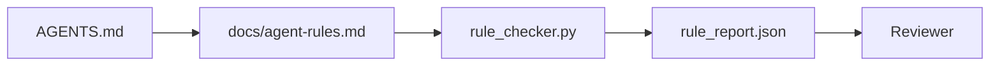

# Инструкции агента как исполняемые ограничения

> Инструкции, написанные прозой, — это пожелания. Инструкции, написанные как ограничения, — это тесты. Воркбенч превращает каждое правило во что-то, что агент может проверить во время выполнения, а reviewer — верифицировать постфактум.

**Тип:** Build
**Языки:** Python (stdlib)
**Предварительные требования:** Phase 14 · 32 (Minimal Workbench)
**Время:** ~50 минут

## Цели обучения

- Отделить маршрутизирующую прозу от операционных правил.
- Выразить startup rules, forbidden actions, definition of done, uncertainty handling и approval boundaries как машино-проверяемые ограничения.
- Реализовать rule checker, который оценивает запуск по набору правил.
- Сделать набор правил удобным для diff, чтобы review видел, что изменилось.

## Проблема

Типичный `AGENTS.md` читается как onboarding-документация. Он говорит агенту "be careful", "test thoroughly" и "ask if unsure". Через три дня агент отгружает изменение без тестов, пишет в запрещенную директорию и ни о чем не спрашивает, потому что он так и не понял, где проходит граница.

Инструкции сильны, когда они операционны, и слабы, когда они декларативны. Исправление — писать правила, которые воркбенч может интерпретировать, а reviewer может оценить.

## Концепция

Правила живут в `docs/agent-rules.md`, отдельно от короткого корневого маршрутизатора. У каждого правила есть имя, категория и проверка.



### Пять категорий, которые покрывают большинство правил

| Category | Question the rule answers | Example |
|----------|---------------------------|---------|
| Startup | Что должно быть истинно до начала работы? | "state file exists and is fresh" |
| Forbidden | Что никогда не должно происходить? | "do not edit `scripts/release.sh`" |
| Definition of done | Что доказывает, что задача завершена? | "pytest exits 0 and acceptance line passes" |
| Uncertainty | Что делает агент, когда не уверен? | "open a question note instead of guessing" |
| Approval | Что требует human approval? | "any new dependency, any prod write" |

Правило, которое не помещается в одну из этих пяти категорий, обычно хочет быть двумя правилами. Принудительно разделите его.

### Правила машиночитаемы

У каждого правила есть slug, категория, однострочное описание и поле `check`, называющее функцию в `rule_checker.py`. Добавить правило значит добавить check; checker растет вместе с воркбенчем.

### Правила удобны для diff

Правила живут по одному на heading в одном markdown-файле. Переименования видны в diffs. Новые правила идут в начало своей категории. Устаревшие правила удаляют, а не комментируют, потому что workbench — источник истины, а не chat log о том, что команда чувствовала в прошлом квартале.

### Правила против framework guardrails

Framework guardrails (OpenAI Agents SDK guardrails, LangGraph interrupts) обеспечивают правила на уровне runtime. Набор правил в этом уроке — человекочитаемый, reviewable contract, который эти guardrails реализуют. Нужны оба слоя: runtime ловит нарушения во время хода, rule set доказывает, что runtime делает правильную вещь.

## Соберите это

`code/main.py` поставляет:

- Парсер `agent-rules.md`, который загружает rules в dataclass.
- Checker-функции в стиле `rule_checker.py`, по одной на каждую ссылку `check`.
- Demo agent run, который нарушает два правила, и check pass, который их ловит.

Запустите:

```
python3 code/main.py
```

Вывод: разобранный rule set, run trace, pass/fail по каждому правилу и `rule_report.json`, сохраненный рядом со скриптом.

## Production-паттерны в реальной практике

Три паттерна отделяют rule set, который живет квартал, от того, который сгнивает за неделю.

**Severity tagging во время записи.** Каждое правило несет `severity`: `block`, `warn` или `info`. Checker сообщает все три; runtime отказывается только на `block`. Большинство команд сначала завышают severity, а затем тихо ослабляют ее под давлением дедлайна; tagging во время записи заставляет откалибровать это заранее. Свяжите с verification gate (Phase 14 · 38), который подписывает любой override правила `block` в audit log `overrides.jsonl`.

**Rule expiry как forcing function.** Каждое правило несет дату `expires_at` (по умолчанию 90 дней от создания). Checker выдает warning, когда неистекшее правило не имело нарушений 60 дней подряд; следующий quarterly review либо обосновывает сохранение, либо ослабляет его до `info`, либо удаляет. Production-данные Cloudflare AI Code Review (апрель 2026, 131,246 review runs в 5,169 repos за 30 дней) показали, что rule sets с явным expiry оставались меньше 30 правил на repo; наборы без expiry разрастались до 80+ и большинство правил никогда не срабатывало.

**Markdown-as-source, JSON-as-cache.** `agent-rules.md` — authored file; `agent-rules.lock.json` — cache, который checker читает в hot path. Lock регенерируется pre-commit hook. Markdown diffs пригодны для review; JSON parsing не попадает в каждый ход. Та же форма, что у `package.json` / `package-lock.json` и `Cargo.toml` / `Cargo.lock`.

## Используйте это

В production:

- Claude Code, Codex, Cursor читают rules при старте сессии и цитируют их при отказе от действий. Checker перезапускает их в CI, чтобы поймать silent drift.
- OpenAI Agents SDK guardrails регистрируют те же checks как input и output guardrails. Markdown — поверхность docs; SDK — поверхность runtime.
- LangGraph interrupts срабатывают, когда in-flight node нарушает rule. Interrupt handler читает правило, спрашивает человека и resumes.

Rule set переносим между всеми тремя, потому что это всего лишь markdown плюс имена функций.

## Отгрузите это

`outputs/skill-rule-set-builder.md` интервьюирует владельца проекта, классифицирует существующие prose instructions по пяти категориям и генерирует versioned `agent-rules.md` плюс checker stub.

## Упражнения

1. Добавьте шестую категорию, если вашему продукту она действительно нужна. Защитите, почему она не схлопывается в одну из пяти.
2. Расширьте checker так, чтобы правило могло нести severity (`block`, `warn`, `info`), а report агрегировал это соответствующим образом.
3. Подключите checker к CI: валите build, если правило с block-severity падает на последнем agent run.
4. Добавьте поле "expiry" для каждого правила. После 90 дней без check fail правило отправляется на review.
5. Найдите настоящий `AGENTS.md` и перепишите его как правила пяти категорий. Сколько его строк были операционными? Сколько — декларативными?

## Ключевые термины

| Термин | Как обычно говорят | Что это на самом деле означает |
|------|----------------|------------------------|
| Operational rule | "A real instruction" | Правило, которое workbench может проверить во время выполнения |
| Aspirational rule | "Be careful" | Правило без check; его нужно удалить или усилить |
| Definition of done | "Acceptance" | Объективное, file-backed доказательство, что задача завершена |
| Block severity | "Hard rule" | Нарушение останавливает run; его нельзя заглушить без оператора |
| Rule expiry | "Stale rule sweep" | Правило без fails за N дней отправляется на retirement |

## Дополнительное чтение

- [OpenAI Agents SDK guardrails](https://platform.openai.com/docs/guides/agents-sdk/guardrails)
- [LangGraph interrupts](https://langchain-ai.github.io/langgraph/how-tos/human_in_the_loop/breakpoints/)
- [Anthropic, Building Effective Agents](https://www.anthropic.com/research/building-effective-agents)
- [Rick Hightower, Agent RuleZ: A Deterministic Policy Engine](https://medium.com/@richardhightower/agent-rulez-a-deterministic-policy-engine-for-ai-coding-agents-9489e0561edf) — block/warn/info severity in production
- [Cloudflare, Orchestrating AI Code Review at Scale](https://blog.cloudflare.com/ai-code-review/) — 131k review runs, rule composition lessons
- [microservices.io, GenAI development platform — part 1: guardrails](https://microservices.io/post/architecture/2026/03/09/genai-development-platform-part-1-development-guardrails.html) — defense in depth between rules and CI
- [Type-Checked Compliance: Deterministic Guardrails (arXiv 2604.01483)](https://arxiv.org/pdf/2604.01483) — Lean 4 as the upper bound on rule-as-check
- [logi-cmd/agent-guardrails](https://github.com/logi-cmd/agent-guardrails) — merge-gate implementation: scope, mutation testing, violation budgets
- Phase 14 · 32 — minimal workbench, в который вставляется этот rule set
- Phase 14 · 38 — verification gate, который потребляет rule report
- Phase 14 · 39 — reviewer agent, который оценивает rule compliance
