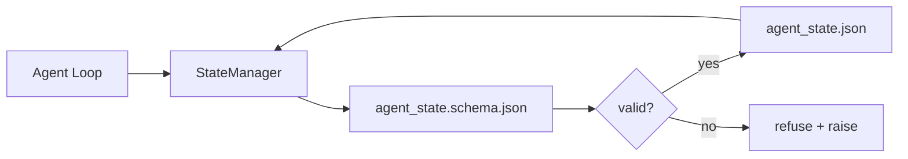

# Память репозитория и долговечное состояние

> История чата изменчива. Репозиторий долговечен. Воркбенч хранит состояние агента в версионированных файлах, чтобы следующая сессия, следующий агент и следующий reviewer читали один и тот же источник истины.

**Тип:** Build
**Языки:** Python (stdlib + `jsonschema` optional)
**Предварительные требования:** Phase 14 · 32 (Minimal Workbench)
**Время:** ~60 минут

## Цели обучения

- Определить, что относится к repo memory, а что — к chat history.
- Написать JSON Schemas для `agent_state.json` и `task_board.json`.
- Построить state manager, который загружает, валидирует, изменяет и атомарно сохраняет состояние.
- Использовать schema, чтобы отказываться от плохих записей до того, как они испортят workbench.

## Проблема

Агент завершает сессию. Чат закрывается. Следующая сессия открывается и спрашивает, с чего начать. Модель говорит "let me check the files", читает устаревшие заметки и повторяет работу, которая уже была завершена. Или хуже: переписывает законченный файл, потому что никто не сказал ей, что файл завершен.

Исправление воркбенча — repo memory: состояние живет в JSON-файлах в репозитории, пишется под schema, сохраняется атомарно и удобно читается в code review. Чат — transient feed; репозиторий — system of record.

## Концепция



### Что относится к repo memory

| Belongs | Does not belong |
|---------|-----------------|
| Active task id | Raw chat transcripts |
| Touched files this session | Token-level reasoning traces |
| Assumptions the agent made | "The user seemed frustrated" |
| Open blockers | Sampled completions |
| Next action | Vendor-specific model ids |

Тест — долговечность: будет ли это полезно через три месяца при повторном CI rerun? Если да — repo. Если нет — telemetry.

### Schema-first state

JSON Schema — это контракт. Без нее каждый агент придумывает новые поля, каждый reviewer изучает новую форму, а каждый CI script вынужден special-case старые версии. С ней плохая запись становится отказанной записью.

Schema покрывает:

- Required keys.
- Допустимые значения `status`.
- Запрещенные значения (например, `null` для arrays).
- Pattern constraints (task ids match `T-\d{3,}`).
- Version field для migrations.

### Атомарные записи

Записи состояния должны переживать частичные отказы: записать во временный файл, fsync, rename поверх target. State file — источник истины; наполовину записанный файл хуже, чем отсутствие файла.

### Миграции

Когда schema меняется, поставляйте migration script рядом с schema bump. State file несет поле `schema_version`; manager отказывается загружать файл версии, которую не может мигрировать.

## Соберите это

`code/main.py` реализует:

- `agent_state.schema.json` и `task_board.schema.json`.
- Валидатор только на stdlib (подмножество JSON Schema: required, type, enum, pattern, items).
- `StateManager.load`, `StateManager.update`, `StateManager.commit` с атомарной temp-and-rename записью.
- Demo, который изменяет состояние, сохраняет, загружает заново и доказывает round-trip.

Запустите:

```
python3 code/main.py
```

Скрипт записывает `workdir/agent_state.json` и `workdir/task_board.json`, изменяет их на двух ходах и печатает validated state на каждом шаге.

## Production-паттерны в реальной практике

Четыре паттерна превращают минимум урока в то, что переживет multi-agent monorepo.

**Atomic temp-and-rename не опционален.** Bug report проекта Hive за март 2026 документирует failure mode чисто: `state.json` записывался через `write_text()`, а exceptions ловились и глушились. Частичные записи оставляли сессии возобновляться на corrupt state без сигнала. Исправление всегда одно: `tempfile.mkstemp` в той же директории, что target, write, `fsync`, `os.replace` (atomic rename на POSIX и Windows). `atomic_write` в этом уроке делает именно это.

**Idempotency keys на каждом non-idempotent tool call.** Если агент падает после вызова tool, но до checkpoint результата, recovery повторит tool call. Безопасно для reads; опасно для emails, DB inserts, file uploads. Паттерн: логировать каждый tool call ID до выполнения в `pending_calls.jsonl`. При retry проверить ID; если он есть, пропустить call и использовать cached result. Anthropic и LangChain оба подчеркивают это в guidance 2026 года; LangGraph checkpointer сохраняет pending writes по той же причине.

**Отделяйте большие artifacts от state.** Не храните CSVs, длинные transcripts или generated files в `agent_state.json`. Сохраните artifact отдельным файлом (или загрузите в object storage) и держите в state только path. Checkpoints остаются маленькими и быстрыми; artifacts растут независимо.

**Event sourcing для audit, snapshots для resume.** Append в event log (`state.events.jsonl`) на каждую mutation; периодически snapshot в `state.json`. Resume читает snapshot, затем replay events после timestamp snapshot. Это стоит больше диска, но позволяет replay agent decisions verbatim — важно при debugging long-horizon runs. Та же форма, которую Postgres использует внутри для WAL.

**Schema migrations или отказ от загрузки.** Integer `schema_version` — контракт. Когда manager загружает файл неизвестной версии, он отказывается читать. Поставляйте migration script рядом с schema bump; `tools/migrate_state.py` запускается idempotently на каждом startup.

## Используйте это

В production:

- **LangGraph checkpointers.** Та же идея, другое хранилище. Checkpointer сохраняет graph state в SQLite, Postgres или custom backend. Schema из этого урока — то, к чему вы обращаетесь, когда checkpointer умер и нужно прочитать state вручную.
- **Letta memory blocks.** Persistent blocks со structured schemas (Phase 14 · 08). Та же дисциплина, scoped to long-running personas.
- **OpenAI Agents SDK session store.** Pluggable backends, schema-aware. State file в этом уроке — local-file backend.

## Отгрузите это

`outputs/skill-state-schema.md` генерирует project-specific пару JSON Schema (state + board), Python `StateManager`, подключенный к atomic writes, и migration scaffold, чтобы следующий schema bump не сломал workbench.

## Упражнения

1. Добавьте timestamp `last_human_touch`. Отказывайтесь от любой agent write в течение пяти секунд после human edit.
2. Расширьте validator поддержкой `oneOf`, чтобы task могла быть build task или review task с разными required fields.
3. Добавьте поле `schema_version` и напишите migration from v1 to v2 (переименуйте `blockers` в `risks`).
4. Перенесите storage backend с local file на SQLite. Сохраните API `StateManager` идентичным.
5. Запустите двух agents против одного state file с write race 50 ms. Что ломается и как atomic rename вас спасает?

## Ключевые термины

| Термин | Как обычно говорят | Что это на самом деле означает |
|------|----------------|------------------------|
| Repo memory | "Notes file" | State, сохраненный в tracked files в repo, под schema |
| Schema-first | "Validate inputs" | Сначала определить contract, затем writer; отказывать drift |
| Atomic write | "Just rename" | Записать во temp, fsync, rename, чтобы partial failures не corrupt |
| Migration | "Schema bump" | Script, который превращает vN state в v(N+1) state |
| System of record | "Source of truth" | Artifact, который workbench считает authoritative |

## Дополнительное чтение

- [JSON Schema specification](https://json-schema.org/specification.html)
- [LangGraph checkpointers](https://langchain-ai.github.io/langgraph/concepts/persistence/)
- [Letta memory blocks](https://docs.letta.com/concepts/memory)
- [Fast.io, AI Agent State Checkpointing: A Practical Guide](https://fast.io/resources/ai-agent-state-checkpointing/) — schema-first checkpointing with idempotency
- [Fast.io, AI Agent Workflow State Persistence: Best Practices 2026](https://fast.io/resources/ai-agent-workflow-state-persistence/) — concurrency control, TTL, event sourcing
- [Hive Issue #6263 — non-atomic state.json writes silently ignored](https://github.com/aden-hive/hive/issues/6263) — failure mode in a real project
- [eunomia, Checkpoint/Restore Systems: Evolution, Techniques, Applications](https://eunomia.dev/blog/2025/05/11/checkpointrestore-systems-evolution-techniques-and-applications-in-ai-agents/) — CR primitives from OS history applied to agents
- [Indium, 7 State Persistence Strategies for Long-Running AI Agents in 2026](https://www.indium.tech/blog/7-state-persistence-strategies-ai-agents-2026/)
- [Microsoft Agent Framework, Compaction](https://learn.microsoft.com/en-us/agent-framework/agents/conversations/compaction) — vendor checkpoint manager
- Phase 14 · 08 — memory blocks and sleep-time compute
- Phase 14 · 32 — three-file minimum, который этот урок schematizes
- Phase 14 · 40 — handoff packets, читающие ту же schema
