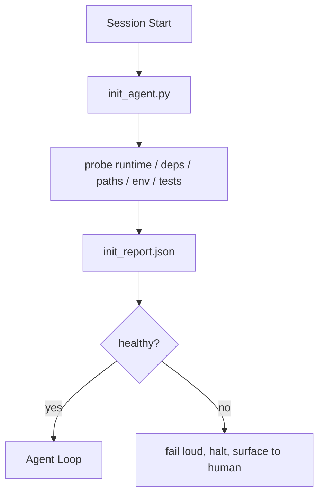

# Скрипты инициализации для агентов

> Каждая холодная сессия платит налог. Агент читает те же файлы, повторяет те же probes и заново находит те же paths. Init script платит этот налог один раз и записывает ответы в state.

**Тип:** Build
**Языки:** Python (stdlib)
**Предварительные требования:** Phase 14 · 32 (Minimal Workbench), Phase 14 · 34 (Repo Memory)
**Время:** ~45 минут

## Цели обучения

- Определить работу, которую агент не должен повторять в каждой сессии.
- Построить deterministic init script, который проверяет runtime, dependencies и repo health.
- Сохранять probe result, чтобы агент читал его вместо повторного запуска checks.
- Падать громко, быстро и с одним местом для диагностики, когда initialization fails.

## Проблема

Открывается сессия. Агент угадывает версию Python. Угадывает test command. Пять раз листит repo root, чтобы найти entry point. Пытается импортировать package, который не установлен. Спрашивает пользователя, где живет config file. К моменту настоящего edit десять тысяч tokens ушли на setup work, который должен был быть одним script.

Исправление — один initialization script, который запускается до любых действий агента и пишет `init_report.json`, читаемый агентом при startup.

## Концепция



### Что проверяет init script

| Probe | Why it matters |
|-------|----------------|
| Runtime versions | Неправильная версия Python или Node дает тихие wrong-version bugs |
| Dependency availability | Missing package позже стоит в десять раз дороже, чем поймать его сейчас |
| Test command | Агент должен знать, как verify; если команды нет, workbench сломан |
| Repo paths | Hard-coded paths drift; resolve them once and pin |
| Environment variables | Missing `OPENAI_API_KEY` — failure surface, а не runtime mystery |
| State + board freshness | Stale state после crashed session — footgun |
| Last-known-good commit | Anchor для handoff diff в конце session |

### Fail loud, fail fast, fail in one place

Probe failure означает halt и surface to human. Никакого "agent will figure it out". Весь смысл init — отказаться стартовать, когда workbench сломан.

### Idempotent

Запустите дважды подряд. Второй run должен быть no-op, кроме свежего timestamp. Idempotency позволяет подключать script к CI, hooks или pre-task slash command.

### Init против startup rules

Rules (Phase 14 · 33) описывают, что должно быть true для действия. Init — script, который устанавливает, что эти rules можно проверить. Rules без init превращаются в "be careful". Init без rules превращается в polished failure.

## Соберите это

`code/main.py` реализует `init_agent.py`:

- Пять probes: Python version, listed dependencies через `importlib.util.find_spec`, test command resolvability, required env vars, state file freshness.
- Каждый probe возвращает `(name, status, detail)`.
- Скрипт пишет `init_report.json` с полным probe set и выходит non-zero, если любой block-severity probe fails.

Запустите:

```
python3 code/main.py
```

Скрипт печатает таблицу probes, пишет `init_report.json` и выходит zero на happy path или non-zero со списком failed probes.

## Production-паттерны в реальной практике

Три паттерна отделяют полезный init script от церемонии.

**Last-known-good commit anchoring.** Проверяйте текущий commit против файла `LKG`, записанного при последнем successful merge. Если diff превышает budget (default 50 files), отказывайтесь стартовать и требуйте human ratify нового baseline. Именно так Cloudflare AI Code Review скоупит reviewer agents: каждая review session anchored против одного last-known-good и никогда не compounds drift между sessions.

**Lock files with TTL.** Пишите `prereqs.lock` после первого успешного probe pass. Последующие runs доверяют lock N часов (default 24h) и пропускают дорогие probes. Init script сначала читает lock; если он fresh и hash dependency manifest совпадает, он short-circuits. Это тот же паттерн, который Docker использует для layer caches: idempotent probe + content hash = skip.

**No network, no LLM, no surprises in the hot path.** Init probes — deterministic plumbing. Probe, который вызывает LLM для классификации failure или ходит во внешний service проверить license, — не probe, а workflow. Если probe в dry run занимает больше трех секунд, считайте это workbench smell и вынесите его из init или закешируйте result.

## Используйте это

В production:

- **Claude Code hooks.** `pre-task` hook вызывает init script и отказывается запускать agent, если он fails.
- **GitHub Actions.** Job `setup-agent` запускает init script; agent job зависит от него.
- **Docker entrypoint.** Agent container запускает init script перед exec agent runtime; logs surfaced on failure.

Init script переносим, потому что не делает calls к конкретному framework. Bash, Make или tasks file могут его оборачивать.

## Отгрузите это

`outputs/skill-init-script.md` интервьюирует проект, классифицирует setup work по probes и генерирует project-specific `init_agent.py` плюс CI workflow, который запускает его перед любым agent step.

## Упражнения

1. Добавьте probe, который diff текущего commit против last-known-good commit и отказывается стартовать, если изменилось больше 50 files.
2. Подключите script к записи `prereqs.lock` и отказывайтесь стартовать, если lock старше seven days.
3. Добавьте flag `--fix`, который auto-installs missing dev dependencies, но никогда не меняет runtime dependencies без approval.
4. Перенесите probes из hardcoded functions в YAML registry. Защитите trade-off.
5. Добавьте timing budget на probe. Probe, который работает дольше трех секунд, — workbench smell.

## Ключевые термины

| Термин | Как обычно говорят | Что это на самом деле означает |
|------|----------------|------------------------|
| Probe | "A check" | Deterministic function, возвращающая `(name, status, detail)` |
| Init report | "Setup output" | JSON, записанный рядом со state, с probe results |
| Idempotent | "Safe to re-run" | Два runs подряд дают identical reports modulo timestamp |
| Fail loud | "Don't swallow" | Halt и surface to human; no silent fallback |
| Setup tax | "Bootstrap cost" | Tokens, которые agent тратит per session на rediscovering obvious |

## Дополнительное чтение

- [Anthropic, Effective harnesses for long-running agents](https://www.anthropic.com/engineering/effective-harnesses-for-long-running-agents)
- [GitHub Actions, composite actions for setup](https://docs.github.com/en/actions/sharing-automations/creating-actions/creating-a-composite-action)
- [microservices.io, GenAI dev platform: guardrails](https://microservices.io/post/architecture/2026/03/09/genai-development-platform-part-1-development-guardrails.html) — pre-commit + CI checks as init
- [Augment Code, How to Build Your AGENTS.md (2026)](https://www.augmentcode.com/guides/how-to-build-agents-md) — init expectations
- [Codex Blog, Codex CLI Context Compaction](https://codex.danielvaughan.com/2026/03/31/codex-cli-context-compaction-architecture/) — session start as compaction-aware init
- Phase 14 · 33 — rule set, который включает этот script
- Phase 14 · 34 — state file, который этот script seeds
- Phase 14 · 38 — verification gate, который питается init script
- Phase 14 · 40 — handoff, который потребляет last-known-good из init report
