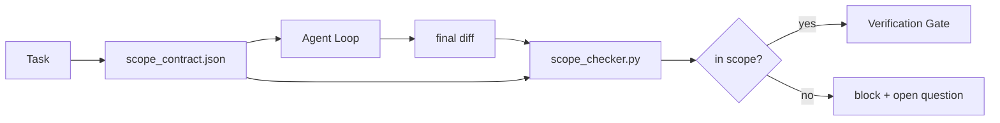

# Контракты области действия и границы задач

> Модель не знает, где заканчивается работа. Scope contract — это файл на задачу, который говорит, где работа начинается, где заканчивается и как откатиться, если она расползется. Contract превращает "stay in scope" из пожелания в check.

**Тип:** Build
**Языки:** Python (stdlib)
**Предварительные требования:** Phase 14 · 32 (Minimal Workbench), Phase 14 · 33 (Rules as Constraints)
**Время:** ~50 минут

## Цели обучения

- Написать scope contract, который агент читает в начале task, а verifier — в конце task.
- Указать allowed files, forbidden files, acceptance criteria, rollback plan и approval boundaries.
- Реализовать scope checker, который сравнивает diff с contract и отмечает violations.
- Сделать scope creep видимым, автоматическим и reviewable.

## Проблема

Агенты расползаются. Task звучит "fix the login bug". Diff трогает login route, email helper, database driver, README и release script. У каждого касания была правдоподобная причина в моменте. Вместе это уже другое изменение, не то, которое проходило review.

Scope creep — самый недомониторенный failure mode в agent work, потому что агент добросовестно объясняет каждый шаг. Исправление — не более строгий prompt. Исправление — contract на диске, где написано, что было обещано, и check, который сравнивает результат с обещанием.

## Концепция



### Что входит в scope contract

| Field | Purpose |
|-------|---------|
| `task_id` | Связывает с task на board |
| `goal` | Одно предложение, которое reviewer может verify |
| `allowed_files` | Globs, в которые agent может писать |
| `forbidden_files` | Globs, которые agent не должен трогать даже случайно |
| `acceptance_criteria` | Test commands или assertion lines, доказывающие done |
| `rollback_plan` | Один paragraph, который operator может выполнить, если нужен halt |
| `approvals_required` | Actions вне scope, которым нужен explicit human sign-off |

Contract без `forbidden_files` неполон. Негативное пространство — половина contract.

### Globs, а не raw paths

Настоящие repos перемещают files. Привязывайте contracts к globs (`app/**/*.py`, `tests/test_signup*.py`), чтобы refactor между sessions не invalidated contract.

### Rollback — часть scope

Перечисление rollback заставляет автора contract думать о том, что может пойти не так. Contract, из которого нельзя откатиться, не должен быть approved.

### Scope check — это diff check

Agent пишет diff. Checker читает diff, allowed globs, forbidden globs и список acceptance commands, которые запускались. Каждое violation — tagged finding, который verification gate может refuse.

## Соберите это

`code/main.py` реализует:

- Schema `scope_contract.json` (подмножество JSON Schema, glob arrays).
- Diff parser, который превращает список touched files плюс список run commands в `RunSummary`.
- `scope_check`, возвращающий `(violations, in_scope, off_scope)` против contract.
- Два demo runs: один остается in scope, другой creeps. Checker отмечает creep с точным file и reason.

Запустите:

```
python3 code/main.py
```

Вывод: contract, два runs, verdict по каждому run и сохраненный `scope_report.json`.

## Production-паттерны в реальной практике

Практик, запускавший "specsmaxxing" (scope contracts в YAML перед вызовом agent), сообщает: rabbit-hole rate упал с 52% до 21% за три недели без смены agent. Работу сделал contract, не model. Три паттерна закрепляют выигрыш.

**Violation budgets, а не binary failures.** `agent-guardrails` (OSS merge gate, используемый Claude Code, Cursor, Windsurf, Codex через MCP) поставляет `violationBudget` на task: minor scope slips внутри budget показываются как warnings; только при превышении budget merge gate refuses. Свяжите с `violationSeverity: "error" | "warning"`. Budget — разница между gate, который ship, и gate, который команда отключит, потому что он всем мешал.

**Severity asymmetry by path family.** Off-scope writes в `docs/**` обычно `warn`; off-scope writes в `scripts/**`, `migrations/**`, `config/prod/**` всегда `block`. Эта asymmetry должна жить в contract, а не runtime, потому что она project-specific и меняется по task.

**Time and network budgets рядом с file budgets.** Поле `time_budget_minutes` ограничивает wall clock; runtime отказывается продолжать после него без re-approval. Allowlist `network_egress` по hostnames не дает agent тихо обращаться к внешнему API, который не был частью task. Это тоже scope dimensions; file globs необходимы, но недостаточны.

**Multi-contract merge semantics (least privilege).** Когда применяются два scope contracts (например, project-wide и task-specific), merge такой: **intersect** `allowed_files` (оба contracts должны разрешать path), **union** `forbidden_files` (любой может запретить), `time_budget_minutes` — самый restrictive (min), `approvals_required` накапливаются. `network_egress` равен `None` для отсутствия enforcement, `[]` для deny-all, `[...]` как allowlist; при merge `None` уступает другой стороне, два lists пересекаются, deny-all остается deny-all. Зафиксируйте это в contract schema, чтобы merge был mechanical и reviewable.

## Используйте это

Production patterns:

- **Claude Code slash commands.** Команда `/scope` пишет contract и pins его как session context. Subagents читают contract перед действием.
- **GitHub PRs.** Поместите contract как JSON file в PR body или как checked-in artifact. CI запускает scope checker против merge diff.
- **LangGraph interrupts.** Scope violation вызывает interrupt; handler спрашивает человека, должен ли contract grow или agent back off.

Contract travels with the task. Когда task closes, contract архивируется в `outputs/scope/closed/`.

## Отгрузите это

`outputs/skill-scope-contract.md` генерирует scope contract для task description и glob-aware checker, который запускается в CI на каждом agent diff.

## Упражнения

1. Добавьте поле `network_egress` со списком allowed external hosts. Отказывайте runs, которые трогают другие hosts.
2. Расширьте checker: fail soft на `docs/**` и hard на `scripts/**`. Обоснуйте asymmetry.
3. Сделайте так, чтобы contract выводил `allowed_files` из поля `goal` через static rule set (no LLM). Что сломается на первом edge case?
4. Добавьте `time_budget_minutes` и отказывайтесь продолжать, когда wall clock его превышает.
5. Запустите два contracts против одного diff. Какая merge semantics правильна, когда применяются оба?

## Ключевые термины

| Термин | Как обычно говорят | Что это на самом деле означает |
|------|----------------|------------------------|
| Scope contract | "The task brief" | Per-task JSON со списком allowed/forbidden files, acceptance, rollback |
| Scope creep | "It also touched..." | Files outside the contract changed in the same task |
| Rollback plan | "We can revert" | One-paragraph operator runbook для halting |
| Approval boundary | "Needs sign-off" | Action, listed in the contract as requiring explicit human approval |
| Diff check | "Path audit" | Comparing touched files against the contract globs |

## Дополнительное чтение

- [LangGraph human-in-the-loop interrupts](https://langchain-ai.github.io/langgraph/concepts/human_in_the_loop/)
- [OpenAI Agents SDK tool approval policies](https://platform.openai.com/docs/guides/agents-sdk)
- [logi-cmd/agent-guardrails — merge gates and scope validation](https://github.com/logi-cmd/agent-guardrails) — violation budgets, severity tiers
- [Dev|Journal, Preventing AI Agent Configuration Drift with Agent Contract Testing](https://earezki.com/ai-news/2026-05-05-i-built-a-tiny-ci-tool-to-keep-ai-agent-configs-from-drifting-in-my-repo/) — `--strict` mode without external deps
- [Agentic Coding Is Not a Trap (production logs)](https://dev.to/jtorchia/agentic-coding-is-not-a-trap-i-answered-the-viral-hn-post-with-my-own-production-logs-33d9) — specsmaxxing receipts: 52% → 21%
- [OpenCode permission globs](https://opencode.ai/docs/agents/) — fine-grained per-permission scope
- [Knostic, AI Coding Agent Security: Threat Models and Protection Strategies](https://www.knostic.ai/blog/ai-coding-agent-security) — scope as part of least privilege
- [Augment Code, AI Spec Template](https://www.augmentcode.com/guides/ai-spec-template) — three-tier boundary system (must/ask/never)
- Фаза 14 · 27 — prompt injection defenses, которые pair with scope locks
- Phase 14 · 33 — rule set, который этот contract specializes per task
- Phase 14 · 38 — verification gate, куда reports checker
