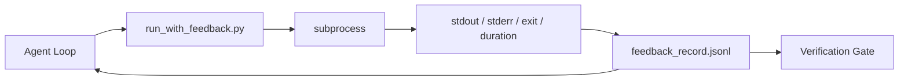

# Runtime feedback loops

> Агенты, которые не видят реальный command output, угадывают. Feedback runner захватывает stdout, stderr, exit code и timing в structured record, который следующий ход может прочитать. Тогда агент реагирует на факты, а не на собственное предсказание фактов.

**Тип:** Build
**Языки:** Python (stdlib)
**Предварительные требования:** Phase 14 · 32 (Minimal Workbench), Phase 14 · 35 (Init Script)
**Время:** ~50 минут

## Цели обучения

- Отличать runtime feedback от observability telemetry.
- Построить feedback runner, который оборачивает shell commands и сохраняет structured records.
- Детерминированно обрезать большие outputs, чтобы loop оставался в token budget.
- Отказываться продвигать loop, когда feedback отсутствует.

## Проблема

Агент говорит "running tests now". Следующее сообщение: "all tests pass". Реальность: ни один test не запускался. Агент вообразил output, или запустил command и не прочитал result, или прочитал result и тихо обрезал failure line.

Feedback runner убирает этот разрыв. Каждая command проходит через runner. Каждая record хранит command, captured stdout и stderr, exit code, wall-clock duration и one-line agent note. Агент читает record на следующем ходе. Verification gate читает records в конце task.

## Концепция



### Что входит в feedback record

| Field | Why it matters |
|-------|----------------|
| `command` | Exact argv, без shell expansion surprises |
| `stdout_tail` | Последние N lines, deterministic truncation |
| `stderr_tail` | Последние N lines, отдельно от stdout |
| `exit_code` | Однозначный success signal |
| `duration_ms` | Показывает slow probes и runaway processes |
| `started_at` | Timestamp для replay |
| `agent_note` | One line, которую agent пишет о том, чего ожидал |

### Truncation детерминирован

Лог на 50 MB разрушает loop. Runner обрезает head и tail с marker `...truncated N lines...`, детерминированно, чтобы один и тот же output всегда давал одну и ту же record. Никакого sampling; части, которые agent должен увидеть (final error, final summary), живут в tail.

### Feedback против telemetry

Telemetry (Phase 14 · 23, OTel GenAI conventions) — для human operators, которые review runs across time. Feedback — для следующего хода этого run. У них общие fields, но они живут в разных files с разным retention.

### Refuse to advance без feedback

Если runner ошибается до capture exit, record несет `exit_code: null` и `error: <reason>`. Agent loop должен отказаться claim success при `null` exit. Нет exit — нет progress.

## Соберите это

`code/main.py` реализует:

- `run_with_feedback(command, agent_note)`, который оборачивает `subprocess.run`, captures stdout/stderr/exit/duration, deterministically truncates, appends to `feedback_record.jsonl`.
- Маленький loader, который streams JSONL в Python list.
- Demo, который запускает три commands (success, failure, slow) и печатает last record per command.

Запустите:

```
python3 code/main.py
```

Вывод: три feedback records appended to `feedback_record.jsonl`, последняя по каждой command printed inline. Tail the file across re-runs, чтобы увидеть, как loop accumulates.

## Production-паттерны в реальной практике

Три паттерна укрепляют runner достаточно для shipping.

**Redact at write, not at read.** Любая record, которая touches stdout или stderr, может leak secrets. Runner выполняет redaction pass до JSONL append: strip lines matching `^Bearer `, `password=`, `api[_-]?key=`, `AKIA[0-9A-Z]{16}` (AWS), `xox[baprs]-` (Slack). Redaction at read time — foot-gun; file on disk — то, до чего доберется attacker. Аудируйте redaction patterns quarterly against observed secret formats production runtime.

**Rotation policy, а не single file.** Ограничьте `feedback_record.jsonl` размером 1 MB per file; при overflow rotate to `.1`, `.2`, drop `.5`. Agent loop читает только current file, поэтому runtime cost bounded. CI artifact storage получает full rotated set. Без rotation файл становится bottleneck при каждом loader call.

**Parent-command id for retry chains.** Каждая record получает `command_id`; retries несут `parent_command_id`, указывающий на previous attempt. Список "failed attempts" reviewer (Phase 14 · 40) и audit verification gate следуют по chain. Без этой связи retries выглядят как independent successes, и audit скрывает failure history.

## Используйте это

Production patterns:

- **Claude Code Bash tool.** Tool уже captures stdout, stderr, exit и duration. Runner в этом уроке — framework-agnostic equivalent для любого agent product.
- **LangGraph nodes.** Оборачивайте любой shell node в runner, чтобы record persisted outside graph state.
- **CI logs.** Pipe JSONL в CI artifact store; reviewers смогут replay любую command без rerunning session.

Runner — тонкая wrapper, которая переживает любую framework migration, потому что owns shape of the record.

## Отгрузите это

`outputs/skill-feedback-runner.md` генерирует project-specific `run_with_feedback.py` с правильным truncation budget, JSONL writer, wired to the workbench, и loader, который agent читает на каждом ходе.

## Упражнения

1. Добавьте поле `cwd` в каждую record, чтобы одну и ту же command из разных directories можно было различить.
2. Добавьте шаг `redaction`, который strips lines matching `^Bearer ` или `password=`. Test on a fixture record.
3. Ограничьте общий размер `feedback_record.jsonl` 1 MB, rotating to `.1`, `.2` files. Защитите rotation policy.
4. Добавьте `parent_command_id`, чтобы retry chains были видимы: какая command produced input, consumed by the next command.
5. Pipe JSONL в tiny TUI, который highlights latest non-zero exit. Восемь key features, которые TUI должен показывать, чтобы быть полезным на review.

## Ключевые термины

| Термин | Как обычно говорят | Что это на самом деле означает |
|------|----------------|------------------------|
| Feedback record | "Run log" | Structured JSONL entry with command, output, exit, duration |
| Tail truncation | "Trim the log" | Deterministic head+tail capture, чтобы records fit in token budget |
| Refuse-on-null | "Block on missing data" | Loop не должен advance, когда `exit_code` is null |
| Agent note | "Expectation tag" | One-line prediction, которую agent пишет перед чтением result |
| Telemetry split | "Two log files" | Feedback для next turn, telemetry для operator |

## Дополнительное чтение

- [OpenTelemetry GenAI semantic conventions](https://opentelemetry.io/docs/specs/semconv/gen-ai/)
- [Anthropic, Effective harnesses for long-running agents](https://www.anthropic.com/engineering/effective-harnesses-for-long-running-agents)
- [Guardrails AI x MLflow — deterministic safety, PII, quality validators](https://guardrailsai.com/blog/guardrails-mlflow) — redaction patterns as regression tests
- [Aport.io, Best AI Agent Guardrails 2026: Pre-Action Authorization Compared](https://aport.io/blog/best-ai-agent-guardrails-2026-pre-action-authorization-compared/) — pre/post-tool capture
- [Andrii Furmanets, AI Agents in 2026: Practical Architecture for Tools, Memory, Evals, Guardrails](https://andriifurmanets.com/blogs/ai-agents-2026-practical-architecture-tools-memory-evals-guardrails) — observability surfaces
- Phase 14 · 23 — OTel GenAI conventions for the telemetry side
- Phase 14 · 24 — agent observability platforms (Langfuse, Phoenix, Opik)
- Phase 14 · 33 — rule, demanding feedback before declaring done
- Phase 14 · 38 — verification gate, читающий JSONL
