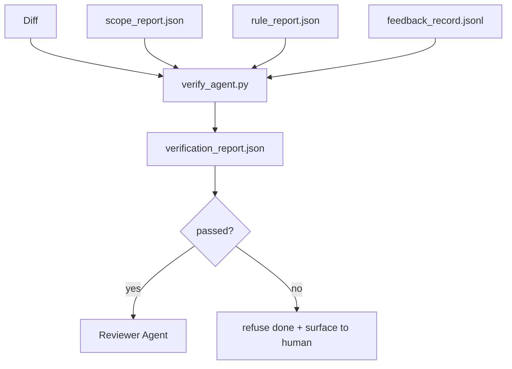

# Verification gates

> Агент не получает права сам помечать свою работу как done. Verification gate читает scope contract, feedback log, rule report и diff и отвечает на один вопрос: эта задача действительно завершена? Если gate говорит no, задача не done, независимо от того, что сказано в chat.

**Тип:** Build
**Языки:** Python (stdlib)
**Предварительные требования:** Phase 14 · 33 (Rules), Phase 14 · 36 (Scope), Phase 14 · 37 (Feedback)
**Время:** ~55 минут

## Цели обучения

- Определить verification gate как deterministic function над workbench artifacts.
- Объединить rule report, scope report, feedback records и diff в единый verdict.
- Выпустить `verification_report.json`, который могут читать и reviewer agent, и CI.
- Отказываться продвигать task при любом block-severity failure, без исключений.

## Проблема

Агенты слишком легко объявляют success. Доминируют три формы failure:

- "Looks good." Модель прочитала собственный diff и решила, что он correct.
- "Tests passed." Сказано уверенно. Нет record, что test действительно запускался.
- "Acceptance met." Acceptance criteria интерпретированы настолько свободно, что означают "anything resembling done."

Исправление воркбенча — единый verification gate, который читает artifacts, уже produced by agent, и принимает решение. Gate deterministic. Gate in version control. Gate wired into CI. Agent cannot bribe it.

## Концепция



### Что проверяет gate

| Check | Source artifact | Severity |
|-------|-----------------|----------|
| All acceptance commands ran | `feedback_record.jsonl` | block |
| All acceptance commands exited zero | `feedback_record.jsonl` | block |
| Scope check has no forbidden writes | `scope_report.json` | block |
| Scope check has no off-scope writes | `scope_report.json` | block or warn |
| All block-severity rules pass | `rule_report.json` | block |
| No `null` exit codes in feedback | `feedback_record.jsonl` | block |
| Touched files match `scope.allowed_files` | both | warn |

Finding `warn` аннотирует verdict; finding `block` не дает `passed: true`.

### Deterministic, not probabilistic

Gate должен выдавать один и тот же verdict для одного и того же artifact set каждый раз. Никаких LLM judges. LLM judges относятся к reviewer side (Phase 14 · 39), где цель — qualitative evaluation, а не status.

### One report, one path

Gate выпускает один `verification_report.json` на task close-out, записанный в `outputs/verification/<task_id>.json`. CI потребляет тот же path. Multiple gates with different paths fork the source of truth.

### Refuse without exception

Block-severity findings не могут быть overridden агентом. Их может override только human, с записанными `override_reason` и `overridden_by` user id. Override — signed change, не agent decision.

## Соберите это

`code/main.py` реализует:

- Loader для каждого input artifact, все stubbed locally, чтобы lesson был self-contained.
- Pure function `verify(task_id, artifacts) -> VerdictReport`.
- Printer, показывающий per-check results и final pass/fail.
- Demo с тремя task scenarios: clean pass, scope creep, missing acceptance.

Запустите:

```
python3 code/main.py
```

Вывод: три verdict reports, каждый сохранен рядом со script.

## Production-паттерны в реальной практике

Четыре паттерна поднимают gate с "another lint job" до "deciding edge".

**Defense-in-depth, not single gate.** Pre-commit hook → CI status check → pre-tool authz hook → pre-merge gate. Каждый layer deterministic, поэтому failure в одном layer ловится следующим. Playbook microservices.io за март 2026 explicit: pre-commit hook non-bypassable, потому что, unlike model-side skill, не зависит от того, следует ли agent instructions. Verification gate сидит на CI / pre-merge layer.

**Defense by deterministic check, model-judge only for nuance.** Anthropic Hybrid Norm 2026: verifiable rewards (unit tests, schema checks, exit codes) отвечают "did the code solve the problem?" — LLM rubrics отвечают "is the code readable, secure, on-style?" Gate запускает первый класс; reviewer (Phase 14 · 39) запускает второй. Смешивание collapsing signal.

**Signed override log, not Slack threads.** Каждый override пишет строку в `outputs/verification/overrides.jsonl`: timestamp, finding code, reason, signing user, current HEAD commit. Runtime refuses any override без signature; audit trail git-tracked. Это граница между override policy и override theater.

**Coverage floor as a first-class check.** `coverage_report.json` питает check `coverage_floor` (default 80%). Gate fails, если measured coverage падает ниже floor или ниже previous merge floor больше чем на 1 percentage point. Без этого check agents тихо delete tests that fail, а verification reports остаются green.

**`--strict` mode promotes warns to blocks.** Для release branches, ship-blocking PRs или post-incident triage `--strict` делает каждый warning hard fail. Flag opt-in by branch; не global default, потому что strict-on-everything corrodes day-to-day flow.

## Используйте это

Production patterns:

- **CI step.** Job `verify_agent` запускает gate против final artifacts агента. Merge protection refuses без `passed: true`.
- **Pre-handoff hook.** Agent runtime вызывает gate перед генерацией handoff doc. Нет green verdict — нет handoff.
- **Manual triage.** Operators читают report, когда agent claims success, а human suspects it.

Gate — deciding edge в workbench flow. Every other surface is upstream of it.

## Отгрузите это

`outputs/skill-verification-gate.md` подключает gate к конкретному проекту: какие acceptance commands feed it, какие rules are block-severity, какие off-scope writes tolerated, как хранится override audit log.

## Упражнения

1. Добавьте check `coverage_floor`: test command должна produce coverage report не ниже 80%. Решите, какой artifact carries the floor.
2. Поддержите mode `--strict`, который promotes every `warn` to `block`. Document cases, где strict mode — правильный default.
3. Сделайте так, чтобы gate producing Markdown summary in addition to JSON. Защитите, какие fields belong in the summary.
4. Добавьте check `time_since_last_human_touch`: любой file edited within 60 seconds of human keystroke exempt from off-scope flags.
5. Запустите gate на real agent diff из вашего product. Сколько findings real и сколько noise? Где gate needs to grow?

## Ключевые термины

| Термин | Как обычно говорят | Что это на самом деле означает |
|------|----------------|------------------------|
| Verification gate | "The check that stops things" | Deterministic function over workbench artifacts producing pass/fail verdict |
| Block severity | "Hard fail" | Finding, который prevents `passed: true` and requires signed override |
| Override log | "Why we let it through" | Signed entries with reason and user id, audited by review |
| Acceptance command | "The proof" | Shell command whose zero exit is what `done` means |
| One report path | "Source of truth" | `outputs/verification/<task_id>.json`, consumed by CI and humans alike |

## Дополнительное чтение

- [Anthropic, Harness design for long-running application development](https://www.anthropic.com/engineering/harness-design-long-running-apps)
- [OpenAI Agents SDK guardrails](https://platform.openai.com/docs/guides/agents-sdk/guardrails)
- [microservices.io, GenAI dev platform: guardrails](https://microservices.io/post/architecture/2026/03/09/genai-development-platform-part-1-development-guardrails.html) — defense in depth between pre-commit and CI
- [ICMD, The 2026 Playbook for Agentic AI Ops](https://icmd.app/article/the-2026-playbook-for-agentic-ai-ops-guardrails-costs-and-reliability-at-scale-1776661990431) — approval-gate ladder (draft → approval → auto under thresholds)
- [Type-Checked Compliance: Deterministic Guardrails (arXiv 2604.01483)](https://arxiv.org/pdf/2604.01483) — Lean 4 as upper bound of deterministic gating
- [logi-cmd/agent-guardrails — merge gate spec](https://github.com/logi-cmd/agent-guardrails) — scope + mutation-testing gates
- [Guardrails AI x MLflow](https://guardrailsai.com/blog/guardrails-mlflow) — deterministic validators as CI scorers
- [Akira, Real-Time Guardrails for Agentic Systems](https://www.akira.ai/blog/real-time-guardrails-agentic-systems) — pre/post-tool gates
- Phase 14 · 27 — prompt injection defenses (adversarial pair gate)
- Phase 14 · 36 — scope contract, который gate enforces
- Phase 14 · 37 — feedback log, который gate scores
- Phase 14 · 39 — reviewer agent, которому gate hands off
