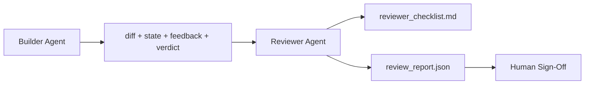

# Reviewer agent: отделите builder от marker

> Агент, который написал код, не может его оценивать. Reviewer — это второй loop с другим system prompt, другой целью и read-only доступом ко всему, что produced builder. Разрыв между builder и reviewer — место, где живет большая часть надежности.

**Тип:** Build
**Языки:** Python (stdlib)
**Предварительные требования:** Phase 14 · 38 (Verification Gate)
**Время:** ~55 минут

## Цели обучения

- Объяснить, почему тот же агент не может надежно review собственную работу.
- Построить reviewer agent loop, который потребляет builder artifacts и emits structured review report.
- Написать reviewer rubric, который оценивает конкретные dimensions, а не vibes.
- Подключить reviewer к workbench, чтобы human review step начинался с реального artifact.

## Проблема

Вы просите агента fix a bug. Он редактирует четыре files, запускает tests и reports done. Verification gate (Phase 14 · 38) подтверждает, что acceptance ran и scope held. Gate говорит `passed: true`. Вы merge. Через два дня выясняется, что fix решил не ту половину bug.

Acceptance необходим, но недостаточен. Reviewer задает вопросы, которые acceptance задать не может: решило ли это правильную проблему? Расширило ли scope без flagging? Задокументировало ли assumptions, которые надо было question? Оставило ли workbench в состоянии, которое next session can pick up?

## Концепция



### Reviewer rubric

Пять измерений, каждое оценивается от 0 до 2.

| Измерение | Вопрос |
|-----------|----------|
| Problem fit | Решило ли изменение задачу как сформулировано, а не соседнюю задачу? |
| Scope discipline | Остались ли правки в рамках контракта или контракт был осознанно расширен? |
| Assumptions | Записаны ли все скрытые допущения там, где их можно проверить? |
| Verification quality | Действительно ли acceptance command доказывает цель или только более слабую версию? |
| Handoff readiness | Сможет ли следующая сессия чисто продолжить с текущего состояния? |

Итого из 10. Запуск ниже 7 — soft fail; ниже 5 — hard fail.

### Reviewer — отдельная роль, не обязательно отдельная модель

Reviewer можно запускать на той же модели, что и builder. Дисциплина — в разделении ролей: другой system prompt, другие входы, без доступа на запись к diff. Смена позиции и есть смена сигнала.

### Reviewer не редактирует diff

Reviewer читает diff, state, feedback, verdict. Он пишет report. Он не патчит diff. Если report говорит "fix this", следующий ход builder делает fix; reviewer возвращается к reviewing. Смешивание ролей уничтожает разрыв между ними.

### Reviewer rubric против verification gate

Gate (Фаза 14 · 38) проверяет детерминированные факты: запускалась ли acceptance-команда, прошли ли rules, удержался ли scope. Reviewer делает качественные суждения: была ли это правильная работа, задокументирована ли она, пригоден ли handoff. Нужны оба.

## Соберите это

`code/main.py` реализует:

- Dataclass `ReviewerInputs`, объединяющий artifacts, которые читает reviewer.
- Rubric scorer с одной функцией на измерение. Каждая функция детерминирована и stub-grade для урока; реальные реализации вызывали бы LLM.
- Writer `review_report.json` с пятью score, total и verdict (`pass`, `soft_fail`, `hard_fail`).
- Два demo cases: clean change и "right tests, wrong problem" change.

Запустите:

```
python3 code/main.py
```

Вывод: два review reports, записанных на диск, и console table с оценками по измерениям.

## Production-паттерны в реальной практике

Receipts: система Cloudflare AI Code Review в апреле 2026 выполнила 131,246 review runs по 48,095 merge requests в 5,169 repos за 30 дней. Медианный review завершался за 3 минуты 39 секунд. До семи specialist reviewers (security, performance, code quality, docs, release management, compliance, Engineering Codex) работали параллельно под Review Coordinator, который дедуплицировал findings и оценивал severity. Top-tier model была зарезервирована только для coordinator; specialists работали на более дешевых tiers.

Четыре паттерна масштабируют это.

**Specialist pool, а не one big reviewer.** Один reviewer с 5-dimension rubric подходит для solo repos. Когда codebase имеет security-critical, performance-critical и docs surfaces, разделите его на specialists с более короткими prompts. Coordinator делает deduplication; specialists никогда не запускают полную rubric. Отсюда следует model-tier separation: дешевые specialists, дорогой coordinator.

**Bias mitigation как design requirement, не optimization.** LLM judges показывают четыре устойчивых biases (Adnan Masood, April 2026): position bias (GPT-4 ~40% inconsistent on (A,B) vs (B,A) ordering), verbosity bias (~15% score inflation toward longer outputs), self-preference (judges prefer outputs from same model family), authority (judges over-rate references to known authors). Mitigations: evaluate both orderings and only count consistent wins; use 1-4 scales that explicitly reward conciseness; rotate judges across model families; strip author names before scoring.

**Calibration set, not vibes.** Historical set из 10-20 tasks с known correct verdicts. Запускайте reviewer на нем при каждом prompt change. Если agreement с historical record падает ниже 80%, rubric needs revision before reviewer ships. Каждая team eventually rediscover this; лучше начать с этого.

**Hybrid norm with the gate.** Verification gate (Фаза 14 · 38) handles deterministic checks: запускалась ли acceptance, прошли ли tests, удержался ли scope. Reviewer handles semantic checks: была ли это правильная работа, задокументированы ли assumptions, usable ли handoff. Anthropic guidance 2026 прямо указывает на это разделение: не просите reviewer заново доказывать то, что уже доказал gate.

## Используйте это

Production patterns:

- **Claude Code subagents.** Reviewer subagent запускается после того, как builder закрывает task. Он posts comment on PR with rubric scores.
- **OpenAI Agents SDK handoffs.** Builder передает работу Reviewer после completion. Reviewer может вернуть ее назад with findings или поднять к human.
- **Two-model pairing.** Builder работает на более быстрой и дешевой model. Reviewer работает на более сильной model с меньшим context, сфокусированным на judgment.

Reviewer — вторая пара глаз, которую workbench grows, когда humans не могут делать каждый review сами.

## Отгрузите это

`outputs/skill-reviewer-agent.md` генерирует project-specific reviewer rubric, stub reviewer agent, подключение к builder artifacts и integration with verification gate, чтобы human review начинался с written report вместо blank page.

## Упражнения

1. Добавьте sixth dimension, specific to your product domain. Защитите, почему она не поглощается существующими five.
2. Запустите reviewer с двумя разными system prompts (terse, verbose). Какой produces report, который human с большей вероятностью прочитает?
3. Добавьте поле `confidence` per dimension. Отказывайтесь ship report, когда confidence in lowest dimension below 0.6.
4. Соберите calibration set: 10 historical task close-outs with known correct verdicts. Запустите по ним reviewer. Где он расходится с historical record?
5. Добавьте affordance "request more evidence": reviewer может попросить builder о specific test run before scoring. Какой back-off нужен, чтобы это не зациклилось?

## Ключевые термины

| Термин | Как обычно говорят | Что это на самом деле означает |
|------|----------------|------------------------|
| Reviewer rubric | "Checklist" | Five-dimension scoring 0-2 с written question per dimension |
| Soft fail | "Needs revisions" | Total below 7; builder получает findings для исправления |
| Hard fail | "Reject" | Total below 5 or any dimension at 0; halt and surface to human |
| Role separation | "Different prompt" | Та же model может быть в обеих roles; дисциплина находится во входах и posture |
| Confidence floor | "Don't ship low-signal reports" | Отказ emit verdict, когда rubric неуверенна |

## Дополнительное чтение

- [OpenAI Agents SDK handoffs](https://platform.openai.com/docs/guides/agents-sdk/handoffs)
- [Anthropic Claude Code subagents](https://docs.anthropic.com/en/docs/agents-and-tools/claude-code/sub-agents)
- [Cloudflare, Orchestrating AI Code Review at Scale](https://blog.cloudflare.com/ai-code-review/) — 7-specialist + coordinator architecture, 131k runs / 30 days
- [Agent-as-a-Judge: Evaluating Agents with Agents (OpenReview / ICLR)](https://openreview.net/forum?id=DeVm3YUnpj) — DevAI benchmark, 366 hierarchical solution requirements
- [Adnan Masood, Rubric-Based Evaluations and LLM-as-a-Judge: Methodologies, Biases, Empirical Validation](https://medium.com/@adnanmasood/rubric-based-evals-llm-as-a-judge-methodologies-and-empirical-validation-in-domain-context-71936b989e80) — 4 biases and mitigations
- [MLflow, LLM-as-a-Judge Evaluation](https://mlflow.org/llm-as-a-judge) — production tooling for separated builder/evaluator
- [LangChain, How to Calibrate LLM-as-a-Judge with Human Corrections](https://www.langchain.com/articles/llm-as-a-judge) — calibration-set workflow
- [Evidently AI, LLM-as-a-judge: a complete guide](https://www.evidentlyai.com/llm-guide/llm-as-a-judge)
- [Arize, LLM as a Judge — Primer and Pre-Built Evaluators](https://arize.com/llm-as-a-judge/)
- Phase 14 · 05 — Self-Refine and CRITIC (single-agent self-review baseline)
- Phase 14 · 30 — Eval-driven agent development (calibration set generator)
- Phase 14 · 38 — verification gate, который reviewer reads
- Phase 14 · 40 — handoff packet, который feeds reviewer report
