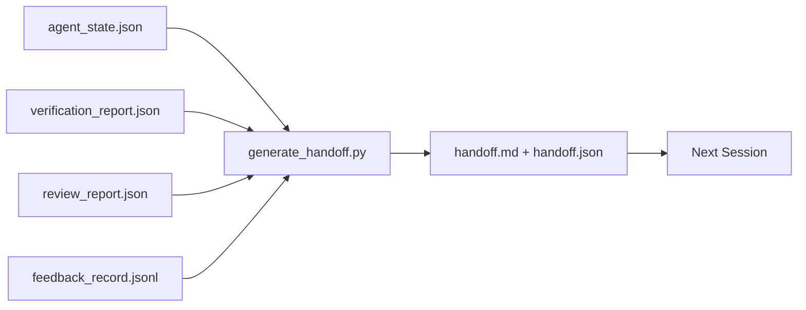

# Multi-session handoff

> Сессия закончится. Работа — нет. Handoff packet — artifact, который превращает "агент работал час" в "следующая сессия продуктивна с первой минуты". Стройте его намеренно, а не как afterthought.

**Тип:** Build
**Языки:** Python (stdlib)
**Предварительные требования:** Phase 14 · 34 (Repo Memory), Phase 14 · 38 (Verification), Phase 14 · 39 (Reviewer)
**Время:** ~50 минут

## Цели обучения

- Определить семь fields, нужных каждому handoff packet.
- Генерировать handoff из workbench artifacts без ручного prose.
- Обрезать большие feedback logs до handoff-sized summary.
- Сделать первое действие следующей сессии deterministic.

## Проблема

Сессия заканчивается. Агент говорит "great, we made progress." Открывается следующая сессия. Следующий агент спрашивает "where did we leave off?" Ответ первого агента исчез. Следующий агент rediscover, re-runs те же commands, re-asks human those same questions и сжигает тридцать минут на восстановление последних тридцати секунд предыдущей сессии.

Цена плохого handoff платится каждую сессию на протяжении жизни task. Исправление — packet, generated automatically at session end: what changed, why, what was tried, what failed, what is left, what to do first next time.

## Концепция



### Семь полей каждого handoff

| Field | Question it answers |
|-------|---------------------|
| `summary` | One paragraph of what was done |
| `changed_files` | Diff at a glance |
| `commands_run` | What was actually executed |
| `failed_attempts` | What was tried and why it did not work |
| `open_risks` | What could bite next session, with severity |
| `next_action` | First concrete step next session takes |
| `verdict_pointer` | Path to verification + review reports |

Поле `next_action` — load-bearing. Handoff со всем, кроме `next_action`, — status report, не handoff.

### Handoffs generated, not written

Ручной handoff — handoff, который пропускают в тяжелый день. Generator читает workbench artifacts и emits packet. Задача агента — оставить workbench в состоянии, которое generator can summarize, а не писать summary.

### Две формы: human-readable и machine-readable

`handoff.md` читает human. `handoff.json` загружает следующий agent. Оба происходят из одних source artifacts. Если они расходятся, JSON wins.

### Feedback log trimming

Полный `feedback_record.jsonl` может содержать сотни entries. Handoff несет только last K плюс каждую entry с non-zero exit. Следующая session загружает full log при необходимости, но packet остается small.

## Соберите это

`code/main.py` реализует:

- Loader, который gathers state, verdict, review и feedback в один `WorkbenchSnapshot`.
- Function `generate_handoff(snapshot) -> (markdown, payload)`.
- Filter, который выбирает last K feedback entries plus all non-zero exits.
- Demo run, который пишет `handoff.md` и `handoff.json` рядом со script.

Запустите:

```
python3 code/main.py
```

Вывод: printed handoff body плюс оба files on disk.

## Production-паттерны в реальной практике

Codex CLI, Claude Code и OpenCode поставляют разные compaction stories; structured handoff packet сидит поверх всех трех.

**Compaction strategies vary; packet schema does not.** Codex CLI POST /v1/responses/compact — server-side opaque AES blob (fast path for OpenAI models); fallback — local "handoff summary", appended as `_summary` user-role message. Claude Code runs five-stage progressive compaction at 95% of context. OpenCode делает timestamp-based message hiding плюс 5-heading LLM summary. Три разных механизма, одна потребность: serialize what survives compression into portable artifact. Packet — этот artifact.

**Fresh-session handoff is not compaction.** Compaction extends a session; handoff cleanly closes one and starts the next. Формулировка Hermes Issue #20372 (April 2026) правильна: когда in-place compression начинает degrading, agent должен write compact handoff, end session и resume in fresh context. Packet делает этот transition дешевым. Ошибка — keep compressing until quality collapses; fix — budget for early, clean handoff.

**One active handoff per branch and topic.** Multi-agent coordination breaks down on stale handoffs more than bad model output. Всегда включайте `branch`, `last_known_good_commit` и `status` of `active | superseded | archived`. Stale handoffs archived; only active one drives next session. Это разница между handoff-as-notes и handoff-as-state.

**Wrap up before 50-75% context, not at the wall.** Playbook для hand-written pattern (CLAUDE.md + HANDOVER.md) сообщает лучшие результаты, когда session ends at 50-75% context budget вместо 95%. Packet generator runs cleanly до того, как compression artifacts загрязнят source state. Дешево писать, пока context intact; дорого, когда model already losing its place.

## Используйте это

Production patterns:

- **Session-end hook.** Runtime запускает generator, когда user closes chat. Packet попадает в `outputs/handoff/<session_id>/`.
- **PR template.** Markdown generator также становится PR body. Reviewers читают его, не открывая five other files.
- **Cross-agent handoff.** Сборка в одном product (Claude Code), продолжение в другом (Codex). Packet — lingua franca.

Packet маленький, регулярный и дешевый в производстве. Экономия cost compounds with every session.

## Отгрузите это

`outputs/skill-handoff-generator.md` создает generator, настроенный на artifact paths проекта, end-of-session hook для его запуска и schema `handoff.json`, которую next agent reads on startup.

## Упражнения

1. Добавьте поле `assumptions_to_validate`, которое surfaces every assumption, записанное builder, но не оцененное reviewer выше 1.
2. Обрезайте feedback summary по-разному для failing runs и passing runs. Защитите asymmetry.
3. Включите список "questions for the human". Какой threshold нужен вопросу, чтобы попасть в packet, а не chat message?
4. Сделайте generator idempotent: running it twice produces same packet. Что должно быть stable?
5. Добавьте section "next session prereqs", listing exactly artifacts, которые next session must load before acting.

## Ключевые термины

| Термин | Как обычно говорят | Что это на самом деле означает |
|------|----------------|------------------------|
| Handoff packet | "Session summary" | Generated artifact с семью полями, both markdown and JSON |
| Next action | "What to do first" | Один конкретный step, с которого starts next session |
| Feedback trim | "Log summary" | Последние K records плюс каждый non-zero exit |
| Status report | "What we did" | Документ без `next_action`; полезен, но не handoff |
| Verdict pointer | "Receipt" | Path к verification + review reports для traceability |

## Дополнительное чтение

- [Anthropic, Effective harnesses for long-running agents](https://www.anthropic.com/engineering/effective-harnesses-for-long-running-agents)
- [OpenAI Agents SDK handoffs](https://platform.openai.com/docs/guides/agents-sdk/handoffs)
- [Codex Blog, Codex CLI Context Compaction: Architecture, Configuration, Managing Long Sessions](https://codex.danielvaughan.com/2026/03/31/codex-cli-context-compaction-architecture/) — POST /v1/responses/compact and local fallback
- [Justin3go, Shedding Heavy Memories: Context Compaction in Codex, Claude Code, OpenCode](https://justin3go.com/en/posts/2026/04/09-context-compaction-in-codex-claude-code-and-opencode) — three-vendor compaction comparison
- [JD Hodges, Claude Handoff Prompt: How to Keep Context Across Sessions (2026)](https://www.jdhodges.com/blog/ai-session-handoffs-keep-context-across-conversations/) — CLAUDE.md + HANDOVER.md, 50-75% context budget
- [Mervin Praison, Managing Handoffs in Multi-Agent Coding Sessions: Fresh Context Without Losing Continuity](https://mer.vin/2026/04/managing-handoffs-in-multi-agent-coding-sessions-fresh-context-without-losing-continuity/) — distributed-systems framing
- [Hermes Issue #20372 — automatic fresh-session handoff when compression becomes risky](https://github.com/NousResearch/hermes-agent/issues/20372)
- [Hermes Issue #499 — Context Compaction Quality Overhaul](https://github.com/NousResearch/hermes-agent/issues/499) — handoff-oriented prompts in Codex CLI
- [Microsoft Agent Framework, Compaction](https://learn.microsoft.com/en-us/agent-framework/agents/conversations/compaction)
- [OpenCode, Context Management and Compaction](https://deepwiki.com/sst/opencode/2.4-context-management-and-compaction)
- [LangChain, Context Engineering for Agents](https://www.langchain.com/blog/context-engineering-for-agents)
- Phase 14 · 34 — state file, который generator reads
- Phase 14 · 38 — verification verdict, на который packet points
- Phase 14 · 39 — reviewer report bundled into packet
