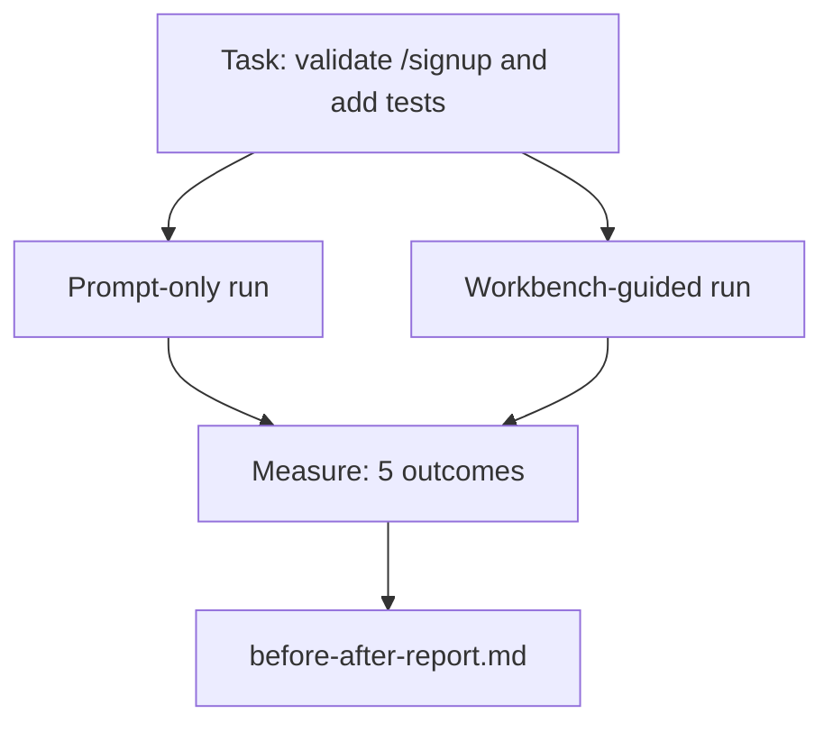

# Воркбенч на реальном репозитории

> Одиннадцать уроков surfaces ничего не стоят, если они не переживают контакт с реальным codebase. Этот урок запускает одну и ту же task дважды на маленьком sample app: prompt-only versus workbench-guided. Цифры спорят сами.

**Тип:** Build
**Языки:** Python (stdlib)
**Предварительные требования:** Phases 14 · 32 to 14 · 40
**Время:** ~60 минут

## Цели обучения

- Собрать семь workbench surfaces на небольшом application.
- Запустить одну task дважды (prompt-only и workbench-guided) и измерить пять outcomes.
- Прочитать before/after report и решить, какие surfaces дали больше всего leverage.
- Защитить workbench от возражения "but my model is good enough".

## Проблема

Demo на toy task никого не убеждает. Аргумент за workbench появляется, когда real-feeling task на real-feeling repo попадает в production с меньшим числом failures, меньшим числом reverts и packet, который next session can use.

Этот урок поставляет такой real-feeling repo и прогоняет одну task через оба pipelines. Result — before/after report, который можно отдать skeptic.

## Концепция



### Sample app

Минимальный FastAPI-style handler в `sample_app/`:

- `app.py` with `/signup` (no validation yet).
- `test_app.py` with one happy-path test.
- `README.md` и `scripts/release.sh` как forbidden-zone bait.

### Task

> Add input validation to `/signup`: reject passwords shorter than 8 characters, return 422 with a typed error envelope. Add a test that proves the new behavior.

### Два pipelines

Prompt-only:

1. Read the README.
2. Read `app.py`.
3. Edit files.
4. Claim done.

Workbench-guided:

1. Run init script (Lesson 35).
2. Read scope contract (Lesson 36).
3. Read state (Lesson 34).
4. Edit allowed files only.
5. Run acceptance command via feedback runner (Lesson 37).
6. Run verification gate (Lesson 38).
7. Run reviewer (Lesson 39).
8. Generate handoff (Lesson 40).

### Пять измеряемых outcomes

| Outcome | Why it matters |
|---------|----------------|
| `tests_actually_run` | Большинство claims "tests passed" unverifiable |
| `acceptance_met` | Test, доказывающий goal, должен быть именно тем test, который ran |
| `files_outside_scope` | Scope creep — dominant silent failure |
| `handoff_quality` | Next session pays for or benefits from this |
| `reviewer_total` | Qualitative judgment on top of gate |

## Соберите это

`code/main.py` orchestrates два pipelines against the same sample app fixture. Оба pipelines scripted (no LLM in the loop), поэтому measurement reproducible. Script writes comparison into `before-after-report.md` and `comparison.json`.

Запустите:

```
python3 code/main.py
```

Вывод: console table of outcomes per pipeline, markdown report saved next to script, and JSON for whoever wants to chart it.

## Production-паттерны в реальной практике

Вопрос skeptic: "how much does the workbench actually help?" Цифры 2026 отвечают: намного лучше, чем объяснение.

**Terminal Bench: с top-30 до top-5 на той же модели.** LangChain *Anatomy of an Agent Harness* (апрель 2026): coding agent поднялся с позиции вне top 30 до rank five на Terminal Bench 2.0, изменив только harness. Та же model. Другие surfaces. Разница в двадцать пять позиций.

**Vercel: с 80% до 100% через удаление tools.** Vercel reported, что удаление 80% agent tools подняло success rate с 80% до 100%. Меньшая tool surface, более четкий scope, меньше способов fail. Negative space wins.

**Harvey: 2x accuracy только через harness.** Legal agents more than doubled accuracy through harness optimization, без смены model.

**88% enterprise AI agent projects не доходят до production.** Paper preprints.org *Harness Engineering for Language Agents* (март 2026) связывает failures с runtime, а не reasoning: stale state, brittle retries, overgrown context, плохое восстановление после intermediate mistakes.

**Long-context collapse.** WebAgent baseline 40-50% success drops to under 10% in long-context conditions, mostly from infinite loops and goal loss. Ralph Loop и handoff packet существуют, чтобы absorb that.

**False negatives still exist.** Single-step factual tasks, one-line lints, formatter runs, все, что model memorized verbatim, быстрее выполняется prompt-only. Benchmark should enumerate them honestly, чтобы workbench не выглядел overkill.

Вывод не в том, что "harness wins forever." Models со временем absorb harness tricks. Вывод: today engineering load sits in seven surfaces, and numbers prove it.

## Используйте это

Этот урок — case file, на который вы ссылаетесь, когда:

- Кто-то спрашивает, почему каждый PR несет `agent-rules.md` и scope contract.
- Team wants to drop verification gate "just for this sprint."
- Запускается новый agent product, и вам нужен portable benchmark, показывающий, экономит ли он время на самом деле.

Numbers travel дальше explanation.

## Отгрузите это

`outputs/skill-workbench-benchmark.md` — portable evaluation harness, который прогоняет любой agent product через оба pipelines на sample app проекта и reports five outcomes.

## Упражнения

1. Добавьте sixth outcome: time-to-first-meaningful-edit. Как измерить это cleanly?
2. Запустите comparison на real second-day task в вашем codebase. Где workbench numbers slip?
3. Добавьте "false negative" pass: tasks, где prompt-only был бы быстрее, а workbench overhead — реальная cost. Защитите сохранение workbench anyway.
4. Замените scripted "agent" на real LLM call. Какие outcomes станут шумнее?
5. Напишите one-page summary aimed at non-engineer. Что переживет сокращение?

## Ключевые термины

| Термин | Как обычно говорят | Что это на самом деле означает |
|------|----------------|------------------------|
| Sample app | "Toy repo" | Маленький, но достаточно реалистичный repo, чтобы задействовать все семь surfaces |
| Pipeline | "Workflow" | Упорядоченная sequence чтений/записей surfaces, которой следует agent |
| Before/after report | "The receipts" | Artifact, который вы отдаете skeptic |
| False negative | "Workbench overkill" | Tasks, где prompt-only быстрее; полезно честно перечислять |
| Workbench benchmark | "Reliability score" | Portable harness, который запускает comparison на вашей codebase |

## Дополнительное чтение

- [LangChain, The Anatomy of an Agent Harness](https://blog.langchain.com/the-anatomy-of-an-agent-harness/) — receipt Terminal Bench Top-30 to Top-5
- [MongoDB, The Agent Harness: Why the LLM Is the Smallest Part of Your Agent System](https://www.mongodb.com/company/blog/technical/agent-harness-why-llm-is-smallest-part-of-your-agent-system) — числа Vercel + Harvey
- [preprints.org, Harness Engineering for Language Agents](https://www.preprints.org/manuscript/202603.1756) — 88% enterprise failure rate, runtime root causes
- [HN: Improving 15 LLMs at Coding in One Afternoon. Only the Harness Changed](https://news.ycombinator.com/item?id=46988596) — репликация на 15 models
- [Cloudflare, Orchestrating AI Code Review at Scale](https://blog.cloudflare.com/ai-code-review/) — 131k review runs / 30 days in production
- [Anthropic, Building Effective Agents](https://www.anthropic.com/research/building-effective-agents)
- Фазы 14 · 32 до 14 · 40 — surfaces, которые этот урок проверяет end-to-end
- Фаза 14 · 19 — SWE-bench, GAIA, AgentBench как macro benchmarks, которые дополняет этот урок
- Фаза 14 · 30 — eval-driven agent development, куда подключается тот же harness
