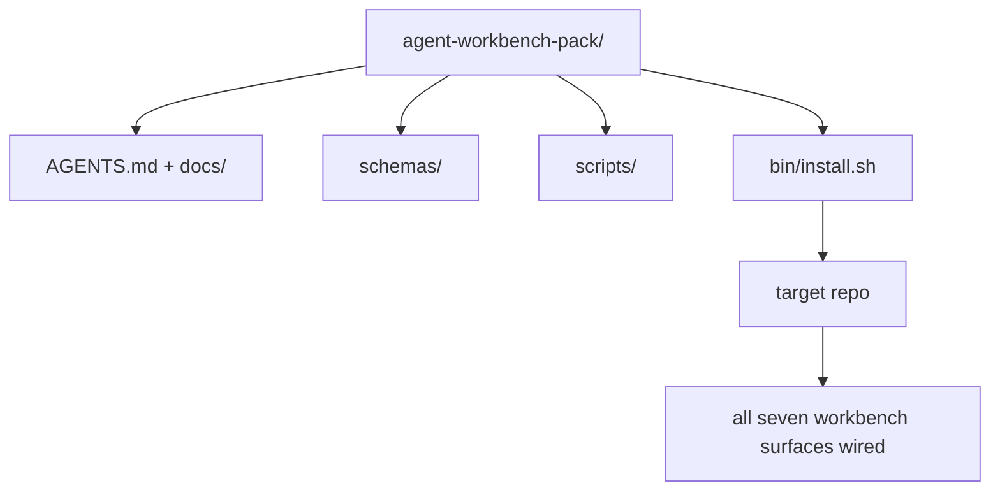

# Capstone: отгрузите переиспользуемый agent workbench pack

> Mini-track заканчивается pack, который можно положить в любой repo. Одиннадцать уроков surfaces сжаты в directory, которую можно `cp -r` и на следующее утро получить агента, работающего надежно. Capstone — artifact, на котором держится этот curriculum.

**Тип:** Build
**Языки:** Python (stdlib)
**Предварительные требования:** Phases 14 · 31 to 14 · 41
**Время:** ~75 минут

## Цели обучения

- Упаковать seven workbench surfaces в одну drop-in directory.
- Закрепить schemas, scripts и templates, чтобы новый repo получал known-good baseline.
- Добавить один installer script, который idempotently lays down pack.
- Решить, что остается в pack, а что остается outside, и защитить выбор по каждому пункту.

## Проблема

Workbench, который живет в Google Doc, chat history и трех half-remembered scripts, — это workbench, который rebuild every quarter. Лекарство — versioned pack: repo или directory with surfaces, schemas, scripts and one-command installer.

Вы закончите этот урок с `outputs/agent-workbench-pack/`, shipped on disk, и `bin/install.sh`, который drops it into any target repo.

## Концепция



### Layout pack

```
outputs/agent-workbench-pack/
├── AGENTS.md
├── docs/
│   ├── agent-rules.md
│   ├── reliability-policy.md
│   ├── handoff-protocol.md
│   └── reviewer-rubric.md
├── schemas/
│   ├── agent_state.schema.json
│   ├── task_board.schema.json
│   └── scope_contract.schema.json
├── scripts/
│   ├── init_agent.py
│   ├── run_with_feedback.py
│   ├── verify_agent.py
│   └── generate_handoff.py
├── bin/
│   └── install.sh
└── README.md
```

### Что остается внутри, что остается снаружи

In:

- Surface schemas. Они contract.
- Четыре scripts выше. Они runtime.
- Четыре docs. Они rules and rubric.

Out:

- Project-specific tasks. Tasks belong on board целевого repo, not in pack.
- Vendor SDK calls. Pack framework-agnostic.
- Onboarding prose. Pack lives рядом с existing onboarding команды, а не внутри него.

### Installer

Короткий `bin/install.sh` (или `bin/install.py`):

1. Отказывается устанавливать поверх existing pack без `--force`.
2. Копирует pack в target repo.
3. Подключает CI, если существует `.github/workflows/`.
4. Печатает next steps: fill in board, set acceptance commands, run init script.

### Versioning

Pack несет файл `VERSION`. Schema bumps и script changes, требующие migrations, bump major. Doc-only changes bump patch. `agent_state.json` целевого repo записывает, against which pack version it was initialized.

## Соберите это

`code/main.py` собирает pack в `outputs/agent-workbench-pack/` рядом с уроком, seeded with schemas and scripts из предыдущих lessons этого mini-track и docs, которые вы уже написали.

Запустите:

```
python3 code/main.py
```

Скрипт копирует и pins surfaces, пишет README, печатает pack tree и exits zero. Повторный запуск idempotent.

## Production-паттерны в реальной практике

Pack ценен только если survives forks, updates и unfriendly upstream. Четыре паттерна помогают.

**`VERSION` is the contract, not marketing.** Major bumps требуют state migration. Minor bumps требуют checker re-run. Patch bumps — doc-only. Installer пишет `.workbench-version` в target repo при каждой установке; `lint_pack.py` refuses to ship, если target lock расходится с pack `VERSION`. Так `npm`, `Cargo` и `pyproject.toml` переживают 10 лет churn; с agents правила не меняются.

**Single source for cross-tool distribution.** Nx ships one `nx ai-setup`, который lays down `AGENTS.md`, `CLAUDE.md`, `.cursor/rules/`, `.github/copilot-instructions.md` и MCP server из одного config. Pack should do the same; installer emits symlinks (`ln -s AGENTS.md CLAUDE.md`), чтобы single source of truth fan out to every coding agent. Forking pack to support one tool over another is a failure mode.

**`uninstall.sh`, который refuses on non-trivial state.** Uninstalling pack не должен удалять user's `agent_state.json`, `task_board.json` или `outputs/`. Uninstaller removes schemas, scripts, docs и `AGENTS.md` (with `--keep-agents-md` opt-out) и refuses to proceed, если state files имеют uncommitted changes. State belongs to user; pack does not own it.

**Skill-as-publishable. SkillKit-style distribution.** Pack ships как SkillKit skill: `skillkit install agent-workbench-pack` lays it down across 32 AI agents from a single source. Pack repo is source of truth; SkillKit — distribution channel. Vendor lock-in collapses; seven surfaces stay same.

## Используйте это

Три места, куда ship pack:

- **As a directory you drop into a repo.** `cp -r outputs/agent-workbench-pack /path/to/repo`.
- **As a public template repo.** Fork-and-customize, with `VERSION` controlling drift.
- **As a SkillKit skill.** Wired into your agent product, чтобы одна command lays it down.

Pack — recipe. Each install is a serving.

## Отгрузите это

`outputs/skill-workbench-pack.md` генерирует project-tuned pack: rules, sharpened to team's history, scope globs, matched to repo, rubric dimensions, extended with one domain-specific entry.

## Упражнения

1. Решите, какой optional fifth doc deserves promotion into canonical pack. Защитите cut.
2. Перепишите installer на Python с flag `--dry-run`. Сравните ergonomics with bash.
3. Добавьте `bin/uninstall.sh`, который safely removes pack and refuses, если state files have non-trivial history. Что считать non-trivial?
4. Добавьте `lint_pack.py`, который fails, когда pack drifts from `VERSION`. Подключите его к CI for pack's own repo.
5. Напишите migration runbook from hand-rolled workbench to this pack. Какой order of operations minimizes downtime?

## Ключевые термины

| Термин | Как обычно говорят | Что это на самом деле означает |
|------|----------------|------------------------|
| Workbench pack | "The starter kit" | Versioned directory, несущая все семь surfaces |
| Installer | "Setup script" | `bin/install.sh`, который lays pack down idempotently |
| Pack version | "VERSION" | Major bumps для schema/script changes, patch для doc-only |
| Drop-in pack | "cp -r and go" | Pack works без per-repo customization в первый день |
| Forkable template | "GitHub template" | Public repo, который GitHub "Use this template" может клонировать |

## Дополнительное чтение

- Фазы 14 · 31 до 14 · 41 — каждая surface, которую включает этот pack
- [SkillKit](https://github.com/stabuev/skillkit) — установка этого skill across 32 AI agents
- [Nx Blog, Teach Your AI Agent How to Work in a Monorepo](https://nx.dev/blog/nx-ai-agent-skills) — single-source generator across six tools
- [agents.md — the open spec](https://agents.md/) — what your pack's router must implement
- [HKUDS/OpenHarness](https://github.com/HKUDS/OpenHarness) — reference implementation of a pack-equivalent
- [andrewgarst/agentic_harness](https://github.com/andrewgarst/agentic_harness) — Redis-backed reference with eval suite
- [Augment Code, A good AGENTS.md is a model upgrade](https://www.augmentcode.com/blog/how-to-write-good-agents-dot-md-files) — pack docs quality bar
- [Anthropic, Effective harnesses for long-running agents](https://www.anthropic.com/engineering/effective-harnesses-for-long-running-agents)
- [Anthropic, Harness design for long-running application development](https://www.anthropic.com/engineering/harness-design-long-running-apps)
- Phase 14 · 30 — eval-driven agent development that consumes pack's verification gate
- Phase 14 · 41 — before/after benchmark this pack improves on
