# Коммуникационные протоколы

> Agents, которые не говорят на одном языке, не команда. Это незнакомцы, кричащие в пустоту.

**Тип:** Build
**Языки:** TypeScript
**Предварительные требования:** Фаза 14 (Agent Engineering), Lesson 16.01 (Why Multi-Agent)
**Время:** ~120 минут

## Цели обучения

- Реализовать MCP tool discovery и invocation, чтобы agents могли использовать tools, exposed by external servers
- Построить A2A Agent Card и task endpoint, позволяющий одному agent делегировать работу другому over HTTP
- Сравнить MCP (tool access), A2A (agent-to-agent), ACP (enterprise audit) и ANP (decentralized trust) и объяснить, какой protocol решает какую проблему
- Связать несколько protocols в одной системе, где agents discover tools через MCP и delegate tasks через A2A

## Проблема

Вы разделили систему на несколько agents. Researcher, coder, reviewer. Каждый отлично делает свою отдельную работу. Но теперь им нужно реально общаться друг с другом.

Первая попытка очевидна: передавать строки. Researcher возвращает кусок текста, coder парсит его как сможет. Это работает, пока coder не интерпретирует research summary неверно, или два agents не попадут в deadlock, ожидая друг друга, или вам не понадобятся agents от разных команд, работающие вместе. Внезапно "просто передавайте строки" разваливается.

Это проблема communication protocol. Без shared contract о том, как agents обмениваются information, multi-agent systems хрупкие, неаудируемые и не масштабируются дальше горстки agents, которые вы написали лично.

AI ecosystem ответила четырьмя protocols, каждый из которых решает свой срез проблемы:

- **MCP** для tool access
- **A2A** для agent-to-agent collaboration
- **ACP** для enterprise auditability
- **ANP** для decentralized identity and trust

Этот урок идет глубоко. Вы прочитаете реальные wire formats из каждой spec, построите working implementations и соедините все четыре в unified system.

## Концепция

### Ландшафт протоколов

Думайте об этих четырех protocols как о layers, каждый отвечает на отдельный вопрос:

```mermaid
block-beta
  columns 1
  block:ANP["ANP — How do agents trust strangers?\nDecentralized identity (DID), E2EE, meta-protocol"]
  end
  block:A2A["A2A — How do agents collaborate on goals?\nAgent Cards, task lifecycle, streaming, negotiation"]
  end
  block:ACP["ACP — How do agents talk in auditable systems?\nRuns, trajectory metadata, session continuity"]
  end
  block:MCP["MCP — How does an agent use a tool?\nTool discovery, execution, context sharing"]
  end

  style ANP fill:#f3e8ff,stroke:#7c3aed
  style A2A fill:#dbeafe,stroke:#2563eb
  style ACP fill:#fef3c7,stroke:#d97706
  style MCP fill:#d1fae5,stroke:#059669
```

Они не конкуренты. Они решают разные проблемы на разных levels.

### MCP (Recap)

MCP подробно покрыт в Phase 13. Кратко: MCP стандартизует, как LLM подключается к external tools и data sources. Это **client-server** protocol, где agent (client) discovers и calls tools, exposed by a server.

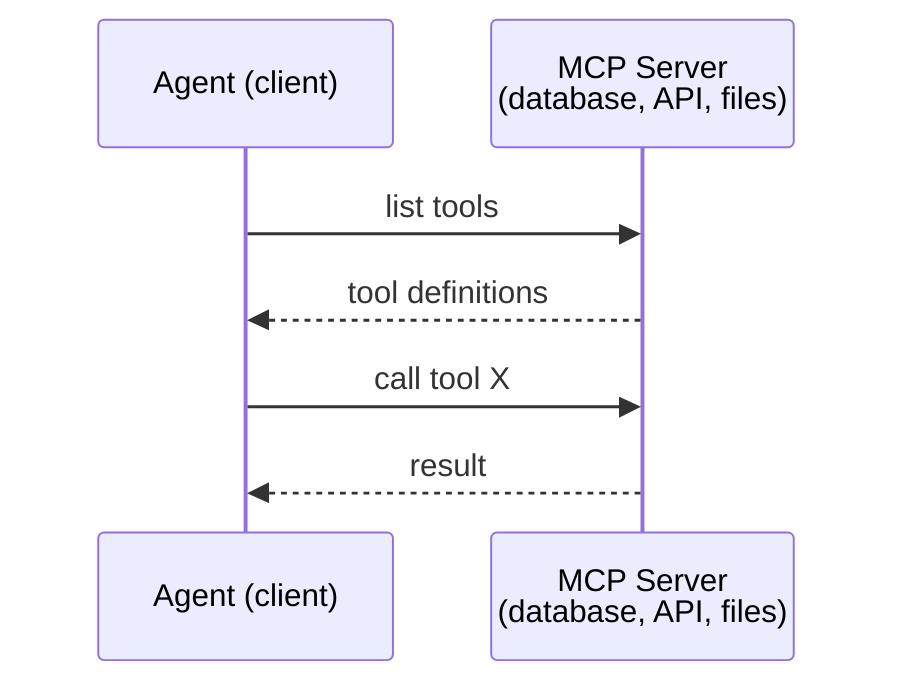

MCP — это **agent-to-tool** communication. Он не помогает agents общаться друг с другом.

### A2A (Agent2Agent Protocol)

**Created by:** Google (now under Linux Foundation as `lf.a2a.v1`)
**Spec version:** 1.0.0
**Problem:** Как autonomous agents collaborate, negotiate и delegate tasks друг другу?

A2A — protocol для **peer-to-peer agent collaboration**. Если MCP соединяет agent с tools, A2A соединяет agent с другими agents. Каждый agent публикует **Agent Card** по well-known URL, а другие agents discover, negotiate и delegate tasks ему.

#### Как работает A2A

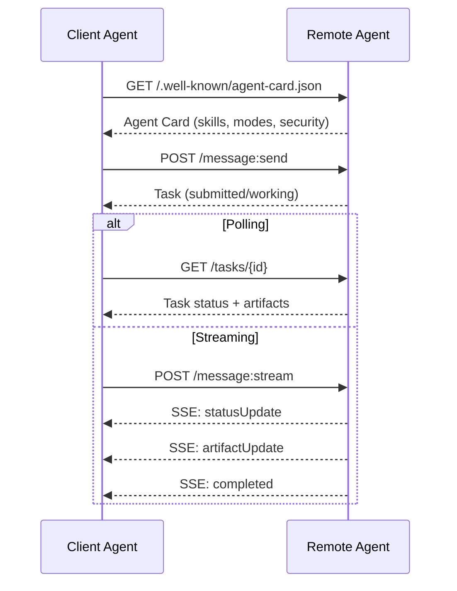

#### Реальная Agent Card

Вот как A2A Agent Card выглядит в реальности. Served at `GET /.well-known/agent-card.json`:

```json
{
  "name": "Research Agent",
  "description": "Searches documentation and summarizes findings",
  "version": "1.0.0",
  "supportedInterfaces": [
    {
      "url": "https://research-agent.example.com/a2a/v1",
      "protocolBinding": "JSONRPC",
      "protocolVersion": "1.0"
    },
    {
      "url": "https://research-agent.example.com/a2a/rest",
      "protocolBinding": "HTTP+JSON",
      "protocolVersion": "1.0"
    }
  ],
  "provider": {
    "organization": "Your Company",
    "url": "https://example.com"
  },
  "capabilities": {
    "streaming": true,
    "pushNotifications": false
  },
  "defaultInputModes": ["text/plain", "application/json"],
  "defaultOutputModes": ["text/plain", "application/json"],
  "skills": [
    {
      "id": "web-research",
      "name": "Web Research",
      "description": "Searches the web and synthesizes findings",
      "tags": ["research", "search", "summarization"],
      "examples": ["Research the latest changes in React 19"]
    },
    {
      "id": "doc-analysis",
      "name": "Documentation Analysis",
      "description": "Reads and analyzes technical documentation",
      "tags": ["docs", "analysis"],
      "inputModes": ["text/plain", "application/pdf"],
      "outputModes": ["application/json"]
    }
  ],
  "securitySchemes": {
    "bearer": {
      "httpAuthSecurityScheme": {
        "scheme": "Bearer",
        "bearerFormat": "JWT"
      }
    }
  },
  "security": [{ "bearer": [] }]
}
```

На что обратить внимание:
- **Skills** — то, что agent умеет делать. У каждого есть ID, tags и supported input/output MIME types. Так client agent решает, может ли remote agent обработать его request.
- **supportedInterfaces** перечисляет несколько protocol bindings. Один agent может одновременно говорить на JSON-RPC, REST и gRPC.
- **Security** встроена в card. Client знает, какая auth нужна, еще до первого request.

#### Жизненный цикл Task

Tasks — базовая единица work в A2A. Они проходят через определенные states:

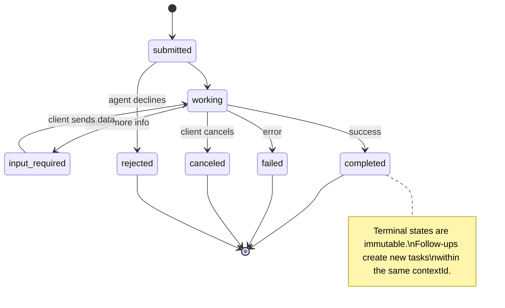

Все 8 states (spec также определяет `UNSPECIFIED` как sentinel, здесь опущен):

| State | Terminal? | Значение |
|---|---|---|
| `TASK_STATE_SUBMITTED` | No | Подтверждена, еще не обрабатывается |
| `TASK_STATE_WORKING` | No | Активно обрабатывается |
| `TASK_STATE_INPUT_REQUIRED` | No | Agent нужна дополнительная информация от client |
| `TASK_STATE_AUTH_REQUIRED` | No | Требуется authentication |
| `TASK_STATE_COMPLETED` | Yes | Успешно завершена |
| `TASK_STATE_FAILED` | Yes | Завершена с ошибкой |
| `TASK_STATE_CANCELED` | Yes | Отменена до completion |
| `TASK_STATE_REJECTED` | Yes | Agent отклонил task |

Когда task достигает terminal state, она immutable. Никаких further messages. Follow-ups создают новую task в том же `contextId`.

#### Wire Format

A2A использует JSON-RPC 2.0. Вот как выглядит реальный message exchange:

**Client sends a task:**
```json
{
  "jsonrpc": "2.0",
  "id": 1,
  "method": "SendMessage",
  "params": {
    "message": {
      "messageId": "msg-001",
      "role": "ROLE_USER",
      "parts": [{ "text": "Research React 19 compiler features" }]
    },
    "configuration": {
      "acceptedOutputModes": ["text/plain", "application/json"],
      "historyLength": 10
    }
  }
}
```

**Agent responds with a task:**
```json
{
  "jsonrpc": "2.0",
  "id": 1,
  "result": {
    "task": {
      "id": "task-abc-123",
      "contextId": "ctx-xyz-789",
      "status": {
        "state": "TASK_STATE_COMPLETED",
        "timestamp": "2026-03-27T10:30:00Z"
      },
      "artifacts": [
        {
          "artifactId": "art-001",
          "name": "research-results",
          "parts": [{
            "data": {
              "findings": [
                "React 19 compiler auto-memoizes components",
                "No more manual useMemo/useCallback needed",
                "Compiler runs at build time, not runtime"
              ]
            },
            "mediaType": "application/json"
          }]
        }
      ]
    }
  }
}
```

**Streaming via SSE:**
```text
POST /message:stream HTTP/1.1
Content-Type: application/json
A2A-Version: 1.0

data: {"task":{"id":"task-123","status":{"state":"TASK_STATE_WORKING"}}}

data: {"statusUpdate":{"taskId":"task-123","status":{"state":"TASK_STATE_WORKING","message":{"role":"ROLE_AGENT","parts":[{"text":"Searching documentation..."}]}}}}

data: {"artifactUpdate":{"taskId":"task-123","artifact":{"artifactId":"art-1","parts":[{"text":"partial findings..."}]},"append":true,"lastChunk":false}}

data: {"statusUpdate":{"taskId":"task-123","status":{"state":"TASK_STATE_COMPLETED"}}}
```

### ACP (Agent Communication Protocol)

**Created by:** IBM / BeeAI
**Spec version:** 0.2.0 (OpenAPI 3.1.1)
**Status:** Merging into A2A under the Linux Foundation
**Problem:** Как agents общаются с полной auditability, session continuity и trajectory tracking?

ACP — это **enterprise protocol**. Вопреки многим summary, ACP **не** использует JSON-LD. Это прямой REST/JSON API, определенный через OpenAPI. Его особенность — **TrajectoryMetadata**: каждый agent response может нести detailed log reasoning steps и tool calls, которые его породили.

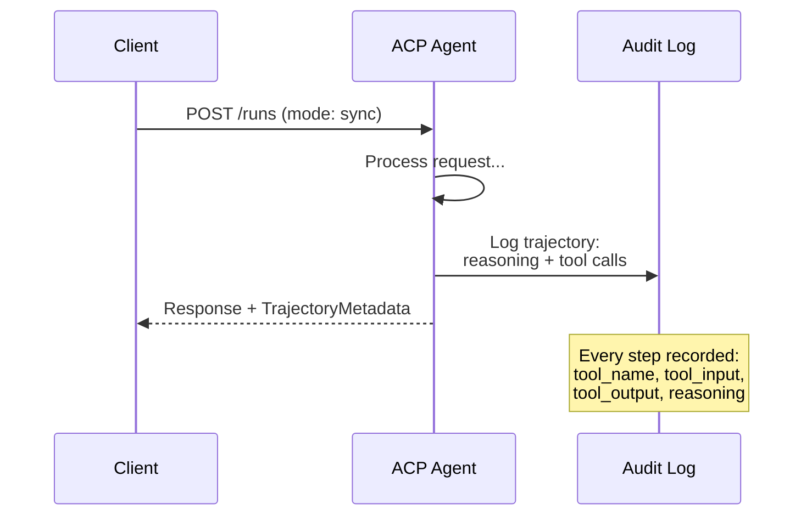

#### Agent Discovery в ACP

ACP определяет четыре discovery methods:

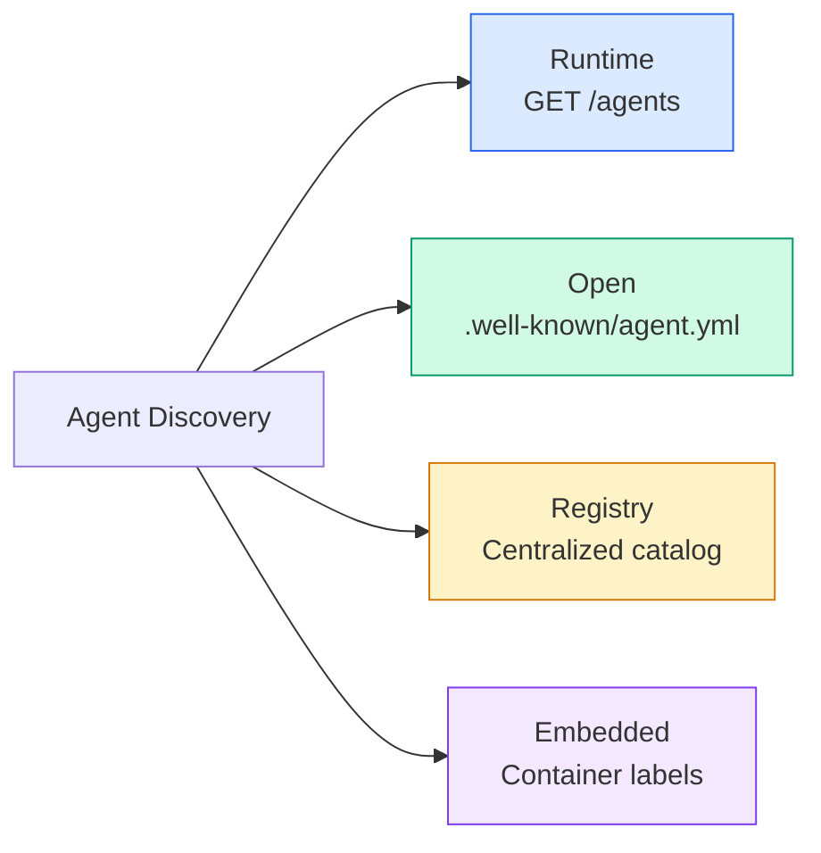

**AgentManifest** проще, чем Agent Card в A2A:

```json
{
  "name": "summarizer",
  "description": "Summarizes documents with source citations",
  "input_content_types": ["text/plain", "application/pdf"],
  "output_content_types": ["text/plain", "application/json"],
  "metadata": {
    "tags": ["summarization", "RAG"],
    "framework": "BeeAI",
    "capabilities": [
      {
        "name": "Document Summarization",
        "description": "Condenses long documents into key points"
      }
    ],
    "recommended_models": ["llama3.3:70b-instruct-fp16"],
    "license": "Apache-2.0",
    "programming_language": "Python"
  }
}
```

#### Run Lifecycle

ACP использует "Runs" вместо "Tasks". Run — это выполнение agent с тремя modes:

| Mode | Behavior |
|---|---|
| `sync` | Blocking. Response содержит complete result. |
| `async` | Сразу возвращает 202. Poll `GET /runs/{id}` для status. |
| `stream` | SSE stream. Events приходят по мере работы agent. |

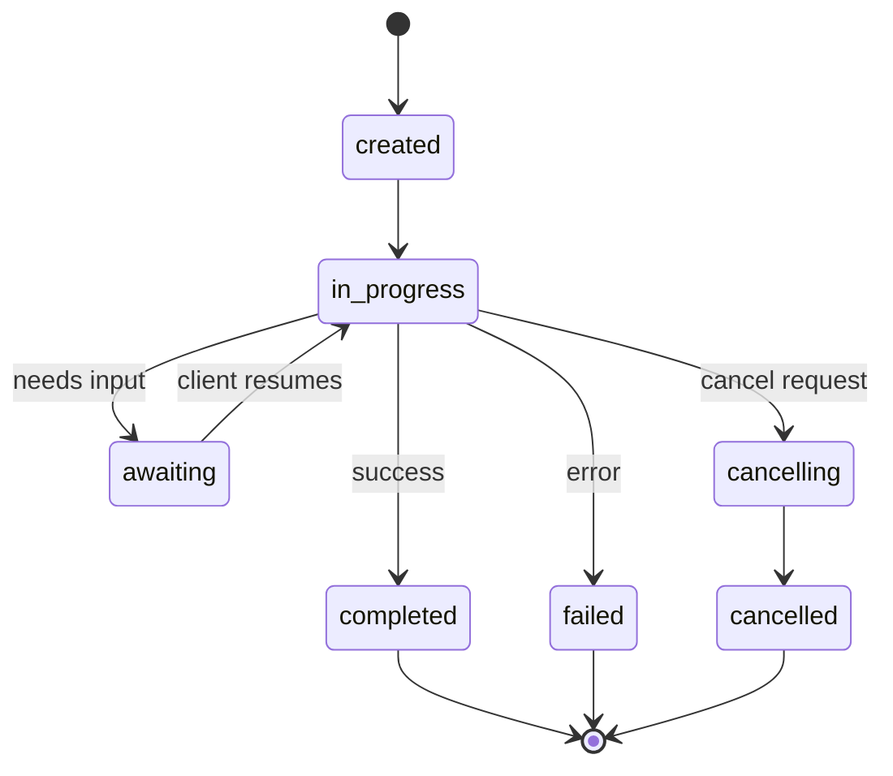

#### TrajectoryMetadata (Audit Trail)

Это ключевое отличие ACP. Каждая message part может включать metadata, показывающую, что именно сделал agent:

```json
{
  "role": "agent/researcher",
  "parts": [
    {
      "content_type": "text/plain",
      "content": "The weather in San Francisco is 72F and sunny.",
      "metadata": {
        "kind": "trajectory",
        "message": "I need to check the weather for this location",
        "tool_name": "weather_api",
        "tool_input": { "location": "San Francisco, CA" },
        "tool_output": { "temperature": 72, "condition": "sunny" }
      }
    }
  ]
}
```

Для regulated industries это золото. Каждый answer приходит с provable chain of reasoning: какие tools были called, какие inputs использовались, какие outputs были received. Никакого black box.

ACP также поддерживает **CitationMetadata** для source attribution:

```json
{
  "kind": "citation",
  "start_index": 0,
  "end_index": 47,
  "url": "https://weather.gov/sf",
  "title": "NWS San Francisco Forecast"
}
```

### ANP (Agent Network Protocol)

**Created by:** Open-source community (founded by GaoWei Chang)
**Repo:** [github.com/agent-network-protocol/AgentNetworkProtocol](https://github.com/agent-network-protocol/AgentNetworkProtocol)
**Problem:** Как agents из разных organizations доверяют друг другу без central authority?

ANP — это **decentralized identity protocol**. Он строит trust через W3C Decentralized Identifiers (DIDs) и end-to-end encryption. В отличие от A2A, где вы discover agents через known endpoints, ANP позволяет agents криптографически доказывать identity.

ANP имеет три layers:

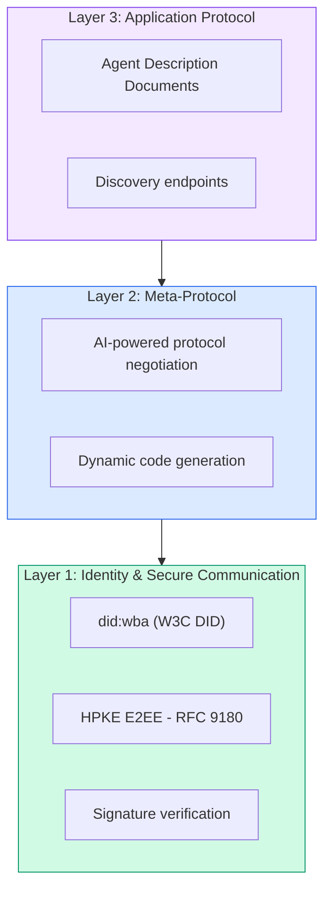

#### DID Documents (Real Structure)

ANP использует custom DID method под названием `did:wba` (Web-Based Agent). DID `did:wba:example.com:user:alice` resolves to `https://example.com/user/alice/did.json`:

```json
{
  "@context": [
    "https://www.w3.org/ns/did/v1",
    "https://w3id.org/security/suites/jws-2020/v1",
    "https://w3id.org/security/suites/secp256k1-2019/v1"
  ],
  "id": "did:wba:example.com:user:alice",
  "verificationMethod": [
    {
      "id": "did:wba:example.com:user:alice#key-1",
      "type": "EcdsaSecp256k1VerificationKey2019",
      "controller": "did:wba:example.com:user:alice",
      "publicKeyJwk": {
        "crv": "secp256k1",
        "x": "NtngWpJUr-rlNNbs0u-Aa8e16OwSJu6UiFf0Rdo1oJ4",
        "y": "qN1jKupJlFsPFc1UkWinqljv4YE0mq_Ickwnjgasvmo",
        "kty": "EC"
      }
    },
    {
      "id": "did:wba:example.com:user:alice#key-x25519-1",
      "type": "X25519KeyAgreementKey2019",
      "controller": "did:wba:example.com:user:alice",
      "publicKeyMultibase": "z9hFgmPVfmBZwRvFEyniQDBkz9LmV7gDEqytWyGZLmDXE"
    }
  ],
  "authentication": [
    "did:wba:example.com:user:alice#key-1"
  ],
  "keyAgreement": [
    "did:wba:example.com:user:alice#key-x25519-1"
  ],
  "humanAuthorization": [
    "did:wba:example.com:user:alice#key-1"
  ],
  "service": [
    {
      "id": "did:wba:example.com:user:alice#agent-description",
      "type": "AgentDescription",
      "serviceEndpoint": "https://example.com/agents/alice/ad.json"
    }
  ]
}
```

На что обратить внимание:
- **Key separation** enforced. Signing keys (secp256k1) отделены от encryption keys (X25519).
- **`humanAuthorization`** уникален для ANP. Эти keys требуют explicit human approval (biometric, password, HSM) перед использованием. High-risk operations вроде fund transfers идут через этот path.
- **`keyAgreement`** keys используются для HPKE end-to-end encryption (RFC 9180).
- Секция **service** ссылается на Agent Description document.

#### Как работает Trust в ANP

ANP **не** использует web-of-trust или endorsement graph. Trust bilateral и verified per-interaction:

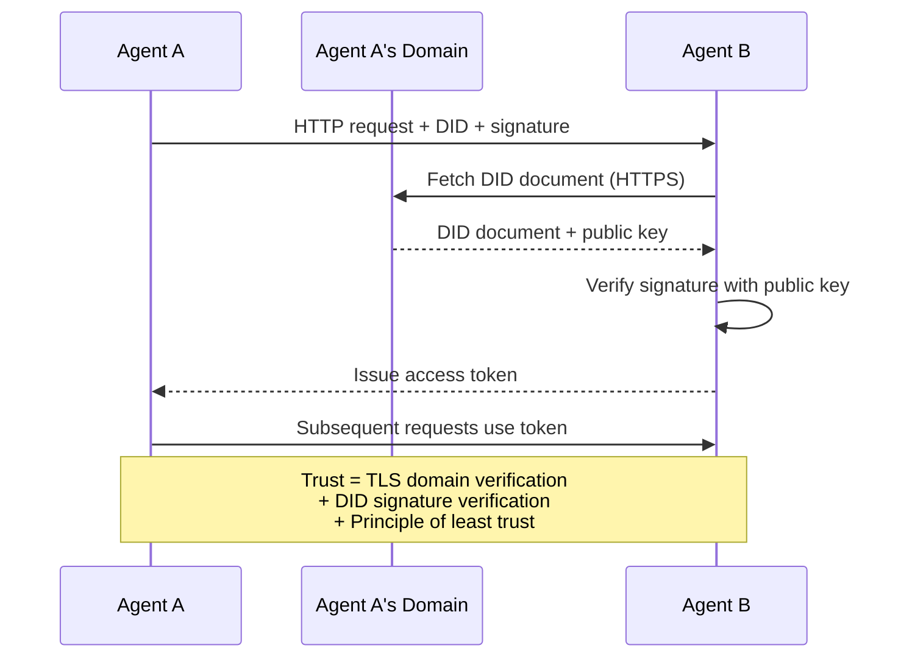

Trust приходит из трех sources:
1. **Domain-level TLS** verifies host DID document
2. **DID cryptographic signatures** verify identity agent
3. **Principle of least trust** grants only minimum permissions

Нет gossip-based trust propagation или PageRank scoring. Вы проверяете каждого agent напрямую через его DID.

#### Meta-Protocol Negotiation

Это самая новая feature ANP. Когда два agents из разных ecosystems встречаются, им не нужны заранее согласованные data formats. Они negotiate на natural language:

```json
{
  "action": "protocolNegotiation",
  "sequenceId": 0,
  "candidateProtocols": "I can communicate using:\n1. JSON-RPC with hotel booking schema\n2. REST with OpenAPI 3.1 spec\n3. Natural language over HTTP",
  "modificationSummary": "Initial proposal",
  "status": "negotiating"
}
```

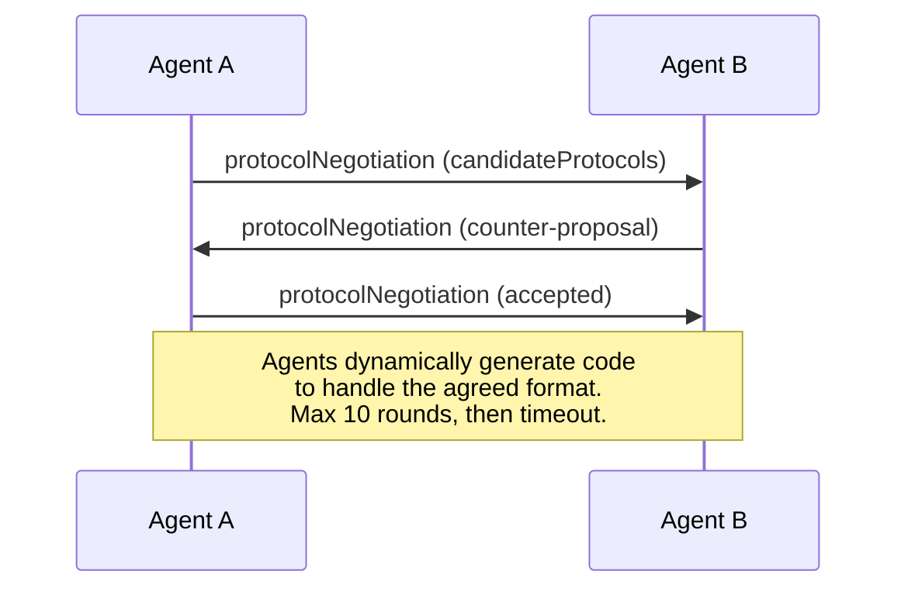

Агенты ходят туда-сюда (max 10 rounds), пока не согласуют format, затем динамически генерируют code для его обработки. Status values: `negotiating`, `rejected`, `accepted`, `timeout`.

Это означает, что два agents, которые никогда раньше не видели друг друга, могут выяснить, как общаться, без заранее заданной shared schema.

### Сравнение (исправленное)

| | MCP | A2A | ACP | ANP |
|---|---|---|---|---|
| **Created by** | Anthropic | Google / Linux Foundation | IBM / BeeAI | Community |
| **Spec format** | JSON-RPC | JSON-RPC / REST / gRPC | OpenAPI 3.1 (REST) | JSON-RPC |
| **Primary use** | Agent to Tool | Agent to Agent | Agent to Agent | Agent to Agent |
| **Discovery** | Tool listing | `/.well-known/agent-card.json` | `GET /agents`, `/.well-known/agent.yml` | `/.well-known/agent-descriptions`, DID service endpoints |
| **Identity** | Implicit (local) | Security schemes (OAuth, mTLS) | Server-level | W3C DID (`did:wba`) with E2EE |
| **Audit trail** | N/A | Basic (task history) | TrajectoryMetadata (tool calls, reasoning) | Not formally specified |
| **State machine** | N/A | 9 task states | 7 run states | N/A |
| **Streaming** | N/A | SSE | SSE | Transport-agnostic |
| **Unique feature** | Tool schemas | Agent Cards + Skills | Trajectory audit trail | Meta-protocol negotiation |
| **Best for** | Tools & data | Dynamic collaboration | Regulated industries | Cross-org trust |
| **Status** | Stable | Stable (v1.0) | Merging into A2A | Active development |

### Как они работают вместе

Эти protocols не являются mutually exclusive. Реалистичная enterprise system использует несколько:

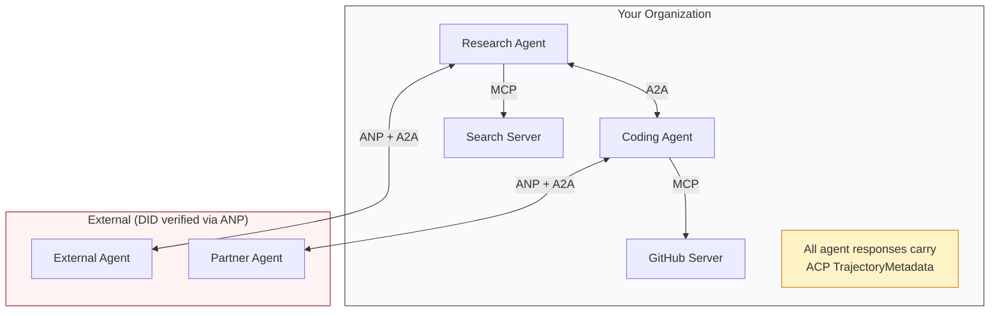

- **MCP** соединяет каждого agent с его tools
- **A2A** обрабатывает collaboration между agents (internal and external)
- **ACP** wraps responses в trajectory metadata для auditability
- **ANP** provides identity verification для agents, которых вы не контролируете

## Соберите это

### Шаг 1: Core Message Types

Каждая multi-agent system начинается с message format. Определим types, которые map to what real protocols use:

```typescript
import crypto from "node:crypto";

type MessageRole = "user" | "agent";

type MessagePart =
  | { kind: "text"; text: string }
  | { kind: "data"; data: unknown; mediaType: string }
  | { kind: "file"; name: string; url: string; mediaType: string };

type TrajectoryEntry = {
  reasoning: string;
  toolName?: string;
  toolInput?: unknown;
  toolOutput?: unknown;
  timestamp: number;
};

type AgentMessage = {
  id: string;
  role: MessageRole;
  parts: MessagePart[];
  trajectory?: TrajectoryEntry[];
  replyTo?: string;
  timestamp: number;
};

function createMessage(
  role: MessageRole,
  parts: MessagePart[],
  replyTo?: string
): AgentMessage {
  return {
    id: crypto.randomUUID(),
    role,
    parts,
    replyTo,
    timestamp: Date.now(),
  };
}

function textMessage(role: MessageRole, text: string): AgentMessage {
  return createMessage(role, [{ kind: "text", text }]);
}
```

Заметьте: `MessagePart` multimodal (text, structured data, files), как в реальных A2A и ACP specs. `TrajectoryEntry` captures reasoning chain, matching ACP's TrajectoryMetadata.

### Шаг 2: A2A Agent Card and Registry

Построим agent discovery, matching real A2A spec:

```typescript
type Skill = {
  id: string;
  name: string;
  description: string;
  tags: string[];
  inputModes: string[];
  outputModes: string[];
};

type AgentCard = {
  name: string;
  description: string;
  version: string;
  url: string;
  capabilities: {
    streaming: boolean;
    pushNotifications: boolean;
  };
  defaultInputModes: string[];
  defaultOutputModes: string[];
  skills: Skill[];
};

class AgentRegistry {
  private cards: Map<string, AgentCard> = new Map();

  register(card: AgentCard) {
    this.cards.set(card.name, card);
  }

  discoverBySkillTag(tag: string): AgentCard[] {
    return [...this.cards.values()].filter((card) =>
      card.skills.some((skill) => skill.tags.includes(tag))
    );
  }

  discoverByInputMode(mimeType: string): AgentCard[] {
    return [...this.cards.values()].filter(
      (card) =>
        card.defaultInputModes.includes(mimeType) ||
        card.skills.some((skill) => skill.inputModes.includes(mimeType))
    );
  }

  resolve(name: string): AgentCard | undefined {
    return this.cards.get(name);
  }

  listAll(): AgentCard[] {
    return [...this.cards.values()];
  }
}
```

Это существенно богаче простой map name-to-capability. Можно discover agents по skill tags, input MIME types или name — как поддерживает реальная A2A spec.

### Шаг 3: A2A Task Lifecycle

Построим полную task state machine:

```typescript
type TaskState =
  | "submitted"
  | "working"
  | "input-required"
  | "auth-required"
  | "completed"
  | "failed"
  | "canceled"
  | "rejected";

const TERMINAL_STATES: TaskState[] = [
  "completed",
  "failed",
  "canceled",
  "rejected",
];

type TaskStatus = {
  state: TaskState;
  message?: AgentMessage;
  timestamp: number;
};

type Artifact = {
  id: string;
  name: string;
  parts: MessagePart[];
};

type Task = {
  id: string;
  contextId: string;
  status: TaskStatus;
  artifacts: Artifact[];
  history: AgentMessage[];
};

type TaskEvent =
  | { kind: "statusUpdate"; taskId: string; status: TaskStatus }
  | {
      kind: "artifactUpdate";
      taskId: string;
      artifact: Artifact;
      append: boolean;
      lastChunk: boolean;
    };

type TaskHandler = (
  task: Task,
  message: AgentMessage
) => AsyncGenerator<TaskEvent>;

class TaskManager {
  private tasks: Map<string, Task> = new Map();
  private handlers: Map<string, TaskHandler> = new Map();
  private listeners: Map<string, ((event: TaskEvent) => void)[]> = new Map();

  registerHandler(agentName: string, handler: TaskHandler) {
    this.handlers.set(agentName, handler);
  }

  subscribe(taskId: string, listener: (event: TaskEvent) => void) {
    const existing = this.listeners.get(taskId) ?? [];
    existing.push(listener);
    this.listeners.set(taskId, existing);
  }

  async sendMessage(
    agentName: string,
    message: AgentMessage,
    contextId?: string
  ): Promise<Task> {
    const handler = this.handlers.get(agentName);
    if (!handler) {
      const task = this.createTask(contextId);
      task.status = {
        state: "rejected",
        timestamp: Date.now(),
        message: textMessage("agent", `No handler for ${agentName}`),
      };
      return task;
    }

    const task = this.createTask(contextId);
    task.history.push(message);
    task.status = { state: "submitted", timestamp: Date.now() };

    this.processTask(task, handler, message).catch((err) => {
      task.status = {
        state: "failed",
        timestamp: Date.now(),
        message: textMessage("agent", String(err)),
      };
    });
    return task;
  }

  getTask(taskId: string): Task | undefined {
    return this.tasks.get(taskId);
  }

  cancelTask(taskId: string): boolean {
    const task = this.tasks.get(taskId);
    if (!task || TERMINAL_STATES.includes(task.status.state)) return false;
    task.status = { state: "canceled", timestamp: Date.now() };
    this.emit(taskId, {
      kind: "statusUpdate",
      taskId,
      status: task.status,
    });
    return true;
  }

  private createTask(contextId?: string): Task {
    const task: Task = {
      id: crypto.randomUUID(),
      contextId: contextId ?? crypto.randomUUID(),
      status: { state: "submitted", timestamp: Date.now() },
      artifacts: [],
      history: [],
    };
    this.tasks.set(task.id, task);
    return task;
  }

  private async processTask(
    task: Task,
    handler: TaskHandler,
    message: AgentMessage
  ) {
    task.status = { state: "working", timestamp: Date.now() };
    this.emit(task.id, {
      kind: "statusUpdate",
      taskId: task.id,
      status: task.status,
    });

    try {
      for await (const event of handler(task, message)) {
        if (TERMINAL_STATES.includes(task.status.state)) break;

        if (event.kind === "statusUpdate") {
          task.status = event.status;
        }
        if (event.kind === "artifactUpdate") {
          const existing = task.artifacts.find(
            (a) => a.id === event.artifact.id
          );
          if (existing && event.append) {
            existing.parts.push(...event.artifact.parts);
          } else {
            task.artifacts.push(event.artifact);
          }
        }
        this.emit(task.id, event);
      }
    } catch (err) {
      task.status = {
        state: "failed",
        timestamp: Date.now(),
        message: textMessage("agent", String(err)),
      };
      this.emit(task.id, {
        kind: "statusUpdate",
        taskId: task.id,
        status: task.status,
      });
    }
  }

  private emit(taskId: string, event: TaskEvent) {
    for (const listener of this.listeners.get(taskId) ?? []) {
      listener(event);
    }
  }
}
```

Это реализует реальный A2A task lifecycle: submitted, working, input-required, terminal states. Handlers — async generators, которые yield events (status updates и artifact chunks), matching SSE streaming model.

### Шаг 4: ACP-Style Audit Trail

Обернем communication в trajectory tracking:

```typescript
type AuditEntry = {
  runId: string;
  agentName: string;
  input: AgentMessage[];
  output: AgentMessage[];
  trajectory: TrajectoryEntry[];
  status: "created" | "in-progress" | "completed" | "failed" | "awaiting";
  startedAt: number;
  completedAt?: number;
  sessionId?: string;
};

class AuditableRunner {
  private log: AuditEntry[] = [];
  private handlers: Map<
    string,
    (input: AgentMessage[]) => Promise<{
      output: AgentMessage[];
      trajectory: TrajectoryEntry[];
    }>
  > = new Map();

  registerAgent(
    name: string,
    handler: (input: AgentMessage[]) => Promise<{
      output: AgentMessage[];
      trajectory: TrajectoryEntry[];
    }>
  ) {
    this.handlers.set(name, handler);
  }

  async run(
    agentName: string,
    input: AgentMessage[],
    sessionId?: string
  ): Promise<AuditEntry> {
    const entry: AuditEntry = {
      runId: crypto.randomUUID(),
      agentName,
      input: structuredClone(input),
      output: [],
      trajectory: [],
      status: "created",
      startedAt: Date.now(),
      sessionId,
    };
    this.log.push(entry);

    const handler = this.handlers.get(agentName);
    if (!handler) {
      entry.status = "failed";
      return entry;
    }

    entry.status = "in-progress";
    try {
      const result = await handler(input);
      entry.output = structuredClone(result.output);
      entry.trajectory = structuredClone(result.trajectory);
      entry.status = "completed";
      entry.completedAt = Date.now();
    } catch (err) {
      entry.status = "failed";
      entry.trajectory.push({
        reasoning: `Error: ${String(err)}`,
        timestamp: Date.now(),
      });
      entry.completedAt = Date.now();
    }
    return entry;
  }

  getFullAuditLog(): AuditEntry[] {
    return structuredClone(this.log);
  }

  getAuditLogForAgent(agentName: string): AuditEntry[] {
    return structuredClone(
      this.log.filter((e) => e.agentName === agentName)
    );
  }

  getAuditLogForSession(sessionId: string): AuditEntry[] {
    return structuredClone(
      this.log.filter((e) => e.sessionId === sessionId)
    );
  }

  getTrajectoryForRun(runId: string): TrajectoryEntry[] {
    const entry = this.log.find((e) => e.runId === runId);
    return entry ? structuredClone(entry.trajectory) : [];
  }
}
```

Каждый agent execution производит full audit entry: что вошло, что вышло и complete trajectory tool calls и reasoning steps между ними. Можно query by agent, by session или by individual run.

### Шаг 5: ANP-Style Identity Verification

Построим DID-based identity and verification:

```typescript
type VerificationMethod = {
  id: string;
  type: string;
  controller: string;
  publicKeyDer: string;
};

type DIDDocument = {
  id: string;
  verificationMethod: VerificationMethod[];
  authentication: string[];
  keyAgreement: string[];
  humanAuthorization: string[];
  service: { id: string; type: string; serviceEndpoint: string }[];
};

type AgentIdentity = {
  did: string;
  document: DIDDocument;
  privateKey: crypto.KeyObject;
  publicKey: crypto.KeyObject;
};

class IdentityRegistry {
  private documents: Map<string, DIDDocument> = new Map();

  publish(doc: DIDDocument) {
    this.documents.set(doc.id, doc);
  }

  resolve(did: string): DIDDocument | undefined {
    return this.documents.get(did);
  }

  verify(did: string, signature: string, payload: string): boolean {
    const doc = this.documents.get(did);
    if (!doc) return false;

    const authKeyIds = doc.authentication;
    const authKeys = doc.verificationMethod.filter((vm) =>
      authKeyIds.includes(vm.id)
    );

    for (const key of authKeys) {
      const publicKey = crypto.createPublicKey({
        key: Buffer.from(key.publicKeyDer, "base64"),
        format: "der",
        type: "spki",
      });
      const isValid = crypto.verify(
        null,
        Buffer.from(payload),
        publicKey,
        Buffer.from(signature, "hex")
      );
      if (isValid) return true;
    }
    return false;
  }

  requiresHumanAuth(did: string, operationKeyId: string): boolean {
    const doc = this.documents.get(did);
    if (!doc) return false;
    return doc.humanAuthorization.includes(operationKeyId);
  }
}

function createIdentity(domain: string, agentName: string): AgentIdentity {
  const did = `did:wba:${domain}:agent:${agentName}`;
  const { publicKey, privateKey } = crypto.generateKeyPairSync("ed25519");

  const publicKeyDer = publicKey
    .export({ format: "der", type: "spki" })
    .toString("base64");

  const keyId = `${did}#key-1`;
  const encKeyId = `${did}#key-x25519-1`;

  const document: DIDDocument = {
    id: did,
    verificationMethod: [
      {
        id: keyId,
        type: "Ed25519VerificationKey2020",
        controller: did,
        publicKeyDer,
      },
      {
        id: encKeyId,
        type: "X25519KeyAgreementKey2019",
        controller: did,
        publicKeyDer,
      },
    ],
    authentication: [keyId],
    keyAgreement: [encKeyId],
    humanAuthorization: [],
    service: [
      {
        id: `${did}#agent-description`,
        type: "AgentDescription",
        serviceEndpoint: `https://${domain}/agents/${agentName}/ad.json`,
      },
    ],
  };

  return { did, document, privateKey, publicKey };
}

function signPayload(identity: AgentIdentity, payload: string): string {
  return crypto
    .sign(null, Buffer.from(payload), identity.privateKey)
    .toString("hex");
}
```

Это mirrors real ANP identity model: agents имеют DID documents с separate authentication, key agreement и human authorization keys. `IdentityRegistry` simulates DID resolution (в production это были бы HTTP fetches к domain agent).

### Шаг 6: Protocol Gateway

Соединим все четыре protocols в unified system:

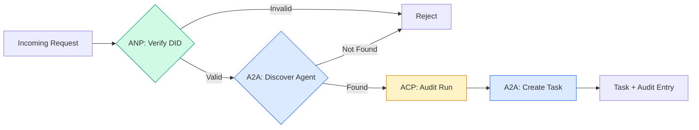

```typescript
class ProtocolGateway {
  private registry: AgentRegistry;
  private taskManager: TaskManager;
  private auditRunner: AuditableRunner;
  private identityRegistry: IdentityRegistry;

  constructor(
    registry: AgentRegistry,
    taskManager: TaskManager,
    auditRunner: AuditableRunner,
    identityRegistry: IdentityRegistry
  ) {
    this.registry = registry;
    this.taskManager = taskManager;
    this.auditRunner = auditRunner;
    this.identityRegistry = identityRegistry;
  }

  async delegateTask(
    fromDid: string,
    signature: string,
    targetAgent: string,
    message: AgentMessage,
    sessionId?: string
  ): Promise<{ task: Task; audit: AuditEntry } | { error: string }> {
    if (!this.identityRegistry.verify(fromDid, signature, message.id)) {
      return { error: "Identity verification failed" };
    }

    const card = this.registry.resolve(targetAgent);
    if (!card) {
      return { error: `Agent ${targetAgent} not found in registry` };
    }

    const audit = await this.auditRunner.run(
      targetAgent,
      [message],
      sessionId
    );
    const task = await this.taskManager.sendMessage(targetAgent, message);

    return { task, audit };
  }

  discoverAndDelegate(
    fromDid: string,
    signature: string,
    skillTag: string,
    message: AgentMessage
  ): Promise<{ task: Task; audit: AuditEntry } | { error: string }> {
    const candidates = this.registry.discoverBySkillTag(skillTag);
    if (candidates.length === 0) {
      return Promise.resolve({
        error: `No agents found with skill tag: ${skillTag}`,
      });
    }
    return this.delegateTask(
      fromDid,
      signature,
      candidates[0].name,
      message
    );
  }
}
```

Gateway делает четыре вещи за один call:
1. **ANP**: Verifies caller identity через DID signature
2. **A2A**: Discovers target agent и checks capabilities
3. **ACP**: Wraps execution в audit trail with trajectory
4. **A2A**: Creates a task with full lifecycle tracking

### Шаг 7: Связать все вместе

```typescript
async function protocolDemo() {
  const registry = new AgentRegistry();
  registry.register({
    name: "researcher",
    description: "Searches and summarizes findings",
    version: "1.0.0",
    url: "https://researcher.local/a2a/v1",
    capabilities: { streaming: true, pushNotifications: false },
    defaultInputModes: ["text/plain"],
    defaultOutputModes: ["text/plain", "application/json"],
    skills: [
      {
        id: "web-research",
        name: "Web Research",
        description: "Searches the web",
        tags: ["research", "search", "summarization"],
        inputModes: ["text/plain"],
        outputModes: ["application/json"],
      },
    ],
  });
  registry.register({
    name: "coder",
    description: "Writes code from specs",
    version: "1.0.0",
    url: "https://coder.local/a2a/v1",
    capabilities: { streaming: false, pushNotifications: false },
    defaultInputModes: ["text/plain", "application/json"],
    defaultOutputModes: ["text/plain"],
    skills: [
      {
        id: "code-gen",
        name: "Code Generation",
        description: "Generates code",
        tags: ["coding", "generation"],
        inputModes: ["text/plain", "application/json"],
        outputModes: ["text/plain"],
      },
    ],
  });

  const taskManager = new TaskManager();
  const auditRunner = new AuditableRunner();

  const researchTrajectory: TrajectoryEntry[] = [];

  taskManager.registerHandler(
    "researcher",
    async function* (task, message) {
      yield {
        kind: "statusUpdate" as const,
        taskId: task.id,
        status: { state: "working" as const, timestamp: Date.now() },
      };

      researchTrajectory.push({
        reasoning: "Searching for React 19 documentation",
        toolName: "web_search",
        toolInput: { query: "React 19 compiler features" },
        toolOutput: {
          results: ["react.dev/blog/react-19", "github.com/react/react"],
        },
        timestamp: Date.now(),
      });

      researchTrajectory.push({
        reasoning: "Extracting key findings from search results",
        toolName: "doc_analysis",
        toolInput: { url: "react.dev/blog/react-19" },
        toolOutput: {
          summary:
            "React 19 compiler auto-memoizes, no manual useMemo needed",
        },
        timestamp: Date.now(),
      });

      yield {
        kind: "artifactUpdate" as const,
        taskId: task.id,
        artifact: {
          id: crypto.randomUUID(),
          name: "research-results",
          parts: [
            {
              kind: "data" as const,
              data: {
                findings: [
                  "React 19 compiler auto-memoizes components",
                  "No more manual useMemo/useCallback needed",
                  "Compiler runs at build time, not runtime",
                ],
                sources: ["react.dev/blog/react-19"],
              },
              mediaType: "application/json",
            },
          ],
        },
        append: false,
        lastChunk: true,
      };

      yield {
        kind: "statusUpdate" as const,
        taskId: task.id,
        status: { state: "completed" as const, timestamp: Date.now() },
      };
    }
  );

  auditRunner.registerAgent("researcher", async () => ({
    output: [
      textMessage("agent", "React 19 compiler auto-memoizes components"),
    ],
    trajectory: researchTrajectory,
  }));

  const identityRegistry = new IdentityRegistry();

  const coderIdentity = createIdentity("coder.local", "coder");
  const researcherIdentity = createIdentity("researcher.local", "researcher");

  identityRegistry.publish(coderIdentity.document);
  identityRegistry.publish(researcherIdentity.document);

  const gateway = new ProtocolGateway(
    registry,
    taskManager,
    auditRunner,
    identityRegistry
  );

  console.log("=== Protocol Demo ===\n");

  console.log("1. Agent Discovery (A2A)");
  const researchAgents = registry.discoverBySkillTag("research");
  console.log(
    `   Found ${researchAgents.length} agent(s):`,
    researchAgents.map((a) => a.name)
  );

  console.log("\n2. Identity Verification (ANP)");
  const message = textMessage("user", "Research React 19 compiler features");
  const signature = signPayload(coderIdentity, message.id);
  const verified = identityRegistry.verify(
    coderIdentity.did,
    signature,
    message.id
  );
  console.log(`   Coder DID: ${coderIdentity.did}`);
  console.log(`   Signature verified: ${verified}`);

  console.log("\n3. Task Delegation (A2A + ACP + ANP)");
  const result = await gateway.delegateTask(
    coderIdentity.did,
    signature,
    "researcher",
    message,
    "session-001"
  );

  if ("error" in result) {
    console.log(`   Error: ${result.error}`);
    return;
  }

  console.log(`   Task ID: ${result.task.id}`);
  console.log(`   Task state: ${result.task.status.state}`);
  console.log(`   Artifacts: ${result.task.artifacts.length}`);

  console.log("\n4. Audit Trail (ACP)");
  console.log(`   Run ID: ${result.audit.runId}`);
  console.log(`   Status: ${result.audit.status}`);
  console.log(`   Trajectory steps: ${result.audit.trajectory.length}`);
  for (const step of result.audit.trajectory) {
    console.log(`     - ${step.reasoning}`);
    if (step.toolName) {
      console.log(`       Tool: ${step.toolName}`);
    }
  }

  console.log("\n5. Full Audit Log");
  const fullLog = auditRunner.getFullAuditLog();
  console.log(`   Total runs: ${fullLog.length}`);
  for (const entry of fullLog) {
    const duration = entry.completedAt
      ? `${entry.completedAt - entry.startedAt}ms`
      : "in-progress";
    console.log(`   ${entry.agentName}: ${entry.status} (${duration})`);
  }
}

protocolDemo().catch((err) => {
  console.error("Protocol demo failed:", err);
  process.exitCode = 1;
});
```

## Что идет не так

Protocols решают happy path. Вот что ломается в production:

**Schema drift.** Agent A публикует Agent Card, рекламируя `application/json` output. Но JSON schema меняется между versions. Agent B парсит старый format и получает мусор. Fix: version your skills and output schemas. A2A spec поддерживает `version` на Agent Cards именно по этой причине.

**State machine violations.** Agent handler yield-ит event `completed`, затем пытается yield-ить еще artifacts. Task immutable. Ваш code silently drops updates или throws. Fix: check terminal state before yielding. `TaskManager` выше enforce-ит это через `break` после terminal states.

**Trust resolution failures.** Agent A пытается verify DID Agent B, но domain Agent B недоступен. DID document нельзя fetched. Вы fail open (принимаете unverified agents) или fail closed (reject everything)? ANP recommends fail closed with principle of least trust.

**Trajectory bloat.** ACP trajectory logging мощный, но дорогой. Complex agent, делающий 200 tool calls per run, производит massive audit entries. Fix: log trajectory на configurable verbosity levels. Записывайте tool names и IO для compliance, пропускайте reasoning steps для non-regulated workloads.

**Discovery thundering herd.** 50 agents одновременно делают query `GET /agents` on startup. Fix: cache Agent Cards with TTL, stagger discovery intervals или используйте push-based registration вместо polling.

## Используйте это

### Реальные реализации

**A2A** самый mature. Официальная [spec Google](https://github.com/google/A2A) open-source under the Linux Foundation. SDKs для Python и TypeScript. Если вашим agents нужны dynamic discovery and collaboration, начните здесь.

**ACP** merges into A2A. Проект IBM [BeeAI](https://github.com/i-am-bee/acp) создал ACP как REST-first alternative, но concept trajectory metadata поглощается ecosystem A2A. Используйте ACP patterns (trajectory logging, run lifecycle), даже если используете A2A как transport.

**ANP** самый experimental. [Community repo](https://github.com/agent-network-protocol/AgentNetworkProtocol) имеет Python SDK (AgentConnect). Concept meta-protocol negotiation действительно novel. Стоит наблюдать для cross-organizational agent deployments.

**MCP** уже covered in Phase 13. Если вы хотите, чтобы agents использовали tools, MCP — стандарт.

### Выбор правильного Protocol

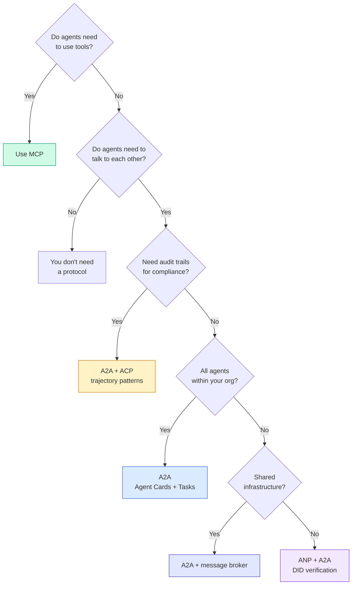

## Доведите до production

Этот урок производит:
- `code/main.ts` -- complete implementation всех четырех protocol patterns
- `outputs/prompt-protocol-selector.md` -- prompt, который помогает выбрать protocols для вашей system

## Упражнения

1. **Multi-hop task delegation.** Расширьте `TaskManager`, чтобы agent handler мог delegate subtasks другим agents. Researcher получает task, delegates "search" и "summarize" subtasks двум specialist agents, waits for both to complete, затем merges results в свои artifacts.

2. **Streaming audit trail.** Измените `AuditableRunner`, чтобы поддержать streaming mode. Вместо ожидания full result yield-ите `AuditEntry` updates in real-time по мере добавления trajectory entries. Используйте async generator, producing audit snapshots.

3. **DID rotation.** Добавьте key rotation в `IdentityRegistry`. Agent должен уметь publish a new DID document with updated keys, сохраняя `previousDid` reference. Verifiers должны принимать signatures от current и previous key during grace period.

4. **Protocol negotiation.** Реализуйте concept ANP meta-protocol. Два agents обмениваются `protocolNegotiation` messages с candidate formats (например, "I can speak JSON-RPC" vs "I prefer REST"). После max 3 rounds они agree on a format или timeout. Agreed format определяет, какой `TaskManager` или `AuditableRunner` они используют.

5. **Rate-limited discovery.** Добавьте wrapper `RateLimitedRegistry`, который caches Agent Card lookups with configurable TTL и limits discovery queries per agent per second. Симулируйте thundering herd из 100 agents, discover each other on startup, и измерьте difference.

## Ключевые термины

| Термин | Как говорят | Что это на самом деле означает |
|------|----------------|----------------------|
| MCP | "The protocol for AI tools" | Client-server protocol, с помощью которого agents discover и use tools. Agent-to-tool, not agent-to-agent. |
| A2A | "Google's agent protocol" | Peer-to-peer protocol для agent collaboration under the Linux Foundation. Discovery via Agent Cards, 9-state task lifecycle, streaming via SSE. Supports JSON-RPC, REST, and gRPC bindings. |
| ACP | "Enterprise agent messaging" | REST API IBM/BeeAI для agent runs с TrajectoryMetadata: каждый response несет full chain reasoning и tool calls. Merging into A2A. |
| ANP | "Decentralized agent identity" | Community protocol, использующий `did:wba` (DID) для cryptographic identity, HPKE для E2EE и AI-powered meta-protocol negotiation для agents, которые никогда не видели друг друга. |
| Agent Card | "An agent's business card" | JSON document at `/.well-known/agent-card.json`, описывающий skills, supported MIME types, security schemes и protocol bindings. |
| DID | "Decentralized ID" | W3C standard для cryptographically verifiable identities, hosted on the agent's own domain. ANP uses `did:wba` method. |
| TrajectoryMetadata | "The audit receipt" | Механизм ACP для attaching reasoning steps, tool calls и их inputs/outputs к каждому agent response. |
| Meta-protocol | "Agents negotiating how to talk" | Подход ANP, где agents используют natural language, чтобы dynamically agree on data formats, затем generate code для их обработки. |
| Task | "A unit of work" | Stateful object A2A, tracking work from submission through completion. Immutable once terminal. |

## Дополнительное чтение

- [Google A2A specification](https://github.com/google/A2A) -- official spec and SDKs (v1.0.0, Linux Foundation)
- [IBM/BeeAI ACP specification](https://github.com/i-am-bee/acp) -- OpenAPI 3.1 spec for agent runs and trajectory metadata
- [Agent Network Protocol](https://github.com/agent-network-protocol/AgentNetworkProtocol) -- DID-based identity, E2EE, meta-protocol negotiation
- [Model Context Protocol docs](https://modelcontextprotocol.io/) -- Anthropic's MCP specification (covered in Phase 13)
- [W3C Decentralized Identifiers](https://www.w3.org/TR/did-core/) -- identity standard underpinning ANP
- [RFC 9180 (HPKE)](https://www.rfc-editor.org/rfc/rfc9180) -- encryption scheme ANP uses for E2EE
- [FIPA Agent Communication Language](http://www.fipa.org/specs/fipa00061/SC00061G.html) -- academic precursor to modern agent protocols
