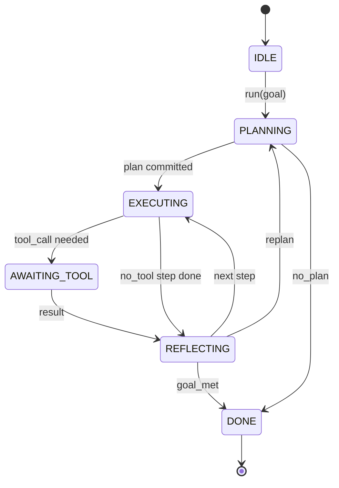

# Agent Harness Loop Contract

> Харнес — это и есть агент. Модель — сопроцессор. Этот урок фиксирует контракт цикла, к которому можно подключить любую модель.

**Тип:** Практика
**Языки:** Python
**Пререквизиты:** Фаза 13, уроки 01–07; Фаза 14, урок 01
**Время:** ~90 минут

## Цели обучения
- Специфицировать цикл агентского харнеса как детерминированную машину состояний с явными переходами.
- Реализовать десять hook-топиков жизненного цикла, к которым операторы подключают политики, телеметрию и guardrails.
- Определить две pull-точки, в которых цикл возвращает управление вызывающей стороне и возобновляется на свежем входе.
- Обеспечить соблюдение бюджетов на сессию (ходы, tool calls, wall-clock) без утечки частичного состояния при превышении.
- Излучать типизированный поток из одиннадцати типов событий, чтобы UI и трейсеры могли подписаться, не заглядывая внутрь цикла.

## Рамка

Coding-агент, работающий без присмотра сорок ходов подряд, — это не чат-цикл. Это машина состояний, узлы которой оператор может перехватывать, а рёбра — аудировать. Как только контракт записан, замена модели, инструментов или политик перестаёт быть рефакторингом. Она становится вызовом регистрации.

Этот урок строит такой контракт. Мы называем шесть состояний, десять hook-топиков, две pull-точки, одиннадцать типов событий и бюджетный конверт. Всё остальное в харнесе (реестр инструментов, JSON-RPC-транспорт, диспетчер, планировщик) подключается к этой форме.

## Состояния

В цикле шесть состояний. Пять активных. Одно терминальное.



`IDLE` — единственная легальная точка входа. `DONE` — единственный легальный выход. `AWAITING_TOOL` — единственное состояние, дающее pull-точку. Все остальные переходы внутренние.

Машина состояний детерминирована. По одному и тому же журналу событий харнес приходит в то же состояние. Именно это свойство позволяет реиграть сессии при отладке без повторных вызовов модели.

## Hook-топики

Хуки — это шов, через который оператор входит в цикл. Харнес запускает десять топиков. Каждый топик принимает любое число подписчиков. Подписчики срабатывают в порядке регистрации. Подписчик может мутировать payload, кинуть исключение и прервать ход или вернуть сентинел, чтобы пропустить следующий шаг.

```text
before_plan         after_plan
before_tool_call    after_tool_call
before_step         after_step
on_error
on_pause
on_budget_exceeded
on_complete
```

Форма повторяет то, к чему к середине 2025 года сошлись Claude Code, Cursor и OpenCode. Имена функциональные, не брендовые. Хук, блокирующий `rm -rf`, живёт в `before_tool_call`. Хук, отправляющий span в OpenTelemetry, — в `after_step`. Хук, возобновляющий приостановленную сессию, — в `on_pause`.

## Pull-точки

Цикл отдаёт управление дважды. Первый раз — на `AWAITING_TOOL`, когда без результата инструмента прогресс невозможен. Второй — на `on_pause`, когда бюджет исчерпан или хук явно запросил human review.

Pull-точка — это не исключение. Это return. Вызывающая сторона смотрит на состояние харнеса, достаёт то, что харнес запросил, и вызывает `resume(payload)`. Харнес продолжает с места остановки. Это та же форма, что у генератора в Python. Транспорт поверх pull-точки — на ваш выбор. В TUI это нажатие клавиши. Через MCP — `tools/call`. Через очередь — поллинг джобы.

## Поток событий

Цикл дописывает события в типизированный поток в конкретных точках контракта. Поток append-only, и подписчики могут реиграть его с любого смещения. Одиннадцать реализованных типов событий:

- `session.start` — излучается один раз при вызове `run(goal)`
- `plan.draft` — когда планировщик вернул черновик плана
- `plan.commit` — после того как черновик закоммичен как активный план
- `step.start` — в начале каждого исполняемого шага
- `step.end` — в конце каждого исполняемого шага
- `tool.call` — когда шаг, требующий инструмента, отдаёт управление вызывающей стороне
- `tool.result` — при возобновлении с результатом инструмента
- `tool.error` — при возобновлении с ошибкой или когда хук прервал вызов
- `budget.warn` — при достижении лимита бюджета
- `session.pause` — когда цикл уступает на паузе (бюджет или хук)
- `session.complete` — один раз, когда цикл достигает `DONE`

События не дублируют payload'ы хуков. Хуки императивны (мутировать, прервать). События наблюдательны (записать, отправить). Считайте их ортогональными.

## Бюджетный конверт

Сессия несёт три лимита. Число ходов, число tool calls, wall-clock в секундах. Каждый ход увеличивает счётчик ходов на один. Каждый tool call — счётчик вызовов на один. Wall-clock проверяется на каждом переходе состояния. Когда любой лимит достигнут, цикл запускает `on_budget_exceeded`, излучает `budget.warn`, а затем на следующей pull-точке переходит в `IDLE` с причиной budget-exceeded.

Бюджет — это не kill switch. Это yield. Вызывающая сторона решает: расширить бюджет и продолжить или закрыть сессию.

## Чего этот урок не делает

Он не вызывает модель. Не регистрирует настоящие инструменты. Не реализует транспорт. Это следующие четыре урока. Этот урок прибивает контракт, чтобы следующие четыре подключались к нему без переписывания.

Детерминированный планировщик в `main.py` — заглушка. Он возвращает захардкоженный план из трёх шагов, два из которых требуют результата инструмента. Суть в цикле, а не в плане.

## Как читать код

`HarnessLoop` — главный класс. Он держит состояние, запускает хуки, излучает события. `Budget` отслеживает лимиты. `Event` — типизированный конверт в потоке. `HookRegistry` — таблица диспетчеризации. `_transition` — единственная функция, меняющая состояние, поэтому инварианты машины состояний живут в одном месте.

Прочитайте `main.py` сверху вниз. Затем — `code/tests/test_loop.py`. Тесты фиксируют каждый переход и порядок срабатывания каждого хука.

## Куда двигаться дальше

Самое сложное в продакшен-харнесе — не машина состояний. Это принудительное исполнение контракта. Контракт должен пережить горячую перезагрузку планировщика. Пережить инструмент, вернувший битый JSON. Пережить хук, кинувший исключение в `before_tool_call` на двух третях сорокаходовой сессии. Тесты этого урока прогоняют эти режимы отказа. Запустите их. Сломайте их. Добавьте кейсы.

Следующий урок добавляет реестр инструментов. Потом — JSON-RPC-транспорт. Потом — диспетчер. К двадцать четвёртому уроку цикл из этого файла будет гонять настоящий план по настоящим инструментам с настоящими бюджетами.
