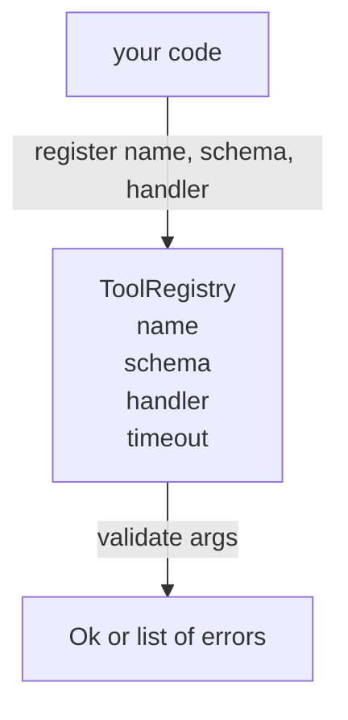

# Tool Registry with Schema Validation

> Инструмент, который агент не может провалидировать, — это инструмент, который агент не может вызвать. Постройте реестр и проверку схем раньше, чем сами инструменты.

**Тип:** Практика
**Языки:** Python
**Пререквизиты:** Фаза 13, уроки 01–07; Фаза 14, урок 01
**Время:** ~90 минут

## Цели обучения
- Держать типизированный реестр «имя инструмента → схема → обработчик», у которого диспетчер спрашивает один раз, а дальше доверяет.
- Реализовать подмножество JSON Schema 2020-12, покрывающее ключевые слова, которые реально использует девяносто процентов tool calls.
- Возвращать точные пути ошибок в форме json-pointer, чтобы модель могла самоисправиться за один round trip.
- Отклонять повторную регистрацию без явного override — молчаливые перезаписи и есть причина дрейфа продакшен-каталогов инструментов.
- Держать валидатор чистым (без I/O, времени и глобалов), чтобы его можно было перезапустить на replay-логе.

## Почему реестр идёт раньше инструмента

У coding-агента в 2026 году зарегистрировано больше инструментов, чем модель может вместить в одно контекстное окно. Нетривиальный харнес регистрирует две сотни инструментов и показывает от десяти до сорока на каждый ход. Реестр — источник правды для трёх вопросов: «какие инструменты существуют», «какой формы их аргументы» и «какой обработчик вызвать». Как только эти три ответа прибиты, остальному харнесу можно перестать гадать.

Ошибка, которой мы избегаем, — поставлять обработчики без схем или схемы без валидации. И то и другое встречается сплошь и рядом. И то и другое превращает следующий слой (диспетчер из урока двадцать три) в угадайку, где единственный режим отказа — stack trace из обработчика.

## Как выглядит запись об инструменте

```text
ToolRecord
  name        : str          (unique, lowercase alphanumeric and underscore segments separated by dots, e.g., snake_case.segment.case)
  description : str          (one line, shown to the model)
  schema      : dict         (JSON Schema 2020-12 subset)
  handler     : Callable     (async or sync, returns Any)
  idempotent  : bool         (dispatcher uses this for retry decisions)
  timeout_ms  : int          (override per-tool dispatcher default)
```

Схема — единственное поле, которое трогает валидатор. Обработчик для него непрозрачен. Мы разделяем их намеренно. Схема — это данные. Обработчик — это код. Их смешение соблазняет положить логику валидации внутрь обработчика, а это ровно тот баг, который мы останавливаем.

## Подмножество JSON Schema 2020-12

Полная спецификация 2020-12 — это целый талмуд. Нам нужно восемь ключевых слов.

```text
type           string / number / integer / boolean / object / array / null
properties     map of property name -> schema
required       list of property names
enum           list of allowed primitive values
minLength      integer, applies to strings
maxLength      integer, applies to strings
pattern        ECMA-262-compatible regex, applies to strings
items          schema applied to every array element
```

Этого достаточно, чтобы покрыть то, что реально нужно API инструмента. Ключевые слова, которые мы не добавляем (oneOf, anyOf, allOf, $ref, условные конструкции), легальны в продакшен-схемах, но превращают валидатор в обходчик дерева с циклами. Мы строим реестр, а не движок JSON Schema.

## Пути ошибок в формате json pointer

Когда валидация проваливается, валидатор возвращает список ошибок. Каждая ошибка несёт json-pointer-путь во входные данные. Pointer — это последовательность имён свойств и индексов массива, разделённая слэшами.

```text
{"a": {"b": [1, 2, "x"]}}
                    ^
                    /a/b/2
```

Модель читает пути ошибок лучше, чем предложения. Если схема требует `args.user.email`, а модель передала целое число, ошибка должна быть `/user/email` с `expected_type: string`. Модель чинит это в следующем вызове без раунда естественного языка.

## Регистрация и override

`register(name, schema, handler, **opts)` по умолчанию отклоняет повторную регистрацию. Чтобы заменить, вызывающий обязан передать `override=True`. Это операционная гигиена. Две части кодовой базы, молча регистрирующие одно имя инструмента, — тот сорт бага, который в продакшене ищут неделю.

Реестр даёт три метода чтения. `get(name)` возвращает запись или кидает исключение. `validate(name, args)` возвращает `Ok` или список ошибок. `names()` возвращает имена инструментов в порядке регистрации.

## Чем валидатор является и чем не является

Это один проход по дереву схемы, рекурсивный. Он чистый. Он не вызывает обработчики. Он не приводит типы (строка `"42"` не проходит числовую схему). Он не обрезает данные молча.

Он не является границей безопасности. Злонамеренный обработчик всё ещё может навредить после успешной валидации. Диспетчер из урока двадцать три добавляет слои таймаутов и sandbox. Реестр добавляет форму.

## Форма



## Как читать код

`code/main.py` определяет `ToolRegistry`, `ToolRecord`, `ValidationError` и восемь функций-валидаторов. Валидатор диспетчеризуется по `schema["type"]` (схему с `enum` трактует как бестиповую проверку enum). Каждый типовой валидатор возвращает либо пустой список, либо список `ValidationError`. Верхнеуровневый обходчик конкатенирует ошибки и добавляет сегменты пути по мере спуска.

`code/tests/test_registry.py` покрывает регистрацию, override, успешную валидацию, провал валидации с путями и каждое ключевое слово подмножества.

## Куда двигаться дальше

Два расширения, которые захочется сразу после этого урока, — резолв `$ref` по локальному блоку definitions и `additionalProperties: false` для строгой формы. Оба небольшие. Оба обычно добавляют, когда каталог инструментов переваливает за полсотни. Мы вынесли их за рамки урока, чтобы файл читался за один присест.

Следующий урок (двадцать два) строит JSON-RPC-транспорт по stdio, который открывает этот реестр модельному клиенту. Урок после него (двадцать три) оборачивает оба в диспетчер с таймаутами и ретраями.
