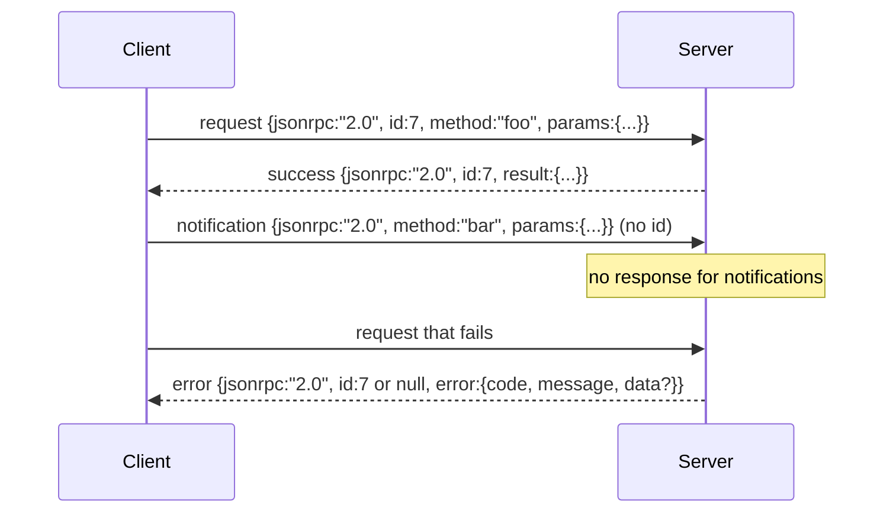

# JSON-RPC 2.0 Over Newline-Delimited Stdio

> Транспорт между модельным клиентом и tool-сервером — это JSON-RPC поверх stdio. Собрав его руками один раз, вы поймёте, за что платит любой слой фрейминга.

**Тип:** Практика
**Языки:** Python
**Пререквизиты:** Фаза 13, уроки 01–07; Фаза 14, урок 01
**Время:** ~90 минут

## Цели обучения
- Говорить на JSON-RPC 2.0, обрамлённом как newline-delimited JSON поверх stdin и stdout.
- Сопоставить пять стандартных кодов ошибок (-32700, -32600, -32601, -32602, -32603) и поднимать их с правильной семантикой.
- Различать requests, responses, notifications и batches, не изобретая новых ключей конверта.
- Обрабатывать одну ошибку парсинга на строку, не отравляя остальной поток.
- Собрать самозавершающееся демо на io.BytesIO, чтобы урок работал без порождения дочернего процесса.

## Почему JSON-RPC остаётся lingua franca

Coding-агент в 2026 году за одну сессию разговаривает с дюжиной tool-серверов. Каждый сервер — отдельный процесс или удалённый endpoint. Формат провода не менялся с 2013 года. JSON-RPC 2.0 — спецификация на две страницы. Он выживает потому, что альтернативы (gRPC, HTTP на каждый вызов, кастомный бинарный протокол) навязывают компромисс, которого у JSON-RPC нет: они выбирают либо стриминг, либо батчинг, либо привязку к транспорту. JSON-RPC симметричен поверх stdio, сокетов, вебсокетов и HTTP, и клиент может управлять сервером, который видит впервые, если оба чтут спецификацию.

Этот урок строит stdio-вариант. Newline-delimited JSON. Каждый request — одна строка. Каждый response — одна строка. Граница транспорта — `\n`.

## Форма провода

Существует четыре формы конверта. Две произносит клиент. Две — сервер.



У notification нет `id`. Сервер не должен на него отвечать. Если сервер вернёт ответ на notification, клиенту не к чему его привязать. Это единственное правило, которое сохраняет арифметику фрейминга простой.

Batch — это JSON-массив requests или notifications. Сервер отвечает массивом responses в произвольном порядке, по одному на каждую не-notification-запись. Если каждая запись в батче — notification, сервер не отвечает ничем.

## Пять кодов ошибок

```text
-32700  Parse error      JSON could not be parsed
-32600  Invalid Request  Envelope shape is wrong
-32601  Method not found
-32602  Invalid params
-32603  Internal error
```

Коды от -32000 до -32099 зарезервированы под серверные ошибки. Всё остальное определяется приложением. Урок держится пяти кодов. Если обработчик кидает исключение, транспорт заворачивает его в -32603 с именем класса исключения в `data.exception`.

У parse error особое правило. `id` в ответе — `null`, потому что запрос не распарсился даже настолько, чтобы извлечь id.

## Newline-фрейминг и демо на BytesIO

Транспорт читает по одной строке. Строка — это байты до `\n` включительно. Если строка не парсится, транспорт пишет ответ -32700 с `id: null` и продолжает. Поток не отравлен. Следующая строка парсится заново.

Для урока мы оборачиваем пару `io.BytesIO` как stdin и stdout. Сервер читает запросы до EOF, пишет ответ на каждый и возвращается. Клиент вычитывает ответы обратно. Никакого порождения процессов. Никаких таймаутов. Поведение транспорта идентично настоящему subprocess-пайпу, потому что интерфейс `io` в Python даёт тот же контракт `.readline()` и `.write()`.

## Диспетчеризация методов

Транспорт не знает, какие методы существуют. Он передаёт управление callable `handler(method, params)`, который поставляет харнес. Обработчик возвращает результат или кидает исключение. Три класса исключений маппятся на конкретные коды.

```text
MethodNotFound -> -32601
InvalidParams  -> -32602
Anything else  -> -32603 with exception name in data
```

Транспорт никогда не видит реестр инструментов. Реестр сидит за обработчиком. Это то расслоение, которое нам нужно. Транспорт говорит на JSON-RPC. Реестр — на формах инструментов. Диспетчер (урок двадцать три) сшивает их вместе.

## Поведение потока при ошибках

```text
client writes              server reads             server writes
---------------            -----------              -------------
{...valid request...}      parses ok                {...response, id matches...}
{...broken json...         parse fails              {id:null, error: -32700}
{...valid request...}      parses ok                {...response, id matches...}
{...missing method...}     invalid envelope         {id:X, error: -32600}
```

Строка с битым JSON не останавливает цикл. Отсутствующее поле `method` не останавливает цикл. Исключение в обработчике не останавливает цикл. Транспорт читает до EOF.

## Notifications и асимметричные потоки

Notification — это fire-and-forget. Харнес использует notifications для событий прогресса, сигналов отмены и строк логов. Notifications — это способ, которым долгий инструмент стримит статусы, не делая round trip на каждый.

Урок реализует один исходящий хелпер, `write_notification`. Сервер использует его, чтобы излучать прогресс, пока запрос в полёте. Демо показывает паттерн: приходит запрос, обработчик излучает две notification о прогрессе, затем пишет финальный ответ.

## Как читать код

`code/main.py` определяет `StdioTransport`, хелпер парсинга (`parse_request`), три хелпера записи (`write_response`, `write_error`, `write_notification`) и цикл диспетчеризации `serve`. Константы кодов ошибок живут на уровне модуля.

`code/tests/test_transport.py` покрывает пять кодов ошибок, notifications (ответ не пишется), batches (массив на входе, массив на выходе, notifications пропущены), битый JSON (parse error, затем продолжение) и асимметричный поток, где обработчик пишет notification посреди вызова.

## Куда двигаться дальше

Этого транспорта достаточно для следующих уроков. Продакшен-транспорты добавляют три вещи. Поле correlation id, переживающее форвардинг (ваш `id` уже играет эту роль, но в mesh нужен ещё внешний trace id). Канал отмены (notification вида `$/cancelRequest` с id вызова в полёте). И handshake согласования content-type, чтобы один сокет мог говорить и на JSON-RPC, и на Streamable HTTP. Ничто из этого не меняет провод. Это добавление метаданных.
