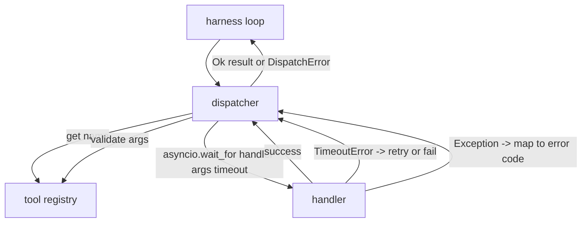
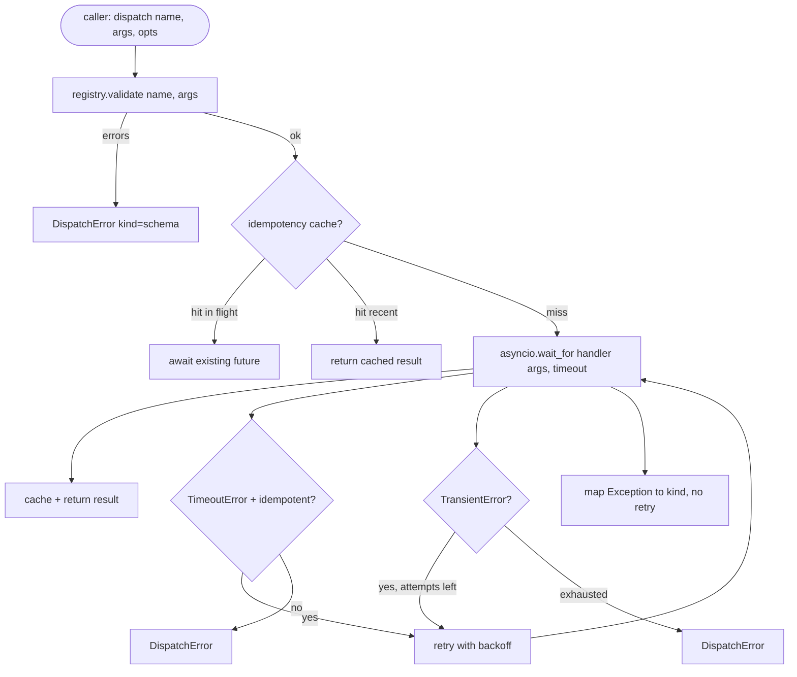

# Function Call Dispatcher

> Диспетчер — то место, где харнес платит по каждому обещанию, которое дала схема. Таймауты, ретраи, дедупликация, маппинг ошибок. Все на одном шве.

**Тип:** Практика
**Языки:** Python
**Пререквизиты:** Фаза 13, уроки 01–07; Фаза 14, урок 01
**Время:** ~90 минут

## Цели обучения
- Обернуть обработчик инструмента в таймаут на вызов, который возвращает типизированную ошибку вместо зависшего цикла.
- Применить ретраи с экспоненциальным backoff, джиттером и максимальным числом попыток.
- Дедуплицировать ретраи по ключу идемпотентности, чтобы ретрай, гоняющийся с медленным оригиналом, не выполнился дважды.
- Смаппить исключения обработчиков и сбои транспорта на единый конверт ошибки, который цикл харнеса уже понимает.
- Ограничить параллельную диспетчеризацию лимитом конкурентности, чтобы fan-out на сорок tool calls не исчерпал event loop.

## Где сидит диспетчер

Между циклом харнеса (урок двадцать) и реестром инструментов (урок двадцать один). Транспорт (урок двадцать два) кормит цикл. Цикл передает tool call диспетчеру. Диспетчер обращается к реестру, запускает обработчик и возвращает либо результат, либо конверт ошибки в форме JSON-RPC.



Диспетчер — единственный слой, который знает про таймеры, ретраи и идемпотентность. Цикл не знает. Реестр не знает. Обработчик не знает. Эта изоляция и есть суть.

## Таймауты

У каждого инструмента есть таймаут по умолчанию. Запись реестра несет `timeout_ms`. Диспетчер перекрывает его пер-вызовным override, если харнес его передал. Мы используем `asyncio.wait_for`. По таймауту задача обработчика отменяется, и диспетчер возвращает `DispatchError(kind="timeout")`.

Для неидемпотентных инструментов таймаут по умолчанию не является ретраебельной ошибкой. `db.write`, отвалившийся по таймауту, мог закоммититься, а мог и нет. Ретрай дублирует запись. Диспетчер чтит флаг `idempotent` из записи реестра. Идемпотентные инструменты ретраятся. Неидемпотентные — нет.

## Ретраи с экспоненциальным backoff

Политика ретраев — максимум три попытки. Backoff экспоненциальный с джиттером.

```text
attempt 1  -> delay 0
attempt 2  -> delay 0.1s * (1 + random[0..0.5])
attempt 3  -> delay 0.4s * (1 + random[0..0.5])
```

Ретраятся только ошибки `timeout` и `transient`. Ошибка `schema`, `not_found` или `internal` не ретраится. Схемные ошибки детерминированы. Ретрай не меняет исход и сжигает бюджет.

Цикл ретраев уважает бюджет харнеса. Если у вызывающей стороны в бюджете ноль оставшихся tool calls, диспетчер падает быстро на первой попытке и возвращает `kind="budget_exceeded"`.

## Дедупликация по ключу идемпотентности

Ретрай, стартующий, пока оригинал еще в полете, — реальный продакшен-баг. Первый вызов висит на четырех и девяти десятых секунды (чуть меньше таймаута). Ретрай стартует на пятой секунде. Теперь два запроса гоняются к одному бэкенду. Если инструмент — `payments.charge`, вы списали деньги дважды.

Диспетчер принимает опциональный `idempotency_key`. Если такой же ключ уже в полете, когда приходит вызов, диспетчер ждет на in-flight future и возвращает его результат. Кэш держит ключи шестьдесят секунд после завершения, чтобы поглотить поздние ретраи.

Ключ — ответственность вызывающей стороны. Харнес выводит его из планировщика: `f"{step_id}:{tool_name}:{hash(args)}"`. Диспетчер не изобретает ключи сам, потому что ключ, выведенный только из аргументов, делает два семантически разных вызова неотличимыми.

## Конверт ошибки

Провалившаяся диспетчеризация возвращает единую форму.

```text
DispatchError
  kind        : "timeout" | "transient" | "schema" | "not_found" | "internal" | "budget_exceeded"
  message     : str
  attempts    : int
  jsonrpc_code: int   (one of -32601, -32602, -32603)
```

Цикл харнеса маппит `kind` на следующее состояние. `schema` и `not_found` уходят в `on_error` и триггерят replan. `timeout` и `transient` уходят в `on_error` и могут вести к replan в зависимости от числа попыток. `budget_exceeded` триггерит `on_budget_exceeded`.

## Лимит конкурентности на fan-out

`gather(*calls)` запускает все корутины одновременно. При сорока tool calls это сорок открытых сокетов или сорок subprocess-пайпов. Большинству бэкендов не нравятся сорок параллельных подключений от одного клиента.

Диспетчер оборачивает `gather` в семафор. Лимит конкурентности по умолчанию — восемь. Каждый вызов забирает семафор перед диспетчеризацией и отпускает по завершении. Вызывающая сторона видит выход в форме `gather`, но фактическое расписание ограничено.

## Поток одного вызова



## Как читать код

`code/main.py` определяет `Dispatcher`, `DispatchError` и `TransientError`. Диспетчер получает реестр при конструировании. Асинхронный `dispatch(name, args, ...)` — единственная точка входа. Таймауты на попытку применяются инлайн внутри `_run_with_retries` через `asyncio.wait_for`. `gather_bounded(calls)` запускает много диспетчеризаций с лимитом конкурентности.

`code/tests/test_dispatcher.py` покрывает срабатывание таймаута, ретрай на transient, отсутствие ретрая на схемной ошибке, дедупликацию по идемпотентности (два конкурентных вызова с одним ключом схлопываются в один запуск обработчика) и ограничение конкурентности (семафор в действии).

Тесты используют `asyncio.sleep(0)` и детерминированные обработчики на `Counter`, поэтому завершаются за миллисекунды и не зависят от wall-clock.

## Куда двигаться дальше

Два расширения, которые добавляют продакшен-диспетчеры. Первое — структурное логирование на каждом переходе (поток событий цикла это уже дает, но диспетчер должен излучать и свои события `dispatch.attempt` и `dispatch.retry`). Второе — circuit breakers: после N сбоев в окне инструмент получает период охлаждения, когда диспетчеризации немедленно возвращают `kind="circuit_open"` вместо попытки вызвать обработчик. Оба ложатся поверх этого диспетчера без изменения контракта.

Урок двадцать четыре приклеивает диспетчер к plan-and-execute-агенту, и вы увидите все четыре части в движении.

## Дополнительное чтение

- Фаза 13, уроки 02–03 — глубокий разбор function calling и параллельные вызовы.
- Фаза 19, урок 21 — реестр инструментов, урок 22 — транспорт, урок 24 — plan-execute.
