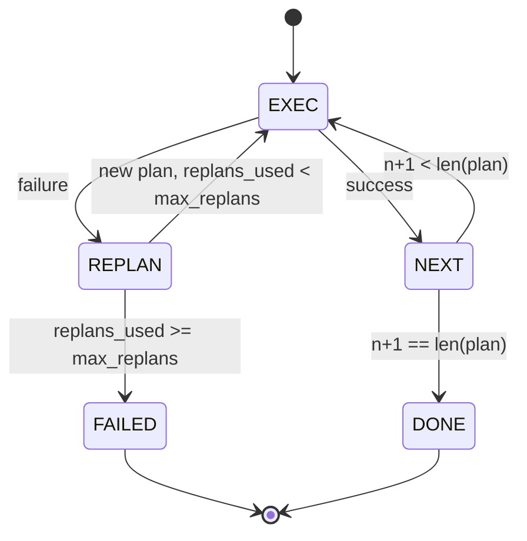

# Plan-Execute Control Flow

> План, не переживающий сбой, — это скрипт. Скрипт, умеющий перепланироваться, — это агент. Сначала постройте репланер.

**Тип:** Практика
**Языки:** Python
**Пререквизиты:** Фаза 13, уроки 01–07; Фаза 14, урок 01
**Время:** ~90 минут

## Цели обучения
- Представить план как упорядоченный список типизированных шагов, чтобы исполнитель мог рассуждать о прогрессе и исходе.
- Исполнять шаги последовательно с контролируемой передачей сбоя обратно планировщику.
- Перепланировать с текущего курсора, передавая предыдущую ошибку в контекст, чтобы следующий план был информированным.
- Излучать diff плана при каждой ревизии, чтобы трейсер или UI ниже по течению могли показать, почему план изменился.
- Обеспечить два бюджета: жёсткий потолок шагов и жёсткий потолок перепланирований.

## Plan and execute, а не chain-of-thought

Chain-of-thought-агент излучает токены и оставляет циклу гадать, где заканчивается tool call. Plan-and-execute-агент сначала излучает структурированный план, а затем детерминированно исполняет каждый шаг. План — это данные, которые харнес может интроспектировать. Исполнение — это харнес, прогоняющий эти данные через диспетчер.

Две части. Планировщик, порождающий план. Исполнитель, прогоняющий план. Самое интересное — что происходит, когда исполнитель натыкается на сбой. Три варианта:

```text
1. Abort         (return failed, surface the error)
2. Skip          (mark step failed, continue with the rest)
3. Replan        (hand the error to the planner, get a new plan from the cursor)
```

Replan — тот вариант, который превращает скрипт в агента.

## Форма Step

```text
Step
  id              : int           (monotonic within a plan revision)
  tool_name       : str
  args            : dict
  expected_outcome: str           (planner's stated success condition)
  result          : Any | None
  error           : str | None
```

`expected_outcome` — короткое предложение, которое планировщик излучает вместе с шагом. Исполнитель его не проверяет. Оно нужно для двух вещей: репланер читает его при ревизии плана; поток событий излучает его, чтобы трейсер мог показать «этот шаг должен был сделать X».

## Форма планировщика

```python
def planner(goal: str, history: list[Step], last_error: str | None) -> list[Step]:
    ...
```

Чистая функция. `goal` — цель пользователя. `history` — уже исполненные шаги (с заполненными результатами и ошибками). `last_error` — None на первом вызове и сообщение о последнем сбое на каждом последующем. Планировщик возвращает следующий план, начиная с курсора.

Планировщик не знает про исполнителя. Не знает про ретраи. Не знает про таймауты. Он порождает план. Точка.

## Исполнитель

Исполнитель — маленькая машина состояний. Каждый шаг проходит через диспетчер. Исход — одно из трёх: успех, сбой-с-перепланированием, сбой-фатальный. Перепланируемые сбои возвращаются планировщику. Фатальные (превышен бюджет, достигнут потолок перепланирований) возвращают результат сессии `FAILED`.



## Diff плана при ревизии

Когда планировщик возвращает новый план после сбоя, исполнитель излучает событие `plan.diff` с тремя полями.

```text
removed: list of step ids that were in the old plan and are not in the new
added  : list of step ids in the new plan that were not in the old
revised: list of step ids whose tool_name or args changed
```

Трейсер или UI могут отрисовать это как зачёркивание удалённых шагов и подсветку добавленных. Суть не в формате diff. Суть в том, что ревизия — видимое событие, а не молчаливое переписывание.

## Два бюджета, оба жёсткие

`max_steps` ограничивает общее число исполнений шагов за всю сессию, включая перепланирования. По умолчанию — двенадцать. Линейный план из пяти шагов, который дважды перепланируется и каждый раз добавляет по три шага, доходит до шестнадцати исполнений и превысил бы бюджет. Исполнитель откажет в перепланировании и вернёт FAILED.

`max_replans` ограничивает число вызовов планировщика после первого плана. По умолчанию — пять. Это более важный лимит. Планировщик, пять раз подряд возвращающий один и тот же сломанный план, иначе крутился бы, пока его не поймает бюджет шагов. Потолок перепланирований делает сбой быстрее, а причину — яснее.

## Детерминированный планировщик этого урока

В этом уроке мы не вызываем модель. Урок поставляется с детерминированным планировщиком, который выбирает план по `last_error`.

```text
last_error is None    -> emit a four-step plan
last_error matches X  -> emit a three-step plan that routes around X
last_error matches Y  -> emit a two-step plan that gives up gracefully
otherwise             -> return [] (signals nothing to replan)
```

Этого достаточно, чтобы протестировать поведение исполнителя на каждом пути переходов: успех, одно перепланирование, два перепланирования, исчерпание перепланирований и исчерпание бюджета шагов.

## Форма результата

```text
SessionResult
  status      : "completed" | "failed"
  reason      : str     ("goal_met" | "step_budget" | "replan_budget" | "no_plan")
  history     : list[Step]
  revisions   : list[PlanDiff]
  events      : list[Event]
```

Цикл харнеса из урока двадцать может читать это напрямую. Диспетчер из урока двадцать три исполняет каждый шаг. Реестр из урока двадцать один валидирует аргументы каждого шага. Транспорт из урока двадцать два поднял бы весь этот поток по JSON-RPC модельному клиенту.

## Как читать код

`code/main.py` определяет `PlanExecuteAgent`, `Step`, `PlanDiff`, `SessionResult` и детерминированный планировщик. Исполнитель — единственный метод `run(goal)`, возвращающий `SessionResult`. Diff плана вычисляется сравнением id шагов и кортежей `(tool_name, args)`.

`code/tests/test_agent.py` покрывает линейный успех, сбой посреди плана с одним перепланированием, исчерпание перепланирований с `failed:replan_budget`, исчерпание бюджета шагов и формат события plan-diff.

## Куда двигаться дальше

Два расширения, которые понадобятся при подключении настоящей модели. Первое — кэширование частичного плана: когда план успешен на первых трёх шагах из шести и потом падает, вы не хотите перегонять первые три. Исполнитель уже хранит историю; планировщику остаётся её прочитать. Второе — параллельные ветки: текущий исполнитель строго последователен. Планировщик, излучающий независимую ветку (`gather_step` вместо `next_step`), может прогнать два tool call конкурентно через диспетчер.

Оба добавляют реальную сложность. Оба легче добавить, когда линейный исполнитель прибит. Именно это делает этот урок.
