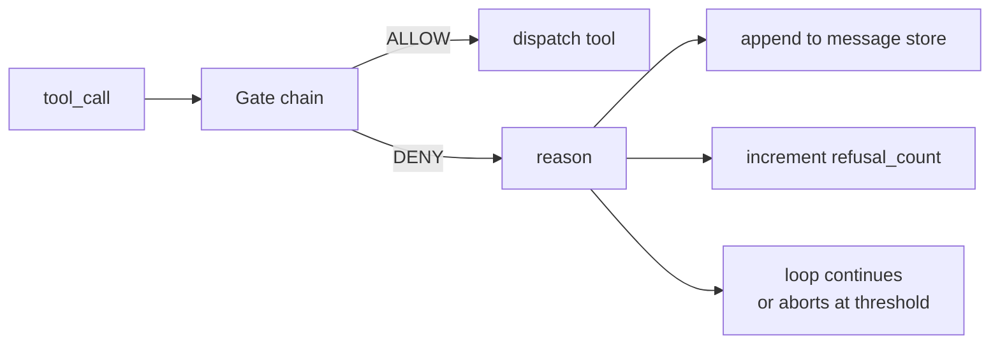
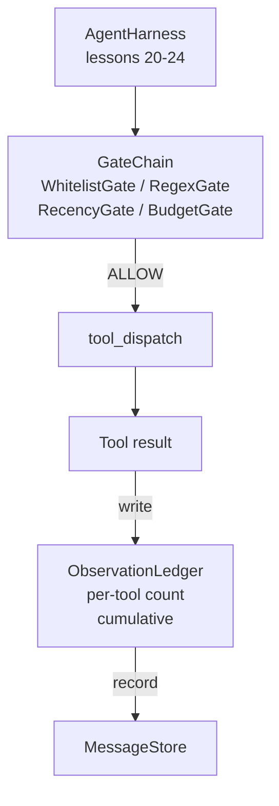

# Capstone Lesson 25: Verification Gates and the Observation Budget

> Агентский харнес без слоя верификации — это желание в плаще. Этот урок строит детерминированную цепочку gates, которая решает, разрешено ли tool call выстрелить, сколько его вывода агенту позволено увидеть и когда цикл обязан остановиться, потому что агент прочитал слишком много. Цепочка — это композиция маленьких именованных gates плюс журнал наблюдений, отслеживающий каждый токен, показанный модели.

**Тип:** Практика
**Языки:** Python (stdlib)
**Пререквизиты:** Фаза 19 · 20–24 (трек A1: цикл агента, реестр инструментов, message store, prompt builder, model router), Фаза 14 · 33 (инструкции как ограничения), Фаза 14 · 36 (scope-контракты), Фаза 14 · 38 (verification gates)
**Время:** ~90 минут

## Цели обучения

- Построить протокол `VerificationGate` с детерминированным методом `evaluate(call)`.
- Скомпоновать budget-, recency-, whitelist- и regex-gates в цепочку с short-circuit-семантикой.
- Отслеживать каждое наблюдение через `ObservationLedger` с ключами по инструменту и ходу.
- Отклонять tool call, когда суммарный бюджет наблюдений был бы превышен.
- Выдавать структурную запись `GateDecision`, которую может поглотить observability ниже по течению.

## Проблема

Когда агентский харнес позволяет модели свободно вызывать инструменты, в первый же час реального использования проявляются три класса багов.

Первый — неограниченное наблюдение. Grep по репозиторию в 200 тысяч строк вываливает полмиллиона токенов вывода в следующий ход. Модель видит одно совпадение на килобайт, а остальной контекст потрачен впустую. Счет за токены большой, а агент теперь справляется с задачей хуже, а не лучше.

Второй — протухшая свежесть. Долгая задача накапливает пятьдесят tool calls. Модель перечитывает первый read_file с третьего хода так, будто это живое состояние. Правки, сделанные на сорок седьмом ходу, не видны, потому что prompt builder сериализовал самые ранние наблюдения первыми.

Третий — ползучее расширение привилегий. Исследовательская задача начинается с вызова `web_search`, а потом каким-то образом заканчивается запуском `shell`, потому что модель выдумала имя инструмента, а харнес по умолчанию оказался пермиссивным. К моменту, когда кто-то читает трейс, в /tmp лежит мусорный файл, а curl сходил в приватный API.

Verification gate — это компонент харнеса, который говорит «нет». Это не модель. Это не судья. Это детерминированная функция от `(call, history, ledger)`, возвращающая ALLOW или DENY с причиной. Причина логируется. Модели сообщается. Цикл продолжается или прерывается.

## Концепция



Gate — это что угодно с методом `evaluate(call, ctx) -> GateDecision`. Цепочка — упорядоченный список. Вычисление обрывается на первом deny. Порядок важен: дешевые структурные gates идут раньше дорогих, считающих токены.

Урок поставляет четыре gate:

- `WhitelistGate`. Разрешенные имена инструментов — явное множество. Все вне его отклоняется. Это самый дешевый gate, он идет первым.
- `RegexGate`. Аргументы инструмента матчатся против regex. Полезен, чтобы отклонять shell-вызовы с `rm -rf` внутри или HTTP-вызовы к внутренним IP. Чистая функция от payload вызова.
- `RecencyGate`. Модель видит наблюдения только за последние N ходов. Более старые маскируются. Gate отклоняет tool call, чей результат продлил бы окно наблюдения, которое уже устарело.
- `BudgetGate`. У суммарного числа токенов, прочитанных моделью за сессию, есть потолок. Когда журнал говорит, что потолок достигнут, каждый следующий tool call отклоняется.

Журнал наблюдений — это бухгалтерия. Каждый успешный tool call пишет одну строку: имя инструмента, ход, излученные токены, накопленный итог. Журнал отвечает на два вопроса: сколько модель увидела всего и сколько — от инструмента X. Budget gate читает первое. Пер-инструментный budget gate, который вы напишете в упражнении, читает второе.

## Архитектура



Харнес спрашивает цепочку. Цепочка либо кивает, либо отказывает. Если кивает — инструмент запускается, журнал тикает, результат дописывается в message store. Если отказывает — модель получает отказ как системное сообщение, и цикл решает: повторить или прервать.

## Что вы соберете

Реализация — один `main.py` плюс тесты.

1. Датаклассы `Observation` и `ToolCall` задают форматы на проводе.
2. `ObservationLedger` записывает строки `(turn, tool, tokens)` и отвечает на `cumulative()` и `per_tool(name)`.
3. `GateDecision` несет `(allow, reason, gate_name)`.
4. `VerificationGate` — протокол. Каждый gate реализует `evaluate(call, ctx)`.
5. `GateChain` оборачивает упорядоченный список. Он вызывает каждый gate, возвращает первый deny или allow, если каждый gate прошел.
6. Демо гоняет крошечный синтетический цикл агента. Три хода. Третий ход спотыкается о budget gate, и цикл сообщает о чистом отказе с ненулевым счетчиком отказов.

Счетчик токенов — намеренно глупая эвристика `len(text) // 4`. Суть урока — обвязка gates, а не токенизатор. В продакшене подставьте настоящий токенизатор.

## Почему важен порядок в цепочке

Deny дешевле, чем allow. `WhitelistGate` работает за O(1)-поиск в хэше. `RegexGate` — за O(pattern * argv). `RecencyGate` читает маленький срез message store. `BudgetGate` читает весь журнал. Вы упорядочиваете их по возрастанию стоимости, чтобы отклоненный вызов оборвался до дорогой работы.

Еще вы упорядочиваете их по радиусу поражения. Whitelist — самое сильное утверждение: этого инструмента нет в контракте. Regex gate следующий: этого аргумента нет в контракте. Recency идет после: харнесу все еще не все равно, но вызов структурно легален. Budget — последний, потому что по определению он срабатывает, только когда все остальное прошло.

## Как это стыкуется с остальным треком A

Предыдущие уроки дали вам цикл, реестр инструментов, message store, prompt builder и model router. Этот урок добавляет слой между моделью и инструментами. Урок 26 поставляет sandbox, которому диспетчер передает tool call после того, как цепочка gates сказала ALLOW. Урок 27 поставляет eval-харнес, записывающий счетчики отказов как сигнал качества. Урок 28 подключает решения gates к span'ам OpenTelemetry. Урок 29 сшивает все в работающего coding-агента.

## Запуск

```bash
cd phases/19-capstone-projects/25-verification-gates-observation-budget
python3 code/main.py
python3 -m pytest code/tests/ -v
```

Демо печатает трейс ход за ходом, включая каждое решение gate, и выходит с нулем. Тесты покрывают журнал, каждый gate в изоляции, short-circuit цепочки и синтетический цикл end-to-end.

## Дополнительное чтение

- Фаза 14, урок 38 — verification gates, урок 33 — инструкции как ограничения.
- Фаза 19, урок 26 — sandbox, работающий после ALLOW, урок 27 — eval-харнес, оценивающий отказы.
