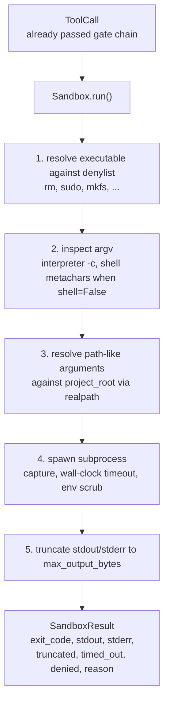
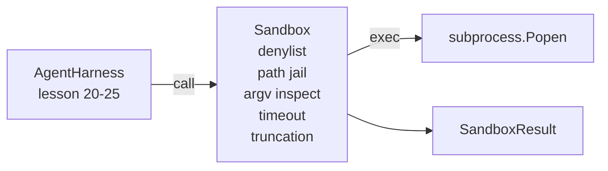

# Capstone Lesson 26: Sandbox Runner with Denylist and Path Jail

> Verification gate решает, должен ли tool call запускаться. Sandbox решает, что происходит, когда он запустился. Этот урок поставляет subprocess-раннер, который отказывает опасным исполняемым файлам, отказывает опасным формам argv, сажает каждый файловый путь в клетку project root, усекает раздутый вывод и убивает процессы-беглецы по wall-clock-таймауту. Это второй из двух слоёв между моделью и операционной системой.

**Тип:** Практика
**Языки:** Python (stdlib)
**Пререквизиты:** Фаза 19 · 25 (verification gates и бюджет наблюдений), Фаза 14 · 33 (инструкции как ограничения), Фаза 14 · 38 (verification gates)
**Время:** ~90 минут

## Цели обучения

- Построить класс `Sandbox`, оборачивающий `subprocess.run` с таймаутом, захватом и усечением вывода.
- Отказывать команде по имени против denylist и по структуре против инспектора argv.
- Отказывать любому path-аргументу, резолвящемуся за пределы объявленного project root.
- Отказывать shell-метасимволам, когда shell-режим выключен.
- Возвращать структурный `SandboxResult`, который могут поглотить observability и eval-харнес ниже по течению.

## Проблема

Coding-агент с доступом к shell может за один ход поставить бэкдоры, слить ключи, окирпичить ноутбук разработчика и накрутить облачный счёт. Самая дешёвая защита — не давать ему shell. Вторая по дешевизне — sandbox, говорящий «нет» точному списку паттернов.

В трейсах агентов повторяются три класса сбоев.

Первый — опасные исполняемые файлы. Модель под давлением задачи «почини путь» попробует `sudo`, `chmod -R 777`, `rm -rf`, `mkfs`, `dd`. Ничему из этого не место в прогоне агента. Denylist ловит их по имени и по алиасу.

Второй — трюки с argv. Модель, которой сказали «без shell», протащит атаку через интерпретатор: `python3 -c "import os; os.system('rm -rf /')"`, `bash -c '...'`, `node -e '...'`, `perl -e '...'`. Sandbox должен знать: любой интерпретатор, запущенный с флагом вида `-c`, — это shell-вызов с лишними шагами.

Третий — побег по пути. Модели сказали прочитать `./src/main.py`, а она читает `../../etc/passwd`. Sandbox сажает каждый path-аргумент в клетку, резолвя его через `os.path.realpath` и проверяя префикс.

Sandbox — не граница безопасности в смысле операционной системы. Решительный атакующий с исполнением кода всё равно выберется. Sandbox — это guardrail времени разработки: он делает частые режимы отказа громкими и не даёт агенту навредить по чистой неуклюжести.

## Концепция



У sandbox четыре оси отказа: имя, argv, путь, структура. Каждая ось — чистая функция от вызова, ещё без subprocess. Subprocess порождается только после того, как каждая ось пройдена.

Коды выхода `SandboxResult` — конвенциональные: 0 — успех, ненулевой — сбой, плюс три сентинел-кода: denied (-100), timed_out (-101) и truncated (код выхода настоящий, но выставлен флаг). Последующие уроки читают этот структурный результат вместо парсинга stderr.

## Архитектура



Denylist — это frozenset базовых имён исполняемых файлов. Алиасы (`/bin/rm`, `/usr/bin/rm`) резолвятся в одно базовое имя. Инспектор argv знает форму интерпретатора: любой argv, где argv[0] — интерпретатор, а любой последующий аргумент начинается с `-c` или `-e`, отклоняется. Shell-метасимволы (`;`, `|`, `&`, `>`, `<`, обратные кавычки, `$()`) приводят к отказу, если вызов явно не запросил shell.

Path jail — самая тонкая часть. Sandbox получает `project_root` при конструировании. Любой аргумент, похожий на путь (содержит `/` или совпадает с существующим файлом), нормализуется через `os.path.realpath`, а затем сверяется с realpath корня проекта. Если резолвленная цель не под корнем — отказ. Попытки побега через симлинки (симлинк в корне проекта, указывающий наружу) блокируются проверкой realpath, а не буквального пути.

## Что вы соберёте

Реализация — `main.py` плюс директория тестов.

1. Датакласс `SandboxResult`: exit_code, stdout, stderr, truncated, timed_out, denied, reason, duration_ms.
2. Датакласс `SandboxConfig`: project_root, max_output_bytes, timeout_seconds, denylist, interpreter_block.
3. Класс `Sandbox`: `run(argv, *, shell=False, cwd=None)` возвращает `SandboxResult`.
4. Внутренние хелперы отказа: `_check_executable_denylist`, `_check_argv_interpreter`, `_check_shell_metachars`, `_check_path_jail`.
5. Усечение вывода с явным флагом `truncated` и строкой-маркером в захваченном потоке.
6. Демо внизу файла: последовательность легитимных и враждебных вызовов. Каждый показан со своим результатом.

Sandbox использует `subprocess.run` с `shell=False` по умолчанию и `capture_output=True`. Wall-clock-таймаут задаётся аргументом `timeout`; на `TimeoutExpired` sandbox убивает группу процессов и синтезирует SandboxResult.

## Почему это не настоящий sandbox

Урочный sandbox не использует namespaces, cgroups, seccomp, gVisor, Firecracker или какую-либо изоляцию уровня ядра. Всё, что может subprocess, может и sandbox. Защита структурная: агенту отказано в самых частых опасных инвокациях, а громкий отказ уходит в observability вместо молчаливого исполнения.

Для продакшен-агентов слоите сверху: запуск в непривилегированном Docker-контейнере, запуск в microVM, сброс capabilities, монтирование корня проекта read-only и scratch-директории read-write, ulimit на память и CPU, зачистка окружения до известно-безопасного whitelist. Урок 29 делает часть этого. Изоляция уровня операционной системы — за рамками этого урока.

## Запуск

```bash
cd phases/19-capstone-projects/26-sandbox-runner-denylist
python3 code/main.py
python3 -m pytest code/tests/ -v
```

Демо создаёт временную директорию, кладёт в неё чистый файл и прогоняет батарею вызовов. Легальные вызовы успешны. Отклонённые возвращают SandboxResult с `denied=True` и причиной. Таймауты возвращают `timed_out=True`. Усечение выставляет `truncated=True`. Демо печатает JSON-таблицу исходов и выходит с нулём.

## Как это стыкуется с остальным треком A

Урок 25 дал цепочку gates. Урок 26 — исполнитель, работающий после ALLOW от gate. Eval-харнес урока 27 сравнивает результаты sandbox с ожидаемым кодом выхода по задаче. Урок 28 излучает span `gen_ai.tool.execution` вокруг каждого вызова `Sandbox.run`. End-to-end-демо урока 29 проводит настоящего coding-агента через оба слоя.
