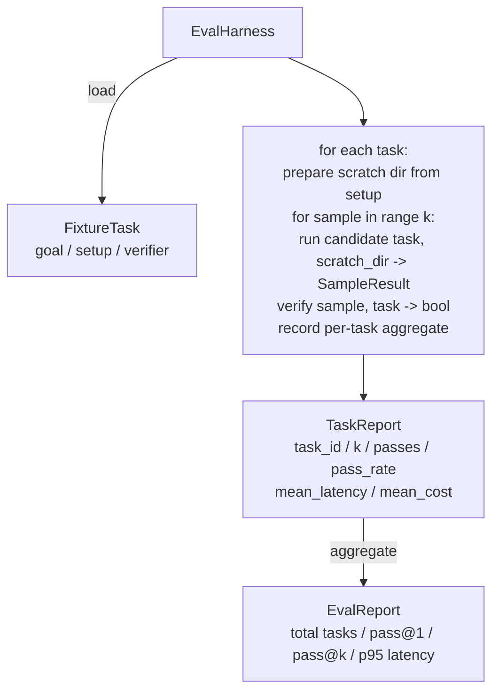

# Capstone Lesson 27: Eval Harness with Fixture Tasks

> Coding-агент хорош ровно настолько, насколько хорош набор задач, которым вы его измеряете. Этот урок строит eval-харнес, который берёт папку fixture-задач, прогоняет каждую через агента-кандидата, оценивает pass/fail детерминированным верификатором и агрегирует результаты в pass@1, pass@k, среднюю задержку и среднюю стоимость. Харнес — источник правды, позволяющий отличить регрессию от рефакторинга.

**Тип:** Практика
**Языки:** Python (stdlib)
**Пререквизиты:** Фаза 19 · 25 (verification gates), Фаза 19 · 26 (sandbox-раннер), Фаза 14 · 30 (eval-driven разработка агентов), Фаза 14 · 19 (бенчмарки SWE-bench и GAIA)
**Время:** ~90 минут

## Цели обучения

- Определить fixture-задачу как тройку из цели, setup и верификатора.
- Оценивать несколько прогонов-сэмплов на задачу и вычислять pass@1 и pass@k.
- Агрегировать задержку и стоимость в среднее и 95-й перцентиль.
- Собрать детерминированные верификаторы (diff файла, код выхода, regex-совпадение) в переиспользуемые функции.
- Излучать структурный JSON-отчёт, который может поглотить скрипт трекинга регрессий.

## Проблема

Агентские бенчмарки, собранные без eval-харнеса, страдают от трёх режимов отказа.

Первый — неверифицированный pass. Агент говорит, что починил баг, человек мельком смотрит на diff, набор помечается зелёным, а через три недели регрессионный тест поднимает тот же баг. Агент правдоподобно порассуждал, ничего на самом деле не починив.

Второй — незамеченная регрессия. Изменение шаблона промпта делает агента на 4% лучше на громкой задаче и на 14% хуже на тихой. Без goldset и пер-задачного скора регрессия въезжает в main и всплывает, только когда пожалуется клиент.

Третий — дрейф задач. В понедельник eval гоняли на 100 задачах, а в пятницу — на 95 из них, потому что кто-то переименовал пять фикстур. Pass rate выглядит как улучшение на 5%. Это не так.

Харнес — программа, превращающая эти сбои в факты. Он прогоняет каждую фикстуру, каждый раз, в воспроизводимом порядке, против верификатора, возвращающего true или false по детерминированной проверке.

## Концепция

```mermaid
flowchart LR
  F1[fixtures/task_001/<br/>task.json + expected/] --> Harness
  F2[fixtures/task_002/<br/>...] --> Harness
  Harness[Harness<br/>for each task:<br/>setup / run agent k samples /<br/>verify each sample /<br/>record latency, cost]
  Harness --> Report[EvalReport<br/>pass@1 / pass@k<br/>mean ms / p95 ms<br/>mean cost]
```

`FixtureTask` — маленький JSON-файл плюс опциональная директория `expected/`. JSON объявляет `id`, `goal` (промпт, скармливаемый агенту), блок `setup` (файлы, раскладываемые в scratch-директорию) и блок `verifier`. Блок верификатора называет функцию в реестре верификаторов харнеса и передаёт ей аргументы.

Три формы верификаторов покрывают большинство полезных задач.

Первая — `file_equals`. После прогона агента именованный файл сравнивается с ожидаемым содержимым. Ловит задачи «почини этот баг ровно вот так».

Вторая — `regex_match`. Содержимое именованного файла матчится против regex. Ловит задачи «функция должна существовать и возвращать X», где приемлемых решений много.

Третья — `shell_exit_zero`. Харнес запускает shell-команду (через sandbox из урока 26) и засчитывает задачу, только если команда вышла с нулём. Ловит задачи «тесты должны проходить».

Харнес прогоняет каждую задачу `k` раз. Pass@k — это `1 - (1 - p)^k`, где p — эмпирический pass rate; харнес также сообщает сырые счётчики, чтобы была видна дисперсия. Задержка — wall-clock на сэмпл. Стоимость — то, что агент сам о себе сообщает (число токенов, USD или оба); харнес суммирует её по сэмплам и показывает пер-задачные и агрегированные числа.

```figure
pass-at-k
```

## Архитектура



Кандидат — это callable: `Callable[[FixtureTask, str], SampleResult]`. Харнес создаёт scratch-директорию через `tempfile.mkdtemp()` и передаёт её путь обычной строкой. Харнесу всё равно, как устроен кандидат. Кандидатом может быть детерминированный применитель патчей (полезно для самотестов харнеса), настоящий LLM-агент, фаззер. Контракт — это SampleResult.

## Что вы соберёте

`main.py` поставляет:

1. Датакласс `FixtureTask`.
2. Датакласс `SampleResult`: success_self_reported, latency_ms, cost_units, edits.
3. Датаклассы `TaskReport`, `EvalReport` с `to_dict()`.
4. `VerifierRegistry`, маппящий имя верификатора на функцию. Встроенные верификаторы: file_equals, regex_match, shell_exit_zero.
5. Класс `EvalHarness`. Прогоняет директорию задач против кандидата. Возвращает EvalReport.
6. Пять fixture-задач в комплекте в `tasks/`:
   - off-by-one в `fizzbuzz`
   - пропущенный return в `factorial`
   - опечатка в сообщении об ошибке
   - пустое тело функции
   - off-by-one в обходе связного списка
7. Детерминированный референсный кандидат (`apply_known_fixes`), на котором харнес демонстрирует чистый pass@1 = 1.0.
8. Демо печатает JSON EvalReport и выходит с нулём.

Fixture-задачи лежат JSON-файлами в `tasks/` плюс парные исходники в `tasks/<id>/buggy/` и `tasks/<id>/expected/`. Харнес копирует buggy в scratch-директорию, отдаёт её кандидату и верифицирует против expected.

## Почему pass@k, а не только pass@1

Настоящие LLM-агенты стохастичны. Pass@1 в 0.6 выглядит провалом. Pass@5 в 0.95 говорит, что агент в большинстве случаев доходит до правильного ответа, но ошибается на ранних сэмплах. Лечение — сэмплирование и ранжирование, а не обязательно дообучение. Pass@k делает это видимым.

Pass@k публикуется рядом с pass@1, потому что pass@k замазывает реальный провал: если модель отвечает правильно один раз из двадцати, полезного агента у вас нет. Харнес показывает оба числа.

## Как это стыкуется с остальным треком A

Урок 25 дал цепочку gates. Урок 26 дал sandbox. Харнес использует sandbox для любого верификатора `shell_exit_zero`. Урок 28 оборачивает каждый прогон харнеса в OTel-трейс. Урок 29 гоняет end-to-end-демо против одной из комплектных фикстур и утверждает pass@1 = 1.0 для референсного кандидата.

## Запуск

```bash
cd phases/19-capstone-projects/27-eval-harness-fixture-tasks
python3 code/main.py
python3 -m pytest code/tests/ -v
```

Демо печатает EvalReport в JSON, включая pass@1, pass@5, среднюю задержку и пер-задачную разбивку. Код выхода — ноль. Тесты покрывают функции-верификаторы, математику pass@k, загрузку фикстур и харнес end-to-end против комплектного референсного кандидата.
