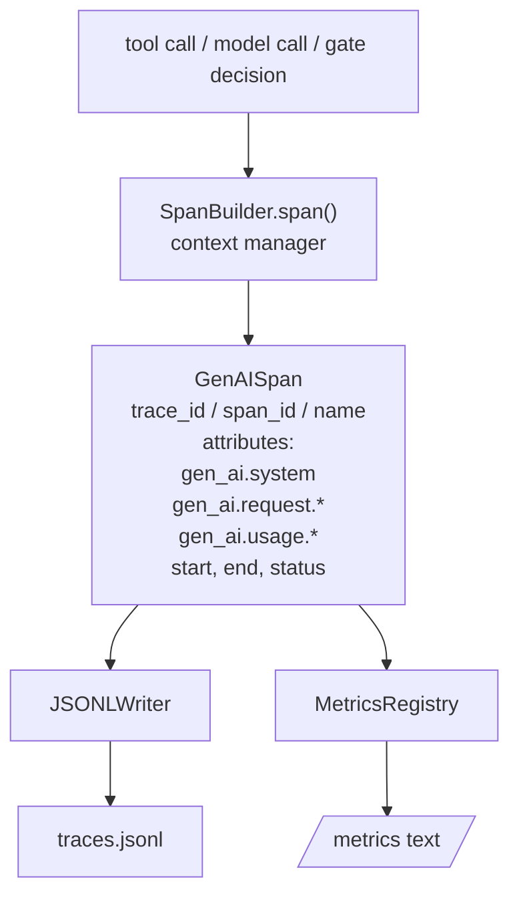
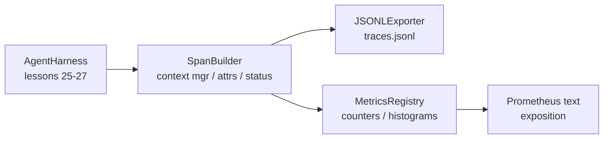

# Capstone Lesson 28: Observability with OTel GenAI Spans and Prometheus Metrics

> Агентский харнес без observability — это черный ящик, который стоит денег. Этот урок вручную собирает построитель span'ов, излучающий записи по семантическим конвенциям OpenTelemetry GenAI, пишет их в JSON-Lines-файл по одному span'у на строку и открывает счетчики и гистограммы в текстовом формате Prometheus. Все на stdlib Python и работает офлайн.

**Тип:** Практика
**Языки:** Python (stdlib)
**Пререквизиты:** Фаза 19 · 25 (verification gates), Фаза 19 · 26 (sandbox), Фаза 19 · 27 (eval-харнес), Фаза 13 · 20 (OpenTelemetry GenAI), Фаза 14 · 23 (конвенции OTel GenAI)
**Время:** ~90 минут

## Цели обучения

- Построить датакласс span'а по форме семантических конвенций OpenTelemetry GenAI.
- Реализовать JSONL-экспортер, пишущий один самодостаточный span на строку.
- Построить счетчики и гистограммы с метками и экспозицией в текстовом формате Prometheus.
- Обернуть любой callable в контекст-менеджер span'а, записывающий длительность, статус и исключения.
- Убедиться, что излученные span'ы совершают round trip через `json.loads` и совпадают с формой спецификации.

## Проблема

Coding-агент в продакшене каждый ход порождает три класса артефактов: вызов модели, исполнение инструмента и решение verification gate. Ничто из этого не полезно без структурной телеметрии.

Первый режим отказа — отсутствующий трейс. Во вторник что-то пошло не так, но единственная запись — чат-лог на 500 строк. Нет записи о том, какой инструмент запускался, сколько занял, сколько токенов ушло в промпт, отказал ли gate чему-нибудь. Автору агента остается гадать.

Второй режим — непарсибельный трейс. Харнес писал span'ы, но со своими ad-hoc-именами полей. Ни Grafana, ни Honeycomb, ни Jaeger, ни локальный CLI прочитать их не могут. Весь инструментарий стека команды пропадает зря, потому что span'ы нестандартные.

Третий режим — неагрегированная метрика. Один медленный tool call в трейсе виден, но ответить на «какова p95-задержка вызовов read_file за последний час?» нельзя, потому что метрик нет — только трейсы.

Семантические конвенции OpenTelemetry GenAI существуют ровно для этого. Они задают небольшой набор стандартных атрибутов, общий для эмиттеров span'ов во всех LLM-фреймворках. Если харнес пишет эти атрибуты, их прочитает любой OTel-совместимый бэкенд.

## Концепция



Каждая операция харнеса порождает span. У span'а есть trace id (вся инвокация агента), span id (эта одна операция), имя (например, `gen_ai.chat`, `gen_ai.tool.execution`), атрибуты по конвенциям GenAI, время старта и конца и статус.

Конвенции GenAI стандартизируют такие ключи атрибутов: `gen_ai.system` (провайдер, например `anthropic`, `openai`), `gen_ai.request.model` (id модели), `gen_ai.request.max_tokens`, `gen_ai.usage.input_tokens`, `gen_ai.usage.output_tokens`, `gen_ai.response.model`, `gen_ai.response.id`, `gen_ai.operation.name`, плюс инструментные ключи `gen_ai.tool.name` и `gen_ai.tool.call.id`.

Экспортер пишет JSONL. Один JSON-объект на строку. Это простейший формат, который последующий инструментарий может стримить, грепать и импортировать. Настоящий OTel-экспортер говорил бы на OTLP gRPC; урочный JSONL-экспортер — его офлайн-эквивалент, выходящий с нулем на любой рабочей станции.

Метрики живут рядом с трейсами. Счетчик инкрементится на каждый tool call: `tools_called_total{tool="read_file"}`. Гистограмма записывает наблюдаемую задержку: `tool_latency_ms{tool="read_file"}`. Оба сериализуются в текстовый формат экспозиции Prometheus — де-факто стандарт pull-метрик.

```figure
trace-spans
```

## Архитектура



Построитель span'ов — маленький класс с методом `span(name, attrs)`, возвращающим контекст-менеджер. Контекст-менеджер записывает время старта на входе, время конца на выходе, прикрепляет исключение, если оно было брошено, и толкает финализированный span в экспортер.

Реестр метрик — два dict'а. Счетчики — `{(name, frozen_labels): int}`. Гистограммы хранят сырые сэмплы в списке и сериализуются в Prometheus-бакеты в момент экспозиции.

## Что вы соберете

`main.py` поставляет:

1. Датакласс `GenAISpan`: trace_id, span_id, parent_span_id, name, attributes, start_unix_nano, end_unix_nano, status, status_message, events.
2. Класс `SpanBuilder` с контекст-менеджером `span(name, attrs, parent=None)`.
3. Класс `JSONLExporter` с `export(span)`, дописывающим одну строку.
4. Классы `Counter` и `Histogram` плюс `MetricsRegistry`.
5. `prometheus_exposition(registry)`, порождающий вывод в текстовом формате.
6. Декоратор `wrap_tool_call(name)`, излучающий span и обновляющий метрики.
7. Демо: синтезирует полную инвокацию агента (span gen_ai.chat вокруг span'ов инструментов), пишет traces.jsonl, печатает Prometheus-экспозицию, выходит с нулем.

Span id и trace id — 16-байтные hex-строки, порожденные из `os.urandom`. Это соответствует W3C trace context из OTel. Экспортер никогда не кидает исключений; IO-ошибки поднимаются наружу, но харнес продолжает работать.

У гистограммы фиксированный набор бакетов (дефолт OTel для задержки в миллисекундах: 5, 10, 25, 50, 100, 250, 500, 1000, 2500, 5000, 10000, +Inf). Сэмплы хранятся списком; экспозиция считает счетчики по бакетам по требованию.

## Почему вручную, а не opentelemetry-sdk

OTel Python SDK — настоящая зависимость. А еще это несколько тысяч строк кода, несколько процессов для OTLP-экспортера и рантайм-стоимость, топящая бюджет урока. Ручная версия учит формату провода. В продакшене вы подключаете те же атрибуты к настоящему SDK и бесплатно получаете OTLP-экспортер, батчинг и детекцию ресурсов.

Конвенции стабильны. Формат провода, который излучает урок, будет парситься и в 2030-м, потому что OTel никогда не ломает имена GenAI-атрибутов — только добавляет новые.

## Как это стыкуется с остальным треком A

Урок 25 дал цепочку gates. Урок 26 дал sandbox. Урок 27 дал eval-харнес. Урок 28 делает все три наблюдаемыми. Урок 29 оборачивает каждый шаг end-to-end-демо в span'ы и печатает Prometheus-текст в конце.

## Запуск

```bash
cd phases/19-capstone-projects/28-observability-otel-traces
python3 code/main.py
python3 -m pytest code/tests/ -v
```

Демо излучает `traces.jsonl` в рабочей директории урока (подчищается в конце), затем печатает выборку из трех span'ов, затем — Prometheus-экспозицию счетчиков и гистограмм. Тесты проверяют, что span'ы сериализуются round-trip, что канонические GenAI-атрибуты на месте, что счетчики инкрементятся корректно и что экспозиция гистограммы содержит ожидаемые счетчики бакетов.

## Дополнительное чтение

- [Семантические конвенции OpenTelemetry GenAI](https://opentelemetry.io/docs/specs/semconv/gen-ai/) — форма span'а, которую излучает урок.
- Фаза 13, урок 20 — OpenTelemetry GenAI.
- Фаза 19, урок 27 — eval-харнес, урок 29 — end-to-end-демо.
