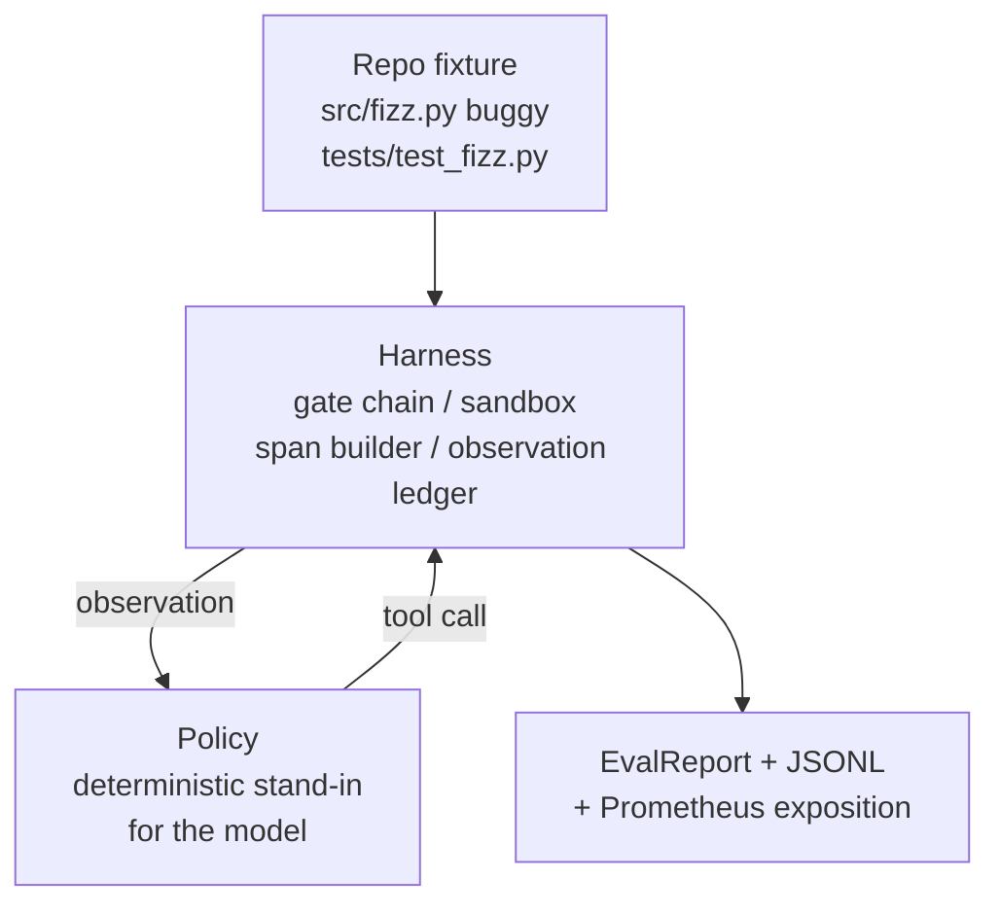
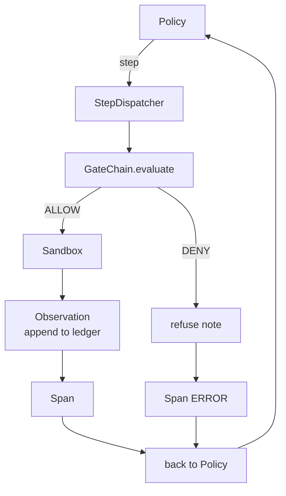

# Capstone Lesson 29: End-to-End Coding Agent on the Harness

> Кульминация трека A. Этот урок сшивает цепочку gates, sandbox, eval-харнес и OTel-span'ы в одного работающего coding-агента, чинящего настоящий (маленький, fixture-масштаба) баг в многофайловом Python-проекте. Агент — детерминированная политика, а не LLM; подстановка делает урок воспроизводимым и показывает, что самым интересным всё это время был харнес. Контракт идентичен: настоящая модель подключается в шов политики.

**Тип:** Практика
**Языки:** Python (stdlib)
**Пререквизиты:** Фаза 19 · 25 (verification gates), Фаза 19 · 26 (sandbox), Фаза 19 · 27 (eval-харнес), Фаза 19 · 28 (observability), Фаза 14 · 38 (verification gates), Фаза 14 · 41 (workbench для настоящих репозиториев), Фаза 14 · 42 (capstone agent workbench)
**Время:** ~90 минут

## Цели обучения

- Скомпоновать цепочку gates, sandbox, eval-харнес и построитель span'ов в единый цикл агента.
- Реализовать детерминированную политику, использующую read_file, run_tests и write_file для починки fixture-бага.
- Обеспечить глобальный бюджет шагов плюс токеновый бюджет наблюдений на всём end-to-end-прогоне.
- Излучить полные OTel GenAI-трейсы и Prometheus-метрики за весь прогон.
- Убедиться, что агент решает фикстуру менее чем за 12 шагов с нулём срабатываний gates на легальных инструментах.

## Проблема

Большинство агентских демо работают в изоляции: sandbox сам по себе, eval-харнес сам по себе, эмиттер span'ов сам по себе. Выглядят они хорошо. Скомпонуйте их — и швы вылезут.

Цепочка gates говорит ALLOW, но sandbox отказывает по причине, которую цепочка не предвидела. Eval-харнес записывает pass, но OTel-span'ы говорят, что gate отклонил инструмент, которым агент якобы пользовался. Счётчик Prometheus инкрементится дважды там, где должен один раз. Бюджет наблюдений превышен, но агент продолжил, потому что бюджет считался в цепочке, а sandbox о нём не знал.

Этот урок — интеграционный тест всего трека. Агент должен сделать четыре вещи по порядку: прочитать проект, запустить тесты, опознать баг по провалу теста, написать фикс, перезапустить тесты и остановиться. Каждая операция идёт через цепочку gates. Каждое исполнение инструмента — через sandbox. Каждый шаг обёрнут в span. В конце eval-харнес оценивает всё целиком.

## Концепция



Политика агента — машина состояний. Пять состояний.

`SURVEY`: агент читает листинг проекта. Следующее состояние — RUN_TESTS.

`RUN_TESTS`: агент запускает тестовую команду. Если тесты проходят, машина останавливается с успехом. Иначе следующее состояние — INSPECT.

`INSPECT`: агент читает падающий исходный файл. Следующее состояние — FIX.

`FIX`: агент пишет исправленный файл. Следующее состояние — VERIFY.

`VERIFY`: агент снова запускает тестовую команду. Тесты прошли — стоп с успехом. Иначе — стоп с провалом.

Каждое состояние соответствует одному tool call. Каждый tool call проходит через цепочку gates. Если вызов отклонён, агент фиксирует отказ в трейсе и останавливается.

Баг фикстуры — off-by-one в `fizz.py`. Детерминированная политика распознаёт баг по сообщению о провале теста через regex и излучает исправленный файл. Замена политики на LLM контракт харнеса не меняет.

## Архитектура



Урок самодостаточен. Каждый примитив предыдущих уроков реимплементирован в минимальном масштабе в `main.py` (gate, sandbox, журнал, span), чтобы урок работал без импорта соседей. Имена совпадают с уроками 25–28 в точности, поэтому концептуальный маппинг однозначен.

## Что вы соберёте

`main.py` поставляет:

1. Минимальные примитивы харнеса, скопированные с теми же именами, что в уроках 25–28: `GateChain`, `Sandbox`, `ObservationLedger`, `SpanBuilder`, `MetricsRegistry`.
2. Класс `CodingAgentPolicy`: машина состояний с пятью состояниями.
3. Хелпер `Repo`: готовит scratch-директорию с комплектной багованной фикстурой.
4. Класс `AgentRun`: гоняет политику, диспетчеризует через харнес, возвращает `AgentRunReport`.
5. Комплектную фикстуру (`fixture_repo/`) с src/fizz.py, tests/test_fizz.py и деревом expected/ для eval-харнеса.
6. Демо: прогоняет политику end-to-end, печатает пошаговый трейс, утверждает pass, печатает метрики.

Комплектная фикстура — той же формы, что структура задач урока 27: багованный файл и файл тестов. Сообщение о провале теста содержит достаточно информации, чтобы детерминированная политика опознала фикс. Настоящая LLM сделала бы ту же работу — медленнее и с более широким охватом, — но ожиданий харнеса это бы не изменило.

## Почему политика — не LLM

Настоящая LLM требует API-ключа, сетевого вызова и неверифицируемой стохастичности. Урок заботится о харнесе. Подстановка детерминированной политики позволяет уроку работать на любом ноутбуке разработчика с нулём внешних зависимостей и даёт тестовому набору утверждать точные счётчики шагов.

Урочная политика — строгое подмножество того, что делает LLM-агент. Политика читает репозиторий, видит падающий тест, находит строку и излучает фикс. LLM проходит через тот же цикл с тем же контрактом харнеса; бухгалтерия идентична.

## Что утверждает демо

End-to-end-демо утверждает пять вещей на выходе, а тестовый набор переутверждает их программно.

Политика решила фикстуру менее чем за 12 шагов.

Бюджет наблюдений ни разу не был превышен.

Ноль отказов gates на легальных инструментах. (Агент ни разу не выдумал запрещённое имя инструмента.)

У каждого шага есть соответствующий span в traces.jsonl.

Prometheus-экспозиция содержит запись `tools_called_total{tool="read_file"}` и гистограмму `tool_latency_ms`.

## Как это стыкуется с остальным треком A

Этот урок — интеграция. Урок 25 написал цепочку gates. Урок 26 — sandbox. Урок 27 — eval-харнес. Урок 28 — observability. Урок 29 доказывает, что они работают как система. Настоящий агентский харнес растёт отсюда: замените детерминированную политику моделью, комплектную фикстуру — задачей на настоящем репозитории, JSONL-экспортер — OTLP.

## Запуск

```bash
cd phases/19-capstone-projects/29-end-to-end-coding-task-demo
python3 code/main.py
python3 -m pytest code/tests/ -v
```

Демо печатает пошаговый трейс, финальный eval-отчёт и Prometheus-экспозицию. Код выхода — ноль. Тесты покрывают переходы состояний политики, отказы gates на синтетических tool calls, end-to-end-прогон на комплектной фикстуре и инварианты бюджета шагов.

## Дополнительное чтение

- Фаза 14, уроки 41–42 — agent workbench и его capstone.
- Фаза 19, уроки 25–28 — цепочка gates, sandbox, eval-харнес и observability, скомпонованные здесь.
