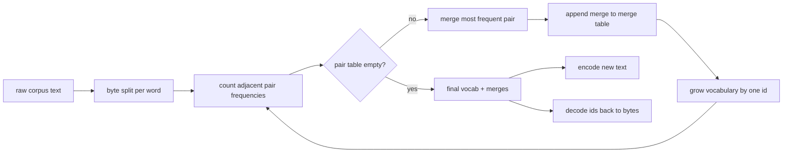
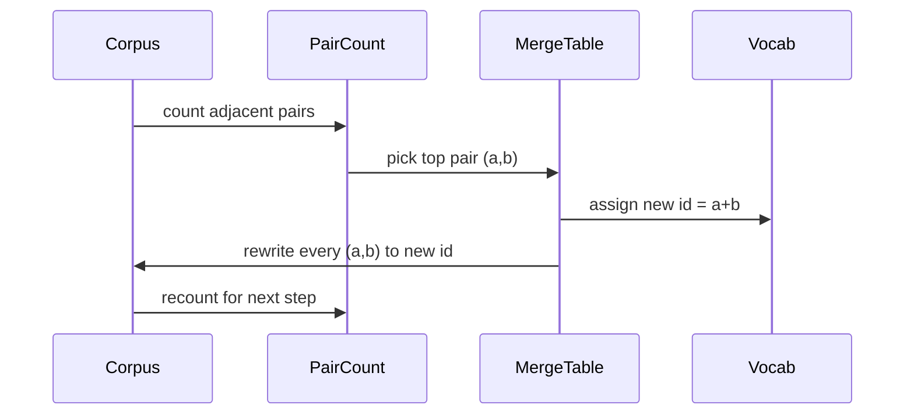

# BPE Tokenizer From Scratch

> Байты на входе, id на выходе, id обратно в те же байты. Соберите токенизатор, с которого до сих пор начинается каждая современная текстовая модель.

**Тип:** Практика
**Языки:** Python
**Пререквизиты:** уроки Фазы 04, уроки Фазы 07 о трансформерах
**Время:** ~90 минут

## Цели обучения
- Обучить словарь Byte-Pair Encoding на сыром текстовом корпусе, раз за разом сливая самую частую пару соседних символов.
- Реализовать детерминированную таблицу слияний и применить её к свежему тексту, получив поток subword-id.
- Совершать round trip произвольного UTF-8-входа в id и обратно без потери информации.
- Зарезервировать и защитить специальные токены (`<|endoftext|>`, `<|pad|>`), чтобы они переживали обучение и декодирование.
- Понять, почему байтовый алфавит — правильный фундамент для универсального токенизатора.

## Рамка

Языковая модель никогда не видит текст. Она видит целые числа. Отображение строки в список чисел и обратно — это токенизатор. Ошибитесь в этом слое — и каждая кривая лосса в обучении меряет не то.

Доминирующее семейство subword-токенизаторов для универсальных текстовых моделей — Byte-Pair Encoding. Идея маленькая. Начать с известного алфавита. Найти пару соседних символов, которая чаще всего встречается в обучающем корпусе. Слить её в новый символ. Повторять, пока словарь не достигнет целевого размера. Кодирование нового текста переиспользует тот же список слияний в том же порядке.

Мы соберём байтовый вариант. Алфавит — 256 сырых байтов, а не код-пойнты Unicode. Именно этот выбор позволяет токенизатору принять любой UTF-8-вход без отката к unknown-токену.

## Пайплайн

Обучающая и инференс-сторона делят одну таблицу слияний. Это разделение и есть контракт. Измените порядок слияний на инференсе — и декодируете другой поток id.

## Байтовый алфавит

Первые 256 id зарезервированы под сырые байты от 0x00 до 0xFF. Это гарантирует, что любая входная строка выразима в словаре до того, как случилось хоть одно слияние. За байтовым блоком мы резервируем небольшой диапазон под специальные токены. Обучающий цикл никогда не предлагает эти id как цели слияния, потому что мы полностью держим их вне претокенизированного потока.

Претокенизатор режет корпус по границам пробелов и пунктуации до того, как его увидит обучение. Без этого разреза шаг слияния BPE с удовольствием выучил бы слияния через границы слов, и словарь забился бы целыми частыми фразами. С разрезом слияния остаются внутри слова, и результат обобщается.

## Обучающий цикл

На каждом шаге обучения цикл делает три вещи. Проходит по каждому слову корпуса и считает, как часто встречается каждая пара соседних текущих символов, взвешивая на частоту самого слова. Выбирает пару с наибольшим счётом. Переписывает каждое вхождение этой пары в один новый символ, чей id — следующий свободный слот словаря. Затем записывает слияние.

Стоимость каждого шага линейна по размеру корпуса, выраженного как список последовательностей символов. Для миллиона слов и целевого словаря в десять тысяч id цикл добегает до конца за секунды, потому что последовательности символов сжимаются по мере слияний.

## Кодирование свежего текста

Инференс не вызывает счётчик пар. Он применяет таблицу слияний в том порядке, в котором она была выучена. Для свежего слова кодировщик стартует с байтового разреза. Он сканирует текущую последовательность в поисках слияния с наименьшим рангом (самого раннего из применимых). Выполняет это слияние. Сканирует снова. Цикл заканчивается, когда ни одно слияние из таблицы к текущей последовательности не применимо.

Упорядочивание по рангу — то свойство, которое делает кодирование детерминированным и совпадающим с поведением обучения на том же входе. Слияние, выученное первым, стоит наверху таблицы и применяется первым. Если два слияния применимы в одной позиции, побеждает то, у которого ранг ниже.

## Специальные токены

Специальные токены — id, которые байтовый поток породить не может. Мы резервируем их вручную. Для этого урока хватит двух.

- `<|endoftext|>` разделяет документы при предобучении. Он говорит модели: «здесь начинается новый документ, не дай контексту предыдущего протечь».
- `<|pad|>` добивает короткие последовательности, чтобы батч был прямоугольным тензором. Маска лосса прячет его при обучении.

Кодировщик принимает флаг, разрешающий специальные токены во входе. С выключенным флагом строки `<|endoftext|>` и `<|pad|>` токенизируются как байты, которыми они записаны. С включённым — буквальные строки маппятся на зарезервированные id и не подлежат никакому слиянию.

## Гарантия round trip

Кодирование и затем декодирование обязано вернуть входные байты в точности. Декодер конкатенирует байтовое разворачивание каждого id по порядку. Поскольку каждый id — либо сырой байт, либо конкатенация двух ранее известных id, рекурсивное разворачивание всегда завершается сырыми байтами. Декодирование возвращает UTF-8-строку, которую эти байты записывают.

Тестовый набор урока проверяет это свойство на невиданном предложении, на предложении с Unicode-эмодзи и на предложении, содержащем буквальный токен `<|endoftext|>`.

## Чего этот урок не делает

Он не строит regex-претокенизатор в стиле крупнейших продакшен-токенизаторов. Претокенизатор здесь — маленький разрез по пробелам и пунктуации. Его достаточно, чтобы получить осмысленные слияния на маленьком корпусе, а контракт с остальной цепочкой уроков не меняется. Следующий урок трактует токенизатор как чёрный ящик и строит поверх него датасет со скользящим окном.

Он не параллелит счётчик пар. Цикл на Python по корпусу из нескольких тысяч слов заканчивается значительно быстрее секунды. Для больших корпусов очевидный ход — считать пары по словам параллельно и редьюсить.

## Как читать код

`main.py` определяет четыре объекта. `BPETokenizer` держит словарь, таблицу слияний и таблицу специальных токенов. `train` — обучающий цикл. `encode` — путь инференса. `decode` — конкатенация байтов. Демо внизу обучает маленький токенизатор на встроенном корпусе, кодирует отложенное предложение, декодирует id обратно и печатает оба. Тесты в `code/tests/test_bpe.py` фиксируют свойство round trip, резервирование специальных токенов и порядок слияний.

Запустите демо. Затем измените целевой размер словаря в демо с 300 на 600 и посмотрите, как падает закодированная длина отложенного предложения. Эта кривая — кривая сжатия BPE.

## Дополнительное чтение

- Sennrich, Haddow, Birch, [Neural Machine Translation of Rare Words with Subword Units (arXiv 1508.07909)](https://arxiv.org/abs/1508.07909) — статья про BPE.
- Фаза 5 — основы NLP.
- Фаза 19, урок 31 — датасет со скользящим окном поверх этого токенизатора.
