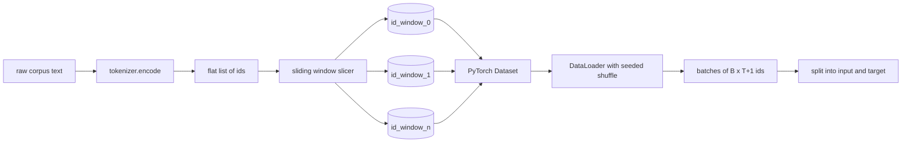
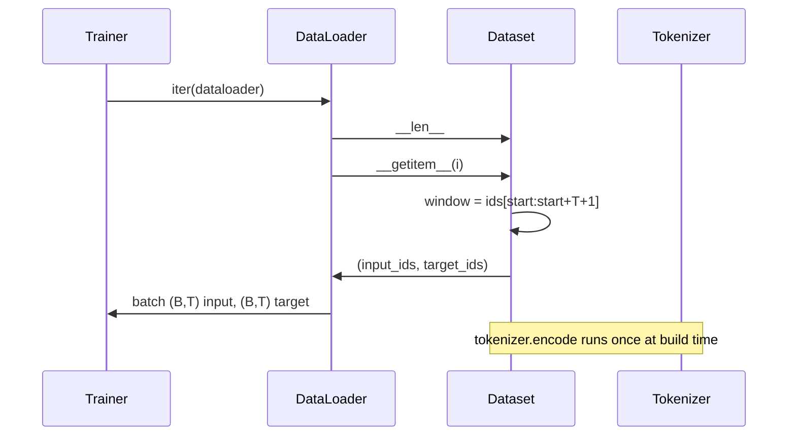

# Tokenized Dataset with Sliding Window

> Прогон предобучения — это функция из токенных id в градиенты. Этот урок строит конвейер, подающий эти id.

**Тип:** Практика
**Языки:** Python
**Пререквизиты:** уроки Фазы 04, уроки Фазы 07 о трансформерах, урок 30 этой фазы
**Время:** ~90 минут

## Цели обучения
- Превратить сырой корпус в поток токенных id одним вызовом токенизатора.
- Нарезать поток id на окна фиксированной длины с настраиваемым stride перекрытия.
- Построить PyTorch Dataset, возвращающий тензоры входа и цели для предсказания следующего токена.
- Обернуть датасет в DataLoader с детерминированным шаффлом, сидируемым на каждую эпоху.
- Понять компромисс между stride, избыточностью и эффективным размером датасета.

## Рамка

Прогон предобучения читает по одному батчу токенных id за раз и обновляет модель. Форма каждого батча зафиксирована контрактом обучения. Для каузальной языковой модели батч держит входные id формы `(B, T)` и целевые id формы `(B, T)`, где цель — вход, сдвинутый влево на один. Работа дата-пайплайна — выдавать этот контракт по требованию, детерминированно и воспроизводимо, из корпуса, который может весить несколько гигабайт сырого текста.

Этот урок строит пайплайн. Токенизатор из предыдущего урока превращает текст в длинный плоский список id. Скользящее окно нарезает этот список на обучающие примеры. Кастомный Dataset открывает примеры как тензоры. DataLoader батчит их и шаффлит с известным сидом.

## Контракт формы

Каузальная LM потребляет id формы `(B, T)`, где `B` — размер батча, `T` — длина контекста. Цель в позиции `t` — вход в позиции `t+1`. Значит, каждый обучающий пример покрывает `T+1` сырых id. Stride окна управляет тем, сколько перекрытия между соседними примерами.

Нарезчик никогда не пересекает границу корпуса. Если последнему окну не хватает id, чтобы заполнить `T+1` позиций, нарезчик его отбрасывает. Добивать хвост `<|pad|>` — тоже легальный выбор, но он усложняет маску лосса. В этом уроке мы отбрасываем.

## Почему скользящее окно

Корпус предобучения — один длинный поток id. Если бы модель видела только неперекрывающиеся окна, каждый обучающий пример учил бы её одним и тем же `T` границам. Настройка stride двигает эти границы, и модель видит более разнообразные задачи «предскажи следующий токен».

Stride, равный `T`, даёт неперекрывающиеся окна. Stride `T // 2` даёт пятидесятипроцентное перекрытие и удваивает эффективный датасет. Stride `1` даёт максимальное перекрытие и увеличивает датасет в `T` раз. Цена — больше compute на эпоху. Выгода — больше разнообразия границ. Большинство прогонов предобучения используют stride, равный длине контекста, потому что корпус и так намного больше, чем модель успеет пройти за одну эпоху, и аргумент о разнообразии границ слабее.

## Класс Dataset

У PyTorch Dataset два обязательных метода. `__len__` возвращает число примеров. `__getitem__` возвращает один пример как пару тензоров. Наш Dataset хранит закодированный поток id и stride. Индексация вычисляет старт окна на лету, поэтому стоимость по памяти — одна копия потока id независимо от того, сколько примеров порождает stride.

Сдвиг-на-один происходит внутри `__getitem__`. Dataset возвращает `(input, target)`, где `input = window[:-1]` и `target = window[1:]`. Оба — long-тензоры PyTorch. Цикл обучения трактует их как ground truth.

## Детерминированный шаффл

DataLoader с `shuffle=True` читает из генератора случайных чисел PyTorch. Передав явный `torch.Generator`, сидируемый на каждую эпоху, мы получаем один и тот же шаффл при каждом перезапуске прогона. Это свойство важно, когда вы хотите сравнить два прогона, различающихся единственным гиперпараметром. Без сида два прогона видят данные в разном порядке, и кривые лосса расходятся по причинам, не связанным с изменением.

Контракт сида в уроке прост. `epoch_seed = base_seed + epoch_index`. Базовый сид передаётся при конструировании. Индекс эпохи инкрементит тренер в начале каждой эпохи. Перезапуск с тем же базовым сидом всегда видит один и тот же порядок в каждой эпохе.

## Batch sampler

Дефолтный сэмплер PyTorch выбирает индексы равномерно случайно без возвращения. Именно это нам нужно для предобучения. Для файнтюнинга на маленьком датасете контракт тот же. DataLoader собирает батч, вызывая `__getitem__` `B` раз и стекуя результаты. Поскольку каждый пример по построению одной длины, логика паддинга не нужна.

Урок держит `num_workers=0` ради простоты. В продакшен-прогоне воркеры параллелят вызовы `__getitem__`. С нашим пайплайном это почти no-op, потому что вся работа — срез in-memory-тензора, но тот же Dataset API чисто поддерживает воркеров.

## Подсчёт примеров

Для потока id длины `N`, длины контекста `T` и stride `S` число примеров — `max(0, 1 + (N - (T + 1)) // S)`. Урок открывает этот расчёт статическим методом на Dataset, чтобы тренер мог посчитать общее число шагов на эпоху без итерации.

## Чего этот урок не делает

Он не стримит с диска. Корпус кодируется целиком в память и держится одним тензором. Для корпуса в несколько миллионов id это значительно меньше ста мегабайт — правильная форма для урока. Стриминг с диска — отдельная забота, которая подключается заменой хранилища при сохранении контракта Dataset.

Он не обрабатывает несколько документов. Корпус трактуется как один непрерывный поток id. Граница следующего документа кодируется вставкой id `<|endoftext|>`, когда корпус собирается из нескольких документов. Модель учится предсказывать вокруг границы.

## Как читать код

`main.py` определяет два класса и один хелпер. `SlidingWindowDataset` — PyTorch Dataset. `make_dataloader` возвращает сконфигурированный DataLoader с сидированным генератором. `_encode_corpus_to_ids` — одноразовый вызов токенизатора. Демо внизу строит маленький токенизатор in-process, кодирует встроенный корпус, конструирует датасет и dataloader, печатает один батч и утверждает контракт формы. Тесты в `code/tests/test_dataset.py` фиксируют формулу числа окон, свойство сдвига-на-один, детерминированный шаффл и компромисс stride.

Запустите демо. Затем измените длину контекста с 16 на 32 и посмотрите, как падает число примеров на эпоху. Это число — ваш бюджет шагов на эпоху.
