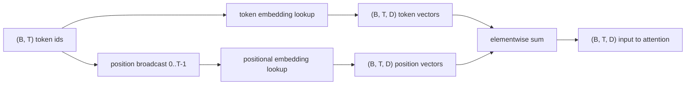
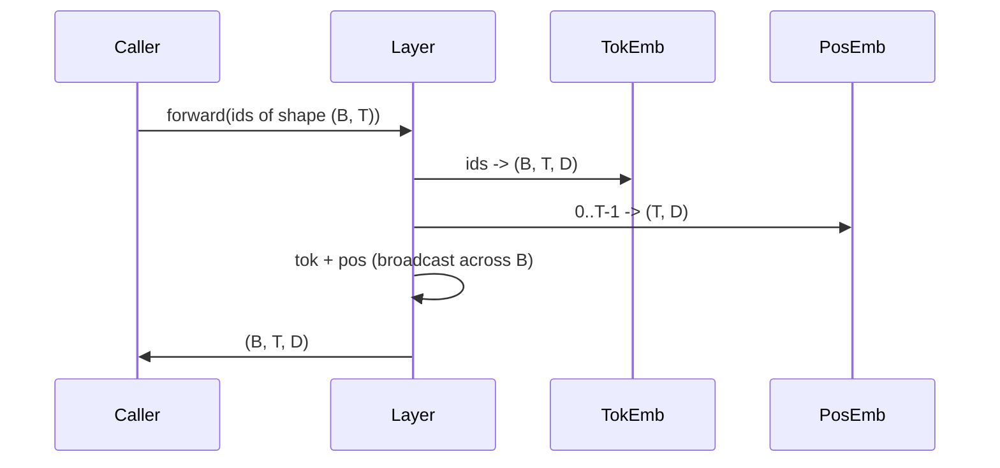

# Token and Positional Embeddings

> Id — это целые числа. Модель хочет векторы. Между ними сидят две таблицы поиска, и выбор позиционной определяет, что модель сможет выучить.

**Тип:** Практика
**Языки:** Python
**Пререквизиты:** уроки Фазы 04, уроки Фазы 07 о трансформерах, уроки 30 и 31 этой фазы
**Время:** ~90 минут

## Цели обучения
- Построить таблицу поиска токенных эмбеддингов, маппящую словарные id в плотные векторы.
- Построить обучаемую таблицу позиционных эмбеддингов, индексируемую позицией.
- Построить фиксированный синусоидальный позиционный эмбеддинг, индексируемый позицией и не имеющий параметров.
- Скомпоновать токенный и позиционный эмбеддинги в единый вход для блока трансформера.
- Сопоставить обучаемые и синусоидальные эмбеддинги по обобщению на длину и числу параметров.

## Рамка

Первый контакт модели с токенным id — поиск строки в матрице токенных эмбеддингов. В матрице по строке на каждый словарный id и по столбцу на каждое измерение модели. Поиск возвращает вектор, который остальная модель трактует как смысл id. Backprop обновляет строки, использованные в forward-проходе. За время обучения геометрия этих строк выучивается кодировать сходство направлениями.

У токенных id самих по себе нет порядка. Модели нужен второй сигнал, говорящий, что позиция один отличается от позиции семнадцать. Два доминирующих выбора для этого сигнала — обучаемый позиционный эмбеддинг (вторая таблица, по строке на позицию) и фиксированный синусоидальный (математическая формула без параметров). У выбора есть последствия. Обучаемая таблица — параметр, ограниченный максимальной длиной контекста, на которой модель обучалась. Синусоидальная таблица в теории беспараметрична, а формула продолжается на любую позицию, но `SinusoidalPositionalEmbedding` этого урока предвычисляет фиксированную таблицу на `max_context_length`, и его `forward` кидает исключение за этой границей; поэтому здесь оба модуля насаждают максимальную длину контекста. Модель все равно может спотыкаться за пределами обученной длины, даже когда таблицы хватает для индексации.

Этот урок строит оба варианта и компонует их с токенным эмбеддингом в единый вход для attention-блока следующего урока.

## Контракт формы

Вход стадии эмбеддингов — батч токенных id формы `(B, T)`. Выход — тензор формы `(B, T, D)`, где `D` — размерность модели. У каждого элемента батча одна и та же длина контекста `T`. У каждой позиции одна и та же размерность вектора `D`.



Композиция — сумма, а не конкатенация. Суммирование держит `D` постоянным по всей сети и позволяет модели пофичево решать, что доминирует на каждом слое — смысл токена или позиция.

## Матрица токенных эмбеддингов

Токенный эмбеддинг — тензор-параметр формы `(V, D)`, где `V` — размер словаря. PyTorch открывает его как `nn.Embedding(V, D)`. При инициализации элементы берутся из маленького гауссиана — традиционно с нулевым средним и стандартным отклонением около `0.02` для моделей трансформерного масштаба. Точная инициализация важна меньше, чем ее согласованность между прогонами.

Forward-проход — одна операция индексации. PyTorch маппит int64-id формы `(B, T)` в float-тензор `(B, T, D)`, собирая строки. Backward-проход аккумулирует градиенты только в строки, тронутые в forward-проходе. Две строки, не встретившиеся в батче, получают на этом шаге нулевой градиент.

Тонкая деталь. Токенный эмбеддинг и выходная проекция в конце модели часто делят веса (weight tying). Тогда каждый backward-проход трогает каждую строку эмбеддинга через выходную сторону. Урок открывает их как отдельные модули, но в полной модели одна матрица могла бы играть обе роли.

## Обучаемый позиционный эмбеддинг

Обучаемый позиционный эмбеддинг — второй `nn.Embedding` формы `(max_context_length, D)`. Поиск идет по id позиции `0, 1, 2, ..., T-1`. Forward-проход бродкастит этот позиционный вектор по батчевому измерению.

Минус обучаемой таблицы: ее нельзя спросить о позиции `T`, если модель обучалась только до позиции `T-1`. Строки не существует. Продакшен-модели decoder-only с этой схемой вшивают максимальную длину контекста в архитектуру и отказываются обрабатывать более длинные входы.

## Синусоидальный позиционный эмбеддинг

Синусоидальный позиционный эмбеддинг — функция из позиции в вектор. Позиция `p` и фича `i` дают

```python
angle = p / (10000 ** (2 * (i // 2) / D))
emb[p, 2k]     = sin(angle)
emb[p, 2k + 1] = cos(angle)
```

У функции нет параметров. У каждой позиции уникальный вектор. Длина волны меняется геометрически по измерениям фич, поэтому нижние измерения кодируют грубую позицию, а верхние — тонкую.

Свойство, следующее из выбора `sin` и `cos` вместе: вектор в позиции `p + k` — линейная функция вектора в позиции `p`. Это дает слою внимания легкий путь к выучиванию относительных сдвигов позиций. Модели не нужен отдельный параметр, чтобы выразить «посмотри на пять токенов назад».

Урок вычисляет полную синусоидальную таблицу один раз при конструировании и индексирует ее в момент forward.

## Композиция

Входной пайплайн делает три вещи по порядку. Читает токенные id. Ищет токенные векторы. Прибавляет позиционные векторы. Возвращает сумму.



Бродкастинг на шаге суммы реплицирует позиционный тензор `(T, D)` вдоль батчевого измерения. PyTorch делает это автоматически, потому что после unsqueeze позиционный тензор имеет форму `(1, T, D)`.

## Сравнительный анализ

Урок гоняет оба варианта на одних входах и печатает две диагностики.

Первая — число параметров. Обучаемый вариант добавляет `max_context_length * D` параметров поверх токенного эмбеддинга. Синусоидальный — ноль.

Вторая — косинусное сходство эмбеддингов соседних позиций. У синусоидального варианта — гладкое и предсказуемое затухание, потому что функция непрерывна. У обучаемого при инициализации сходство почти случайное, потому что строки взяты независимо. После обучения обучаемый вариант обычно развивает похожую гладкую структуру, но ему приходится открывать ее из данных.

## Чего этот урок не делает

Он не строит rotary-позиционное кодирование (RoPE) или AliBi. Это современный выбор продакшен-трансформеров. Оба следуют тому же контракту формы, что эмбеддинги здесь (применить позиционно-зависимое преобразование к векторам формы `(B, T, D)`), но применяются на шаге attention-проекций, а не на входе. Следующий урок строит attention-блок, и одно из опциональных расширений — вплести rotary в query-key-проекции там.

Он не обучает эмбеддинг. Обучение требует лосса, лосс требует выхода модели, а выход требует внимания и LM-головы. Это следующий урок и урок за ним.

## Как читать код

`main.py` определяет три модуля. `TokenEmbedding` оборачивает `nn.Embedding(V, D)`. `LearnedPositionalEmbedding` оборачивает `nn.Embedding(L, D)`. `SinusoidalPositionalEmbedding` предвычисляет таблицу и открывает ее как буфер. `EmbeddingComposer` связывает токенный и позиционный эмбеддинги вместе. Демо внизу печатает формы, счетчики параметров и диагностику сходства соседних позиций. Тесты в `code/tests/test_embeddings.py` фиксируют форму, поведение бродкаста, число параметров и синусоидальную формулу.

Запустите демо. Затем измените размерность модели `D` с 64 на 32 и посмотрите, как меняются полосы длин волн синусоиды.

## Дополнительное чтение

- Vaswani et al., [Attention Is All You Need (arXiv 1706.03762)](https://arxiv.org/abs/1706.03762) — формула синусоидальной позиции.
- Фаза 7 — глубокий разбор трансформеров.
- Фаза 19, урок 33 — attention-блок, потребляющий эти эмбеддинги.
