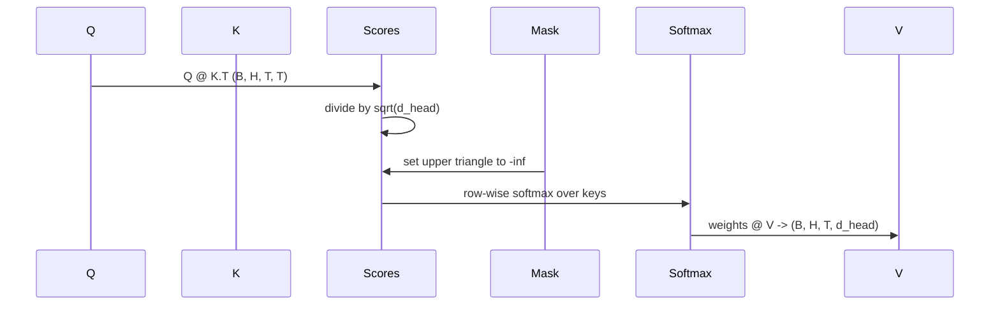

# Multi-Head Self-Attention

> Одна линейная проекция, три представления, H параллельных голов, одна маска. Attention-блок таким, каким модель реально его использует.

**Тип:** Практика
**Языки:** Python
**Пререквизиты:** уроки Фазы 04, уроки Фазы 07 о трансформерах, уроки 30–32 этой фазы
**Время:** ~90 минут

## Цели обучения
- Реализовать батчевую проекцию Query/Key/Value одним линейным слоем, разрезаемым на H голов.
- Вычислить scaled dot-product attention с корректной нормализацией и обращением с dtype.
- Применить каузальную маску, запрещающую позиции смотреть на будущие позиции.
- Рассмотреть пер-головные веса внимания на фиксированном входе и порассуждать, куда смотрит каждая голова.
- Обучить маленький attention-блок на игрушечной задаче и увидеть, как лосс падает по мере специализации голов.

## Рамка

Внимание — функция, позволяющая представлению токена подтягивать информацию из других токенов той же последовательности. Self-attention означает, что queries, keys и values выведены из одного и того же входа. Multi-head означает, что проекция разрезана на H параллельных задач внимания, чьи выходы конкатенируются и проецируются обратно.

Эффективный паттерн реализации — один линейный слой, проецирующий из `D` в `3 * D` и нарезаемый на три представления, затем перестраиваемый в H голов размера `D // H` каждая. Matmul, softmax и взвешенная сумма выполняются как батчевые тензорные операции, поэтому головы работают на ускорителе параллельно.

Этот урок строит такой блок. Он также добавляет каузальную маску, чтобы тот же код работал слоем внимания в decoder-only языковой модели. Следующий урок складывает блок в полный трансформер, а урок за ним его обучает.

## Контракт формы

Вход — `(B, T, D)`. Выход — `(B, T, D)`. Маска — `(T, T)` или бродкастится к ней. Внутри блока промежуточные тензоры имеют форму `(B, H, T, d_head)`, где `d_head = D // H`. Ограничение — `D % H == 0`.

```mermaid
flowchart LR
    A["(B, T, D) input"] --> B[Linear D -> 3D]
    B --> C["split into Q, K, V"]
    C --> D["reshape to (B, H, T, d_head)"]
    D --> E["scores = Q @ K.T / sqrt(d_head)"]
    E --> F[apply causal mask]
    F --> G[softmax over keys]
    G --> H["context = weights @ V"]
    H --> I["reshape to (B, T, D)"]
    I --> J[output Linear D -> D]
    J --> K["(B, T, D) output"]
```

Два линейных слоя (QKV-проекция и выходная проекция) — единственные параметры блока. Маска, softmax, matmul'ы и reshape'ы — все беспараметрические.

## Разрез QKV

Наивная реализация держит три отдельных линейных слоя — по одному на Q, K и V. Эффективная — один слой, выдающий `3 * D` фич, и разрез результата. Они математически эквивалентны, потому что три отдельных умножения на матрицы `(D, D)` — это в точности одно умножение на матрицу `(3D, D)`, составленную из них.

Эффективная версия быстрее: ускоритель запускает один matmul вместо трёх. Её также легче инициализировать, потому что три подматрицы живут в одном тензоре-параметре и инициализируются вместе.

## Reshape в головы

После разреза каждый из Q, K, V имеет форму `(B, T, D)`. Чтобы превратить это в H параллельных задач внимания, мы делаем reshape в `(B, T, H, d_head)` и транспонируем в `(B, H, T, d_head)`. Измерение голов теперь стоит рядом с батчевым, и PyTorch трактует пер-головное внимание как батчевую операцию над `B * H` независимыми экземплярами.

Измерение d_head остаётся последним, чтобы матмул скоров `Q @ K.transpose(-2, -1)` его свернул. Результат — пер-головные скоры внимания `(B, H, T, T)`.

## Масштабирование

Скоры делятся на `sqrt(d_head)` до softmax. Без этого масштабирования скалярные произведения растут с ростом `d_head` и загоняют softmax в режим, где почти вся масса у одного элемента, а остальные исчезающе малы. Градиенты в этом режиме крошечные, и обучение стопорится. Деление на `sqrt(d_head)` держит дисперсию скоров примерно постоянной при любых размерах голов.

## Каузальная маска

Decoder-only языковая модель при предсказании следующего токена может опираться только на прошлое. Маска это насаждает. Конкретно: перед softmax каждый элемент выше диагонали матрицы скоров `(T, T)` заменяется на минус бесконечность. После softmax эти позиции получают нулевой вес.

Мы регистрируем маску буфером при конструировании, чтобы она жила на том же устройстве, что модель, и не входила в градиентный граф. Маска покрывает максимальную длину контекста, которую блок вообще увидит. В момент forward мы срезаем верхний левый угол `(T, T)`.

## Выходная проекция

После пер-головных контекстных векторов `(B, H, T, d_head)` мы транспонируем обратно в `(B, T, H, d_head)`, делаем reshape в `(B, T, D)` и применяем финальную линейную проекцию `(D, D)`. Выходная проекция позволяет модели смешивать головы. Без неё H голов рекомбинировались бы только через последующие слои, и блок был бы искусственно ограничен.

## Инспекция весов внимания

Урок открывает флаг `return_weights=True` на forward-проходе. С ним блок возвращает пер-головные веса внимания формы `(B, H, T, T)` вместе с выходом. Демо печатает теплокарту весов одной головы на коротком входе, чтобы была видна структура каузального треугольника и фокус по позициям.

В обученной модели разные головы выучивают разные паттерны. Одни смотрят на непосредственно предыдущий токен. Другие — на начало последовательности. Третьи размазывают внимание почти равномерно. Хук инспекции — точка входа в эту интерпретируемость.

## Обучающее демо

Демо внизу `main.py` подключает attention-блок к крошечной LM-голове и обучает всё это на задаче повторения. Каждая строка входа — один случайный id, реплицированный по контексту. Цель — вход, сдвинутый на один, поэтому модель должна выучить, что следующий токен равен предыдущему. Лосс — кросс-энтропия. При H=4, D=32, T=12 и словаре 64 лосс падает со случайного (около `log(64) ~ 4.16`) до значительно ниже `1.0` за три эпохи на CPU.

Смысл демо не в обучении полезной модели. Смысл — убедиться, что градиенты текут через каждую часть блока и головы выучивают что-то на задаче с очевидным ответом.

## Чего этот урок не делает

Он не добавляет feed-forward-блок. Слой трансформера в настоящей модели — это внимание, за которым идёт двухслойный MLP с residual-связью и layer norm вокруг каждого. Их добавляет следующий урок.

Он не реализует rotary- или AliBi-позиционное кодирование. Оба применяются на шаге QKV-проекции в том же блоке, но это отдельная учебная единица. Построенный здесь блок совместим с любым из них через преобразование Q и K до матмула.

Он не реализует KV cache для инференса. Кэширование ключей и значений между forward-проходами — оптимизация, делающая авторегрессивное декодирование быстрым. Она меняет контракт формы на тензорах K и V, но не на Q. Ей место в уроке об инференсе.

## Как читать код

`main.py` определяет `MultiHeadSelfAttention`. Класс держит два линейных слоя и зарегистрированный буфер маски. Forward-проход проецирует, перестраивает, считает скоры, маскирует, делает softmax, взвешивает, перестраивает и проецирует снова. Демо внизу собирает маленькую модель, оборачивающую внимание токенными и позиционными эмбеддингами и LM-головой, обучает её на задаче копирования три эпохи и печатает кривую лосса и пер-головную теплокарту внимания. Тесты в `code/tests/test_attention.py` фиксируют контракт формы, свойство каузальности, свойство softmax, свойство разреза на головы и течение градиентов.

Запустите демо. Затем увеличьте `n_heads` с 4 до 8 (оставив `d_model=32`, то есть `d_head=4`) и посмотрите, как меняется теплокарта.

## Дополнительное чтение

- Vaswani et al., [Attention Is All You Need (arXiv 1706.03762)](https://arxiv.org/abs/1706.03762) — scaled dot-product и multi-head attention.
- Фаза 7, урок 02 — self-attention с нуля.
- Фаза 19, урок 34 — блок трансформера, оборачивающий это внимание.
