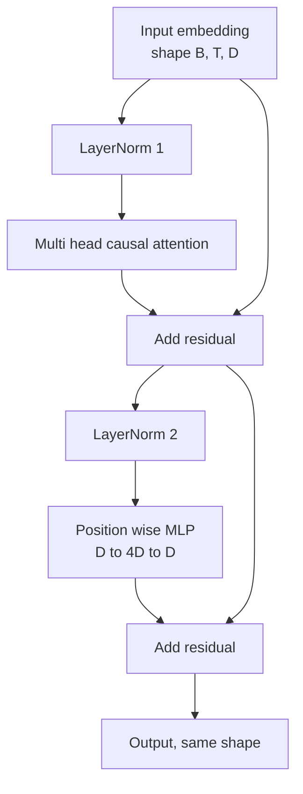
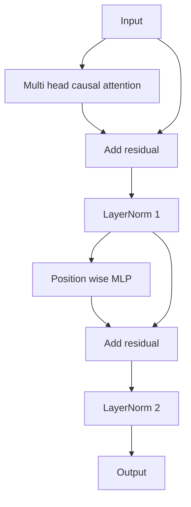

# Transformer Block from Scratch

> Один блок — единица любого современного decoder-LLM. Layer norm, multi-head attention, residual, MLP, residual. Pre-LN-вариант обучается стабильно без warmup. Post-LN — то, что отгрузила оригинальная статья. Этот урок строит оба бок о бок и показывает, какой выживает в стеке из 12 слоёв на обычных learning rate.

**Тип:** Практика
**Языки:** Python
**Пререквизиты:** Фаза 19, уроки 30–33 (токенизатор, эмбеддинги, математика внимания, батчевый загрузчик данных)
**Время:** ~90 минут

## Цели обучения

- Собрать блок трансформера в PyTorch из четырёх движущихся частей: LayerNorm, multi-head каузальное внимание, residual-связи, позиционно-независимый MLP.
- Разместить LayerNorm'ы в двух конфигурациях (pre-LN и post-LN) и объяснить, почему одна обучается стабильно без warmup.
- Реализовать каузальное маскирование внутри multi-head attention, чтобы токен `i` не видел токены `j > i`.
- Проследить течение градиентов через оба варианта в стеке из 12 слоёв и прочитать результат без размахивания руками.
- Переиспользовать блок как drop-in-единицу, когда следующий урок собирает GPT на 124 миллиона параметров.

## Проблема

Трансформер — это один повторяемый блок. Ошибитесь в блоке один раз, повторите его двенадцать раз — и вы отгрузите модель, расходящуюся на первой эпохе, или модель, которой до конца жизни нужны warmup-костыли. Два режима отказа, которые вы увидите в этом уроке, не экзотика. Они всплывают в первый же раз, когда учащийся наивно стекует блоки. Первый — слой внимания, смотрящий в будущее. Второй — LayerNorm, поставленный туда, где он не может укротить residual-сигнал на глубине.

Лечение механическое, как только вы его увидели. В блоке ровно два residual-пути и ровно две позиции нормализации. Выберите позиции правильно — и остальной стек превращается в бухгалтерию.

## Концепция

Каждый decoder-only блок трансформера — функция, принимающая тензор формы `(batch, sequence, embedding)` и возвращающая тензор той же формы. Внутри работают два подслоя.



Это pre-LN-вариант. LayerNorm сидит внутри residual-ветки, перед подслоем. Residual-связь несёт ненормализованный сигнал вперёд.

Post-LN-вариант переносит LayerNorm после residual-сложения.



Форма идентична. Поведение обучения — нет. При post-LN градиент, текущий назад по residual-пути, обязан пройти через LayerNorm. На глубине двенадцать и learning rate `3e-4` этот градиент сжимается достаточно быстро, чтобы понадобилось warmup-расписание. Pre-LN оставляет residual-путь ненормализованным, и градиенты чисто доходят до слоя эмбеддингов. Именно поэтому pre-LN — конфигурация, с которой отгружаются GPT-2 и всё после него.

### Каузальное multi-head attention

Подслой внимания проецирует вход тремя способами в тензоры query, key, value. Каждый перестраивается из `(B, T, D)` в `(B, H, T, D/H)`, где `H` — число голов. Scaled dot-product attention вычисляет `softmax(Q K^T / sqrt(d_k))` на голову, маскирует верхний треугольник минус бесконечностью, применяет маску через softmax, затем умножает на `V`. Головы конкатенируются обратно в единый тензор `(B, T, D)` и проецируются ещё раз. Маска — единственная деталь, делающая модель каузальной. Забудьте маску — и обучите модель, которая жульничает.

### MLP

Позиционно-независимый MLP применяет одну и ту же двухслойную сеть к каждому токену независимо. Скрытая ширина — четырёхкратная ширина эмбеддинга, активация — GELU, за вторым линейным слоем следует dropout. Внутри MLP токены друг с другом не разговаривают. Всё смешение токенов происходит во внимании.

### Residual-связи делают две вещи

Они делают градиентный путь аддитивным по глубине, что держит норму градиента в масштабе через двенадцать слоёв. И они позволяют каждому блоку выучивать аддитивное обновление текущего представления, а не полную замену. Оба эффекта — причина, по которой блок масштабируется.

## Соберите это

`code/main.py` реализует:

- `class LayerNorm` с обучаемыми scale и shift, eps в знаменателе, применяется к каждому токенному вектору.
- `class MultiHeadAttention` с `num_heads`, `head_dim = d_model // num_heads`, слитой QKV-проекцией, зарегистрированной каузальной маской, attention- и residual-dropout.
- `class FeedForward` с двумя линейными слоями, активацией GELU, dropout.
- `class TransformerBlock` с флагом `pre_ln`, переключающим между двумя вариантами.
- Демо, которое строит 6-слойный pre-LN-стек и 6-слойный post-LN-стек на идентичных входах и печатает (а) форму выхода, (б) норму градиента на эмбеддинге после одного backward-прохода.

Запустите:

```bash
python3 code/main.py
```

Вывод: проверка формы на обоих стеках, нормы градиентов бок о бок. Градиент эмбеддинга у pre-LN-стека на порядок больше, чем у post-LN при том же learning rate, — это и есть эмпирический сигнал того, что pre-LN обучается без warmup.

## Стек

- `torch` для тензорной математики, autograd и обвязки `nn.Module`.
- Никакого `transformers`, никаких предобученных весов. Блок реализован из примитивов.

## Production-паттерны в реальной практике

Три паттерна превращают учебный блок в то, что можно отгрузить.

**Слитая QKV-проекция.** Три отдельных линейных слоя стоят трёх запусков ядер и трёх матмулов. Один линейный слой ширины `3 * d_model` делает ту же работу одним запуском, а затем режет выход по последней оси. Слитый путь быстрее на любом ускорителе и совпадает с тем, что отгружают референсные реализации GPT-2, LLaMA и Mistral.

**Зарегистрированный буфер каузальной маски.** Маска зависит только от максимальной длины контекста. Выделите её один раз при конструировании через `register_buffer`, срезайте активное окно на каждый forward и пропустите аллокацию на вызов. Забыв это, вы превращаете маску в горячую точку аллокатора на длинном контексте.

**Dropout в двух местах, а не в трёх.** Dropout уместен после attention-softmax (attention dropout) и после второго линейного слоя MLP (residual dropout). Dropout на самом residual ломает аддитивную идентичность, позволяющую градиенту течь на глубине. Некоторые ранние реализации ошиблись здесь и заплатили хрупким обучением.

## Используйте это

- Блок из этого урока без модификаций втыкается в сборку GPT урока 35.
- Pre-LN-вариант — то, что использует каждый современный open-weights LLM. Post-LN — то, что использовала оригинальная статья 2017 года о внимании. Знания обоих достаточно, чтобы читать любую decoder-архитектуру, которая вам встретится.
- Замените GELU на SiLU — получите активацию семейства LLaMA. Замените LayerNorm на RMSNorm — получите нормализацию семейства LLaMA. Скелет тот же.

## Упражнения

1. Добавьте флаг `bias=False` каждому линейному слою блока. Современные open-weights LLM отгружаются без bias на линейных слоях. Посчитайте, сколько параметров вы экономите в 12-слойной модели с размерностью 768.
2. Замените `nn.LayerNorm` на собственноручный RMSNorm и убедитесь, что форма выхода не изменилась.
3. Добавьте флаг, возвращающий веса внимания первой головы тензором `(B, T, T)`. Постройте верхний треугольник и подтвердите, что после softmax он нулевой.
4. Соберите sanity-проверку, прогоняющую тензор `(2, 16, 384)` с `H=6` через оба варианта и утверждающую, что forward-выходы различаются (например, `not torch.allclose`) при идентичной инициализации весов и нулевом dropout.

## Ключевые термины

| Термин | Как говорят | Что это на самом деле |
|------|-----------------|------------------------|
| Pre-LN | «Pre norm» | LayerNorm внутри residual-ветки, перед каждым подслоем; residual несёт ненормализованный сигнал |
| Post-LN | «Post norm» | LayerNorm после residual-сложения; то, что отгрузила статья 2017 года и что требует warmup |
| Каузальная маска | «Треугольная маска» | Верхний треугольник attention-логитов, установленный в минус бесконечность, чтобы токен i не читал токен j при j больше i |
| Слитый QKV | «Комбинированная проекция» | Один линейный слой ширины 3D вместо трёх ширины D; одно ядро, один matmul |
| Residual stream | «Skip connection» | Ненормализованный тензор, текущий сверху вниз через каждый блок; то, к чему каждый блок прибавляет |

## Дополнительное чтение

- Фаза 7, урок 02 (self-attention с нуля) — математика внимания под этим блоком.
- Фаза 7, урок 05 (полный трансформер) — encoder-decoder-версия того же скелета.
- Фаза 10, урок 04 (предобучение mini-GPT) — процедура обучения, в которую этот блок втыкается.
- Фаза 19, урок 35 (этот трек) — стекует двенадцать таких блоков в GPT-модель.
