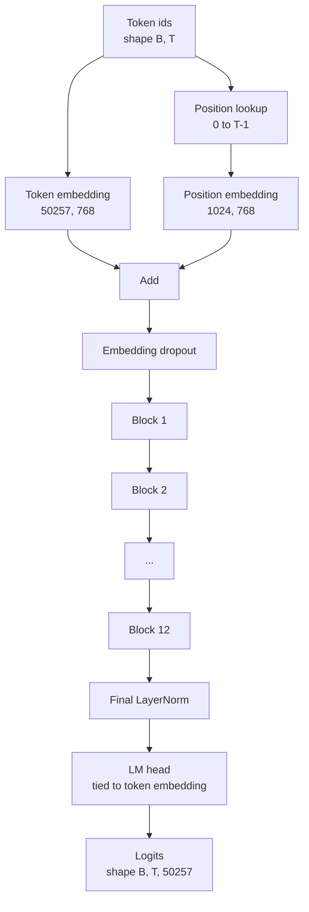
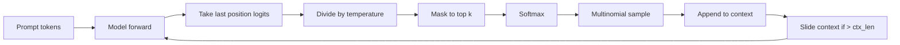

# GPT Model Assembly

> Стек из двенадцати блоков, токенный эмбеддинг, обучаемый позиционный эмбеддинг, финальный LayerNorm и связанная (tied) LM-голова. Это вся GPT-модель на 124 миллиона параметров. Этот урок собирает эти части в работающий класс, пересчитывает параметры, подтверждая совпадение с референсной формой 124M, и генерирует текст с multinomial-сэмплированием, температурой и top-k.

**Тип:** Практика
**Языки:** Python
**Пререквизиты:** Фаза 19, уроки 30–34
**Время:** ~90 минут

## Цели обучения

- Собрать блок трансформера из урока 34 в полную GPT-модель: токенный эмбеддинг, позиционный эмбеддинг, N блоков, финальный LayerNorm, LM-голова.
- Воспроизвести конфигурацию на 124 миллиона параметров: словарь 50257, контекст 1024, эмбеддинг 768, двенадцать голов, двенадцать слоев.
- Связать веса LM-головы с токенным эмбеддингом и объяснить, почему это экономит ~38 миллионов параметров на этом масштабе.
- Генерировать текст из промпта с multinomial-сэмплированием, температурным масштабированием и top-k-усечением, удерживая длину контекста скользящим окном.
- Замерить число параметров и стоимость forward-прохода против цели 124M.

## Проблема

Блок трансформера сам по себе ничего не делает. Нужно превратить токенные id в векторы, подмешать позиционную информацию, прогнать через стек и спроецировать обратно в логиты словаря. Забудьте любой из этих четырех шагов — и модель либо не пройдет forward, либо потеряет позиционную информацию, либо не сможет говорить.

Форма модели тоже важна. Референсная GPT-2 small — это 124 миллиона параметров ровно при конфигурации выше. Числа не магические. Словарь 50257 на эмбеддинг 768 — токенная таблица. Позиции 1024 на 768 — позиционная таблица. Двенадцать блоков примерно по 7 миллионов параметров — 84 миллиона. Финальная голова переиспользует токенную таблицу через weight tying. Сложите части — получите 124 миллиона. Модель, чей счетчик параметров не совпадает с референсом, — признак, что вы что-то соединили неправильно.

## Концепция



Токенные id становятся токенными векторами. Позиционные id — позиционными векторами. Они складываются и отправляются через стек. Финальный LayerNorm — та единственная деталь вне блоков, которая выживает в каждом современном варианте. LM-голова переиспользует матрицу токенного эмбеддинга — именно это и означает weight tying.

### Weight tying

Токенный эмбеддинг имеет форму `(vocab, d_model)`. LM-голове нужно проецировать из `d_model` обратно в `vocab`. Это транспозиции друг друга. Связать их — значит буквально один и тот же тензор-параметр, используемый дважды. При словаре 50257 и d_model 768 матрица — 38 миллионов параметров. Без связывания вы платите за нее дважды. Со связыванием — один раз, и вдобавок получаете чуть более чистый градиентный сигнал, потому что эмбеддинг и голова обновляются вместе.

### Позиционный эмбеддинг — обучаемый, не синусоидальный

GPT-2 отгружается с обучаемым позиционным эмбеддингом. Позиционная таблица — один тензор-параметр формы `(1024, 768)`. Модель на каждом forward ищет позиции от 0 до T-1 и прибавляет результат к токенному эмбеддингу. Это простейшая из позиционных схем (альтернативы — RoPE, ALiBi, относительный bias T5), и именно ее использует референс 124M.

### Генерация: температура, top-k, multinomial

Генерация авторегрессивна. На каждом шаге модель возвращает логиты по всему словарю в каждой позиции. Вы берете только последнюю позицию, делите на температуру, опционально маскируете все, кроме top-k логитов, минус бесконечностью, делаете softmax для вероятностей и сэмплируете один токен из полученного распределения.



Три ручки — три разных поведения. Температура около нуля схлопывается в greedy. Температура один соответствует естественному распределению модели. Top-k, равный одному, — greedy. Top-k сорок отфильтровывает длинный хвост. Комбинации важны; следующий урок об обучении использует генерацию как качественный eval-сигнал.

## Соберите это

`code/main.py` реализует:

- Датакласс `class GPTConfig` с дефолтами 124M: `vocab_size=50257`, `context_length=1024`, `d_model=768`, `num_heads=12`, `num_layers=12`, `mlp_expansion=4`, `dropout=0.1`, `use_bias=True`, `weight_tying=True`.
- `class GPTModel` с токенным эмбеддингом, позиционным эмбеддингом, dropout эмбеддингов, двенадцатью `TransformerBlock`, финальным LayerNorm и `lm_head`, связывающейся с токенным эмбеддингом при установленном флаге.
- Хелпер `count_parameters`, возвращающий число уникальных параметров (weight tying учитывается в счетчике).
- Функцию `generate` с температурой, top-k, multinomial и скользящим окном контекста.
- Демо: собирает модель, печатает число параметров рядом с референсными 124M и генерирует короткую последовательность из фиксированного промпта, показывая пайплайн end to end.

Запустите:

```bash
python3 code/main.py
```

Вывод: число параметров рядом с референсом 124M, сгенерированные токенные id из случайного промпта и подтверждение, что LM-голова и токенный эмбеддинг делят хранилище при включенном связывании.

Чтобы демо оставалось быстрым, скрипт также прогоняет крошечную конфигурацию (`d_model=64`, `num_layers=2`) end to end и печатает сгенерированную последовательность токенов инлайн. Конфигурация 124M собирается, но у нее замеряются только число параметров и один forward-проход.

## Стек

- `torch` для тензорной математики, autograd и модульной обвязки.
- `code/main.py` локально реимплементирует тот же паттерн блока из урока 34.

## Production-паттерны в реальной практике

Три паттерна отличают модель, которая запускается, от модели, которая отгружается.

**Инициализируйте residual-проекции маленькими.** Выходная проекция внимания и второй линейный слой MLP оба напрямую впадают в residual-сложение. Их инициализация с тем же стандартным отклонением, что у остальных линейных слоев, дает residual stream, растущий с глубиной и загоняющий финальный LayerNorm в горячий режим. Масштабируйте std на `1 / sqrt(2 * num_layers)` для этих двух проекций — residual stream останется во вменяемом диапазоне через двенадцать слоев.

**Кэшируйте тензор позиционных id, не пересчитывайте.** `torch.arange(T)` аллоцирует свежую память на каждом forward. Выделите один раз в `__init__` под максимальный контекст, срезайте первые T элементов на вызов и пропустите round trip аллокатора.

**Связывайте веса на уровне параметра, а не копированием.** `lm_head.weight = token_embedding.weight` делит тензор; копирование — нет. Оптимизатору нужно обновлять один параметр, а графу autograd — одну аккумуляцию. Если копируете, голова уплывает от эмбеддинга, и weight tying не дает ничего.

## Используйте это

- Класс модели этого урока — той же формы, что и тот, который обучает следующий урок.
- Замена обучаемого позиционного эмбеддинга на RoPE дает семейство LLaMA, не трогая блок и голову.
- Замена GELU на SiLU и LayerNorm на RMSNorm — остальные изменения семейства LLaMA.
- Функция генерации работает с любым источником логитов, не только этой моделью. В уроке 37 можно тянуть логиты из предобученного файла GPT-2 и переиспользовать тот же цикл генерации.

## Упражнения

1. Развяжите LM-голову и токенный эмбеддинг и пересчитайте параметры. Убедитесь, что дельта — 50257 на 768 = 38 миллионов.
2. Замените обучаемый позиционный эмбеддинг синусоидальной таблицей, вычисляемой при конструировании. Подтвердите, что модель по-прежнему проходит forward, а число параметров падает на 786 432.
3. Добавьте генерации флаг `greedy=True`, пропускающий сэмплирование и берущий argmax. Подтвердите, что последовательность детерминирована между прогонами.
4. Добавьте ручку `repetition_penalty`, делящую логит любого токена из промпта или сгенерированной истории на константу до softmax. Покажите на фиксированном промпте, что значения выше единицы уменьшают число повторов в выводе.
5. Добавьте `top_p` (nucleus) сэмплирование рядом с `top_k`. Двухстрочная проверка: сумма вероятностей оставленных токенов превышает `top_p`.

## Ключевые термины

| Термин | Как говорят | Что это на самом деле |
|------|-----------------|------------------------|
| Weight tying | «Связанные эмбеддинги» | LM-голова и токенный эмбеддинг делят один тензор-параметр; экономит vocab на d_model параметров и совпадает с референсом GPT-2 |
| Позиционный эмбеддинг | «Обучаемые позиции» | Отдельная таблица формы (длина контекста, d_model), прибавляемая к токенным векторам; обучается end to end |
| Скользящее окно контекста | «Потолок контекста» | Когда промпт плюс сгенерированные токены превышают длину контекста, старейшие токены отбрасываются, чтобы активное окно поместилось |
| Top-k-сэмплирование | «K-усечение» | Оставить K логитов с наибольшими значениями, замаскировать остальные минус бесконечностью, softmax по выжившим |
| Температура | «Температура сэмплирования» | Деление логитов на T до softmax; T меньше 1 заостряет, T равное 1 сохраняет естественное распределение, T больше 1 сглаживает |

## Дополнительное чтение

- Фаза 19, урок 34 — блок, который эта модель стекует.
- Фаза 19, урок 36 — цикл обучения, гоняющий эту модель кросс-энтропийным лоссом.
- Фаза 19, урок 37 — загрузка предобученных весов GPT-2 ровно в эту архитектуру.
- Фаза 7, урок 07 (каузальное языковое моделирование GPT) — математика предсказания следующего токена.
- Фаза 10, урок 04 (предобучение mini-GPT) — оригинальная процедура обучения на той же архитектуре.
