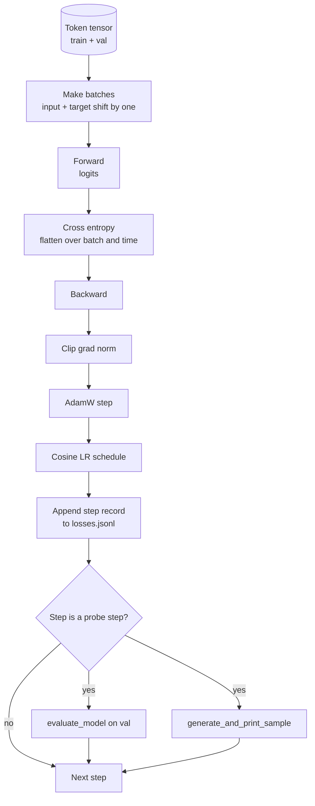

# Training Loop and Evaluation

> Цикл, который не измеряет, — цикл, который лжет. Этот урок строит цикл обучения, гоняющий GPT-модель: AdamW с разделением weight decay, расписание learning rate с warmup и косинусным затуханием, хелпер `calc_loss_batch`, прогон `evaluate_model` на отложенных данных, качественный зонд `generate_and_print_sample` каждые K шагов и JSONL-лог лоссов, который потом можно построить. Тот же скелет обучает любой decoder-LLM, который вы когда-либо соберете.

**Тип:** Практика
**Языки:** Python
**Пререквизиты:** Фаза 19, уроки 30–35
**Время:** ~90 минут

## Цели обучения

- Построить цикл обучения, считающий кросс-энтропийный лосс с правильным выравниванием входа и цели для предсказания следующего токена.
- Сконфигурировать AdamW так, чтобы weight decay применялся к весовым тензорам, но не к LayerNorm- и bias-тензорам.
- Реализовать расписание learning rate с линейным warmup и косинусным затуханием и прочитать получающийся LR во времени.
- Оценивать на отложенном сплите через `evaluate_model`, чтобы eval-лосс был сравним между прогонами.
- Генерировать качественный сэмпл каждые K шагов через `generate_and_print_sample`, чтобы поймать расхождение раньше, чем кривая лосса.
- Персистить пошаговый лосс в JSONL, чтобы лог обучения можно было перезагрузить, построить и отгрузить как артефакт.

## Проблема

Обучающий скрипт, который печатает лосс и больше ничего, отказывает тремя способами. Он не может сказать, падает ли лосс по правильной причине (модель может переобучиться на трейне и ничему не научиться). Не может сказать, начинается ли расхождение (лосс может подскочить на один шаг и восстановиться — или на один шаг и рухнуть). Не может сказать, что модель выучила (лосс — скаляр; сгенерированный сэмпл — абзац). Все три отказа прячутся, пока цикл не измеряет.

Цикл этого урока измеряет тремя способами. Лосс на обучающем батче каждый шаг. Лосс на отложенном батче каждые K шагов. Сгенерированное продолжение фиксированного промпта каждые K шагов. Лог обучения ложится в JSONL — артефакт и есть показания цикла.

## Концепция



Две неочевидные детали — выравнивание лосса и разделение decay в AdamW.

### Выравнивание лосса

Модель предсказывает следующий токен в каждой позиции. Если входной батч — токены `[t0, t1, t2, t3]`, целевой батч обязан быть `[t1, t2, t3, t4]`. Кросс-энтропия считается на плоской форме `(batch * seq, vocab)` против плоской цели `(batch * seq,)`. Забудьте сдвиг — и обучите модель предсказывать саму себя: лосс сойдется к нулю, а полезного не выучится ничего.

### Разделение decay в AdamW

Weight decay регуляризует весовые тензоры, но не масштабы нормализации и не bias'ы. Decay на scale LayerNorm медленно гонит масштаб к нулю и ломает нормализацию. Decay на bias математически безвреден, но тратит циклы впустую. Стандартное разделение: тензоры матричной формы (веса линейных слоев, таблицы эмбеддингов) получают decay, все, что похоже на scale или shift, — нет.

### Warmup плюс косинусное расписание

Warmup поднимает learning rate от нуля до цели за несколько сотен шагов, чтобы состояние оптимизатора успело населиться. Косинусное затухание опускает learning rate обратно к нулю на оставшихся шагах, чтобы финальная фаза дотачивала веса маленьким шагом. Комбинация — самое частое расписание в обучении open-weights LLM, потому что она убирает большинство хрупких моментов первой тысячи и последней тысячи шагов.

### Оценка на отложенных данных

`evaluate_model` прогоняет фиксированное число батчей валидационного сплита, аккумулирует лосс, делит на число батчей и возвращает. Без градиента. Без dropout. Число воспроизводимо между прогонами при одном сиде и одном сплите. Отчет отложенного лосса рядом с обучающим — способ заметить переобучение.

### Качественное сэмплирование как ранний сигнал

Модель, у которой обучающий лосс красиво падает, а сгенерированные сэмплы — один и тот же токен, сломана. Модель, у которой кривая лосса выглядит плоской, но сэмплы заостряются в связные слова, учится. Качественный зонд работает быстрее, чем чтение полной кривой, и ловит режимы, которые скаляр упускает.

## Соберите это

`code/main.py` реализует:

- `make_batches(token_ids, batch_size, context_length)` — режет длинный токенный тензор на пары входа и цели.
- `calc_loss_batch(model, inputs, targets)` — форвардит, уплощает и возвращает скаляр кросс-энтропии.
- `evaluate_model(model, val_loader, max_batches)` — итерирует фиксированное число валидационных батчей без градиента и возвращает средний лосс.
- `generate_and_print_sample(model, prompt, max_new_tokens)` — запускает функцию генерации из урока 35 на фиксированном промпте и печатает результат.
- `build_param_groups(model, weight_decay)` — порождает двухгрупповой список параметров для AdamW.
- `cosine_with_warmup(step, warmup_steps, total_steps, max_lr, min_lr)` — возвращает LR на данном шаге.
- `train(...)` — гоняет цикл, персистит `outputs/losses.jsonl` и печатает eval-лосс и сэмпл каждые `eval_every` шагов.
- Демо: обучает крошечную модель на синтетических данных небольшое число шагов, пишет JSONL-лог и печатает eval-лосс и сэмпл в точках зондирования. Демо укладывается значительно меньше чем в минуту на CPU.

Запустите:

```bash
python3 code/main.py
```

Вывод: строка лосса на каждый шаг, eval-лосс на каждом шаге зондирования, сгенерированный сэмпл на каждом шаге зондирования и финальный `outputs/losses.jsonl`, загружаемый через `json.loads` построчно.

## Стек

- `torch` для autograd, оптимизатора и модулей.
- `main.py` локально реимплементирует `GPTModel` урока 35 и вспомогательные модули.

## Production-паттерны в реальной практике

Три паттерна превращают учебный цикл в то, что можно оставить крутиться на ночь.

**Клиппинг нормы градиента не обсуждается.** Плохой батч (аномальные данные, скачок LR, численный краевой случай) порождает огромный градиент, стирающий часы обучения. `torch.nn.utils.clip_grad_norm_(params, max_norm=1.0)` после `backward` и до `step` держит оптимизатор в безопасном диапазоне. Порог клиппинга — свободный параметр; единица — дефолт, переживающий большинство конфигураций.

**Возобновляемый JSONL-лог, а не запикленное состояние.** Пошаговые записи лосса строками `{"step": int, "train_loss": float, "lr": float}` в JSONL долговечны: любой краш оставляет читаемый артефакт, его можно грепать, строить тридцатью строками Python, а обучение — возобновлять чтением последнего шага. Запикленное состояние привязывает вас к точной раскладке модулей, породившей файл, — это хрупко при рефакторингах.

**Eval-батчи из фиксированного среза.** Валидационные токены режутся на батчи при старте скрипта, а не на лету. Воспроизводимость зависит от идентичности eval-батчей от прогона к прогону; иначе сравнение eval-лосса двух прогонов меряет шаффл батчей не меньше, чем модель.

## Используйте это

- Цикл этого урока — тот же скелет, что обучает модель 124M на настоящих данных. Замените синтетический токенный тензор загрузчиком в стиле `datasets` — и цикл работает без изменений.
- JSONL-лог — артефакт, превращающий обучающий прогон в доказательство. Следующий урок использует его для сравнения свежеобученного чекпоинта с предобученным.
- Качественный зонд сэмплами — та страховка, которую скалярный лосс заменить не может.

## Упражнения

1. Добавьте юнит-тесты `weight_decay_groups()`, подтверждающие, что scale- и bias-параметры попадают в группу без decay, а веса линейных слоев и эмбеддингов — в группу с decay.
2. Замените синтетические случайные токены байтами из маленького текстового файла, чтобы демо обучалось на чем-то читаемом. Убедитесь, что сгенерированный сэмпл использует символы из файла.
3. Добавьте косинусному расписанию пол `min_lr` в 10 процентов от `max_lr` и перестройте график.
4. Сохраняйте чекпоинт каждые `eval_every` шагов вдобавок к JSONL-логу. Добавьте флаг `resume_from`, перезагружающий состояние модели и оптимизатора.
5. Логируйте пошаговый throughput (токены в секунду) рядом с лоссом и подтвердите, что он остается в устойчивой полосе.

## Ключевые термины

| Термин | Как говорят | Что это на самом деле |
|------|-----------------|------------------------|
| Выравнивание лосса | «Сдвиг на один» | Входные токены в позициях 0..T-1, целевые — в позициях 1..T; кросс-энтропия считается на уплощенных формах |
| Разделение decay | «Две группы» | AdamW получает тензоры матричной формы с weight decay и scale/bias-тензоры без него |
| Warmup | «Разгон» | Learning rate поднимается от нуля до цели за фиксированное число шагов, чтобы состояние оптимизатора населилось |
| Eval-батчи | «Отложенные батчи» | Фиксированный срез валидационного токенного тензора, нарезанный один раз при старте скрипта и используемый идентично на каждом зондировании |
| Качественный зонд | «Печать сэмпла» | Короткая генерация из фиксированного промпта, печатаемая каждые K шагов, чтобы ловить режимы отказа, которые лосс в одиночку прячет |

## Дополнительное чтение

- Фаза 19, урок 35 — модель, которую гоняет цикл.
- Фаза 19, урок 37 — загрузка предобученных весов в ту же модель.
- Фаза 10, урок 04 (предобучение mini-GPT) — процедура на настоящих данных.
- Фаза 10, урок 10 (оценка) — более широкая поверхность eval за пределами кросс-энтропийного лосса.
