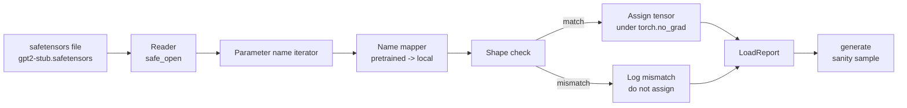

# Loading Pretrained Weights

> Обучить модель на 124 миллиона параметров с нуля — это бюджетное решение; загрузить опубликованный чекпоинт — рядовой вторник. Этот урок загружает предобученные веса в стиле GPT-2 из safetensors-файла ровно в архитектуру урока 35, разбирает маппинг имён параметров кусочек за кусочком и sanity-генерирует продолжение, доказывая, что загрузка сработала. Без сети, без сторонних загрузчиков, без непрозрачной магии.

**Тип:** Практика
**Языки:** Python
**Пререквизиты:** Фаза 19, уроки 30–36
**Время:** ~90 минут

## Цели обучения

- Прочитать safetensors-файл Python-библиотекой `safetensors` и рассмотреть имена и формы тензоров.
- Смаппить каждое имя предобученного параметра на параметр внутри GPT-модели урока 35.
- Обработать две конвенции имён, различающиеся между опубликованными весами GPT-2 и моделью этого трека: `wte/wpe/h.N.attn.c_attn/c_proj` и `mlp.c_fc/c_proj` против локальных `tok_embed/pos_embed/blocks.N.attn.qkv/out_proj` и `mlp.fc1/fc2`.
- Обнаружить несовпадение форм и отказать с ясной ошибкой до какого-либо присваивания весов.
- Сгенерировать короткое продолжение загруженными весами и подтвердить, что токены идут из загруженного распределения, а не из случайно инициализированного.

## Проблема

Опубликованные веса не упакованы под вашу архитектуру. Они несут имена оригинальной реализации. В предобученном файле лежит `transformer.h.0.attn.c_attn.weight` формы `(2304, 768)`; ваша модель ждёт `blocks.0.attn.qkv.weight` формы `(2304, 768)` (это та же матрица в другой конвенции раскладки), или ваша модель использует `nn.Linear`, который хранит матрицу транспонированной. Один и тот же параметр появляется с тремя тонко различающимися идентичностями (имя, форма, байтовая раскладка), и загрузчик обязан согласовать все три.

Загрузчик, копирующий вслепую, кладёт правильный тензор не туда — и вы получаете модель, генерирующую бессмыслицу. Загрузчик, отказывающийся копировать при несовпадении форм, но ничего не логирующий, оставляет вас гадать, какой тензор не приземлился. Загрузчик этого урока явный: каждое присваивание логируется, каждая форма проверяется, а `LoadReport` суммирует попадания, промахи и несовпадения форм, чтобы можно было прочитать, что случилось.

## Концепция



Маппер имён — просто функция из строки в строку. Проверка формы — один if. Присваивание происходит внутри `torch.no_grad()`, чтобы autograd не трекал загрузку. Отчёт хранит исход каждого имени.

### Конвенция имён GPT-2

Опубликованные веса GPT-2 живут под именами вроде:

| Имя в предобученном файле | Форма | Смысл |
|-----------------|-------|---------|
| `wte.weight` | (50257, 768) | Токенный эмбеддинг |
| `wpe.weight` | (1024, 768) | Позиционный эмбеддинг |
| `h.N.ln_1.weight` | (768,) | Scale LayerNorm 1 блока N |
| `h.N.ln_1.bias` | (768,) | Shift LayerNorm 1 блока N |
| `h.N.attn.c_attn.weight` | (768, 2304) | Вес слитого QKV-линейного слоя |
| `h.N.attn.c_attn.bias` | (2304,) | Bias слитого QKV |
| `h.N.attn.c_proj.weight` | (768, 768) | Выходная проекция внимания |
| `h.N.attn.c_proj.bias` | (768,) | Bias выходной проекции |
| `h.N.ln_2.weight` | (768,) | Scale LayerNorm 2 |
| `h.N.ln_2.bias` | (768,) | Shift LayerNorm 2 |
| `h.N.mlp.c_fc.weight` | (768, 3072) | Вес fc1 MLP |
| `h.N.mlp.c_fc.bias` | (3072,) | Bias fc1 MLP |
| `h.N.mlp.c_proj.weight` | (3072, 768) | Вес fc2 MLP |
| `h.N.mlp.c_proj.bias` | (768,) | Bias fc2 MLP |
| `ln_f.weight` | (768,) | Scale финального LayerNorm |
| `ln_f.bias` | (768,) | Shift финального LayerNorm |

Два сюрприза, к которым нужно готовиться. Линейные слои `c_attn`, `c_proj`, `c_fc` хранятся с матрицей, транспонированной относительно ожиданий `nn.Linear.weight`. Загрузчик транспонирует при присваивании. LM-головы в файле нет вовсе; модель опирается на weight tying с `wte`, поэтому голова выставляется алиасом, как только `wte` приземлился.

### Локальная конвенция имён

Модель этого трека использует описательные имена:

| Локальное имя | Смысл |
|------------|---------|
| `tok_embed.weight` | Токенный эмбеддинг |
| `pos_embed.weight` | Позиционный эмбеддинг |
| `blocks.N.ln1.scale` | Scale LayerNorm 1 блока N |
| `blocks.N.ln1.shift` | Shift LayerNorm 1 |
| `blocks.N.attn.qkv.weight` | Слитый QKV |
| `blocks.N.attn.qkv.bias` | Bias слитого QKV |
| `blocks.N.attn.out_proj.weight` | Выходная проекция внимания |
| `blocks.N.attn.out_proj.bias` | Bias выходной проекции |
| `blocks.N.ln2.scale` | Scale LayerNorm 2 |
| `blocks.N.ln2.shift` | Shift LayerNorm 2 |
| `blocks.N.mlp.fc1.weight` | fc1 MLP |
| `blocks.N.mlp.fc1.bias` | Bias fc1 MLP |
| `blocks.N.mlp.fc2.weight` | fc2 MLP |
| `blocks.N.mlp.fc2.bias` | Bias fc2 MLP |
| `final_ln.scale` | Scale финального LayerNorm |
| `final_ln.shift` | Shift финального LayerNorm |

Маппинг — фиксированная функция. Урок поставляет его словарём, который итерирует загрузчик.

### Стуб-фикстура

Настоящие веса GPT-2 весят 0.5 ГБ. Демо их не скачивает; при первом запуске оно генерирует маленькую safetensors-фикстуру с точной конвенцией имён GPT-2 и формами 12-блочной модели при d_model 192 вместо 768. У фикстуры правильная структура, чтобы прогнать каждый код-путь загрузчика. Замените фикстуру настоящим файлом — загрузчик работает без модификаций.

## Соберите это

`code/main.py` реализует:

- Маленькую реплику `GPTModel` урока 35, чтобы урок был самодостаточным.
- `make_pretrained_to_local(num_layers)` — разворачивает пер-слойные записи.
- `load_safetensors(model, path)` — итерирует имена, маппит их, проверяет форму, транспонирует веса conv1d-стиля и присваивает под `torch.no_grad()`. Возвращает `LoadReport`.
- `make_stub_safetensors(path, cfg)` — генерирует файл-фикстуру с точной конвенцией имён предобученного файла.
- Демо: создаёт `outputs/gpt2-stub.safetensors` при первом запуске, собирает свежую модель, захватывает одно сгенерированное продолжение со случайной инициализации, загружает стуб, захватывает второе продолжение, печатает оба и проверяет, что они различны (загрузка действительно изменила модель).

Запустите:

```bash
python3 code/main.py
```

Вывод: путь фикстуры, лог загрузки по каждому имени, сводка `LoadReport`, продолжение до загрузки, продолжение после загрузки и несовпадение формы на одном намеренно испорченном тензоре, вставленном в фикстуру, — чтобы путь отказа тоже был прогнан.

## Стек

- `safetensors` для дискового формата и стримингового ридера.
- `torch` для модели и математики присваивания.
- Никакого `transformers`, никакого `huggingface_hub`, никаких сетевых вызовов.

## Production-паттерны в реальной практике

Три паттерна позволяют загрузчику пережить контакт с весами, которые создали не вы.

**Всегда валидируйте файл до какого-либо присваивания.** Откройте файл, выпишите каждое имя тензора с dtype и формой, прогоните весь маппинг с проверками форм и только при успехе начинайте присваивать. Полузагруженные модели — машины молчаливых отказов.

**Логируйте каждое присваивание с именем источника и именем назначения.** Когда что-то выглядит неправильно, лог говорит, какой тензор куда приземлился; альтернатива — чтение хексдампов. Датакласс `LoadReport` в этом уроке отслеживает списки `loaded`, `missing`, `unexpected` и `shape_mismatch` и печатает сводку в конце.

**LM-голова — алиас weight tying, а не отдельная копия.** `model.lm_head.weight = model.tok_embed.weight` после загрузки `tok_embed` — канонический паттерн. Копирование матрицы эмбеддинга в свежий параметр `lm_head.weight` ломает связывание и тихо удваивает число параметров.

## Используйте это

- Загрузчик работает с любым safetensors-файлом, использующим конвенцию имён предобученного файла. Настоящие файлы GPT-2 (small / medium / large / xl) работают без изменений кода; отличается только конфигурация модели.
- Тот же паттерн растягивается на веса LLaMA, Mistral, Qwen после обновления карты имён. Проверки форм и отчёт остаются идентичными.
- Sanity-генерация после загрузки — быстрый gate: если сэмплы после загрузки выглядят как до, загрузка не изменила модель — значит, маппинг молча промахнулся по каждому тензору.

## Упражнения

1. Добавьте загрузчику аргумент `dtype`, приводящий каждый тензор к целевому dtype (`bfloat16`, `float16`, `float32`) при присваивании. Подтвердите, что `float32`-модель можно понизить до `bfloat16`, и она всё ещё генерирует.
2. Добавьте аргумент `expected_layers`, отказывающий чекпоинту, чьи индексы `h.N` не совпадают с `num_layers` модели.
3. Подключите загрузчик к функции генерации урока 35 и получите два сэмпла бок о бок: один со случайной инициализации, второй — из загруженной фикстуры.
4. Добавьте путь экспорта: запишите текущее состояние модели в свежий safetensors-файл в конвенции имён предобученного файла. Прогоните загрузчик round trip и подтвердите ноль несовпадений форм в отчёте.
5. Расширьте `NAME_MAP` под конвенцию имён LLaMA (без bias, RMSNorm, слитая qkv-раскладка) и перезапустите загрузчик на сгенерированной вами стуб-фикстуре LLaMA.

## Ключевые термины

| Термин | Как говорят | Что это на самом деле |
|------|-----------------|------------------------|
| Карта имён | «Key remapping» | Функция из имён предобученных тензоров в локальные имена параметров; обычно буквальный dict с одной записью на индекс слоя, развёрнутый циклом |
| Несовпадение форм | «Bad shape» | Предобученный тензор существует под смаппленным именем, но его размерности не согласуются с локальным параметром; загрузчик отказывается присваивать и логирует пару |
| Транспонирование при загрузке | «Conv1d layout» | Опубликованный GPT-2 хранит проекции внимания и MLP транспонированными относительно ожиданий nn.Linear; загрузчик транспонирует при присваивании |
| Алиас weight tying | «Общая LM-голова» | model.lm_head.weight = model.tok_embed.weight, чтобы голова и эмбеддинг делили хранилище; головы нет в файле именно поэтому |
| Отчёт загрузки | «Сводка покрытия» | Маленький датакласс со списками loaded, missing, unexpected и shape_mismatch; его печать — способ понять, удалась ли загрузка |

## Дополнительное чтение

- Фаза 19, урок 35 — архитектура, принимающая веса.
- Фаза 19, урок 36 — цикл обучения, порождающий чекпоинт той же формы.
- Фаза 10, урок 11 (квантизация) — что делать с загруженными весами, когда память поджимает.
- Фаза 10, урок 13 (полный LLM-пайплайн) — полный жизненный цикл вокруг загрузки и инференса.
