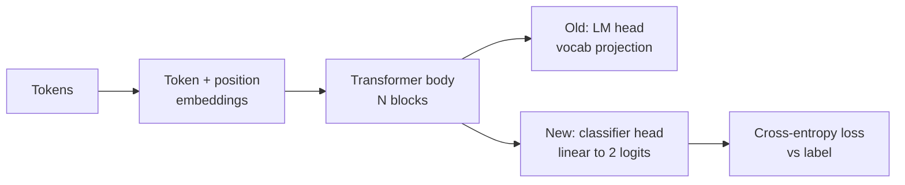
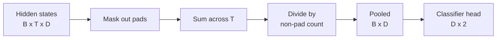
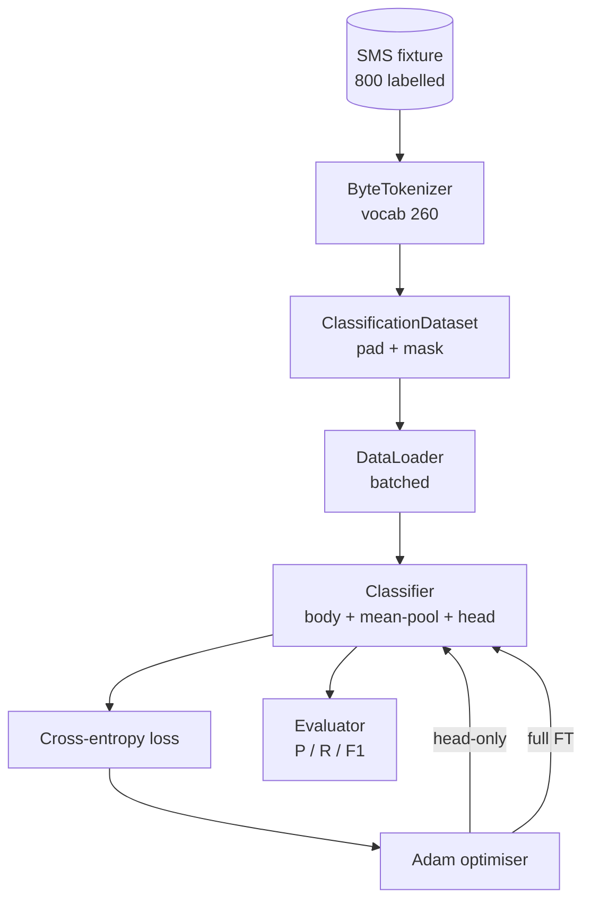

# Capstone Lesson 38: Classifier Fine-Tuning by Head Swap

> Первый capstone трека B. Предобученная языковая модель — стек self-attention-блоков, заканчивающийся головой предсказания токенов. Когда вам нужно spam против ham, голова не подходит, но тело в основном годится. Этот урок срывает голову, приклеивает двухклассовый линейный слой к спуленному представлению и обучает классификатор двумя способами: только финальный слой и полный fine-tuning. Eval — precision, recall и F1 на отложенном сплите. Вы узнаёте, что покупает каждая стратегия и во что она обходится.

**Тип:** Практика
**Языки:** Python (torch, numpy)
**Пререквизиты:** Фаза 19, уроки 30–37 (трек NLP LLM: токенизатор, таблица эмбеддингов, attention-блок, тело трансформера, цикл предобучения, чекпоинты, генерация, перплексия)
**Время:** ~90 минут

## Цели обучения

- Заменить голову языковой модели классификационной, не реинициализируя тело.
- Реализовать два режима обучения: замороженное тело (только голова) и полный fine-tuning — с одним общим циклом обучения.
- Построить токенизатор-осведомлённый дата-пайплайн, который паддит, маскирует паддинг и пулит выход внимания.
- Вычислить precision, recall, F1 и матрицу ошибок из сырых логитов.
- Понять компромисс между числом параметров, временем обучения и запасом качества.

## Проблема

Вы предобучили маленький трансформер на универсальном корпусе. Выходная голова проецирует последнее скрытое состояние в словарь из 1000 токенов. Теперь у вас 800 SMS с метками spam или ham, и вам нужен бинарный классификатор. Есть три варианта.

Неправильный вариант — обучить свежий классификатор с нуля на 800 примерах. Тело предобученной модели уже кодирует полезную структуру: идентичность слов, позицию, простую совстречаемость. Выбросить его — потратить впустую compute, который его построил.

Два правильных варианта — замена головы с замороженным телом и замена головы с обучаемым телом. Обучение только головы быстрое, почти бесплатное по памяти и редко переобучается на таком объёме данных. Полный fine-tuning медленнее, может переобучиться на малых данных, но достигает большей точности, когда downstream-домен дрейфует от корпуса предобучения.

Этот урок строит оба, чтобы вы могли сравнить их на одной фикстуре.

## Концепция

Модель — функция `f_theta(tokens) -> hidden_states`. Голова — функция `g_phi(hidden) -> logits`. Замена головы — это сохранение `theta` и замена `g_phi`. Параметры тела — дорогая часть. Голова — один линейный слой.

Важны два набора обучаемых параметров:

- `theta` (тело): десятки тысяч весов на attention-блок.
- `phi` (голова): `hidden_dim * num_classes` весов плюс bias.

При обучении только головы вы считаете градиенты по `phi` и зануляете их по `theta`. PyTorch позволяет это через `requires_grad=False` на параметрах тела. Оптимизатор тогда видит только голову, а тело остаётся замороженным.

При полном fine-tuning градиенты текут назад через весь стек. Веса тела дрейфуют под классификационную цель. Риск — катастрофическое забывание на малых данных: предобучение тела вымывается шумом переобучения.

## Вопрос пулинга

Классификатору нужен один вектор на последовательность, а не один вектор на токен. Три частых выбора:

- **Mean pool**: усреднить скрытые состояния по последовательности, взвесив на маску внимания.
- **CLS pool**: приклеить специальный токен спереди и использовать только его выход. Так делает BERT.
- **Last-token pool**: использовать последний не-паддинговый токен. Так делают классификаторы GPT-класса.

Этот урок использует mean pooling с явным взвешиванием по маске внимания. Это простейший вариант, он даёт стабильный сигнал на любых длинах последовательностей и не требует предобучать CLS-токен.

## Данные

Восемьсот SMS, сбалансированных 400 spam и 400 ham, генерируются детерминированно в `code/main.py`. Генератор использует фиксированный сид, выбирает шаблоны и подставляет заполнители слотов, порождая сообщения от 5 до 25 токенов. В настоящих датасетах есть шум, которого в этой фикстуре нет. Смысл фикстуры — воспроизводимость.

Данные делятся 80/20: 640 трейн, 160 тест. Сплиты стратифицированы, чтобы тестовый набор сохранял баланс 50/50. Отложенный набор с известным балансом позволяет читать precision и recall как честные числа.

## Метрики

Бинарная классификация с классом 1 как положительным (spam). Счётчики:

- `TP`: предсказан spam, был spam.
- `FP`: предсказан spam, был ham.
- `FN`: предсказан ham, был spam.
- `TN`: предсказан ham, был ham.

Три главные метрики:

- `precision = TP / (TP + FP)`. Из помеченного как spam — какая доля им действительно является?
- `recall = TP / (TP + FN)`. Из настоящего spam — какую долю модель поймала?
- `F1 = 2 * P * R / (P + R)`. Гармоническое среднее двух.

Матрица ошибок печатает четыре счётчика сеткой 2x2. Демо пишет её в stdout для обоих режимов обучения.

## Архитектура

Тело — намеренно крошечный трансформер: словарь 260, hidden 64, 4 головы, 2 блока, максимальная последовательность 32. Он достаточно мал, чтобы обучить оба режима до сходимости за девяносто секунд на CPU. В уроке он не предобучен; вместо этого хелпер `pretrain_quick` делает пять эпох LM-обучения на тексте той же фикстуры, чтобы дать телу нетривиальную стартовую точку. Так урок остаётся самодостаточным.

## Что вы соберёте

Реализация — один `main.py` плюс один тестовый модуль (`code/tests/test_main.py`).

1. `ByteTokenizer`: маппит байты в id, резервирует pad-id.
2. `Block`: блок трансформера с multi-head attention и feed-forward-слоем. Pre-norm.
3. `LMBody`: токенные + позиционные эмбеддинги плюс стек блоков. Возвращает скрытые состояния.
4. `MeanPool`: взвешенное маской среднее по оси последовательности.
5. `Classifier`: тело, пул, линейная голова. Тело — один и тот же экземпляр в обоих режимах.
6. `freeze_body` и `unfreeze_body`: переключают `requires_grad` на параметрах тела.
7. `train_classifier`: один общий цикл. Принимает модель и оптимизатор, сконфигурированный под ту группу параметров, которая обучается.
8. `evaluate`: прогоняет тестовый набор и возвращает `Metrics(precision, recall, f1, confusion)`.
9. `run_demo`: коротко предобучает тело, затем обучает и оценивает head-only, затем полный режим, печатает оба отчёта и выходит с нулём.

## Почему сравнение важно

Режим только головы обычно обучается быстрее и недообучается изящнее. На этой фикстуре после двадцати эпох head-only-обучения вы обычно видите precision около 0.9 и recall около 0.85. Полный fine-tuning занимает примерно втрое дольше и приземляется в паре пунктов в любую сторону — в зависимости от сида.

Урок не выбирает победителя. Он учит читать числа и цену. На 800 примерах и крошечном теле head-only — правильный выбор. На 80 000 примеров и теле побольше полный fine-tuning начинает окупаться. Контракт, который вы забираете из урока, — это API: одна и та же функция `train_classifier` обслуживает оба режима, а переключатель — один вызов.

## Дополнительные цели

- Добавьте третий режим, размораживающий только последний блок. Это иногда называют частичным fine-tuning. Он стоит меньше полного FT и выучивает больше, чем head-only.
- Добавьте планировщик learning rate. Косинусное расписание на голове плюс меньшая константа на теле — частая продакшен-конфигурация.
- Замените mean pooling обучаемым attention-пулом: маленький слой внимания с одним обучаемым query. На длинных последовательностях он часто бьёт mean pool.

Реализация даёт вам хуки. Тесты фиксируют контракт. Числа — вам двигать.

## Дополнительное чтение

- Фаза 11, урок 08 — fine-tuning с LoRA и QLoRA.
- Фаза 19, урок 37 — загрузка предобученных весов, урок 39 — instruction tuning.
