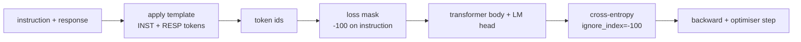
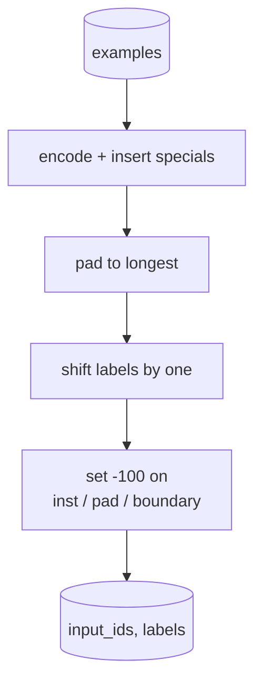
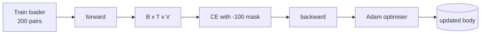

# Capstone Lesson 39: Instruction Tuning by Supervised Fine-Tuning

> Предобученная базовая модель умеет продолжать последовательность, но не умеет следовать инструкции. Supervised fine-tuning — наименьшее изменение, которое это чинит: скормите модели парные примеры инструкции и желаемого ответа и обучите тело предсказывать токены ответа. Хитрость в том, что лосс должен считать только ответ, а не инструкцию. Этот урок строит SFT-цикл в стиле Alpaca с кастомной collate-функцией, маскирующей токены инструкции через `ignore_index=-100`, обучает на 200 парах инструкция-ответ и оценивает на отложенном сплите через exact-match.

**Тип:** Практика
**Языки:** Python (torch, numpy)
**Пререквизиты:** Фаза 19, уроки 30–37 (трек NLP LLM: токенизатор, таблица эмбеддингов, attention-блок, тело трансформера, цикл предобучения, чекпоинты, генерация, перплексия)
**Время:** ~90 минут

## Цели обучения

- Отформатировать парные данные инструкция-ответ в одну каузальную последовательность с явными граничными токенами.
- Построить collate-функцию, маскирующую токены инструкции, чтобы кросс-энтропия считала только токены ответа.
- Обучить крошечное тело трансформера под SFT-целью и увидеть, как двигается eval-метрика.
- Реализовать greedy- и температурную генерацию, уважающую границу начала ответа.
- Посчитать exact-match на сгенерированных завершениях отложенного набора.

## Проблема

Базовая модель, обученная предсказывать следующий токен, понятия не имеет, что такое инструкция. Покажите ей строку `"What is the capital of France?"` — и она продолжит вопрос или выдумает новое предложение. У модели есть язык, но нет контракта формата.

SFT-контракт — строковый шаблон. Каждый обучающий пример становится одной последовательностью с тремя областями:

```text
<INST> What is the capital of France? <RESP> The capital of France is Paris.
```

Граничные токены — специальные токены, зарезервированные на этапе обучения. Модель выучивает, что все после `<RESP>` — ответ, и именно ответ оценивается. Цель базовой модели — следующий токен — никуда не девается; она просто обучается на корпусе, где каждый пример имеет эту форму.

Но есть подвох. Если скормить всю последовательность обычной кросс-энтропии, вы обучаете модель предсказывать еще и токены инструкции. Инструкция дана. На этих позициях нужен нулевой градиент. Лечение — маска.

## Концепция



`ignore_index` — фича `torch.nn.functional.cross_entropy`. Любая целевая позиция, равная `ignore_index`, вносит нулевой лосс и нулевой градиент. Конвенция PyTorch — `-100`. Collate-функция строит два тензора на пример: `input_ids` (полная последовательность) и `labels` (копия `input_ids`, где позиции инструкции перезаписаны `-100`).

Модель видит всю последовательность на forward-проходе; внимание может смотреть на инструкцию. Лосс считает только токены ответа. Это ровно то, что нужно: обусловиться на инструкции, предсказать ответ.

## Данные

Двести пар инструкция-ответ генерируются детерминированно в `main.py`. Они покрывают шесть типов задач:

- фактологическая одношаговая (столица X)
- арифметика
- извлечение списка
- саммари одним предложением
- код (print, sort)
- определение

У каждой задачи шаблонная инструкция и детерминированный ответ. Это намеренно просто. Exact-match хрупок, и урок использует фикстуру, где правильный ответ — одна конкретная строка. Настоящим SFT-датасетам нужны нечеткие метрики; принцип идентичен.

Сплиты: 160 трейн, 40 тест. Тестовый набор покрывает все шесть типов задач, поэтому exact-match можно репортить по категориям.

## Токенизация и паддинг

Токенизатор байтовый, с тремя зарезервированными спецтокенами:

- `INST_ID = 256`: помечает начало области инструкции.
- `RESP_ID = 257`: помечает границу между инструкцией и ответом.
- `PAD_ID = 258`: паддинг для батчей переменной длины.

Последовательность — `[INST] inst_bytes [RESP] resp_bytes [PAD]*`. Collate-функция:

1. Токенизирует каждый пример.
2. Паддит каждый пример батча до длиннейшей последовательности батча.
3. Строит `labels` = `input_ids`, сдвинутые на один (каузальная LM-цель), где:
   - область инструкции заменена на `-100`;
   - область паддинга заменена на `-100`;
   - сама граничная позиция `RESP_ID` заменена на `-100` (модель не обучают предсказывать граничный токен; она предсказывает то, что за ним).



Сдвиг — стандартный каузальный трюк: позиция `i` в `input_ids` предсказывает позицию `i+1`, поэтому `labels[i] = input_ids[i+1]` (финальная позиция выбрасывается из входа, первая — из цели). Маска применяется после сдвига, чтобы попасть на правильные позиции.

## Обучение



Цикл — стандартный PyTorch SFT-цикл. Adam, learning rate около 3e-4–1e-3, десять-двадцать эпох на этой фикстуре, без планировщика. Модель достаточно мала (hidden 96, 2 блока, максимальная длина 64), чтобы дообучиться до сходимости на CPU за две минуты.

Каждую пятую эпоху цикл гоняет маленький eval-проход по отложенному набору и печатает exact-match. Наблюдать, как exact-match идет с 0.0 на первой эпохе до примерно 0.85 на пятнадцатой, — награда урока: видно, как модель одновременно выучивает формат и ответы.

## Генерация

На eval модель получает префикс инструкции `[INST] inst_bytes [RESP]` и генерирует токены, пока:

- последовательность не достигнет `max_len`, или
- модель не выдаст стоп-эвристику: два подряд байта конца предложения (`.`, `!`, `?`).

Урок поставляет greedy-декодирование плюс опциональный температурный сэмплер. Exact-match использует greedy, потому что температура сделала бы метрику стохастичной. Настоящие системы часто сэмплируют, а затем судят нечетко; этот пайплайн — урок 41.

## Оценка exact-match

Exact-match — строжайшая текстовая метрика. Предсказанная строка ответа нормализуется (нижний регистр, обрезка пробелов, схлопывание двойных пробелов) и сравнивается с референсным ответом, нормализованным так же. Метрика — 1 или 0 на пример. Агрегат — среднее.

Настоящие SFT-пайплайны дополняют exact-match токенным F1 (урок 41) и моделью-судьей. Exact-match остается полезным своей однозначностью: если он говорит 0.7, ровно 70 процентов тестовых инструкций породили эталонный ответ символ в символ.

## Что вы соберете

Реализация — один `main.py` плюс тесты.

1. `InstructionTokenizer`: байтовый кодировщик с зарезервированными спецтокенами. Кодирует либо префикс инструкции, либо полную пару.
2. `make_dataset`: генерирует 200 пар по шести типам задач с фиксированным сидом.
3. `SFTDataset`: возвращает `(input_ids, labels)` на пример, уже с подготовленной маской.
4. `sft_collate`: динамический паддинг, сборка батчевого тензора, `-100` на позициях инструкции и паддинга.
5. `TinyGPT`: тело трансформера плюс связанная или несвязанная LM-голова.
6. `train_sft`: SFT-цикл с eval-хуками на эпоху.
7. `generate`: каузальное декодирование из префикса, greedy или сэмплированное, со стоп-эвристикой.
8. `exact_match`: нормализованное сравнение строк, возвращает float в `[0, 1]`.
9. `run_demo`: строит данные, обучает двадцать эпох, оценивает, печатает разбивку по категориям, выходит с нулем при успехе.

## Почему маска важна

Без маски лосс трактует токены инструкции как цели. Модель учится предсказывать инструкцию. Это другая цель, и она дает худшую модель двумя способами. Первый: емкость модели тратится на реконструкцию входов, которые пользователь всегда предоставляет сам. Второй: лосс ответа меньше в градиентной сумме, потому что в большинстве батчей токенов инструкции больше, чем токенов ответа; эффективный learning rate оптимизатора на той части, которая вам важна, ниже задуманного. Маска — не полировка; маска и есть цель обучения.

## Дополнительные цели

- Добавьте warmup learning rate с последующим косинусным затуханием. SFT чувствительнее к LR, чем предобучение.
- Добавьте потокенное логирование лосса и постройте кривую лосса по обучению. Заметьте: ранние эпохи доминируются шаблонными токенами (`<RESP>`, частые префиксы), поздние — токенами собственно ответа.
- Расширьте eval до BLEU-1 или chrF. Exact-match недооценивает модели, выдающие парафраз с тем же ответом.
- Добавьте чат-шаблон с многоходовым форматированием и обучите на фикстуре с follow-up'ами.

Реализация дает вам контракт формата, маску и цикл. Смена цели с базовой модели на следование инструкциям — одна collate-функция.

## Дополнительное чтение

- Ouyang et al., [Training language models to follow instructions (InstructGPT, arXiv 2203.02155)](https://arxiv.org/abs/2203.02155).
- Фаза 11 — инженерия LLM.
- Фаза 19, урок 40 — DPO, шаг настройки на предпочтениях после SFT.
