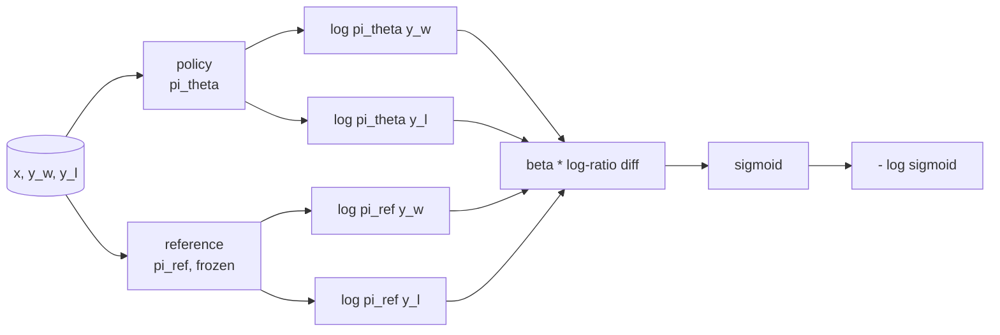
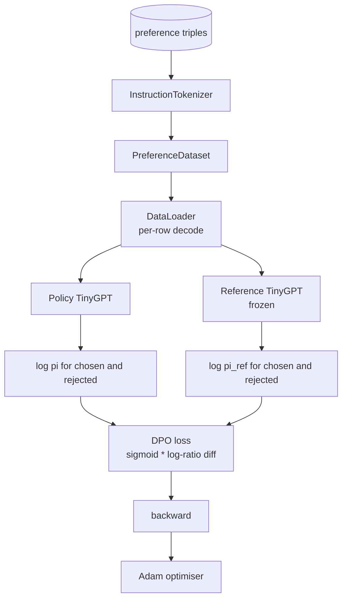

# Capstone Lesson 40: Direct Preference Optimization from Scratch

> Reward-модели и PPO — классический RLHF-стек. DPO схлопывает этот стек в один supervised-лосс, подгоняющий политику напрямую по парам предпочтений. Этот урок выводит DPO-лосс из тождества разности наград, поставляет рабочую референсную модель плюс модель-политику, вычисляет потокенные лог-вероятности и обучает крошечный трансформер на фикстуре предпочтений из chosen- и rejected-завершений. Тесты фиксируют математику лосса и направление градиента, чтобы вы знали: реализация совпадает со статьёй.

**Тип:** Практика
**Языки:** Python (torch, numpy)
**Пререквизиты:** Фаза 19, уроки 30–37 (трек NLP LLM: токенизатор, таблица эмбеддингов, attention-блок, тело трансформера, цикл предобучения, чекпоинты, генерация, перплексия)
**Время:** ~90 минут

## Цели обучения

- Вывести DPO-лосс как сигмоиду над масштабированной разностью лог-отношений и связать её с неявной наградой.
- Построить пару референсная модель + политика с замороженным референсом и обучаемой политикой.
- Вычислить лог-вероятности уровня последовательности под обеими моделями, маскируя токены промпта.
- Обучить политику на тройках `(prompt, chosen, rejected)` и увидеть, как лог-вероятность chosen растёт относительно rejected.
- Зафиксировать поведение тестами на математику лосса, знак градиента и инвариантность референса.

## Проблема

У вас есть SFT-модель. Она следует инструкциям, но её выходы неровные: одни завершения ясные, другие многословные или неверные. Ещё у вас есть маленький датасет пар предпочтений: для одного промпта человек пометил одно завершение как chosen, а другое как rejected.

Классический RLHF-ответ — двухстадийный пайплайн. Обучить reward-модель на предпочтениях. Оптимизировать политику против награды через PPO. Это работает, но дорого: две модели в памяти во время PPO, KL-контроль, удерживающий политику возле референса, reward hacking, когда reward-модель хрупкая.

DPO заменяет обе стадии одним supervised-лоссом. Reward-модель никогда не существует явно. Политика обучается прямо на парах предпочтений, с явным KL-штрафом к SFT-референсу. То же оптимальное решение под моделью предпочтений Брэдли-Терри — куда меньше кода.

## Концепция

Начнём с модели Брэдли-Терри. Даны промпт `x` и два завершения `y_w` (chosen) и `y_l` (rejected); вероятность того, что человек предпочитает `y_w`, равна

```text
P(y_w > y_l | x) = sigmoid( r(x, y_w) - r(x, y_l) )
```

где `r` — некоторая латентная функция награды. RLHF сначала подгоняет `r` по предпочтениям, затем обучает политику `pi` максимизировать `r` с KL-якорем:

```text
max_pi   E_{x, y~pi} [ r(x, y) ] - beta * KL(pi || pi_ref)
```

Вывод DPO замечает, что оптимальная политика `pi*` под этой целью имеет замкнутую форму через `r`:

```text
pi*(y | x) = (1/Z(x)) * pi_ref(y | x) * exp( r(x, y) / beta )
```

Перепишем относительно `r`:

```text
r(x, y) = beta * ( log pi*(y | x) - log pi_ref(y | x) ) + beta * log Z(x)
```

Член `log Z(x)` одинаков для `y_w` и `y_l` (он зависит от `x`, не от `y`), поэтому сокращается при вычислении разности предпочтений:

```text
r(x, y_w) - r(x, y_l) = beta * ( log pi_theta(y_w|x) - log pi_ref(y_w|x)
                                - log pi_theta(y_l|x) + log pi_ref(y_l|x) )
```

Подставим в сигмоиду Брэдли-Терри и возьмём отрицательное лог-правдоподобие по парам предпочтений:

```text
L_DPO(theta) = - E_{(x, y_w, y_l)} [
  log sigmoid( beta * ( log pi_theta(y_w|x) - log pi_ref(y_w|x)
                       - log pi_theta(y_l|x) + log pi_ref(y_l|x) ) )
]
```

Это и есть лосс. Сигмоида над одним скаляром на пример, вычисленным из четырёх лог-вероятностей. Никакой отдельной reward-модели. Никакого PPO. Никакого KL-члена в лоссе; KL-ограничение вшито в вывод замкнутой формы.



## Знак градиента

Полезная sanity-проверка перед любым обучением. Возьмём градиент по `log pi_theta(y_w | x)`:

```text
d L_DPO / d log pi_theta(y_w | x) = - beta * (1 - sigmoid(z))
```

где `z` — аргумент сигмоиды. Это отрицательно при любом `z`, а значит: увеличение лог-вероятности chosen-завершения под политикой уменьшает лосс. Симметрично, градиент по `log pi_theta(y_l | x)` положителен: увеличение лог-вероятности rejected увеличивает лосс. Обучение толкает chosen вверх, а rejected вниз. Референс заморожен; он не двигается.

## Данные

С уроком поставляется двенадцать троек предпочтений. Каждая — `(prompt, chosen, rejected)`. Chosen-завершение короткое и точное. Rejected — многословное, не по теме или неверное. Пары покрывают те же семейства задач, что урок 39 (столица, арифметика, список), поэтому у политики, стартовавшей с SFT-базы, разумная стартовая точка.

Фикстура намеренно маленькая. В продакшене DPO работает на десятках тысяч пар; здесь смысл в том, что математика лосса и цикл прогоняются end-to-end на крошечном датасете, а разрыв лог-вероятностей chosen против rejected видимо растёт.

## Инвариантность референса

DPO-реализация обязана аккуратно обращаться с референсной моделью. Референс — это SFT-модель, замороженная на месте. Должны выполняться три свойства:

- Параметры референса никогда не получают градиентов.
- Лог-вероятности референса никогда не меняются между эпохами.
- Политика стартует с тех же весов, что референс. (Оптимальная `theta` — это референс плюс выученное обновление; инициализация политики копией референса — корректно определённый старт.)

Реализация насаждает это так:

- Оборачивает референс в `torch.no_grad()` во время forward-проходов.
- Ставит `requires_grad=False` на каждый параметр референса.
- Конструирует политику через `policy.load_state_dict(reference.state_dict())` после сборки референса.

## Архитектура



Модель — тот же TinyGPT из урока 39 (decoder-only, каузальный, байтовый токенизатор). Референс и политика делят архитектуру; веса политики дрейфуют от референса под обучением, а референс остаётся фиксированным.

## Что вы соберёте

Реализация — один `main.py` плюс тесты.

1. `InstructionTokenizer`: байтовый токенизатор со спецтокенами `INST` и `RESP`. Той же формы, что в уроке 39.
2. `TinyGPT`: decoder-only трансформер. Той же формы, что в уроке 39, — урок самодостаточен, даже если вы пропустили 39-й.
3. `make_preferences`: возвращает двенадцать троек `(prompt, chosen, rejected)`.
4. `sequence_log_prob`: по модели, префиксу промпта и завершению возвращает сумму лог-вероятностей следующего токена по завершению (без вклада позиций промпта).
5. `dpo_loss`: берёт четыре лог-вероятности и `beta`, возвращает тензор пер-примерного лосса и дельту неявной награды для логирования.
6. `train_dpo`: поэпоховый цикл, считающий chosen- и rejected-лог-вероятности под политикой и референсом, применяющий лосс и шагающий Adam.
7. `evaluate_margins`: возвращает средний зазор лог-вероятностей chosen-rejected под политикой в любой момент.
8. `run_demo`: строит референс и политику из короткого разогревочного предобучения, копирует веса, обучает тридцать шагов, печатает пошаговый лосс и зазор, выходит с нулём при успехе.

## Почему DPO работает

DPO математически эквивалентен RLHF под моделью предпочтений Брэдли-Терри с точностью до параметризации награды. Неявная награда `r(x, y) = beta * (log pi(y|x) - log pi_ref(y|x))` идентифицируема из предпочтений с точностью до функции от `x`, которая сокращается в разности. Замкнутая форма политики позволяет пропустить явную reward-модель. KL-ограничение насаждается структурно: любое отклонение `pi` от `pi_ref` увеличивает лог-отношение, сигмоида насыщается, и это гасит градиент, когда политика уходит слишком далеко. Референс — ваша страховочная сетка.

## Дополнительные цели

- Добавьте нормализацию по длине к сумме лог-вероятностей: делите на длину завершения. Length bias — известный режим отказа DPO, когда модель предпочитает более короткие завершения, потому что их лог-вероятности больше по модулю.
- Добавьте IPO-вариант лосса: замените sigmoid + log на `(z - 1)^2`. Сравните сходимость на фикстуре.
- Добавьте параметр label smoothing, интерполирующий между жёсткой меткой chosen-rejected и равномерной 0.5.
- Замените референс меньшей, более дешёвой моделью (в духе knowledge distillation).

Реализация даёт вам лосс, инвариантность референса и цикл обучения. Математика и есть урок. Код делает математику осязаемой.

## Дополнительное чтение

- Rafailov et al., [Direct Preference Optimization (arXiv 2305.18290)](https://arxiv.org/abs/2305.18290) — статья, которую реализует урок.
- Фаза 19, урок 39 — SFT-референс, урок 41 — eval-пайплайн.
